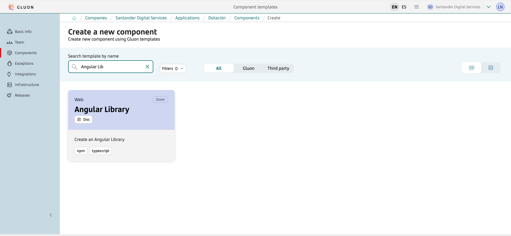
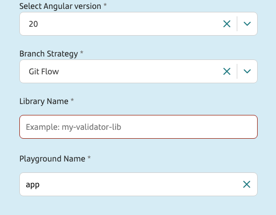
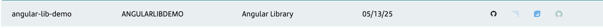

???+ info "Angular Library Journey"

    Currently, the Angular Library component scaffolds an Angular library in **version 20** and **18**.

## Introduction

The purpose of this documentation is to provide a **step-by-step guide** on how to create, build, analyze, and publish a Library based on the **Angular framework** within the GLUON platform.

Monorepository management in this setup is handled using the standard Angular CLI tooling, following the same practices as official Angular libraries.
All library projects and their configurations are managed centrally through `angular.json` and Angular CLI commands, ensuring consistency and maintainability across the workspace.

This guide will help you understand how to build, package, analyze, and distribute your Angular library through the CI/CD process, but it does not cover the development of the library itself.

For more information about developing Angular libraries, please refer to the [Overview of Angular libraries](https://angular.dev/tools/libraries){:target="_blank"}.

## Setup your local environment

{!
   include-markdown "../../../../snippets/setup/npm-setup.md"
!}

## Create Component

### Gluon Portal

First you have to [**onboard your application.**](../../../../../application/application-management/index.md)
Once you have your application created, you can start creating your component.

To create a component, follow the steps described in [**Component Management**](../../../../../application/component-management/create-component.md), searching for the component to be created.

You have to select the type of component you want to create, in this case you are going to create a **Angular Library**.



???+ remember

    To follow the naming convention visit [Repository Naming Convention](../../../../../application/component-management/create-component.md#repository-naming-convention).

When creating an Angular Library, you will be prompted to provide the **Angular version**, **initial library name**, and **playground application name**.
Additionally, a **playground application** will be generated under the `playgrounds` directory to serve as a development and testing environment for your libraries.

For this example, we have created an Angular Library with the following characteristics:

{!
   include-markdown "../../../../snippets/setup/front-setup.md"
   start="<!--Start Branch Strategy-->"
   end="<!--End Branch Strategy-->"
!}

- **Angular version**: Choose between Angular 20 (default) or Angular 18 for compatibility with existing projects.
- **Library name**: The main package name for your initial Angular library. Additional libraries can be added later as needed.
- **Playground application**: An Angular application scaffolded under the `playgrounds` directory, preconfigured to consume and test one or more libraries during development.
By default, the playground application will be named `app`, but you can change it to any name you prefer.



Once the component is created we can see under the application that there is a new repository created with the name of the component, Sonar project and Fortify project.



We have the following links in:

| Item | Link | Role Permission |
| --- | --- | --- |
| GitHub Repository | Link to the repository created in GitHub | Developer (RW) /Technical Lead (Maintain) [All roles explained](https://docs.github.com/es/organizations/managing-user-access-to-your-organizations-repositories/managing-repository-roles/repository-roles-for-an-organization) |
| Sonar Project | Link to the Sonar project created | All Users (Read) |
| Fortify Project | Link to the Fortify project created | All Users (Read) |

### Angular Library Template

#### Branches

{!
   include-markdown "../../../../snippets/setup/branch-setup-for-front.md"
!}

#### Structure

The generated Angular Library has a structure similar to the following (Depending the parameters you have previously configured):

``` bash
📂.github
  ┣ 📂scripts
  | ┣ 📜common.js
  | ┣ 📜publish.js
  | ┣ 📜view.js
  ┣ 📂workflows
  | ┣ 📜ci-fix-gfw.yml
  | ┣ 📜ci-gfw.yml
  | ┣ 📜create-release-branch.yml
  | ┣ 📜quality.yml
  | ┣ 📜release-fix-gfw.yml
  | ┣ 📜release-gfw.yml
  | ┣ 📜security.yml
  | ┣ 📜update-component-workflow.yml
  | ┗ 📜version-validation.yml
  ┗ 📜CODEOWNERS
📂.gluon
  ┗ 📂ci
    ┗ 📜properties.env
📂projects
| ┣ 📂angular-lib-demo
| | ┣ 📂src
| | | ┣ 📂lib
| | | | ┣ 📜angular-lib-demo.spec.ts
| | | | ┗ 📜angular-lib-demo.ts
| | | ┗ 📜public-api.ts
| | ┣ 📜README.md
| | ┣ 📜karma.conf.js
| | ┣ 📜ng-package.json
| | ┣ 📜package.json
| | ┣ 📜tsconfig.lib.json
| | ┣ 📜tsconfig.lib.prod.json
| | ┗ 📜tsconfig.spec.json
| ┗ 📂playgrounds
|   ┗ 📂app
|     ┣ 📂public
|     | ┗ 📜favicon.ico
|     ┗ 📂src
|     | ┣ 📂app
|     | | ┣ 📜app.config.ts
|     | | ┗ 📜app.ts
|     | ┣ 📜index.html
|     | ┣ 📜main.ts
|     | ┗ 📜styles.css
|     ┗ 📜tsconfig.app.json
┣ 📜.editorconfig
┣ 📜.gitignore
┣ 📜.tool-versions
┣ 📜README.md
┣ 📜angular.json
┣ 📜package.json
┗ 📜tsconfig.json
```

## Local Running

{!
   include-markdown "../snippets/libraries.md"
   start="<!--Start Local Running-->"
   end="<!--End Local Running-->"
!}

## Component Configuration

### Branches

{!
   include-markdown "../../../../snippets/configuration/front-configuration.md"
   start="<!--Start Gitflow Branches-->"
   end="<!--End Gitflow Branches-->"
!}

### Configuration Files

- **properties.env**: Properties with the CI configuration
- **Library scripts**: These scripts support the CI/CD process by publishing the library and retrieving its details once it has been published.

#### Properties

{!
   include-markdown "../../../../snippets/configuration/front-configuration.md"
   start="<!--Start Location Properties-->"
   end="<!--End Location Properties-->"
!}

=== "Angular Library"

    ```properties
    # Npm parameters
    NODE_VERSION='22.17.1'
    NPM_CONFIGURATION_DIST_DIRECTORY='dist/'
    NPM_CONFIGURATION_DIST_CONTENT='*'
    NPM_RUN_INSTALL_COMMAND='npm install'
    NPM_RUN_TEST_COMMAND='npm test -- --code-coverage --no-watch --no-progress'
    NPM_RUN_PUBLISH_COMMAND='gluon_publish'
    NPM_RUN_VIEW_COMMAND='gluon_view'
    NPM_SONAR_PROPERTIES='-Dsonar.sources=./projects -Dsonar.javascript.coveragePlugin=lcov -Dsonar.javascript.lcov.reportPath=coverage/**/lcov.info -Dsonar.typescript.lcov.reportPaths=coverage/**/lcov.info -Dsonar.typescript.coveragePlugin=lcov -DtestExecutionReportPaths=test-result/ut_report.xml,ut_report.xml'

    # For monorepos using a fixed version strategy, apply the root version to all packages
    RECURSIVE_VERSION=true
    ```

{!
   include-markdown "../snippets/libraries.md"
   start="<!--Start Default Properties-->"
   end="<!--End Default Properties-->"
!}

{!
   include-markdown "../snippets/libraries.md"
   start="<!--Start Naming Convention-->"
   end="<!--End Naming Convention-->"
!}

#### Library scripts

The location of the scripts is:

``` bash
📂.github
┗ scripts
  ┣ 📜common.js
  ┣ 📜publish.js
  ┗ 📜view.js
  
```

The `publish` and `view` scripts are invoked by the CI/CD workflows to publish the library and to retrieve its details, respectively. Both scripts internally use the `common.js` file, which contains shared utility functions to avoid code duplication.

To ensure this works correctly, these scripts must be defined in two places:

1) In the root `package.json` file of the repository, under the `scripts` section:

   ```json
   "scripts": {
      "gluon_publish": "node .github/scripts/publish.js",
      "gluon_view": "node .github/scripts/view.js"
   }
   ```

2) In the `properties.env` file located in the `.gluon/ci/` directory of the repository, referencing the scripts defined in the root `package.json`:

```properties
NPM_RUN_PUBLISH_COMMAND='gluon_publish'
NPM_RUN_VIEW_COMMAND='gluon_view'
```

???+ warning "Custom Scripts"

    These scripts are designed to publish Angular libraries by traversing the structure defined in `angular.json`, identifying all projects of type `library`, and publishing each one.

    They also check the `outputPath` property in `angular.json` and the `dest` property in each library's `ng-package.json` to determine the distribution directory.

    If these scripts do not meet the specific needs of your library, you can copy them to a new directory within the repository to modify them, or create new custom scripts as required. Just remember to update both the `package.json` and `properties.env` files so that the CI/CD workflows can correctly invoke the new scripts.

## Build and Publish your library

Now we are going to describe the steps that a user has to perform in order to make a complete cycle from the build process (CI) to the push of the image to the registry. The cycle explained below is based on **GitFlow**

{!
   include-markdown "../../../../snippets/lifecycle/gitflow-for-front.md"
   start="<!--Start Prerequisites-->"
   end="<!--End Prerequisites-->"
!}

{!
   include-markdown "../snippets/libraries.md"
   start="<!--Start Build/Publish-->"
   end="<!--End Build/Publish-->"
!}

## Fix/Release Flow

{!
   include-markdown "../../../../snippets/lifecycle/fix-release-flow.md"
!}
