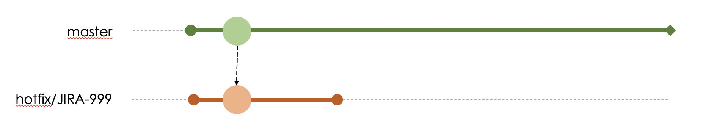
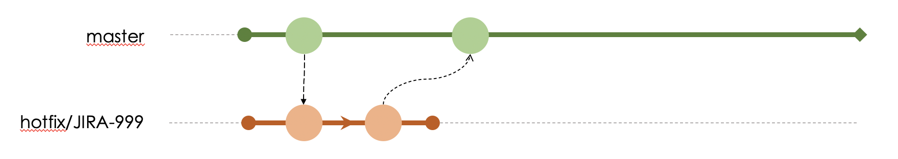
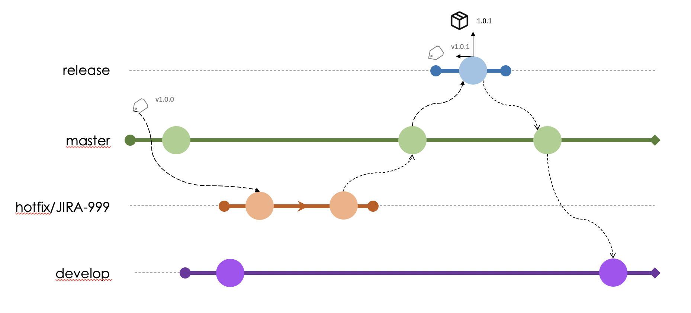

# Hotfix

In cases of fixing urgent ***bugs***, which impact some functioning of the library, a ***branch*** should be created, from a ***tag*** that represents the ***minor*** version of the problem with all its fixes.

(E.g.: If a problem has been identified in production for version ***1.1.3***, and exists up to version ***1.1.8***, the ***branch*** should be created from ***tag*** ***1.1.8***), following the nomenclature ***hotfix/[JIRA-ISSUE] (e.g. hotfix/JIRA-999)***.

If testing is needed, before actually merging with the integration ***branch***, it is possible to follow the flow of [beta-version](./beta-versions.md) but creating from ***branch*** ***hotfix/[JIRA-ISSUE]***.

When the development of the change is finished, a ***MR*** should be opened for the ***branch*** ***master***.

> If before your ***MR*** is approved, another ***branch*** has been incorporated into the ***branch*** ***develop*** you need to ***pull the changes to avoid conflicts and test if everything will continue to work.

If the merge is approved, you can proceed with the [***release***](./release.md) process.

> When creating MR, select the option to delete the branch after it is approved, to remove the development branch when the flow is completed.
