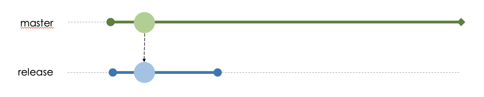
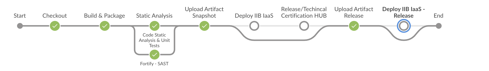
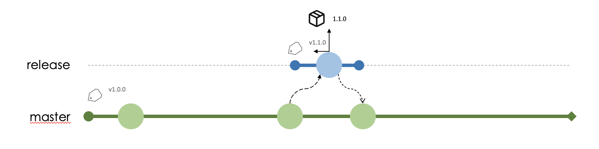

# Release

When there are already enough new features and/or fixes to generate a release, a new branch should be created, from ***develop***, with the name ***release***.

With the ***branch*** run the ***build*** in the ***DevOps*** Pipeline to generate a final version of the library.

Successfully completed, send a ***MR*** to the ***branch*** ***master***, and then a ***MR*** from ***master*** to ***develop***.

> When creating MR, select the option to delete the MR after it is approved to remove the development branch when the flow is completed.
