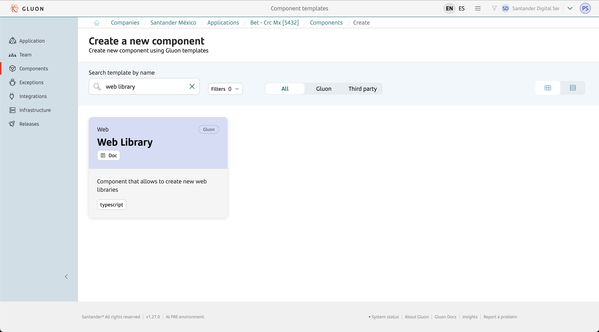
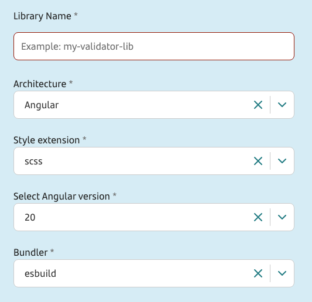
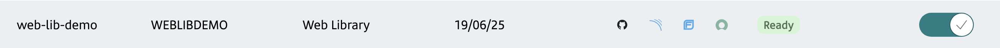

???+ info "Web Library Journey"

    Currently, the Web Library component scaffolds a library using **nx** with support for **React** or **Angular** in **version 18** and **20**.

## Introduction

The purpose of this documentation is to provide a **step-by-step guide** on how to create, build, analyze, and publish a Library using the **Nx framework** within the GLUON platform, regardless of the chosen technology scaffolding (React or Angular).

Monorepository management in this setup is handled using `nx`, following best practices for scalable and maintainable libraries.
All library projects and their configurations are managed centrally through `workspace.json` (or `project.json`) and `nx` commands.

This guide will help you understand how to build, package, analyze, and distribute your Web Library through the CI/CD process, but it does not cover the development of the library itself.

For more information about developing libraries with `nx`, please refer to the [Nx Documentation](https://nx.dev){:target="_blank"}.

## Setup your local environment

{!
   include-markdown "../../../../../snippets/setup/npm-setup.md"
!}

## Create Component

### Gluon Portal

First, you have to [**onboard your application.**](../../../../../../application/application-management/index.md)
Once you have your application created, you can start creating your component.

To create a component, follow the steps described in [**Component Management**](../../../../../../application/component-management/create-component.md), searching for the component to be created.

You have to select the type of component you want to create. In this case, you are going to create a **Web Library**.



???+ remember

    To follow the naming convention visit [Repository Naming Convention](../../../../../../application/component-management/create-component.md#repository-naming-convention).

When creating a Web Library, you will need to configure the following parameters to scaffold your web library:

- **Architecture**: Choose between **React** or **Angular**.
- **Angular version**: (Angular only) Choose between Angular 20 (default) or Angular 18.
- **Library name**: The main package name for your initial Web Library. Additional libraries can be added later as needed.
- **Style extension**: Select the style extension for your library. Options include **css**, **scss**, and **less**.
- **Unit Test Runner**: Choose the test runner for your library. Options include **jest** or **vitest**. For Angular, the default is **jest**.
- **Bundler/Compiler**: (Angular only) Select the bundler or compiler for your library. Options include **esbuild** or **webpack**. For React, the default is **vite**.

For this example, we have created a Web Library with the following characteristics:

{!
   include-markdown "../../../../../snippets/setup/front-setup.md"
   start="<!--Start Branch Strategy-->"
   end="<!--End Branch Strategy-->"
!}

- **Library name**: `my-validator-lib`
- **Architecture**: Angular
- **Style extension**: scss
- **Angular version**: 20
- **Bundler/Compiler**: esbuild



Once the component is created, we can see under the application that there is a new repository created with the name of the component, Sonar project, and Fortify project.



We have the following links in:

| Item | Link | Role Permission |
| --- | --- | --- |
| GitHub Repository | Link to the repository created in GitHub | Developer (RW) /Technical Lead (Maintain) [All roles explained](https://docs.github.com/es/organizations/managing-user-access-to-your-organizations-repositories/managing-repository-roles/repository-roles-for-an-organization) |
| Sonar Project | Link to the Sonar project created | All Users (Read) |
| Fortify Project | Link to the Fortify project created | All Users (Read) |

### Web Library Template

#### Branches

{!
   include-markdown "../../../../../snippets/setup/branch-setup-for-front.md"
!}

#### Structure

The generated Web Library has a structure similar to the following (depending on the parameters you have previously configured):

``` bash
📂.github
  ┣ 📂scripts
  ┃ ┗ 📜view.js
  ┣ 📂workflows
  ┃ ┣ 📜ci-fix-gfw.yml
  ┃ ┣ 📜ci-gfw.yml
  ┃ ┣ 📜create-release-branch.yml
  ┃ ┣ 📜quality.yml
  ┃ ┣ 📜release-fix-gfw.yml
  ┃ ┣ 📜release-gfw.yml
  ┃ ┣ 📜security.yml
  ┃ ┣ 📜update-component-workflow.yml
  ┃ ┗ 📜version-validation.yml
  ┗ 📜CODEOWNERS
📂.gluon
  ┗ 📂ci
    ┗ 📜properties.env
📂apps
  ┗ 📂playground
    ┣ 📂public
    ┃ ┗ 📜favicon.ico
    ┣ 📂src
    ┃ ┣ 📂app
    ┃ ┃ ┣ 📜app.config.ts
    ┃ ┃ ┣ 📜app.scss
    ┃ ┃ ┣ 📜app.html
    ┃ ┃ ┣ 📜app.routes.ts
    ┃ ┃ ┣ 📜app.spec.ts
    ┃ ┃ ┣ 📜app.ts
    ┃ ┃ ┗ 📜nx-welcome.ts
    ┃ ┣ 📜index.html
    ┃ ┣ 📜main.ts
    ┃ ┣ 📜styles.scss
    ┃ ┗ 📜test-setup.ts
    ┣ 📜eslint.config.mjs
    ┣ 📜jest.config.ts
    ┣ 📜project.json
    ┣ 📜tsconfig.app.json
    ┣ 📜tsconfig.json
    ┗ 📜tsconfig.spec.json
📂packages
  ┗ 📂my-validator-lib
    ┣ 📂src
    ┃ ┣ 📂lib
    ┃ ┃ ┗ 📂my-validator-lib
    ┃ ┃   ┣ 📜my-validator-lib.scss
    ┃ ┃   ┣ 📜my-validator-lib.html
    ┃ ┃   ┣ 📜my-validator-lib.spec.ts
    ┃ ┃   ┗ 📜my-validator-lib.ts
    ┃ ┣ 📜index.ts
    ┃ ┗ 📜test-setup.ts
    ┣ 📜eslint.config.mjs
    ┣ 📜jest.config.ts
    ┣ 📜ng-package.json
    ┣ 📜package.json
    ┣ 📜project.json
    ┣ 📜README.md
    ┣ 📜tsconfig.json
    ┣ 📜tsconfig.lib.json
    ┣ 📜tsconfig.lib.prod.json
    ┗ 📜tsconfig.spec.json
📜.editorconfig
📜.gitignore
📜.prettierignore
📜.prettierrc
📜.tool-versions
📜AGENTS.md
📜eslint.config.mjs
📜jest.config.ts
📜jest.preset.js
📜nx.json
📜package-lock.json
📜package.json
📜project.json
📜README.md
📜tsconfig.base.json
```

## Local Running

{!
   include-markdown "../../snippets/libraries.md"
   start="<!--Start Local Running-->"
   end="<!--End Local Running-->"
!}

## Component Configuration

### Branches

{!
   include-markdown "../../../../../snippets/configuration/front-configuration.md"
   start="<!--Start Gitflow Branches-->"
   end="<!--End Gitflow Branches-->"
!}

### Configuration Files

- **properties.env**: Properties with the CI configuration
- **Library scripts**: These scripts support the CI/CD process by publishing the library and retrieving its details once it has been published.

#### Properties

{!
   include-markdown "../../../../../snippets/configuration/front-configuration.md"
   start="<!--Start Location Properties-->"
   end="<!--End Location Properties-->"
!}

=== "Angular"

    ```properties
    # Npm parameters
    NODE_VERSION="22.17.1"
    NPM_APPLICATION_DIST_DIRECTORY='dist/'
    NPM_APPLICATION_DIST_CONTENT='*'
    NPM_RUN_INSTALL_COMMAND='npm install --include=optional'
    NPM_RUN_BUILD_COMMAND='npm run build'
    NPM_RUN_AUDIT_COMMAND='echo "no audit"'
    NPM_RUN_TEST_COMMAND='npm run test'
    NPM_RUN_LINT_COMMAND='npm run lint'
    NPM_RUN_PUBLISH_COMMAND='gluon_publish'
    NPM_RUN_VIEW_COMMAND='gluon_view'

    # Sonar parameters
    SONAR_PROJECT_KEY="web-lib-demo"
    NPM_SONAR_PROPERTIES='-Dsonar.sources=packages -Dsonar.tests=packages -Dsonar.test.inclusions=**/*.spec.ts,**/*.spec.tsx,**/*.test.ts,**/*.test.tsx,**/test-setup.ts -Dsonar.typescript.lcov.reportPaths=coverage/packages/**/lcov.info -Dsonar.typescript.coveragePlugin=lcov -Dsonar.javascript.lcov.reportPaths=coverage/packages/**/lcov.info -Dsonar.javascript.coveragePlugin=lcov -Dsonar.sourceEncoding=UTF-8 -DtestExecutionReportPaths=test-result/ut_report.xml,ut_report.xml'

    # Fortify parameters
    FORTIFY_PROJECT="web-lib-demo"
    ```

=== "React"

    ```properties
    # Npm parameters
    NODE_VERSION="18.20.2"
    NPM_APPLICATION_DIST_DIRECTORY='dist/'
    NPM_APPLICATION_DIST_CONTENT='*'
    NPM_RUN_INSTALL_COMMAND='npm install --include=optional --legacy-peer-deps'
    NPM_RUN_BUILD_COMMAND='npm run build'
    NPM_RUN_AUDIT_COMMAND='echo "no audit"'
    NPM_RUN_TEST_COMMAND='npm run test'
    NPM_RUN_LINT_COMMAND='npm run lint'
    NPM_RUN_PUBLISH_COMMAND='gluon_publish'
    NPM_RUN_VIEW_COMMAND='gluon_view'

    # Sonar parameters
    SONAR_PROJECT_KEY="web-lib-demo"
    NPM_SONAR_PROPERTIES='-Dsonar.sources=packages -Dsonar.tests=packages -Dsonar.test.inclusions=**/*.spec.ts,**/*.spec.tsx,**/*.test.ts,**/*.test.tsx,**/test-setup.ts -Dsonar.typescript.lcov.reportPaths=coverage/packages/**/lcov.info -Dsonar.typescript.coveragePlugin=lcov -Dsonar.javascript.lcov.reportPaths=coverage/packages/**/lcov.info -Dsonar.javascript.coveragePlugin=lcov -Dsonar.sourceEncoding=UTF-8 -DtestExecutionReportPaths=test-result/ut_report.xml,ut_report.xml'

    # Fortify parameters
    FORTIFY_PROJECT="web-lib-demo"
    ```

{!
   include-markdown "../../snippets/libraries.md"
   start="<!--Start Default Properties-->"
   end="<!--End Default Properties-->"
!}

{!
   include-markdown "../../snippets/libraries.md"
   start="<!--Start Naming Convention-->"
   end="<!--End Naming Convention-->"
!}

#### Library scripts

The location of the `view.js` script is:

```bash
📂.github
┗ scripts
  ┗ 📜view.js
```

The `view.js` script is invoked by the CI/CD workflows to retrieve details about the library.
Additionally, the `gluon_publish` script is defined directly in the `package.json` file to handle both the versioning and publishing process.

To ensure this works correctly, the following scripts must be defined in the root `package.json` file of the repository:

```json
"scripts": {
    "gluon_publish": "npx nx release version $VERSION && npx nx release publish --first-release --tag $TAG --registry $REGISTRY_URL",
    "gluon_view": "node .github/scripts/view.js"
}
```

- **`gluon_publish`**: Handles both versioning and publishing of the library to the specified registry.
It uses `nx release version` followed by `nx release publish` to handle both version synchronization across all libraries in the monorepo and the publishing process.
- **`gluon_view`**: Retrieves details about the library using the `view.js` script.

In addition, the `properties.env` file located in the `.gluon/ci/` directory must reference the `gluon_publish` and `gluon_view` scripts defined in the `package.json`:

```properties
NPM_RUN_PUBLISH_COMMAND='gluon_publish'
NPM_RUN_VIEW_COMMAND='gluon_view'
```

???+ warning "Version Synchronization"

    Version synchronization is handled directly within the `gluon_publish` script using `nx release version` followed by `nx release publish`. This approach ensures that all libraries in the monorepo share the same version and maintains consistency across packages.

#### Unit Tests

To ensure that test coverage can be analyzed, each library package must be configured to generate coverage reports when running tests. At a minimum, the reports should include the `lcov` format.

Below are the configurations for `jest` and `vitest`:

???+ info "Test Coverage Configuration"

    === "jest.config.ts"

        ```typescript
        export default {
          // ...existing configuration...
          collectCoverage: true,
          coverageReporters: ['lcov'],
        };
        ```

    === "vite.config.ts"

        ```typescript
        import { defineConfig } from 'vite';

        export default defineConfig({
          // ...existing configuration...
          test: {
            coverage: {
              enabled: true,
              reporter: ['lcov'],
            },
          },
        });
        ```

Ensure these configurations are added to the respective configuration files in each library package to enable proper test coverage reporting.

## Build and Publish your library

Now we are going to describe the steps that a user has to perform in order to make a complete cycle from the build process (CI) to the push of the image to the registry. The cycle explained below is based on **GitFlow**

{!
   include-markdown "../../../../../snippets/lifecycle/gitflow-for-front.md"
   start="<!--Start Prerequisites-->"
   end="<!--End Prerequisites-->"
!}

{!
   include-markdown "../../snippets/libraries.md"
   start="<!--Start Build/Publish-->"
   end="<!--End Build/Publish-->"
!}

## Fix/Release Flow

{!
   include-markdown "../../../../../snippets/lifecycle/fix-release-flow.md"
!}
