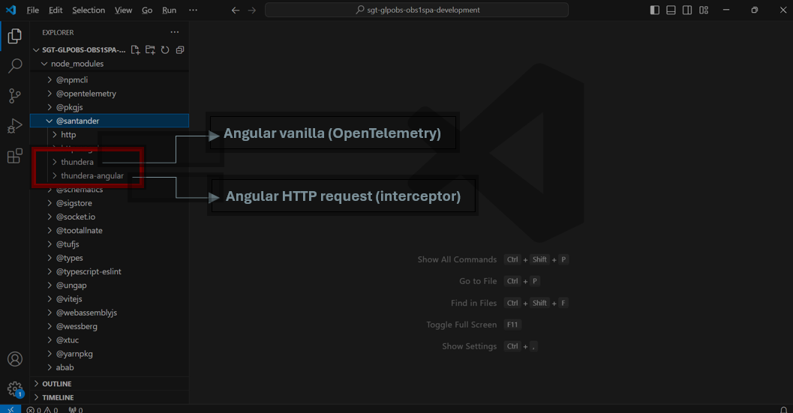
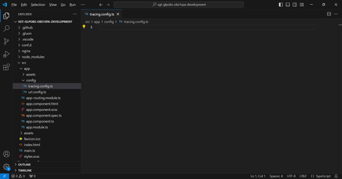

## Introduction

The purpose of this documentation is to provide a **step-by-step guide** on how to create, build, analyze and deploy an MFE with the standards of observability based on  **Thundera** within the GLUON platform.

All deployments will be done in a Kubernetes cluster from an immutable image that we will previously upload to a registry (Harbor/JFROG).

## Getting Started

### Darwin

To start your journey into the Darwin MFE go to [Darwin Microfront Journey](../../darwin/mfe.md) to setup your environment and starting application.

## Pre requisites

After following the journey, you should have:

- Node.js installed
- NPM setup

### Installing the Library

On your terminal use the following command to download the library into your project:

```bash
npm install @santander/thundera-angular
```

This will setup thundera angular in both Vanilla and Angular HTTP Request



### Configuring the Library

Create file tracing.config.ts in the folder src > app > config



#### On the file `tracing.config.ts`

Paste the following content as a Default, on the lines 7,8,9 and 10 you will need to fill based on your specification/needs.

```typescript title="tracing.config.ts"
import { TracingConfig, TracingData, TracingObject } from '@santander/thundera/tracing';
import { TracingConfigAsync } from '@santander/thundera-angular/tracing';

const businessID = crypto.randomUUID();

const commonTracingConfig: Omit<TracingConfig, 'middleware'> = {
  httpInterval: 3000, // time to send the logs
  tracingEndpoint: '/api/tracing', // replace with the URL of the API SendLog
  urlsToAudit: ['/api'], // URL to be audited (can be more than one)
  tracingMode: 'B3', // The tracing type can be B3, W3C or Both
  businessID: businessID,
};

const middleware = async (tracingData: TracingData): Promise<TracingObject> => ({
  timestamp: {
    creationDateTime: tracingData.thunderaPayload?.timestamp,
  },
  originPlatform: 'BRA',
  softwareApplication: {
    softwareApplicationId: '',
    name: 'shell',
  },
  softwareComponent: {
    softwareComponentId: '',
    name: '',
    type: {
      softwareComponentTypeId: '',
      description: '',
    },
  },
  isGluon: true,
  environment: 'DEV',
  logLevel: 'INFO',
  logMessage: 'Angular request',
  logTypeCode: '01',
  logTypeDescription: 'ACTIVITY',
  logVersion: '1.0.0',
  traceContextB3: {
    traceIdB3: tracingData.thunderaPayload?.traceId,
    spanIdB3: tracingData.thunderaPayload?.spanId,
    parentSpanId: tracingData.thunderaPayload?.parentSpanId,
  },
  traceContextW3c: {
    traceIdW3c: '',
    spanIdW3c: '',
    parentId: '',
    traceState: '',
  },
  businessReference: businessID,
  sessionReference: '',
  isError: tracingData.response.status ?? 0 >= 400 ? true : false,
  userActivityTimestamp: tracingData.thunderaPayload?.timestamp?.replace(/\./g, ':') || '',
  httpMethod: tracingData.request.method,
  returnCode: tracingData.response.status,
  url: tracingData.response.url,
  customLog: {
    appRequestId: '',
  },
  businessLog: {},
  result: {},
});

export const tracingConfig: TracingConfigAsync = {
  useFactory: () => {
    return Promise.resolve(commonTracingConfig)
  },
  middleware
};
```

Save the file.

#### On the file `app.config.ts`

You need to do the steps:
1- ADD the import of thundera library
2- ADD the import of the configfile
3- Activate the config file

```typescript title="app.config.ts"
import { ApplicationConfig, importProvidersFrom } from '@angular/core';
import { provideHttpClient } from '@angular/common/http';

// Lib thundera
import { TracingModule } from '@santander/thundera-angular/tracing'; //Step 1

// Config file
import { tracingConfig } from '../app/config/tracing.config'; //Step 2

export const appConfig: ApplicationConfig = {
  providers: [
    provideHttpClient(),
    importProvidersFrom(TracingModule.forRoot(tracingConfig)) //Step 3
  ]
};
```

After that your application have observability.
