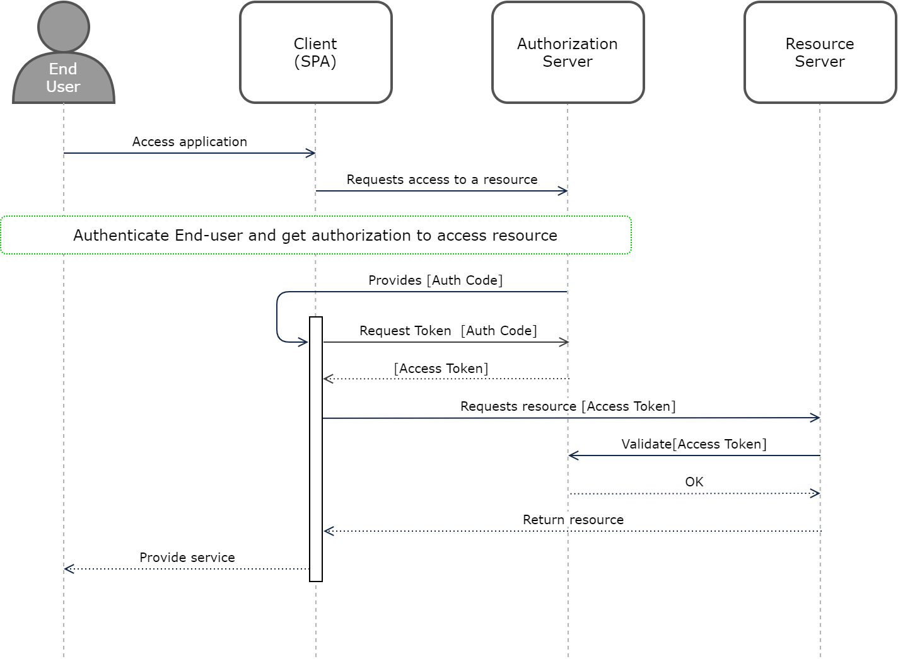
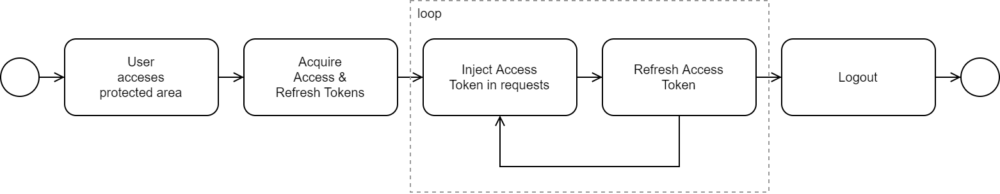

# OAuth authentication

## Standards Context

SCM has been created with standards in mind, specifically those related to
authorizing access to APIs from SPAs:

- [The OAuth 2.0 Authorization Framework](https://datatracker.ietf.org/doc/html/rfc6749){:target="_blank"}
- [Proof Key for Code Exchange by OAuth Public Clients](https://datatracker.ietf.org/doc/html/rfc7636){:target="_blank"}

### Authorized Access to APIs: OAuth 2.0

This framework ensures that all calls made by a *Client* to a *Resource Server* are made using a valid Access Token; in our case the *Resource Server* is an API Gateway and the *Client* is the SPA.
The SPA obtains the Access Token from an *Auth Server* via a series of requests that ensure:

- The SPA has been previously registered with the Auth Server and has been configured to consume a certain set of "scopes" (for example, "account.read").
- The end-user, or *Resource Owner* is authenticated and has given permission to the application to consume resources on their behalf.  For the bank's applications this permission is granted automatically via configuration in the *Auth Server*

#### User authentication

OAuth 2.0 does not specify how the end-user is authenticated; this could be via
a previously established session, a logon screen presented directly by the
Authorization Server, vía a nested OIDC flow etc. Although indifferent to the
functioning of the OAuth 2.0 flow, the SCM has been designed and tested to handle
nested OIDC flows.

## Library Details

As mentioned in the introduction, the SCM facilitates interactions with different backend services to authenticate the end-user, obtain and inject OAuth 2.0 tokens, and manage the session:

### User Accesses Protected Area

Customer facing apps are usually divided into two distinct areas, a public part which can be accessed without logging on, and a protected area where access is restricted to logged users.
The SCM facilitates this by ensuring that a valid Access Token is available to call backend APIs consumed in the protected area.

It is the application’s responsibility to apply the correct controls in its flows to ensure that this process takes place (see the “How to” section of the library for details).

### Acquire Tokens

Acquiring tokens happens automatically when a protected area of the app is first accessed.
The SCM calls the “/authorize” and “/token” endpoints of the backend OAuth 2.0
Authorization Server to obtain an Access Token and a Refresh Token.

Note: This involves HTTP redirects via the browser and the SPA must be developed
with this in mind.

### Injecting Access Tokens

Business calls made to backend APIs by the SPA code are intercepted by the library and the Access Token is automatically injected into the HTTP request. The API’s response is then returned to the SPA.

### Refreshing Access Tokens

Access Tokens have a short lifespan and need to be renewed before they expire. The SCM uses the Refresh Token to obtain new Access Tokens from the backend provider. This occurs transparently to the SPA and asynchronously.

## Detecting user inactivity

Once the user has logged in, the SCM will start a timer to detect user inactivity. If the user is inactive for a certain period of time, the SCM will automatically emit an event to the SPA handle the inactivity.

### Logout

The SPA should provide a button/link that allows the end-user to logout from the application. When clicked by the end-user, the SPA must call the logout function of the SCM. The SCM handles the logout logic on behalf of the application.
