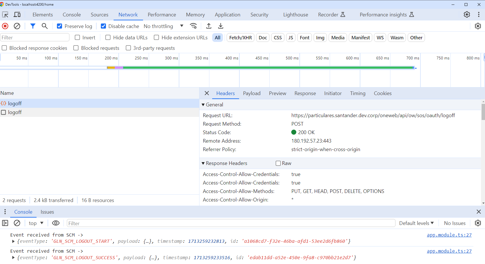
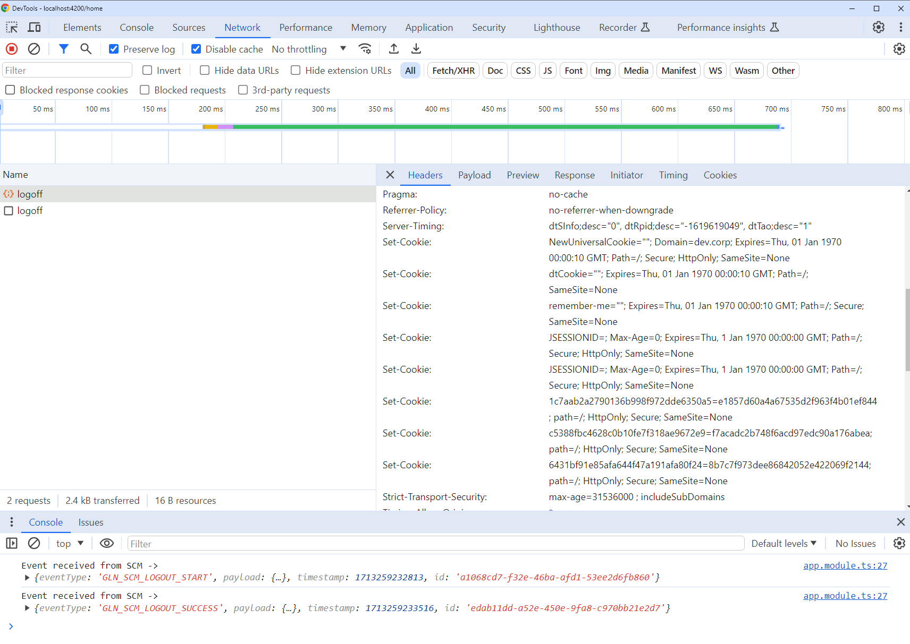
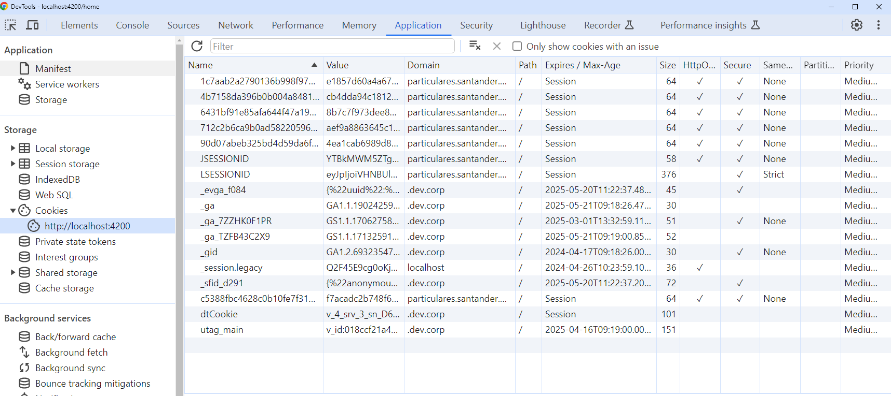

# Use it in Angular

## Overview

The Security Library also known as `SecurityContextManager` or `SCM`, offers utilities to manage the OAuth 2.0 authorization flow providing token obtention, rotation & injection.
User login is handled by the Authorization Server during token acquisition, with this in mind a logout feature is also provided.

`@santander/security-angular` wraps `@santander/security`, which is a vanilla layer with the main implementation. This wrapper productivize the library making it easy to use in Angular applications.
This way, the Angular wrapper offers an Angular module called `SecurityContextManagerModule` with an `OAuthGuard` and an `OAuthService` (among other things) ready to be used in your Angular application.

In a Microfrontend Architecture, it should be used in conjunction with the [http library](../../../http/index.md).

## Capabilities

- **Authentication**: Provide OAuth authorization flow (including implicit login)
- **Logout features**.
- **Token obtention, storage, rotation & injection**. Regarding the token storage, SCM offer two strategies:
    - [Closure](https://developer.mozilla.org/en-US/docs/Web/JavaScript/Closures).
    - [Session Storage](https://developer.mozilla.org/en-US/docs/Web/API/Window/sessionStorage).
- **PKCE (Proof Key for Code Exchange)**. [PKCE](https://oauth.net/2/pkce/) is a simple extension to the [OAuth 2.0 Authorization Code grant](https://oauth.net/2/grant-types/authorization-code/) that prevents CSRF and authorization code injection attacks.
  It's a lightweight mechanism that can be implemented in any application that requests an authorization code.

## Installation

Install the security library:

`npm install @santander/security-angular`

### Configuration

`@santander/security-angular` provide two types of configuration, static and dynamic.

For both configurations, static or dynamic, the `app.config.ts` must import the providers from `SecurityContextManagerModule` and initialize it using the `forRoot()` method. This will be explained deeply on next sections.

```typescript
import { TokenStoreStrategyOptions, AuthType } from '@santander/security';
import { SecurityContextManagerModule } from '@santander/security-angular';
```

Both configurations, static or dynamic, have the same fields to configure. This is the definition and the data format expected:

```typescript
export interface OAuthConfig {
  client: OAuthClient;
  scope: string[];
  redirectUri: string;
  issuerUri: string;
  storageStrategy: TokenStoreStrategyOptions;
  type: AuthType;
  serverConfig?: any;
  protectedResources?: string[];
}
```

- `client`: Information about the client, contains:`clientId: string` .
- `scope`: Array of strings that set the scopes to request from the OAuth server.
- `redirectUri`: URL to redirect to after a successful authentication.
- `issuerUri`: Base URI of the OAuth Server.
- `storageStrategy`: Strategy to decide if the OAuth tokens are stored in session storage or in a closure: `TokenStoreStrategyOptions.SESSION_STORAGE` or `TokenStoreStrategyOptions.CLOSURE_STORAGE`.
- `type`: Specifies that the server authentication flow is OAuth: unique possible value for the moment is `AuthType.OAUTH`.
- `serverConfig`: OAuth server configuration data.

    Minimum `serverConfig` object example (can have more fields, but these are the minimum required):

    ```typescript
    {
      issuer: "http://localhost:8080/sos/oauth/",
      authorization_endpoint: "http://localhost:8080/sos/oauth/authorize",
      token_endpoint: "http://localhost:8080/sos/oauth/token",
      end_session_endpoint: "http://localhost:8080/sos/oauth/session/end",
    }
    ```

- `protectedResources`: (optional) Array of strings representing the urls to be protected. For The requests that match with some of urls or wildcards of this property, a token will be injected into the headers.
  Furthermore, if this property is not specified or the array is empty, the token will be injected into the headers in all requests.
  Although, if the url of the request doesn't match with some of urls or wildcards of this property, the token will not be injected into the headers.
  
    Example of how to set protectedResources property inside configuration object:

    ```typescript
    // the rest of the configuration above
    // the secound url with wildcard (*) inside means that the token will be injected into the headers in all urls that match the specified pattern
    protectedResources: [
      'http://localhost:4200/global-position/',
      'http://localhost:4200/admin/*',
    ];
    ```

- `timePercentageForRefreshToken`: (optional) Number (between 1 and 100) that sets the percentage of the expiration time of the token to do the refresh. Default is 75.
- `promptParamValue`: (optional) This value configures `prompt` URL parameter in the Authorization URL redirection. If set, `prompt` parameter is add in that request with the value set here.
  Possible values are defined in the PromptType enum (`none`, `login`, `consent`, `select_account`) or it can be also a free string. By default, if not set, the parameter is not sent in the request.
- `includeStateParam`: (optional) Boolean property that adds the `state` URL parameter in the Authorization endpoint request if set to true. State parameter is a random number generated by the library.

#### Static vs Dynamic configuration

The main difference between static and dynamic is that in the dynamic approach the definition of the config is stored outside the app code, having a independent lifecycle from the application.

In order to obtain this dynamic configuration, the app should make an additional request to acquire it but it allow you having diffente configuration for different environments. **This is the recommended way to configure SCM**.

In the static config, the configuration is "hardcoded" on the application code, so the same configuration will be used for each environment. This way is just recommended in local scenarios or for testing porpuses.

##### Dynamic configuration

This setup allows to customize OAuth configurations using a function that loads config files asynchronously (`getConfigAsync()` in the example is an async function that returns a `Promise` with the configuration object).

Dynamic loading example:

```typescript
SecurityContextManagerModule.forRoot( {
  useFactory: getConfigAsync, // getConfigAsync is a function responsible to provide the configuration
  deps: [],
}),
```

In case of using Darwin configuration service for example, you can do it this way:

```typescript title="app.config.ts"
import { ConfigModule, ConfigService } from '@ng-darwin/config';
import { SecurityContextManagerModule } from '@santander/security-angular';

async function getConfigAsync(configService: ConfigService): Promise<any> {
  const cfg = await firstValueFrom( configService.onConfigLoaded$ );
  return Promise.resolve(cfg.gluon!.security!); // assuming that the oauth configuration comes inside cfg.gluon.security
}

export const appConfig: ApplicationConfig = {
  providers: [
    importProvidersFrom(ConfigModule.forRoot({···})),
    importProvidersFrom(SecurityContextManagerModule.forRoot({
      useFactory: getConfigAsync,
      deps: [ConfigService],
    }))
  ]
};
```

You may notice that the dynamic configuration JSON is slightly different from the static one, due the values from `storeStrategy` and `type` must be strings instead of enum values.

```JSON title="config.json"
{
  ···
  "app": {
    "oauth": {
      "storageStrategy": "sessionStorage", // "sessionStorage" | "closureStorage"
      "client": { "clientId": "oauth_client" },
      "type": "oauth",
      "scope": ["read"],
      "redirectUri": "http://localhost:4200/home",
      "issuerUri": "http://localhost:8080",
      "serverConfig": {
        "issuer": "http://localhost:8080",
        "authorization_endpoint": "http://localhost:8080/authorize",
        "token_endpoint": "http://localhost:8080/token",
        "end_session_endpoint": "http://localhost:8080/logoff",
      },
    },
  }
}
```

##### Static configuration

When the app is configured in in a static way, the config is not being loaded from outside the application but in a hardcored way inside the app.
This is not recommended, it's a better option to use a config file loaded in runtime, but it makes sense for some scenarios like unit tests.

Static loading examples:

a) Minimum required configuration:

```typescript title="app.config.ts"
import { TokenStoreStrategyOptions, AuthType } from '@santander/security';
import { SecurityContextManagerModule } from '@santander/security-angular';

export const appConfig: ApplicationConfig = {
  providers: [
    importProvidersFrom(
      SecurityContextManagerModule.forRoot({
        storageStrategy: TokenStoreStrategyOptions.SESSION_STORAGE,
        client: { clientId: 'oauth_client' },
        type: AuthType.OAUTH,
        scope: ['read'],
        redirectUri: 'http://localhost:4200/home',
        issuerUri: 'http://localhost:8080',
        serverConfig: {
          issuer: 'http://localhost:8080',
          authorization_endpoint: 'http://localhost:8080/authorize',
          token_endpoint: 'http://localhost:8080/token',
          end_session_endpoint: 'http://localhost:8080/logoff',
        },
      });
    )
  ]
};
```

b) Configuration with some optional parameters:

```typescript title="app.config.ts"

import { TokenStoreStrategyOptions, AuthType } from '@santander/security';
import { SecurityContextManagerModule } from '@santander/security-angular';

export const appConfig: ApplicationConfig = {
  providers: [
    importProvidersFrom(
      SecurityContextManagerModule.forRoot({
        storageStrategy: TokenStoreStrategyOptions.SESSION_STORAGE,
        client: { clientId: 'oauth_client' },
        type: AuthType.OAUTH,
        scope: ['read'],
        redirectUri: 'http://localhost:4200/home',
        issuerUri: 'http://localhost:8080/sos/oauth',
        serverConfig: {
          issuer: 'http://localhost:8080/sos/oauth',
          authorization_endpoint: 'http://localhost:8080/sos/authorize',
          token_endpoint: 'http://localhost:8080/sos/token',
          end_session_endpoint: 'http://localhost:8080/sos/logoff',
        },
        timePercentageForRefreshToken: 75,
        retry: {
          numberOfRetries: 3,
          delay: 400,
        },
        protectedResources: ['http://localhost:4200/global-position/', 'http://localhost:4200/admin/*']
      });
    )
  ]
};
```

#### Session vs Closure storage strategy

You can choose what kind of token strategy do you want to use, `SESSION_STORAGE` or `CLOSURE_STORAGE`. To provide this information, import the `TokenStoreStrategyOptions` in the `app.config.ts` file and configure the `storageStrategy` property.
There are two types of storage strategy you can choose: `CLOSURE_STORAGE` and `SESSION_STORAGE`:

```typescript
import { TokenStoreStrategyOptions } from '@santander/security';

TokenStoreStrategyOptions.SESSION_STORAGE // TokenStoreStrategyOptions.CLOSURE_STORAGE
```

> Or you can set the literal value of them: `'closureStorage'` and `'sessionStorage'` respectively

##### Closure

**PROs**: Helps protect the Access Token / Refresh Token from exfiltration by a malicious script (or possible abuse by a developer).

**CONs**: The tokens are lost if the user launches a page refresh (by pressing “F5” o clicking on the URL).
This means that a new request to the Auth Server is required when the page is reloaded which may affect the end-user experience (slower page loading).

##### Session Storage

**PROs**: The tokens are persisted during a page refresh. This means that page will reload quicker.

**CONs**: The tokens are more vulnerable to extraction by malicious script and more open to abuse by developers.

The selection of one strategy or the other depends on the sensitivity of the application and the context where it is being executed (internet or intranet for example) balanced with the end-user experience.
The final decision must be reviewed with the application and security architects assigned to the project.

### Logic of the token injection

The configuration of the SCM with the property `protectedResources` determines if the token will be injected in the request or not. In addition to this feature, the injection of the token can be also determined by the header of the request `x-santander-backend-service-id`.

This header specifies which backend service should be used with this request. Currently it depends on the OAuth backend services recognized and the presence of the header value. The logic that it follows is:

1. If the request has the header, and the value is recognized (such as `oauth` or `oidc`), it will attach the token independently of the `protectedResources` configured.
2. If the request has the header, but the value is not recognized (like 'backendFake'), it will not attach the token and not check the `protectedResources` configured.
3. If the request does not have the header, it will check the `protectedResources` configured and determine if it should attach the token or not.

### Protecting your inner routes with OAuthGuard

The SCM provides a `OAuthGuard` that internally uses the `OAuthService` to ensure the user is authenticated before accessing guarded routes.

As an Angular Guard it can be used in the Angular router config to avoid the user access a route without previous authentication.

Example:

```typescript
import { OAuthGuard } from '@santander/security-angular';

export const appRoutes: Route[] = [
  {
    path: 'logout',
    component: Logout,
  },
  {
    path: 'home',
    canActivate: [OAuthGuard],
    component: GlobalPositionHost,
  },
  {
    path: '',
    component: Welcome,
  },
];
```

The application checks that the user has a saved oauth token before activate `/home` path in this case. If there isn't a token the auth flow will start.

### Initiate OAuth 2.0 flow programmatically

For this scenario, it's mandatory to use the `OAuthGuard` in the routes file of yor app. Then, inject the `OAuthService` in the component and initiate the OAuth 2.0 flow calling the `init()` method.

A use case example would be if you want to add a login button:
The login button would call to the `init` method of `OAuthService`, and then, the `OAuthGuard` would be ready to check if the user is authenticated or not, and continue the auth flow.

```typescript
startOAuth(): void {
  this.OAuthService.init();
}
```

### User Inactivity Detection

The SCM also provides a feature to detect user inactivity, that is enabled by default, with the time of inactivity set to 5 minutes (3000 milliseconds). but can be changed by defining the `maxIdleTime` property in the configuration object.

```typescript
const oAuthConfig = {
  // common configuration
  maxIdleTime: 30000, // default is 30000ms (5 minutes)
}
```

If the user is inactive for a certain period of time, the SCM will emit an event called `GLN_SCM_MAX_IDLE_TIME_EXCEEDED`, that must be listened by the application to logout the user.

As optional, you can define the `maxIdleWarningPeriod` to define a limit to SCM emit an event called `GLN_SCM_MAX_IDLE_TIME_WARNING` that can be listened by the application to notify the user that the session will expire soon.

```typescript
const oAuthConfig = {
  // common configuration
  maxIdleTime: 30000, // 30000ms (5 minutes)
  maxIdleWarningPeriod: 15000, // after 1500ms (2 minutes and a half) of inactivity, the SCM will emit a warning event
}
```

> You can use the `SCMEventType` enum to use the `MAX_IDLE_TIME_EXCEEDED` and `MAX_IDLE_TIME_WARNING` events.

### Logout the session

For logout the current session, call the `logout()` method from `OAuthService`.

```typescript
logout(): void {
  this.OAuthService.logout();
}
```

Within this configuration, the SCM will emit an event called `LOGOUT_SUCCESS` when the logout process was successfully finished. This event must be listened by the application to redirect the user to the desired page.

```typescript
eventService.onSCMEvent$.subscribe({
  next: (event: SCMEvent) => {
    if (event.eventType === SCMEventType.LOGOUT_SUCCESS) {
      router.navigate(['/logout']);
    }
  },
});
```

### SCM Events

The library doesn't handle the behaviour of the application when errors happen during the process (for example an error from the auth server) or outside the authentication flow process (for example what happens when authentication finishes successfully).

In order to notice the application about the status of SCM tasks, several events are emitted and can be captured from the application in an easy way.

Events are emitted through the `onSCMEvent$` observable of the `SCMEventService`, and their data structure is defined in `SCMEvent` interface:

```typescript
export type SCMEventPayload = {
  message: string;
  error?: unknown;
};

export interface SCMEvent {
  eventType: SCMEventType;
  payload: SCMEventPayload;
  timestamp: number;
  id: string;
}
```

All events are identified by a unique `id` and give information about the time they have been emitted in the `timestamp` property. They also are categorized with the `eventType` and usually more information is added in the `payload` property.

These are the event types, they are listed in the `SCMEventType` enum:

| EVENT_TYPE                     | DESCRIPTION                                                        |
| ------------------------------ | ------------------------------------------------------------------ |
| GLN_SCM_AUTH_CODE_START        | Authentication process starts (login launched)                     |
| GLN_SCM_AUTH_CODE_SUCCESS      | Authentication process success (login success)                     |
| GLN_SCM_AUTH_CODE_FAILURE      | Authentication process fails                                       |
| GLN_SCM_ACQUIRE_TOKEN_START    | Acquire token request launched                                     |
| GLN_SCM_ACQUIRE_TOKEN_SUCCESS  | Acquire token request successful (AUTHENTICATION PROCESS FINISHED) |
| GLN_SCM_ACQUIRE_TOKEN_FAILURE  | Acquire token request failed                                       |
| GLN_SCM_REFRESH_TOKEN_START    | Access token refresh process started                               |
| GLN_SCM_REFRESH_TOKEN_SUCCESS  | Access token refresh process success                               |
| GLN_SCM_REFRESH_TOKEN_FAILURE  | Error when trying to refresh access token                          |
| GLN_SCM_AUTH_PROCESS_COMPLETED | Authentication process completed successfully, token available     |
| GLN_SCM_LOGOUT_START           | Logout process starts                                              |
| GLN_SCM_LOGOUT_SUCCESS         | Logout process success                                             |
| GLN_SCM_LOGOUT_FAILURE         | Error in logout process                                            |
| GLN_SCM_MAX_IDLE_TIME_EXCEEDED | User has exceeded the maximum idle time.                           |
| GLN_SCM_MAX_IDLE_TIME_WARNING  | Period limit before the maximum idle time. (`max-idle-time - max-idle-warning-period`)|

#### Examples of how handling SCM Events

Inside the subscribe function it is possible to use Rxjs operators such as `pipe` and `filter` to filter events.

For example, to receive only the event that is emitted when the authentication process is completed and access token has been obtained it's possible to do something like this:

```typescript
...

const eventService = inject(SCMEventService);

eventService.onSCMEvent$
  .pipe(
    filter((event: SCMEvent) => event.eventType == SCMEventType.GLN_SCM_AUTH_PROCESS_COMPLETED)
  )
  .subscribe({
    next: (event: SCMEvent) => {
      console.log('Authentication process finished successfully, application is ready to inject token in the requests');
      // do something after authentication
    },
  });
```

Events usually give some details inside `payload.message` property. When the event is an error it also adds some info in `payload.error`. In addition to handle the app behaviour when the error occurs, it can be useful to log the error details, for example:

```typescript
...

const eventService = inject(SCMEventService);

const ERROR_EVENTS = [
  SCMEventType.AUTH_CODE_FAILURE,
  SCMEventType.ACQUIRE_TOKEN_FAILURE,
  SCMEventType.REFRESH_TOKEN_FAILURE,
  SCMEventType.LOGOUT_FAILURE
];

eventService.onSCMEvent$
  .pipe(
    filter((event: SCMEvent) => ERROR_EVENTS.some((errorEvent) => errorEvent === event.eventType))
  )
  .subscribe({
    next: (event: SCMEvent) => {
      console.log('Error event, details: ', event.payload);
      console.log('message: ', event.payload.message);
      console.log('error details: ', event.payload.error);
    }
  }),
```

Example without using `filter` operator:

```typescript
...

const eventService = inject(SCMEventService);

eventService.onSCMEvent$.subscribe({
  next: (event: SCMEvent) => {
    if (event.eventType == SCMEventType.REFRESH_TOKEN_FAILURE) {
      console.log('Refresh token error, details: ', event.payload);
      console.log('error message: ', event.payload.message);
      console.log('more error details: ', event.payload.error);
      // handle behaviour when refresh token error (try to launch login again? redirect to home page?...)
    } else {
      console.log('Not a refresh token error here');
      console.log('Event type received from SCM ->', event.eventType);
      console.log('Event details: ', event.payload);
    }
  },
});
```

## Troubleshootings

### Logout / Logoff when testing in local environment

When testing the SCM launching the application in a local environment (localhost) against an OAuth server published in other environment (dev, pre, etc) it's important to note that the logout process probably won't be completed as expected.

It is because the server (at least SOS server, in this case) generates session cookies for a concrete domain, and after the logout it invalidates that cookies.
The problem is that the login in the SOS will be in another domain apart from localhost and then the logoff process tries to invalidate browser session cookies in the corresponding domain, not in localhost from where we are calling.

Due to this, after the logout request is made, even if it's OK (it can be checked that the request gives a 200 OK response with the browser developer tools in "network" tab) the authentication in the server continues alive for that session.
So if the user tries to get a new token (by refreshing or by iniciating a new auth process), the server will give that token without asking to log in. It's completely normal due to the fact that the cookie doesn't invalidate correctly as explained before.

What has to be done then to ensure that the logoff it's working correctly?

First make sure that the response of the logoff request is an HTTP code 200. In the browser, press F12 before clicking the logout button to open the developer console, go to the "network" tab,
and then when clicking the logout button check that the logoff request has completed successfully.
Also you can check in the same request that the cookie invalidation header is there in the response.




Process to completely logoff from localhost:
Once the request to the logoff endpoint against the server is made and the response is OK (see previous images), to complete the logout for the browser session open the developer console again in the browser (pressing F12)
 and go to "Application" tab > Storage > Cookies.
There cookies JSESSIONID and LSESSIONID must be deleted. Note that the domain of the cookies to delete is the same as the domain of the OAuth server, and not localhost (in this example it's particulares.santander.dev.corp).



After that the application will not be able to get a new token, the request throws an error, and if the auth process is started over, the login page is shown again.

An easier way that also works to logoff is to close the browser and open it again, because the cookies set by the OAuth server are attached to the session, and will be deleted after closing the browser.

### Quick fix for servers giving 401 error in token endpoint request

It's been spotted that in `https://sccnuar.santander.dev.corp/ow/sos/oauth` OAuth server the token request gives an 401 error with this library because the Oauth4WebApi library used adds by default a parameter client_id in the request body.
Here is a fix to be added in the index.html of the spa to remove that parameter.

```html
<script>
  const { fetch: origFetch } = window;
  window.fetch = async (...args) => {
    if (args[0].includes('/token')) {
      let params = new URLSearchParams(args[1].body);
      params.delete('client_id');
      args[1].body = params;
    }
    const response = await origFetch(...args);
    return response;
  };
</script>
```

It's configured to modify the requests that include "/token" in the URL, please verify your OAuth server request token URL and change it if needed.
