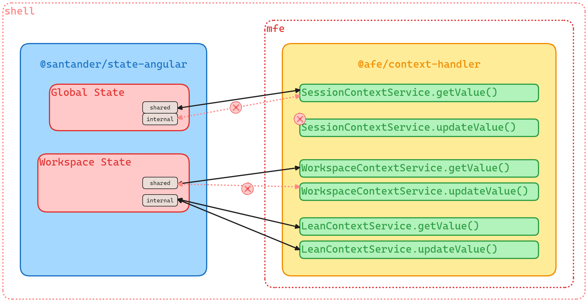

# Coexistence of `@santander/state` and `@afe/context-handler`

## Introduction

The `@santander/state` library was built to save data in the application memory, read this data, and in some cases, change this data. On the other hand, `@afe/context-handler` is a legacy library with same purpose.

This integration was made to satisfy a use case where we have a **Shell Application** with `@santander/state` installed and a Microfronend with `@afe/context-handler` installed.

With this coexistence capability, `@santander/state`, installed on the **Shell Application**, has listeners to receive requests emitted by `@afe/context-handler` installed on the Microfrontend legacy application.

## Coexistence Concepts

The `@santander/state` has a state concept called Global State and another one called Workspace State. The `@afe/context-handler` has different state concepts called **Session Context**, **Workspace Context**, and **Lean Context**.

These two different approaches relate to each other with the following key points:

### Session Context

  - Microfrontend Session Context gets value from Shell Global Shared State
  - Microfrontend Session Context can't get value from Shell Global Internal State
  - Microfrontend Session Context can't update value from Shell Global (Internal / Shared) State

| Microfrontend Session Context   | Shell Global State    |
| ------------------------------- | --------------------- |
| Gets value                      | Shared State          |
| Can't get value                 | Internal State        |
| Can't update value              | Internal/Shared State |

### Workspace Context

  - Microfrontend Workspace Context gets value from Shell Shared Workspace State
  - Microfrontend Workspace Context can't update value from Shell Shared Workspace State

| Microfrontend Workspace Context   | Shell Shared Workspace |
| --------------------------------- | ---------------------- |
| Gets value                        | Shared Workspace State |
| Can't update value                | Shared Workspace State |

### Lean Context

  - Microfrontend Lean Context gets value from Shell Internal Workspace State
  - Microfrontend Lean Context updates value from Shell Internal Workspace State

| Microfrontend Workspace Context   | Shell Shared Workspace |
| --------------------------------- | ---------------------- |
| Gets value                        | Shared Workspace State |
| Can't update value                | Shared Workspace State |

### Coexistence Diagram



### Why this incompatibility?

The reason for this incompatibility is that the `@santander/state` has a more defensive strategy to prevent causing collateral effects.

## Pre-requisites

- Understanding of the fundamentals: Full understanding of the fundamentals of the `@santander/state` library and `@afe/context-handler`.

## Installation

Install the libraries in your shell and Microfrontend applications respectively:

```shell
npm install @santander/state@
```

```shell
npm install @afe/context-handler@ @afe/event-handler@
```

## Configurations

### Configuring the Root Application

To configure your application to use the `@santander/state-angular` library, you need to import the providers from `StateModule` in your `app.config.ts` and call the `forRoot` method.

```ts
import { ApplicationConfig, importProvidersFrom } from '@angular/core';
import { StateModule } from '@santander/state-angular';

export const appConfig: ApplicationConfig = {
  providers: [
    importProvidersFrom(StateModule.forRoot()),
    // ... other providers
  ],
};
```

### Configuring the Child Application

To configure your Microfrontend application to use the `@afe/context-handler` library, you need to import the providers from `InheritedContextHandlerModule` in your `app.config.ts` and call the `forRoot` method.

```ts
import { ApplicationConfig, importProvidersFrom } from '@angular/core';
import { InheritedContextHandlerModule } from '@afe/context-handler';

export const appConfig: ApplicationConfig = {
  providers: [
    importProvidersFrom(
      InheritedContextHandlerModule.forRoot({ enableExperimentalEvents: true, leanName: 'mfeName' })
    ),
    // ... other providers
  ],
};
```
