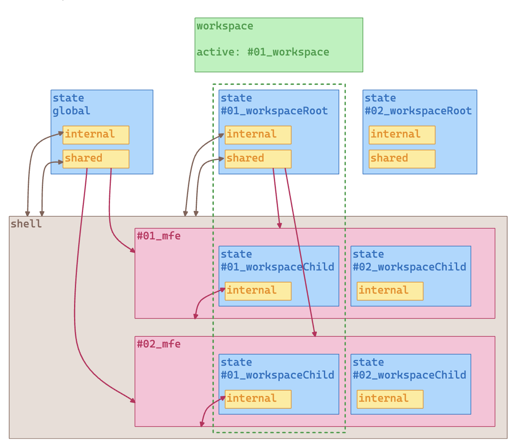

# @santander/state

## Overview

`@santander/state` is a library that provides a **simple way to deal with context data in an application**. It allows you to share data between the whole application, and have isolated contexts to manage different states.

## Fundamentals concepts

Let's dive deep into the architecture of the `@santander/state` library.

In order to understand the library, we need to understand the following concepts:

### State

A state is a scope that contains data you want to manage in your application. It can be a simple string, a number, an object, or an array.

### Global State

The Global State contains data that can be shared across different parts of the application. You can make data shareable by setting `shareable` to `true`. Once data is shareable, it can be accessed from any child application.

> If no flag is set, the data will be internal and only available for the root application.

The global state, could have two contexts: the **internal** and **shared**:

- **Internal**: will be only available in root applications.
- **Shared**: will be available in all applications that try to access the data, once the data is shareable.

### Workspace State

A workspace is an isolated scope that contains data you want to manage in your application. It can be a simple string, a number, an object, or an array and can be create based in a user, a customer, a channel, or any other information.

The state of a workspace will not be accessible from another workspace, but it can share data within its own context, by setting a data with the flag `shareable` equals to `true`.

An workspace can also have two contexts: the **root** and **child** workspace state:

- **Workspace Root**: will be shared among all the workspace's children that try to access the data.
- **Workspace Child**: will be isolated from the workspace root context and from other workspace children.
  
### Workspace Manager

The Workspace Manager is a service that **manages the workspaces in the application**. It allows you to register, unregister, and activate workspaces. Once you have a workspace active, all workspace operations will be apply for the active workspace.

### Context Data Strategy

Sometimes you will need a data available only in the global context. others you'll need a shared data available in the workspace context, but in its absence, it can be replaced by another data.

Whatever the scenario fits you, you can choose which context data will be returned first by passing the parameter `contextDataStrategy` with one of the following strategies available:

- **INTERNAL_ONLY**: retrieves only internal data;
- **SHARED_ONLY**: retrieves only shared data;
- **INTERNAL_FIRST**: retrieves data defined internally and if it does not exists, tries to retrieve the shared data;
- **SHARED_FIRST**: retrieves the data shared and if it does not exist, tries to retrieve the internal data;
- **DEFAULT**: If no context data strategy is passed, the default will be `INTERNAL_FIRST`.

> If none value are found in the internal or shared context, the fallback value will be retrieved.

To a more visual example, take a look at the table below that specifies which data will be returned based on the choose strategy:

| Strategy | Check Internal Data? | Check Shared Data? | Prioritized Data Returned |
| :------: | :-----------------: | :---------------: | :-----------------------: |
| **INTERNAL_ONLY** | Yes | No | Internal Data |
| **SHARED_ONLY** | No | Yes | Shared Data |
| **INTERNAL_FIRST** | Yes | Yes | Internal Data |
| **SHARED_FIRST** | Yes | Yes | Shared Data |
| **DEFAULT (INTERNAL_FIRST)** | Yes | Yes | Internal Data |

## Implementation

Now you're familiar with the concepts, let's see how to implement the `@santander/state` library in your application.

### Promise-based implementation

Follow the [Try it in Vanilla JavaScript](./use-it-in-vanilla.md) to see how to implement the `@santander/state` with promises.

### Observable-based implementation

Follow the [Try it in Angular](./use-it-in-angular.md) to see how to implement the `@santander/state` with observables.
