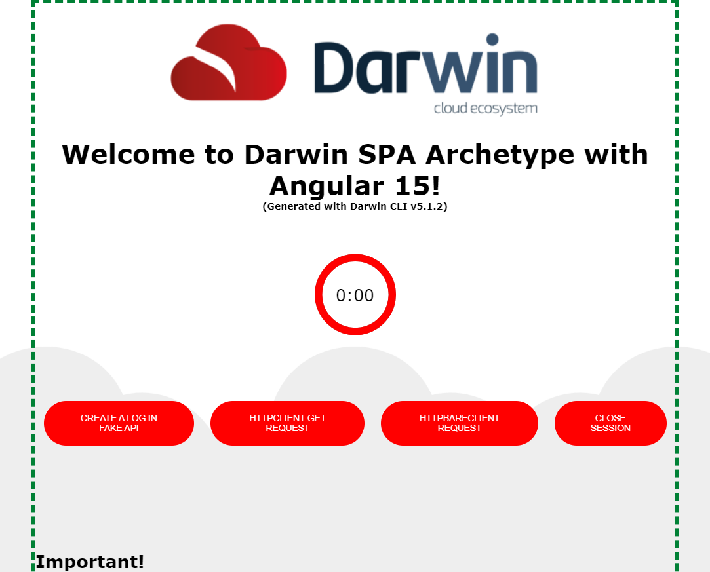
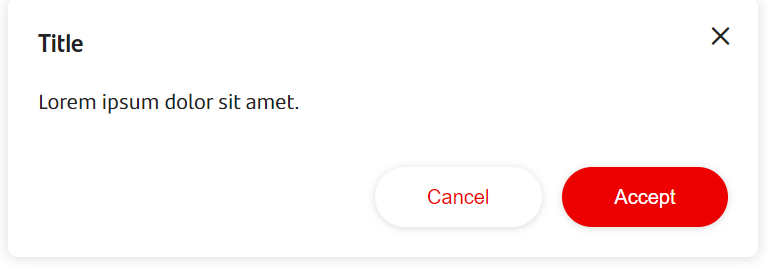

# How to transform a Darwin Classic Shell into a Darwin Gluon Shell

A Darwin Classic Shell is a Single Page Application capable of hosting Microfronts that uses the following classic Darwin modules:

- [Darwin Config](../ng-darwin/modules/config/index.md){:target="_blank"}
- [Darwin Logger](../ng-darwin/modules/logger/index.md){:target="_blank"}
- [Darwin Security](https://automatic-doodle-rew2y31.pages.github.io/modules/_ng-darwin_security.html){:target="_blank"}
- [Darwin Microfront](../microfrontend-architecture/ng-darwin-wmf/index.md){:target="_blank"}

This way, a Classic Shell follows the classic corporative security using BKS tokens.

A Darwin Gluon Shell is a Darwin Shell that uses the new security approach for Gluon based on OAuth 2.0 protocols (Plain Oauth or OIDC),
so the Darwin Security library will be replaced with the new Gluon Security library: [Security Context Manager: a.k.a. SCM](../../../core/security/index.md).

A Darwin Gluon Shell will use the following modules:

- [Darwin Config](../ng-darwin/modules/config/index.md){:target="_blank"}
- [Security Context Manager](../../../core/security/index.md){:target="_blank"}
- [Darwin Microfront](../microfrontend-architecture/ng-darwin-wmf/index.md){:target="_blank"}

## How to transform a Darwin Classic Shell into a Darwin Gluon Shell

To transform a Darwin Classic Shell into a Darwin Gluon Shell, you must follow the next steps:

### 1. Remove the Darwin Security module from the project

Uninstall the Darwin Security module from your project:

```bash
npm uninstall @ng-darwin/security
```

### 2. Remove every reference to `@ng-darwin/security` in your code

You'll need to remove each reference to the Darwin Security module in your code. Every project is different so the best way to find the references in your code will be using the finding tool of your IDE.

Probably you will have references in your `app.config.ts`.

``` typescript title="app.config.ts"
import { provideSecurity } from '@ng-darwin/security';

export const appConfig: ApplicationConfig = {
  providers: [
    provideSecurity(),
    ...
  ]
};
```

As well as in your `app.ts`.

``` typescript title="app.ts"
import { SecurityService, DwError } from '@ng-darwin/security';

@Component({
  ...
  template: `
    @if ((securityService.onSessionInitialized$ | async) === undefined) {
      <app-example />
    }
  `,
})
export class App {
  public readonly securityService: SecurityService = inject(SecurityService);

  async ngOnInit(): Promise<void> {
    await this.securityService.initialize();
    ...
  }

  private _subscribeToSessionEvents(): void {
    this.securityService.onSessionInitialized$.subscribe(...);
    this.securityService.onSessionAboutToTimeout$.subscribe(...);
    this.securityService.onSessionTimeout$.subscribe(...);
    this.securityService.onSessionResume$.subscribe(...);
    this.securityService.onSessionKilled$.subscribe(...);
    ...
  }

  private _subscribeToErrorEvents(): void {
    this.securityService.onError$.subscribe(...);
    ...
  }

  private _subscribeToLogEvents(): void {
    this.securityService.onLog$.subscribe(...);
    ...
  }
  ...
}
```

Remove it also from `webpack.config.js`

``` typescript title="webpack.config.js"
module.exports = {
  plugins: [
    new webpack.container.ModuleFederationPlugin({
      shared: {
        '@ng-darwin/security': { ... },
        ···
      },
    }),
  ],
};

```

You'll probably have references in other files of your project, so you'll need to find them and remove them.

### 3. Remove Darwin Security configuration from your `config.json`

As you will not have the Darwin Security library, you won't need the security configuration in the `config.json`.

You can safely delete this from your `config.json`.

```typescript title="config.json"
{
  "$schema": "../../node_modules/@darwin/config/schema.json",
  "appKey": "···",
  "appName": "···",
  "logLevel": 1,
  "technicalGrouping": "···",
  "logger": {
    ···
  },
  "security": { <-- REMOVE THIS
    ···
  },
  "app": {
    ···
  }
}
```

### 4. Configure Darwin Logger as insecure

The current version of Darwin Logger is attached to Darwin Security so it must be configured as insecure in order to work without Security.

```typescript title="config.json"
{
  ···
  "logger": {
    "isSecured": false,
    ···
  },
  ···
}
```

We are working on a new version of Logger that will be able to work with the new Security Context Manager (SCM) module so... stay tuned!

### 5. Install and configure the Security Context Manager (SCM) module

You'll need to install the SCM module in your project.

In this article, you'll have a summary of the steps you'll need to follow, but you'll have more detail about this in the [Security Context Manager documentation](../../../core/security/authentication/oauth/use-it-in-angular.md).

To install it, you'll need to type the following command in your terminal:

```bash
npm install @santander/security-angular
```

We recommend following a dynamic configuration approach, so we encourage you to use the Darwin Config library to configure the SCM module.
This way, you'll need to configure some providers in your `app.config.ts` and use it to configure the SCM module.

Here you have a snippet with a possible configuration:

```typescript title="app.config.ts"
import { ConfigService, provideConfig } from '@ng-darwin/config';
import { SecurityContextManagerModule } from '@santander/security-angular';
...

export async function acquireSecurityConfig(configService: ConfigService): Promise<any> {
  const cfg = await firstValueFrom(configService.onConfigLoaded$ as Observable<AppProps>);
  const gluonSecurityProps = cfg.gluon!.security!;
  return Promise.resolve(gluonSecurityProps);
}

export const appConfig: ApplicationConfig = {
  providers: [
    // provideConfig. Configures the DI for ConfigService.
    provideConfig({
      technicalGrouping: '...'
      ...
    }),
    importProvidersFrom(SecurityContextManagerModule.forRoot({
      useFactory: acquireSecurityConfig,
      deps: [ConfigService]
    }))
    ...
  ]
};
```

You can see that the factory `acquireSecurityConfig` is created using the `ConfigService` as a dependency, so the `ConfigService` will be injected as a parameter.

This factory will be used to configure the SCM module and it will be called when the SCM module is initialized.
The factory will return a promise awaiting the `configService.onConfigLoaded$` observable to be fulfilled with the dynamic configuration, returning the appropriate configuration for the SCM module.

```JSON title="config.json"
{
  "gluon": {
    "security": {
      "storageStrategy": "...",
      "client": {
        "clientId": "..."
      },
      "type":"...",
      "scope": ["..."],
      "redirectUri": "...",
      "logoutRedirectUri": "...",
      "issuerUri": "..."
    },
  }
  ...
}
```

!!! note

    Please note, at this point, you are configuring the OAuth server so you'll need to have an OAuth server running and configured to work with your Shell.

    You can run a local server (like [OIDC Provider](https://www.npmjs.com/package/oidc-provider){:target="_blank"}) to do your tests or configure your SOS to use it with localhost redirectURIs.

### 6. Configure the SCM guard to secure your routes

You'll need to configure the SCM guard to secure your routes.

You can do it in your `app.routes.ts`, using the `canActivate` property and the `OAuthGuard` guard in the route you want to protect.

``` typescript title="app.routes.ts"
import { OAuthGuard } from '@santander/security-angular';

export const routes: Routes = [
  {
    path: 'global-position',
    canActivate: [ OAuthGuard ],
    component: GlobalPositionComponent
  },
  ...
];
```

When the route is activated, the SCM guard will check if the user is authenticated and if not, it will redirect the user to the login page provided by the OAuth server.

### 7. Install and configure the Gluon HTTP module

You'll need to install the [Gluon HTTP module](../../../core/http/use-it-in-angular.md) (`@santander/http-angular`) in your project.

This module, in the Microfront scope, will be in charge of converting the HTTP requests into custom events that will be sent to the Shell.
This module, in the Shell scope, will be in charge of listening to these custom events from the Microfronts and convert them into HTTP requests.

This way, the SCM will be capable of intercepting them and adding the appropriate headers to the request.

You'll need to install it using the following command:

```bash
npm install @santander/http-angular
```

And import and initialize it in the `app.config.ts`.

!!! note

    Please, keep in mind **it requires** having `provideHttpClient()` configured.

```typescript title="app.config.ts"
import { provideHttpClient, withInterceptorsFromDi } from '@angular/common/http';
import { CustomEventListenerModule } from '@santander/http-angular';

export const appConfig: ApplicationConfig = {
  providers: [
    provideHttpClient(withInterceptorsFromDi()),
    importProvidersFrom(CustomEventListenerModule.forRoot()),
    ···
  ]
};
```

If you want to know more about this module, you can read the [Gluon HTTP module documentation](../../../core/http/index.md).

### 8. Ensure you are using Puppeteer to run your tests

Gluon runners do not provide Chrome installations, so you'll need to use Puppeteer to run your tests in the CI/CD workflows.

Take a look if you are using Puppeteer already. If not, you'll need to install it and configure it.

Follow this short guide to do it: [How to configure Puppeteer to run your tests](../../../core/faq/how-to-use-puppeteer.md).

### 9. Ensure you are using Flame

From Gluon we encourage all the projects to use Flame to standardize the look'n feel of the applications.

Flame is composed of three layers:

- Flame Design System (`@santander/flame-ds`): A set of CSS/SCSS with option and semantic tokens ready to be used, as well as the corporative icons and fonts of Santander.
- Flame User Interface (`@santander/flame-ui`): A set of reusable components developed with Stencil and compiled as standard Web Components.
- Flame User Interface for Angular (`@santander/flame-ui-angular`): A wrapper of `@santander/flame-ui` ready to be used in Angular projects.

You can find more information about Flame in the [Flame documentation](../../../../../../../contribute/cop/flame/index.md).

You can install them in your project using the following commands:

```bash
npm install @santander/flame-ds @santander/flame-ui @santander/flame-ui-angular
```

Once you have installed them, you'll need to configure your project to load the Flame Design System styles.
You have a lot of different possibilities, but we recommend adding them to the `angular.json` file this way:

```JSON title="angular.json"
{
  ···
  "projects": {
    "my-demo-project": {
      ···
      "architect": {
        "build": {
          ···
          "options": {
            ···
            "styles": [
              ···
              "node_modules/@santander/flame-ds/index.css"
            ],
            ···
          },
```

This way, Angular will load Flame Design System styles in the index.html file, so all the tokens, fonts and icons will be available for your project.

!!! note

    Please note, `node_modules/@santander/flame-ds/index.css` contains the following inner CSS:

    ``` CSS
    @import "src/tokens.css";
    @import "src/icon-tokens.css";
    @import "src/icon-font.css";
    @import "src/font.css";
    ```

    So you can import them separately if you want, especially if the weight of fonts or icons is too much for your project.

Once you have flame-ds in place, you'll be able to use it. For example try this in your root component. You'll be able to see a new green dashed border.

```SCSS
:host {
  display: block;
  border: 5px dashed var(--color-border-success);
}
```



The next step is to configure and use the reusable components library we have installed: Flame User Interface for Angular (`@santander/flame-ui-angular`).

We'll need to import the Flame providers from (`FlameStencilAngularModule`) into your config file.

```typescript title="app.config.ts"
import { FlameStencilAngularModule } from '@santander/flame-ui-angular';

export const appConfig: ApplicationConfig = {
  providers: [
    importProvidersFrom(FlameStencilAngularModule)
    ...
  ]
};
```

Once you have imported the providers you will need to import the `FlameStencilAngularModule` to use the Flame components in your Angular components.

```typescript title="your-comp.ts"
import { FlameStencilAngularModule } from '@santander/flame-ui-angular';

@Component({
  selector: 'app-your-comp',
  imports: [
    FlameStencilAngularModule
    ...
  ],
  template: `
    <san-modal
        modal-title="Title"
        modal-text="Lorem ipsum dolor sit amet."
        primary-btn-text="Accept"
        secondary-btn-text="Cancel">
    </san-modal>
  `
})
export class YourComp {}
```

And they will render as expected.


