# Functionalities of Shell and Microfront archetypes

This section explains the functionalities that the Shell and Microfront archetypes expose, most of them are examples for the possible implementations that will be needed in the different projects.

## Session Count Down

An example component is shown that simulates the 2 minutes countdown of the session (the token returned by the Fake API is set to 2 minutes).
If activity is stopped and mouse movement and typing is stopped. When there are only 30 seconds left to timeout, the message `sessionAboutToTimeout` will be displayed on the console.
If the mouse is moved or typed again, the `sessionResume` message will be issued. If the countdown times out, the `sessionTimeout` event will be emitted.

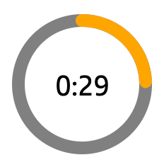{ style="display: block; margin: 0 auto; width: 15%" }

## Main Buttons of application

Each of these buttons executes an [AJAX](https://developer.mozilla.org/en-US/docs/Web/Guide/AJAX) request with its peculiarity.

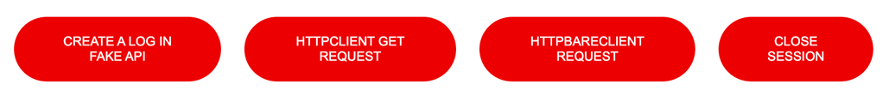{ style="display: block; margin: 0 auto; width: 80%" }

### Create a log in fake API (only for local environment)

It sends a log trace through the Logger module.
If you click this option, a request to a Darwin fake API endpoint, where the security headers and common headers will be sent (token, contactpoint, session-id, x-clientid...) along a payload.
This trace is saved in the database that simulates the Darwin fake API in the `api/db.json` file.

> This button is also available on the Microfront archetype. It performs the same function but pointing to it's port.

### HTTP client get request (only for local environment)

Make a GET request through Angular's HttpClient service. This action will call the same endpoint as the previous point. HttpClient is configured so that any request made through this service includes the security headers and the common headers.

> This button is also available on the Microfront archetype. It performs the same function but pointing to it's port and using the **Shell headers**.

### HTTP bare client request

Make a request through [Darwin HttpBareClient service](https://automatic-doodle-rew2y31.pages.github.io/modules/_ng-darwin_security.html#httpbareclient-service){:target="_blank"}.
A GET request will be requested to an endpoint that indicates the status of the web server, which will **NOT include the security headers**, nor the common ones. It's a bare call without the headers that Darwin adds.

### Close session

Delete the credentials of the current session. After removing them, try to make a request that includes the security headers (token, X-ClientId...). You will see that this time the request is made without a token. In a real API, the service would respond with an error. <!-- markdownlint-disable MD013 -->

## Shell Tabs for loading the Microfronts

At the top of the Shell, you will find the main menu of the container application. The following three tabs refer to the routes that are reflected in the `app.routes.ts` file.

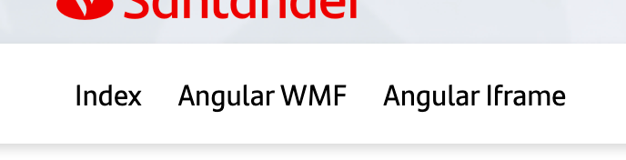{ style="display: block; margin: 0 auto; width: 40%" }

### Index

This link will load the `Home` component, a basic Angular component that is specific to the Shell.

### Angular WMF

This link will load the angular component `MicrofrontContainerComponent`, which makes use of the `MicrofrontContainerDirective` directive in order to invoke a Microfront.

### Angular iFrame

This link will load the angular component `MicrofrontIframeContainerComponent`, and then show an example of loading an iFrame. Concretely, it will try to load the Microfront of the archetype in a standalone way, on port 4201.

## Breadcrumb

As you navigate through the different links in the Microfront, the breadcrumb just above the Microfront will be updated.
This is an implementation example to reflect the breadcrumb outside the Microfront, using the breadcrumb event provided by the `@ng-darwin-wmf/microfront` library.

{ style="display: block; margin: 0 auto; width: 40%" }

To communicate changes to the breadcrumb, it will be necessary to issue this event communicating the new state of the breadcrumb.

``` TS
// Example emit breadcrumb
this.breadcrumb.emit([
  {
    title: 'First child',
    path: 'first-child',
  },
  {
    title: 'Second child',
    path: 'first-child/second-child',
  },
]);
```

## Navigation

Inside the Microfront there is a navigation menu separated into two sections, **internal navigation** and **external navigation**.

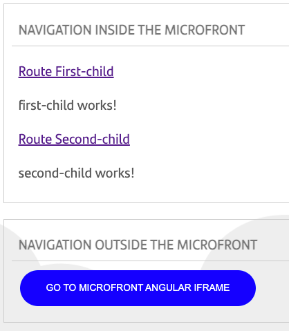{ style="display: block; margin: 0 auto; width: 30%" }

### Internal

The first links refer exclusively internal routes of the Microfront.

In order to work with routes in a Microfront, the pipe is provided from the `@ng-darwin-wmf/microfront` library, which must be informed with the mounting route.

The template should look like this:

```<a [routerLink]="'/first-child' | mountPath">Route First-child</a>```

> `mountPathPipe` pipe is built to be used only for the Microfront main component (the one which is loaded by the Shell).

### External

External navigation is understood as navigation outside the Microfront. For example, if you want to go to another Microfront, to a Shell route, etc.

In order to perform external navigation, the `externalNavigation` event must be emitted from the Microfront.

```this.externalNavigate.emit('external-route');```

This will normally result in a rerouting by the shell.

## Loading the Assets

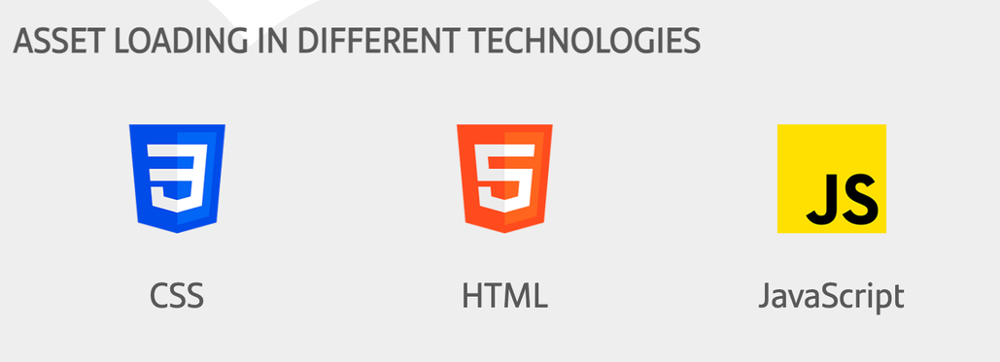{ style="display: block; margin: 0 auto; width: 50%" }

Inside the Microfront we have loaded assets through different ways. For checking how to configure the assets integration in the project,
you can check this documentation [How to work with Microfront Assets](../developer-guides/how-to-work-with-microfront-assets.md) .

### HTML

This is plain HTML, so the technical group is needed in the path.

``` html

```

### CSS

``` css
.css-image-relative {
  background-image: url('../../assets/css.png');
}
```

``` html
<div class="css-image-relative"></div>
```

### JS

If we want to load an asset but we would like to avoid to set the technical group, we can use HTML and JS together through the [PrefixAsset](../ng-darwin-wmf/v20/api-reference/prefixassetpipe.md) pipe provided by the Microfront library

``` html
<div class="img-container" i18n-title title="Image loaded in JavaScript">
  
  <p>JavaScript</p>
</div>
```

## Communication

!!! warning
    Only communications Shell ↔︎ Microfront are recommended to avoid dependencies between applications as much as possible. Therefore, communications Microfront A ↔︎ Microfront B are not advisable.

You can play with both ways of communications using the communication boxes:

- Communication box to send a buzz and a message from the Shell to the Microfront
    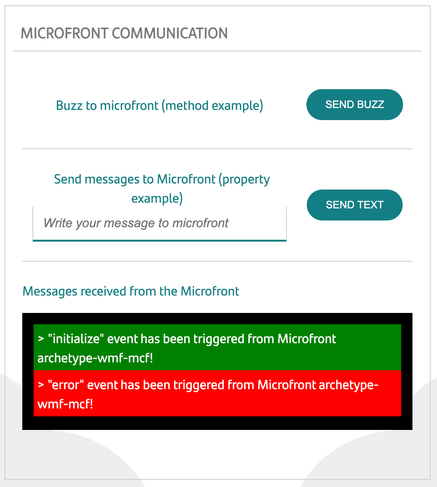{ style="display: block; margin: 0 auto; width: 40%" }

- Communication box to send a technical error and a message from the Microfront to the Shell
    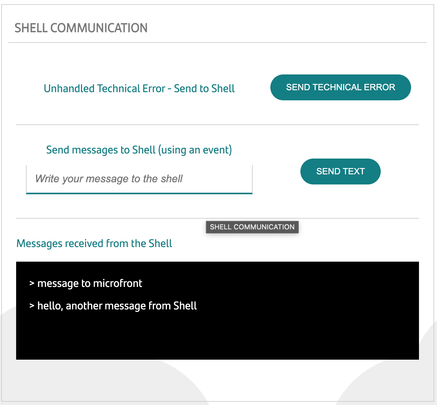{ style="display: block; margin: 0 auto; width: 40%" }

### Properties

_Can be used for Shell => Microfront communication._

Angular Element is used to instantiate the Microfront, which behind it will be use a Web Component, so properties can be used to modify some business logic in the Microfront from the Shell.

Binding is also an advantage of using this method, so properties can be updated in the Shell and it will be reflected on the Microfront.

#### Example

In the Microfront:

``` ts
export class Example {
    @Input() inputMessage = '';
}
```

In the Shell container:

``` html
<microfront-tag
  [inputMessage]="inputMessage"
></microfront-tag>
```

### Methods

_Can be used for Shell => Microfront communication_.

Adding a public method on the main Angular component in the Microfront is needed. **Arrow function is mandatory** if we want to use the context.

It is possible that forcing a detectChanges is needed.

#### Example

In the Microfront main component:

``` ts
export class Example {
    @Input() buzz = (): void => {
      // Logic...
      this._changeDetectorRef.detectChanges();
    };
}
```

In the Shell container:

  ``` html
  <!-- template -->
  <microfront-tag #microfrontRef></microfront-tag>
  <button (click)="callMicrofrontMethod()">Call Microfront Method</button>
  ```

``` ts
// Class Method
callMicrofrontMethod(): void {
  this.microfrontRef().nativeElement.buzz();
}
```

### Events

_Can be used for Microfront => Shell communication._

We will be using the `@Output` Angular decorator to send the events from the Microfront.

#### Example

In the Microfront main component:

``` ts
@Output() outputMessage = new EventEmitter<string>();
```

In the Shell container:

``` html
<microfront-tag
  (outputMessage)="doSomethingWithOutputMessage($event)"
></microfront-tag>
```

### Events from the MicrofrontDirective

The `MicrofrontDirective` is exported to be extended by the main Microfront component, which contains several events by default that can be used in the Shell container.

- **externalNavigate**: to be able to navigate outside the Microfront.
- **breadcrumb**: to inform about breadcrumb changes.
- **initialize**: to inform when the security is initialized.
- **destroy**: to inform that the Microfront has been destroyed.
- **error**: to inform about a technical error in the Microfront.

## Errors

We will be talking about what functional errors (handled) and technical errors (unhandled) are and the particular errors that are dispatched in the Shell and Microfront archetypes.

The errors will be shown in the communication box with a red background and in the browser development console.

### Functional error

We call functional errors when they are expected and handled in a particular way.

In most of the cases the Microfront can manage the errors itself. In case that it is not possible for any reason we need to send it to the Shell by a Custom Event.

The “error” event provided by the MicrofrontDirective should not be used in functional errors because it is designed to handle unexpected errors.

#### Error handled within the Microfront

In the Microfront buttons section the _Functional Error_ button shows an example of it.

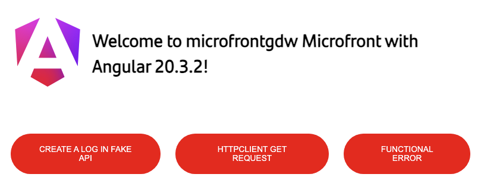{ style="display: block; margin: 0 auto; width: 60%" }

The functional button HTML looks like:

``` html
<button
   id="btnFuntionalError"
   class="button--red"
   (click)="functionalError()"
   i18n-title title="Launches a Microfront controlled functional error"
   i18n
>
   FUNCTIONAL ERROR
</button>
```

Once the functional button is clicked, an incorrect HTTP Request is done.

``` ts
functionalError(): void {
    this._httpClient.get('url_for_functional_error').subscribe({
      error: () => this.response = 'Generic Error',
    });
}
```

Because of the url is not well formatted, the error handler will set the _response_ property, which will be shown to the user.

#### Error handled by the Shell

A **Custom Event** could be used to send a functional error to the Shell. For example:

In the Microfront main component::

``` ts
export class App extends MicrofrontDirective {
  @Output() customError = new EventEmitter<string>();

  sendCustomError(customError: CustomError) {
    this.customError.emit(customError);
  }
}
```

In the Shell container:

``` html
<microfront-tag (customError)="myHandler($event)"></<microfront-tag>

myHandler(event: CustomEvent) {
  const error = event.detail as Error;
  // Logic.
}
```

### Technical error

We call technical errors to the errors that are unexpected and in most of the cases the Microfront cannot recover itself, so the Microfront event “error” from the `MicrofrontDirective` to the Shell, which is designed to be used for this kind of errors.

We aim to use `GlobalErrorHandler` mechanism provided by Angular to archive this. Lets see how all of this works.

#### Example

Click on the _Send Technical Error_ button:

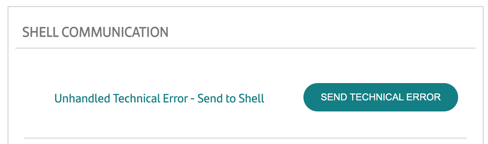{ style="display: block; margin: 0 auto; width: 50%" }

``` html
<button
  id="button-technical-error-to-mcf"
  class="communication-button"
  (click)="sendTechnicalError()"
  i18n
  [attr.disabled]="disabled ? '' : null"
>Send Technical Error</button>
```

The following method will be called:

``` ts
sendTechnicalError(): void {
  throw new Error('Unexpected error');
}
```

To be able to capture this event we are using the `GlobalErrorHandler` provider that implements the `ErrorHandler` provided by Angular.

In the module:

``` ts
providers: [
  ...
  { provide: ErrorHandler, useClass: GlobalErrorHandler }
  ...
],
```

The `GlobalErrorHandler` provider will emit a technicalError event to the main Microfront component through the CommunicationService.

``` ts
handleError(error: Error): void {
  console.error('This error is emitted to the Shell as an event.', error);
  this._communicationService.emitTechnicalError(error);
}
```

And, finally, the main Microfront component will emit the “error” event to the Shell using an `@Output` event provided by the `MicrofrontDirective`.

``` ts
this._communicationService.technicalError$.subscribe((error: Error) => {
  this.error.emit({detail: error});
});
```

In the Shell container can be obtained and do the needed logic:

``` ts
// In the template
(error)="emit($event); log($event)"

// Logic
emit(event: Event): void {
  // Logic to be done
}
```

In this example, an error will be shown in the Shell and the browser consoles:

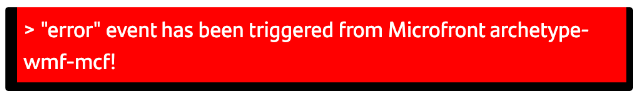{ style="display: block; margin: 0 auto; width: 40%" }
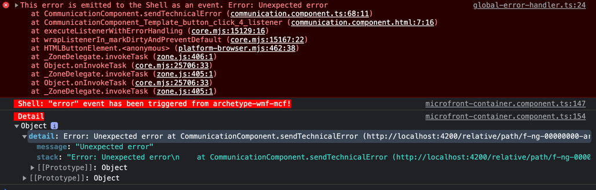{ style="display: block; margin: 0 auto; width: 90%" }

## Internacionalization and Localization

If several languages are needed on the application, the internalization process is needed to be implemented in the project.

The base of this implementation is based on the Angular official process. You can find it in the [Angular documentation](https://angular.dev/){:target="_blank"}.

### Sources files

XLF sources files can be found here:

- `src\\locale\\messages.xlf` (default)
- `src\\locale\\messages.es.xlf`

### Links

You can find more information about how to start and develop in a local environment in the following links:

- [Shell | Internationalization and Localization](shell.md#internationalization-and-localization)
- [MicroFront | Internationalization and Localization](microfront.md#internationalization-and-localization)
