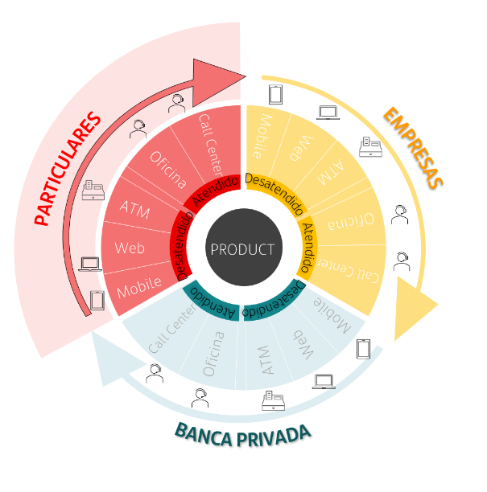

# Channel Management

{ style="display: block; margin: 0 auto;" }

## Shell

We can say an application with a Shell role is the channel itself where the Microfronts will be integrated and executed.

The Shell, and only the Shell, has to set the name of its channel, because the Microfronts integrated by the Shell are able to differentiate certain business logic based on that channel.

### How to set the channel

There are two approaches to set the channel: Using the configuration approach or using programmatic approach.

#### Configuration approach

Import `provideConfig` and `provideSecurity` into the main config of the Angular application, usually called `app.config.ts`. This will take care of obtaining in JSON format the necessary properties for the security.

```ts
export const appConfig: ApplicationConfig = {
    providers: [
        provideConfig({
            technicalGrouping: '...' // mandatory property for Config
        }),
        provideSecurity(),
    ],
};
```

This is how a configuration file looks like. The channel can be configured through the `security` property:

``` json
{
  "appKey": "appKey_value",
  "appName": "appName_value",
  "technicalGrouping": "f-ng-00000000-project-name",
  "security": {
    ...
    "xSantanderChannel": "channel",
    ...
  },
  ...
  "app": {
    ...
  }
}
```

Just in case you are not using the `@ng-darwin/config` module but are using a static configuration:

``` ts
// Example configuration of SecurityModule by passing it an object of type SecurityJsonProps (required):
export const appConfig: ApplicationConfig = {
    providers: [
      provideSecurity(
        withStaticConfig(
            // SecurityJsonProps: Interface with the different properties needed.
            ...
            xSantanderChannel: 'mychannel',
            ...
        ),
      ),
    ],
};
```

#### Programmatic approach

!!! warning
    Please **do not use** both methods simultaneously. Use only one of them, either Configuration approach or Programmatic approach.

If, for any reason, your application Shell can have two different channels, you should not use the previous method to set it, as this value is a static and will always remains the same.

If you need to set the channel in a dynamic way, use the `setChannel` method from the `SecurityService` provider.

``` ts
@Component({
  ...
})
export class App implements OnInit {
  private _securityService = inject(SecurityService);

  async ngOnInit(): Promise<void> {
    // set the channel before initialize the security
    this._securityService.setChannel('mychannel');

    // init the security service
    await this._securityService.initialize();
  }
}
```

### How to read the channel

A Shell must set the name of its channel, but if the application needs to read the value at any time, it can be accomplished through the `channel` getter property.

``` ts
@Component({
  ...
})
export class XComponent implements OnInit {
  private _securityService = inject(SecurityService);

  async ngOnInit() {
    // the channel must have been set before
    const { channel } = this._securityService;
  }
}
```

### Http Request

If the Shell application has set the channel, `X-Santander-Channel` header will be included in all http requests made by the application.

### Microfronts integrated by iframe

If your Shell application needs to integrate a Microfront by _iframe,_ you must pass the channel name as a _queryparam_ called `dw-channel`. The Microfront application and its Shell Lite must have been developed to interpret this _queryparam._

``` html
<iframe [src]="urlSafe" ...></iframe>
```

``` ts
const origin = 'http://localhost:4201';
const localeId = environment.production ? `/${this._localeId}` : '';
const token = `token=${this._securityService.token}`;
const channel = this._securityService.channel ? `&dw-channel=${this._securityService.channel}` : '';
const url = `${origin}${localeId}?${token}${channel}`;
this.urlSafe = this.sanitizer.bypassSecurityTrustResourceUrl(url);
```

## Microfront

### How to read the channel

First and foremost, the Shell application must have set the channel name so that the Microfront application can access this value.

The channel value can be used by a Microfront to do a different business logic depending on the channel on which it is running on.
It will be available once `SecurityLiteService` has been initialized via the `initialize` method, as long as the Shell application has configured it, otherwise the header would be `undefined`.

Import `provideSecurityLite` into the main config of the Angular application, usually called `app.config.ts` and set it up through the `provideConfig` way (or with `withStaticConfig` way) as you would do in any Darwin application.

``` ts
export const appConfig: ApplicationConfig = {
  providers: [
    provideConfig({
      technicalGrouping: '...' // mandatory property for Config
    }),
    provideSecurityLite(),
  ]
};
```

If the Shell app has configured a channel name, this `channel` getter (readonly property) from `SecurityLiteService` provider will return the channel value.

``` ts
@Component({...})
export class App implements OnInit {
    private _securityLiteService = inject(SecurityLiteService);

    async ngOnInit(): Promise<void> {
        // first init the security lite service
        await this._securityLiteService.initialize();
        // the channel must have been set before by Shell app; undefined otherwise
        const { channel } = this._securityLiteService;
    }
}
```

### Http Request

If the **Shell application**, where the Microfront is running, has set the channel, `X-Santander-Channel` header will be included in all http requests made by the **Microfront** application.

If the Microfront has been developed to be multi-channel friendly, the value of this header will be different depending on the channel where the Microfront in running on.

### Standalone mode

A Microfront needs a Shell application that sets the channel value, but when the Microfront is being developed and therefore is run in standalone mode, there is no Shell to set the channel.
However this can be accomplished by the integrated _Shell Lite_ that comes with the Microfront archetype. You will have to indicate through _queryparams,_ that you want to up the Microfront with the _Shell Lite_ and a channel value.

``` js
dw-channel=mychannel // up Microfront with a channel value
```

For example, if your Microfront application is listening on port 4201:

`http://localhost:4201/?dw-channel=mychannel`
