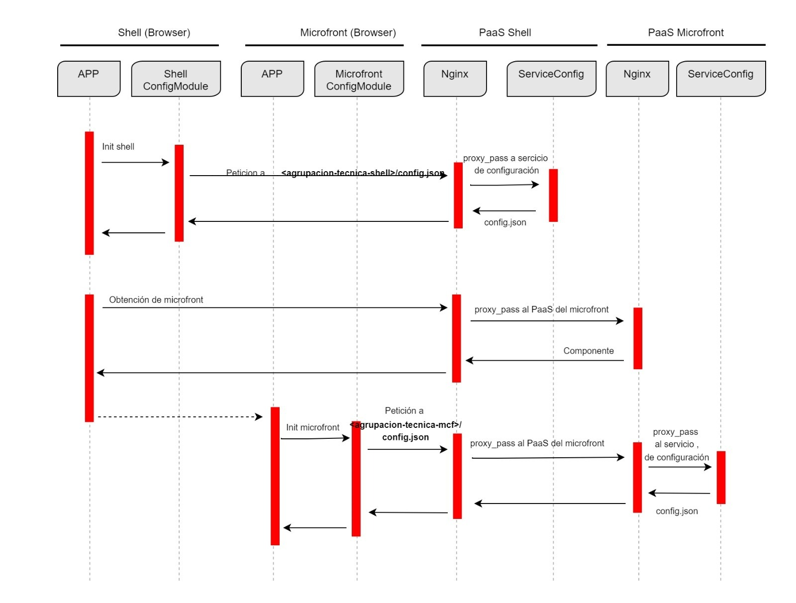

# Configuration

## Introduction

The Darwin Front libraries allow both Shell and Microfront applications to retrieve their configuration properties based on a JSON object, enabling them to behave differently depending on the execution environment.

## Elements involved

=== "Kubernetes"

    It's important to understand the elements involved in obtaining this configuration:

    * [Darwin Configuration Module](../../ng-darwin/modules/config/index.md) (Angular library to get the project configuration).
    * OpenShift PaaS (where the projects and its different pieces are deployed).
    * Nginx (where the web project is deployed).
    * [Configuration Service or Config Maps](../../ng-darwin/modules/config/index.md) (piece in charge of getting the configuration of the different pieces of the project).
    * GitHub repository (place where the different configurations are stored).

=== "AWS S3"

    It's important to understand the elements involved in obtaining this configuration:

    * [Darwin Configuration Module](../../ng-darwin/modules/config/index.md) (Angular library to get the project configuration).
    * AWS S3 (where the web application is deployed).
    * [Web S3 Config](../../../../../../../../architecture/reference-architecture/front-web/aws/s3-bucket.md#web-s3-config) (piece in charge of getting the configuration of the different pieces of the project).
    * GitHub repository (place where the different configurations are stored).

## Flow Example

=== "Kubernetes"

    Flow Example with Configuration Service

    

    During initialization, both Shell and Microfront applications create an instance of the Darwin Configuration Module. This module prevents the application from bootstrapping until each application retrieves its configuration.

    The `ConfigModule` retrieves the configuration by making a request to the `/<technical-group>/config.json` endpoint.
    The default archetypes have a Nginx server configured to capture this request and redirect it to the Configuration Service handled in the OpenShift PaaS.

    This Nginx configuration uses a location directive that proxies the request to the Configuration Service within the same Pass project.
    This service is responsible for retrieving the configuration by searching for it in the Git repository configured in that service.

    We strongly recommend that you read the following reading about [how Darwin Config Module works](https://automatic-doodle-rew2y31.pages.github.io/modules/_ng-darwin_config.html#config-module-functionalities---how-does-it-work){:target="_blank"}.

=== "AWS S3"

    During initialization, both Shell and Microfront applications create an instance of the Darwin Configuration Module. This module prevents the application from bootstrapping until each application retrieves its configuration.

    - The `ConfigModule` belonging to the Shell will retrieve the configuration making a request to the `https://<shell-domain>/<app-shell-name>/cm-<component-shell-name>/config.json` endpoint.

    - The `ConfigModule` belonging to the Microfront will retrieve the configuration making a request to the `https://<mfe-domain>/<app-mfe-name>/cm-<component-mfe-name>/config.json` endpoint.

    For example, if your application called `myapp` has a Shell component named `myshell` and a Microfront component named `mymfe`, the following requests will be made respectively to retrieve the configuration for each component:

    - `https://<shell-domain>/myapp/cm-myshell/config.json`
    - `https://<mfe-domain>/myapp/cm-mymfe/config.json`
  
    !!! note
        Please note that the configuration for each component must be properly deployed in AWS S3. And the domain of the Shell and the Microfront can be the same or different. If they are different, CORS issues may arise and will need to be resolved. For more information, you can refer to:

        - [Reference Architectures: Web S3 Config](../../../../../../../../architecture/reference-architecture/front-web/aws/s3-bucket.md#web-s3-config)
        - [Web S3 Configuration Journey](../../../../../../../configuration/s3/web-s3-config.md)
        - [How Darwin Config Module works](https://automatic-doodle-rew2y31.pages.github.io/modules/_ng-darwin_config.html#config-module-functionalities---how-does-it-work){:target="_blank"}

## Shell Configuration Set Up

### JSON Configuration

=== "Kubernetes"

    The configuration json file has to follow a schema rules that is located in the `node_modules` folder. If the schema has no the very minimum values, a warning will be displayed in you IDE.

    The `appKey`, `appName`, `technicalGrouping` must be set in the configuration, as well as `security` object. `logger` key is an optional property depending on whether the Shell is using the Logger module or not.

    Be aware that the security `endpoint` configuration and `reminderTime` have to be specified in order to the Security Module be able to initialize the security.

    Take a look for a Shell simple configuration:

    ``` json
    {
        "$schema": "../../node_modules/@darwin/config/schema.json",
        "appKey": "darwin",
        "appName": "f-ng-12345678-shell",
        "technicalGrouping": "f-ng-12345678-shell",
        "security": {
            "endpoint": "http://localhost:3000/api/security/tokens",
            "reminderTime": 30000
        },
        "logger": {
            ...
        },
        "app": {
            ...
        }
    }
    ```

    Further detail about the configuration format can be [found here](https://automatic-doodle-rew2y31.pages.github.io/modules/_ng-darwin_config.html#configuration-file-format){:target="_blank"}.

    **Local Development**

    For a local development and to retrieve the configuration from the Fake API, please configure the `proxy.conf.json` file with the necessary redirects.

    ``` json
    {
        ...
        "/f-ng-12345678-shell/config": {
            "target": "http://localhost:3000",
            "pathRewrite": {
                "^/f-ng-12345678-shell": ""
            }
        },
        ...
    }
    ```

=== "AWS S3"

    The configuration json file has to follow a schema rules that is located in the `node_modules` folder. If the schema has no the very minimum values, a warning will be displayed in you IDE.

    The `appKey`, `appName`, `technicalGrouping` must be set in the configuration

    Take a look for a Shell simple configuration:

    ``` json
    {
        "$schema": "../../node_modules/@darwin/config/gln-schema.json",
        "appKey": "rost",
        "appName": "myshell",
        "technicalGrouping": "mex-rost-myshell",
        "gluon": {
            "security": {
                ...
            }
        },
        "app": {
            ...
        }
    }
    ```

    **Local Development**

    For a local development and to retrieve the configuration from the Fake API, please:

    - Add the `meta` tag with the name `manifest` and the following value to the `index.html` file. For more information about why this `meta` tag is needed, refers to [The meta tag manifest](./how-to-integrate-a-microfront-into-a-shell-application/aws-s3-considerations.md#the-meta-tag-manifest).

        ``` html
        <meta name="manifest" content='{"target":"s3"}'>
        ```

    - Configure the `proxy.conf.json` file with the necessary redirects.

        ``` json
        {
            ...
            "/rost/cm-myshell/config": {
                "target": "http://localhost:3000",
                "pathRewrite": {
                    "^/rost/cm-myshell": ""
                }
            },
            ...
        }
        ```

### How to use the Config module

Import the `provideConfig` token from `@ng-darwin` in the bootstrapped main config of the Shell, called `app.config.ts` and placed under the `src/app` folder by default:

```ts
import { provideConfig } from '@ng-darwin/config';
```

Then, import the Angular provider and configure it:

``` ts
export const appConfig: ApplicationConfig = {
    providers: [
        provideConfig({
            technicalGrouping: 'f-ng-12345678-shell', // or mex-rost-myshell
        }),
    ],
};
```

## Microfront Configuration Set Up

### JSON Configuration

=== "Kubernetes"

    The configuration json file has to follow a schema that is located in the `node_modules` folder, as well as the Shell application has to, but in this case is a different one called `mcf-schema.json`.

    It is important to mention that in this case `security` can be empty, since the Microfront do not need the security `endpoind` when it is integrated inside a Shell.
    `logger` key is an optional property depending on whether the Microfront is using the Logger module or not.

    A Microfront simple configuration can look like the following:

    ``` json
    {
        "$schema": "../../node_modules/@darwin/config/mcf-schema.json",
        "appKey": "darwin",
        "appName": "f-ng-12345678-mcf",
        "logLevel": 1,
        "technicalGrouping": "f-ng-12345678-mcf",
        "security": { ... },
        "logger": { ... },
        "app": { ... }
    }
    ```

    Further detail about the configuration format can be [found here](https://automatic-doodle-rew2y31.pages.github.io/modules/_ng-darwin_config.html#configuration-file-format){:target="_blank"}.

=== "AWS S3"

    The configuration json file has to follow a schema that is located in the `node_modules` folder, as well as the Shell application has to, but in this case is a different one called `gln-mcf-schema.json`.

    A Microfront simple configuration can look like the following:

    ``` json
    {
        "$schema": "../../node_modules/@darwin/config/glm-mcf-schema.json",
        "appKey": "rost",
        "appName": "mymfe",
        "logLevel": 1,
        "technicalGrouping": "mex-rost-mymfe",
        "app": {
            ...
        }
    }
    ```

    **Local Development**

    For a local development and to retrieve the configuration from the Fake API, please:

    - Configure the `proxy.conf.json` file with the necessary redirects.

        ``` json
        {
            ...
             "/rost/cm-mymfe/config": {
                "target": "http://localhost:3000",
                "pathRewrite": {
                    "^/rost/cm-mymfe": ""
                }
            }
            ...
        }
        ```

### How to use the Config Module

Import the `provideConfig` from `@ng-darwin` in the bootstrapped main config of the Microfront, called `app.config.ts` and placed under the `src/app` folder by default.

```ts
import { provideConfig } from '@ng-darwin/config';
```

Then, import the Angular provider and configure it:

```ts
export const appConfig: ApplicationConfig = {
    providers: [
        provideConfig({
            technicalGrouping: 'f-ng-12345678-mcf', // or mex-rost-mymfe
        }),
    ],
};
```

### Shell Lite Configuration Set Up

#### Why it is necessary

We have already seen that a configuration is needed for the Microfront when it is integrated into a Shell, but what happen if the Microfront has to work in standalone mode, without any shell wrappering it? (i.e. iframe integration or local development).
Then another piece is necessary, in order to correctly initialize the security. The piece that do this job is called **Shell Lite** and it is delivered together with the Microfront archetype out of the box.

#### JSON Configuration

=== "Kubernetes"

    It looks very similar to a Shell because the `endpoint` and `remienderTime` properties will be needed to be able to initialize de security token to be consumed by the Microfront.

    ``` json
    {
        "$schema": "../../../node_modules/@darwin/config/schema.json",
        "appKey": "darwin",
        "appName": "f-ng-12345678-mcf-shell-lite",
        "technicalGrouping": "f-ng-12345678-mcf-sl",
        "security": {
            "endpoint": "http://localhost:3001/api/security/tokens",
            "reminderTime": 30000
        }
    }
    ```

    !!! warning
        The `appName` and `technicalGrouping` must to be different to the Microfront one. Adding `-sl` at the end of the `appName` and the `technicalGrouping` is a good way to associate the Shell Lite to the Microfront. Take in mind that only one Shell Lite per Microfront will be available.

=== "AWS S3"

    ``` json
    {
        "$schema": "../../../node_modules/@darwin/config/gln-schema.json",
        "appKey": "mex",
        "appName": "mymfesl",
        "technicalGrouping": "mex-rost-mymfesl",
        "logLevel": 1,
        "gluon": {
            "security": {
                ...
            }
        },
        "app": {
        }
    }
    ```

    !!! warning
        The `appName` and `technicalGrouping` must to be different to the Microfront one. Adding `sl` at the end of the `appName` and the `technicalGrouping` is a good way to associate the Shell Lite to the Microfront. Take in mind that only one Shell Lite per Microfront will be available.

    **Local Development**

    For a local development and to retrieve the configuration from the Fake API, please:

    - Add the `meta` tag with the name `manifest` and the following value to the `index.html` file. For more information about why this `meta` tag is needed, refers to [The meta tag manifest](./how-to-integrate-a-microfront-into-a-shell-application/aws-s3-considerations.md#the-meta-tag-manifest).

        ``` html
        <meta name="manifest" content='{"target":"s3"}'>
        ```

    - Configure the `proxy.conf.json` file with the necessary redirects.

        ``` json
        {
            ...
            "/rost/cm-mymfesl/config": {
                "target": "http://localhost:3000",
                "pathRewrite": {
                    "^/rost/cm-mymfesl": "shell-lite"
                }
            },
            ...
        }
        ```

#### How to use the Shell Lite Config Module

This process is identical to a Shell, but adding it in a different config (called `shell-lite.config.ts` and placed under the `src/shell-lite` folder by default within the Microfront archetype). Also the `technicalGrouping` property has to be different.

```ts
export const appConfig: ApplicationConfig = {
    providers: [
        provideConfig({
            technicalGrouping: 'f-ng-12345678-mcf-sl', // or mex-rost-mymfesl
        }),
    ],
};
```

The Shell Lite is only accessible from the main `index.html` file, where the `ShellLite` and the main component of the application, `App`, are invoked.

When working in the local development environment, the fake `config.json` of the Shell Lite will be loaded, which is located inside the Microfront archetype under `api\public\shell-lite` folder.

## Related Documentation

It's beneficial to understand how the different elements work. You can refer to their respective documentation at the following links:

=== "Kubernetes"

    * [Config Maps](../../ng-darwin/modules/config/config-maps.md)
    * [Spring Cloud Config](../../ng-darwin/modules/config/spring-cloud-config.md) (not recommended)
    * [Darwin Configuration Module](../../ng-darwin/modules/config/index.md)

=== "AWS S3"

    * [Reference Architectures: Web S3 Config](../../../../../../../../architecture/reference-architecture/front-web/aws/s3-bucket.md#web-s3-config)
    * [Web S3 Configuration Journey](../../../../../../../configuration/s3/web-s3-config.md)
    * [Darwin Configuration Module](../../ng-darwin/modules/config/index.md)
