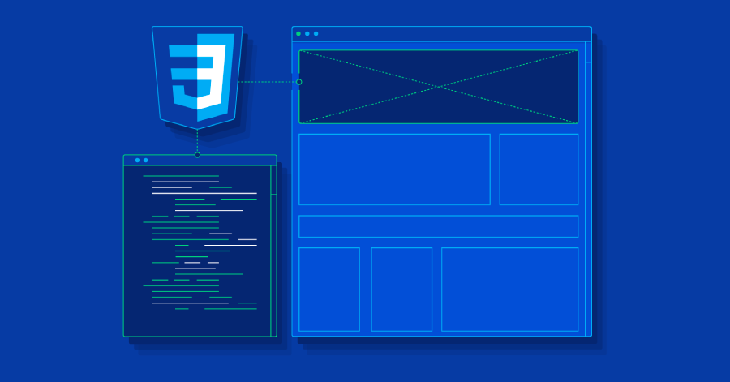
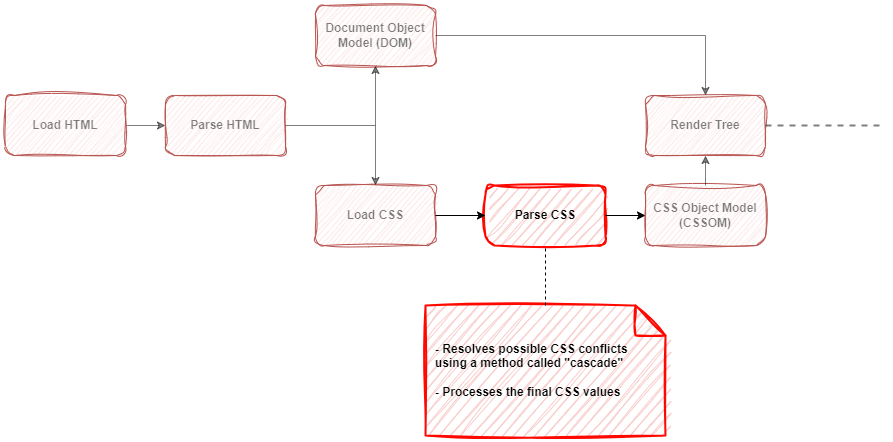
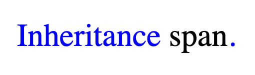
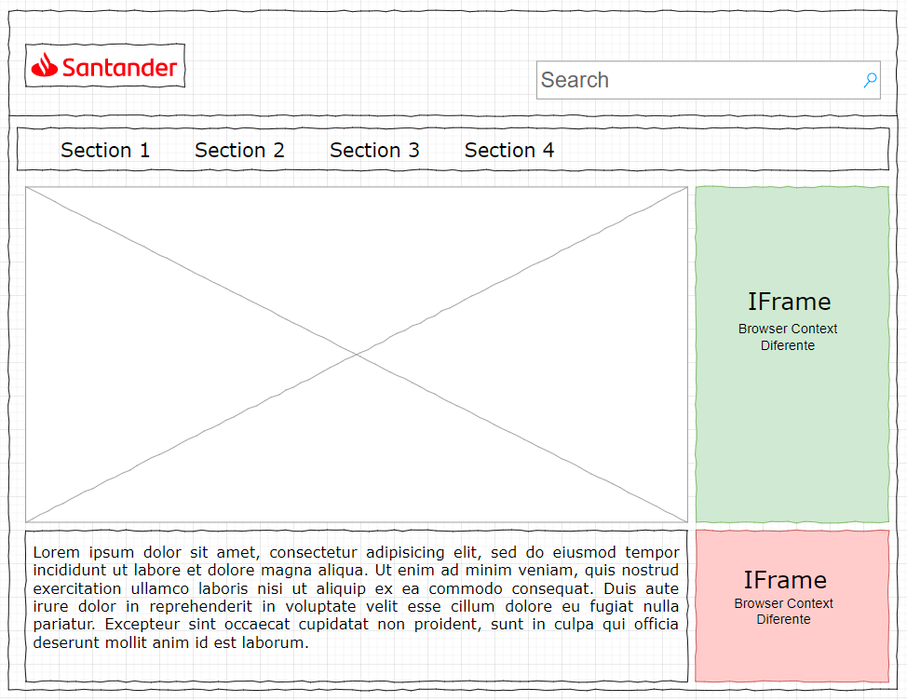
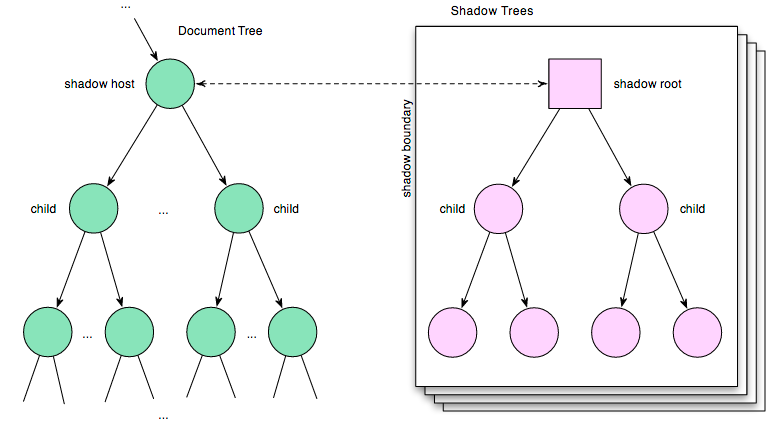

# CSS Styles

{ style="display: block; margin: 0 auto;" }

The following document will present a series of best practices for the proper functioning of styles, focusing on their efficiency, reuse and comprehensibility. Since we are using a Microfronts architecture, we must consider optimizing the styles.

## CSS Processing

To understand why style inheritance exists between the Shell and Microfronts, why it can be problematic, and how we can address it (in case you want to avoid inheritance altogether), it’s crucial to start by gaining a solid understanding of CSS principles and the role of Navigation Context. <!-- markdownlint-disable MD013 -->

Within the process that the rendering of a Document goes through, the most relevant step for our context is parsing the CSS. At this point, the browser performs two crucial steps:

1. Resolving conflicts that may arise in loaded style sheets using the CSS Cascade algorithm.
2. Processing the final CSS values.

{ style="display: block; margin: 0 auto;" }

## CSS Cascade algorithm

How does the CSS cascading algorithm work? We will summarize the conflict resolution process:

### Origin of Styles

Styles can come from different sources. Lets take a look:

- *User Agent Stylesheets*  
These are default styles provided by the web browser, such as margins and font sizes for HTML elements.

- *Author Stylesheets*  
These are styles defined by the websites author in the CSS file associated with the page.

- *User Stylesheets*  
Users can apply their own styles to web pages using extensions or browser settings.

- *Inline Styles*  
Inline styles are defined directly in the HTML element using the style attribute and have the hightst priority.

!!! note
    The CSS cascade algorithm combines these sources to determine which style rules will be applied to an element on the web page. More specific and higher-priority rules override less specific ones, such as inline styles taking precedence over external styles.

### Order of Appearance

When two rules overlap, the one that appears last in the CSS is applied.

``` html
<style>
  h1 { color: red; }
  h1 { color: blue; }
</style>

<h1>Header.</h1>
```

{ style="width: 20%" }

### Specificity

This is when there are several rules that could apply to the same element, but the most specific one is the one that the algorithm will select as valid. The specificity of a selector has 4 levels: 0, 0, 0, 0:

#### Element selector

It is the least specific of all the levels, so its specificity score is the lowest: 0, 0, 0, 1

#### Class selector

It is more specific than the element selector and therefore receives a higher score: 0, 0, 1, 0

#### Identifiers

It is higher than the element and class selectors so its specificity is: 0, 1, 0, 0

#### Inline styles

It is the most specific level, so its specificity score is: 1, 0, 0, 0

``` html
<style>
  /* specificity 0010 */
  .main-heading { color: red; }

  /* specificity  0001 */
  h1 { color: blue; }
</style>

<h1 class="main-heading">Specificity.</h1>
```

{ style="width: 20%" }

### `!important` use

The primary purpose of !important is to guarantee that a particular style rule is applied, even when other rules attempt to override it. While it can be helpful in certain situations, it's recommended as a last resort when other methods of controlling specificity, such as refining selectors or restructuring CSS, are not feasible. It’s crucial to be cautious with this rule to prevent making CSS harder to manage. Keeping the use of !important to a minimum contributes to maintaining clean and maintainable CSS code.

### Inheritance

Some CSS property values that have been set for parent elements are inherited by child elements, but others are not.

For example, if the color (color) and font (font-family) are set for an element, every element inside it will also be displayed in that color and font, unless a different color and font have been directly applied to them.

``` html
<style>
  body { color: blue; }
  span { color: black; }
</style>

<p>Inheritance <span>span</span>.</p>
```

{ style="width: 35%" }

!!! note
    If you want to know even more, read about this algorithm through the following link.

### Browser Context

According to [MDN](https://developer.mozilla.org/en-US/docs/Glossary/Browsing_context){: target="_blank"}:

> A browsing context is an environment in which a browser displays a Document. In modern browsers, it usually is a tab, but can be a window or even only parts of a page, like a frame or an iframe. Each browsing context has an origin (that of the active document) and an ordered history of previously displayed documents. Communication between browsing contexts is severely constrained

One of the restrictions between the different contexts is the impossibility of styles defined in one Document to affect others. It is for this reason that styles defined in a Document placed inside an iframe cannot affect the rest of the contexts.

{ style="display: block; margin: 0 auto;" }

Because Microfronts do not generate a Browser Context when they are rendered, the styles defined in the Shell and in the Microfronts will affect each other. However, there are alternatives to isolate the look & feel of our Microfronts so that the styles remain independent and do not overwrite each other.

### Encapsulation of the Microfront. The Shadow DOM

The use of Shadow DOM becomes mandatory. In a Microfront architecture it is essential to encapsulate the CSS, thus avoiding conflicts between the different Microfronts and even with the Shell itself. In this way we ensure that all the CSS declared in a Microfront cannot impact any other scope.

Even using the Shadow DOM encapsulation, the inheritance between the Shell application and the different Microfronts still works. We can avoid it but it is possible that you want to inherit different values such as fonts, otherwise using **unset** would be enough.

``` css
:host {
  all: unset;
}
```

To enable Shadow DOM encapsulation in Angular just, simply modify the main Microfront component, likely an app.ts. The ViewEncapsulation.ShadowDom encapsulation must be used.

``` ts
import { Component, ViewEncapsulation } from '@angular/core';

@Component({
  ...
  encapsulation: ViewEncapsulation.ShadowDom,
})
export class App {
}
```

The Shadow DOM is an API that allows you to create a special DOM tree, giving it the particular characteristic of encapsulating whatever is inside this DOM (HTML, CSS and JavaScript). Imagine this Shadow Dom as a sub-tree inside the regular DOM and everything defined in this sub-tree (the HTML nodes, the CSS and the JavaScript) will be independent of the regular DOM.

{ style="display: block; margin: 0 auto;" }

## BEM Methodology

Its use is recommended for very large HTML template blocks.

BEM is a methodology whose name stands for Block, Element and Modifier. It is a naming convention for classes in html and css. It is intended to help developers understand the relationships between HTML and CSS. According to [BEM — Block Element Modifier](https://getbem.com/){: target="_blank"}:

> BEM is very powerful and simple, which makes the front-end code easier to read and understand, easier to work with, easier to scale, more robust and explicit, and much strict.

### Key Principles

#### Blocks

They are the main components of your web page. They represent an independent and meaningful entity. For example, a button, a header, or a form can be blocks.

#### Elements

Elements are parts of a block and are directly related to that block. They have a name that describes their relationship to the block. For example, within a button block, an element could be icon to represent an icon inside the button.

#### Modifiers

Classes used to change the state or appearance of a block or element. They help create variations of a block without having to write additional CSS. For example, a modifier could be large to make a button larger.

#### Clear an Predictable Naming

BEM promotes clear and predictable naming conventions. Class names follow a structure like `block__element--modifier`, where each part is separated by underscores.

#### Style isolation

It helps isolate styles for blocks and elements, preventing conflicts and making maintenance easier. Styles for one block do not affect other blocks.

#### Facilitates Maintenance

BEM’s naming structure makes it easier to identify and modify specific parts of your code. This is specially heplful in large and complex projects.

#### Improves Collaboration

BEM provides a clear naming standard that facilitates colllaboration among developers. Everyone understand how classes are named and how the code is structured.

#### Reusability

Blocks and Elements can be easily reused in different parts of a project because their styles are encapsulated.

Hence, it’s important to consider that CSS **inheritance** can extend indefinitely. In contrast to other programming languages, there is no scoping and no closing of functions. Styles that are defined will flow downward (cascade) and never reach the end. BEM mitigates CSS inheritance and provides some scoping by using unique CSS classes per element.

**Specificity** plays a very important role in styling, simply because you need to be more specific to earn the "right" to modify an existing element. And most of the time, developers find themselves using very long nested CSS selectors or the !Important keyword to alter that specificity. Either approach results in a complicated mess of overlapping and conflicting CSS rules.

!!! note
    The official website does not explain with so many examples how to use the methodology. We recommend that you take a look at [Methodology/BEM](https://en.bem.info/methodology/){: target="_blank"} where they explain in much more detail how to use it. In one hour you will probably master at least 60% of the methodology!

## Design Tokens

The use of a methodology like Design Tokens can greatly facilitate the work of reuse and standardizing a web application (both  the Shell and its respective Microfronts).

These Design Tokens should be defined by UI/UX department and implemented as CSS variables in the different developments to be homogenized. This can be achieved either through a small NPM library or directly within the Shell applications. However, the latter approach would limit their reuse and versioning.

!!! note
    In case of publishing as NPM library it is recommended to have different formats, not only CSS. It could be useful to have CSS variables in Javascript in order to include breakpoints, for example, which are not natively supported but if we use them through JS styles.

``` css
/* Example of declaration of variables in a Shell, they are just an example and there could be as many as necessary */

:root {
  /* Colors */
  --primary-color: #ad8052;
  --secondary-color: #e3c381;
  --ternary-color: #b7c47f;
  
  /* Spacing */
  --m-xs: 4px;
  --m-md: 8px;
  --m-lg: 16px;
  
  --p-xs: 6px;
  --p-md: 12px;
  --p-lg: 18px;
  
  --m-xs: 1px;
  --m-md: 2px;
  --m-lg: 4px;
  
  /* Typographies */
  --typography-base: Arial, sans-serif;
}
```

After their declaration in the Shell application, they can be used in the different Microfronts. It is recommended to have these variables in libraries so that they can be reused or even used at development time by the different Microfronts, simply by including them in the project's index.html, which is then not included in the Microfront bundle.

``` css
/* Example of the use of variables in Microfronts */
.app-key__title {
  font-family: var(--typography-base);
  color: var(--primary-color);
  padding: var(--p-md);
}

/* Use of fallback, in case the variable is not declared */
.app-key__title {
  color: var(--primary-color, green);
}
```

## Reuse of libraries/frameworks

In case of using Bootstrap, Material, Angular Flex-Layout or any other CSS library/framework, it is always advisable to use the same in a Microfront, as the Shell in which it is being embedded. If this is not possible, it will affect its performance and possibly in the disparity of breakpoints and / or grid layout, so it will be necessary to ensure its proper functioning by the Microfront.

### Modals and Popovers

Also keep in mind that if you are using the Shadow Dom and you have a library that creates modals or popovers, you would be adding nodes in the DOM outside the scope of the Microfront, so you will only be able to use styles applied in the Shell. To avoid problems, it is recommended to use the same solution proposed by the Shell application for opening modals and popovers.

## Recommendations

### BEM Methodology in both the Shell and the Microfront

Although it is true that the CSS of the components is usually encapsulated and isolated so as not to affect the rest, either by means of techniques such as Shadow Dom, Shady DOM, or others, the use of this methodology is recommended in order to guarantee a good maintenance of the applications as a whole and facilitate their layout, always following the same rules.

### Do not create rules on element selectors

One of the features of the global styles added by each SPA (the style.css file in the case of Angular), is the ability to visually affect the entire Document and therefore all Microfronts and the consuming application. This feature can be very detrimental if the rules and recommendations we explain below are not followed.

!!! note
    Element selectors are those selectors defined on the HTML elements, such as: h1, div, p, span, etc.

In case it is strictly necessary to define global scope styles, we recommend avoiding the use of element selectors, in favor of the BEM methodology already explained to define the rules on class selectors.

``` html
<!-- BAD practice -->
<style>
  h1 { color: blue; }
  p { color: black; }
</style>

<div class="app-key">
  <h1>Heritage </h1>
  <p>My content</p>
</div>
```

```html
<!-- Good practice, BEM -->
<style>
  .app-key__title { color: blue; }
  .app-key__content { color: black; }
</style>

<div class="app-key">
  <h1 class="app-key__title">Heritage </h1>
  <div class="app-key__content">
    <p>My content</p>
  </div>
</div>
```

### Where to load the fonts?

The Shell is the ideal place to load the fonts that need to be used both in the Shell itself and in the Microfronts, thus avoiding duplication. Although it is a fairly lightweight asset compared to a CSS framework, it is advisable to coordinate with the Shell developers to prevent duplicating the fonts in both applications.

On the other hand, the use of the Shadow DOM in the Microfront does not allow the declaration of fonts, only those already declared by the Shell must be used.

For a Microfront to develop with its own fonts, it would be necessary to add them to its main file `styles.[css|scss]`. The limitation of this file is that it will only be used when the Microfront is loaded in standalone mode, through its `index.html` file (this file will load the Microfront's `styles.[css|scss]` file). However, when a Microfront is accessed from a Shell, the Microfront's `styles.[css|scss]` will never be loaded because the access is through the Shell's `index.html`. This file will load its own `styles.[css|scss]` but not the Microfront's.`[css|scss]`.
