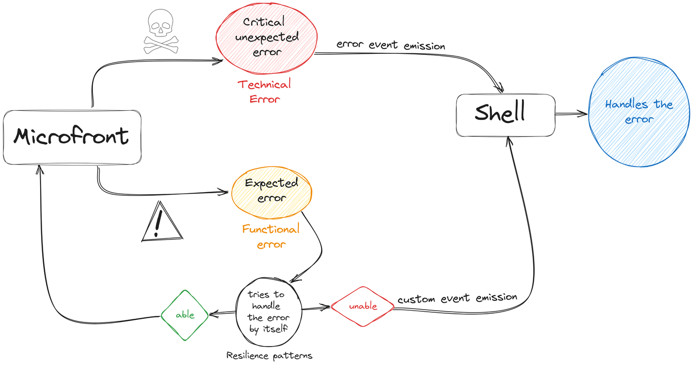

# Error Handling

{ style="display: block; margin: 0 auto;" }

Error handling is an essential concept for all applications, and in a Microfront architecture it is also a fundamental issue. In the following documentation, topics such as where we handle these errors and a good practices will be discussed.

A Microfront must be as robust as possible, so in case of having an error, it must be handled internally by implementing the required functionality.
Only as a last resort, when the Microfront cannot be overcome the error, it could be delegated to the Shell application.

We have two different errors, Technical errors and Functional errors, we are going to see how they work and how to implement the handling for them in both sides, Microfront and Shell.

## Technical Error

We call technical errors to the errors that are unexpected and the Microfront cannot recover itself, so the Microfront `error` [event](../ng-darwin-wmf/v20/api-reference/microfrontdirective.md#error) from the `MicrofrontDirective` to the Shell, which is designed to be used for this kind of errors. <!-- markdownlint-disable MD013 -->

### Microfront Side

To delegate the technical error to the Shell application, the Microfront must emit the `error` [event](../ng-darwin-wmf/v20/api-reference/microfrontdirective.md#error),
available in the main component of the Microfront application, due to extend this component with the [MicrofrontDirective](../ng-darwin-wmf/v20/api-reference/microfrontdirective.md).

``` ts
export class App extends MicrofrontContainer {
  emitCriticalError(error: Error) {
    this.error.emit(error);
    }
}
```

!!! note
    You will find more information about events [here](user-interface-communication.md).

### Shell Side

To capture the error, we can listen for the event error emitted by the Microfront and act in the class that extends from [MicrofrontContainerDirective](../ng-darwin-wmf/v20/api-reference/microfrontdirective.md).

``` html
<!-- Html implementation loading the Microfront from the Shell -->
<mf-ng-12345678-microfront
  (error)="myHandlingFunction($event)">
</mf-ng-12345678-microfront>
```

``` ts
// Typescript implementation
export class App extends MicrofrontContainerDirective {
  myHandlingFunction(technicalError: Event) {
    const {detail} = technicalError as CustomEvent;
    console.log(detail.toString());
  }
}
```

The event emitted by the Microfront is listened thanks to the `error` event and in our handling function we can get the detail of the error.

## Functional Error

We call functional error to an error that is not unexpected, that can happen due to specific business logic or conditions and does not mess with the stability of the application.

For example, a functional error could occur when a person is not found within a Microfront that acts as a NIF finder.

For handling these errors, you must create new [custom events](https://developer.mozilla.org/en-US/docs/Web/API/CustomEvent){: target="_blank"}.

### Microfront Side

We can define our new event in the class that extends from the `MicrofrontDirective`.

``` TS
// Microfront implementation
export class App extends MicrofrontDirective {
  @Output() nifNotFoundError: EventEmitter<any> = new EventEmitter();
  private _findPerson(nif: string): void {
    // Finding logic
    if (isNotFound) {
      this.nifNotFoundError.emit('The person was not found');
     }
  }
}
```

With this the error has been emitted with the value we choose. Now in the Shell it can be listened and handled.

### Shell Side

We implement the listening of the event that we have named and the function to handle it

``` html
<!-- Html implementation loading the Microfront from the Shell -->
<mf-ng-12345678-microfront
  (nifNotFoundError)="handleNifNotFoundError($event)">
</mf-ng-12345678-microfront>
```

``` ts
// Typescript implementation
export class App extends MicrofrontDirective {
  handleNifNotFoundError(event: Event): void {
    const {detail} = event as CustomEvent;
    console.log(detail.toString());
  }
}
```

Now `handleNifNotFoundError` will be executed every time the Microfront emits that event.

## Best practices

Next, a series of good practices aimed at handling errors will be commented. With this, we are looking for a greater stability against them without disturbing the applications.

### Register the errors

Log frontend errors to take advantage of tools like Kibana or similar. If we do not log them, the user who finds a frontend error will be the only one who knows it is there.

The library `@ng-darwin/logger` offers the service `LoggerService` that can be injected and used to register logs.

``` ts
private readonly _loggerService = inject(LoggerService);

myHandlingFunction(technicalError: Event) {
  //Handling logic
  this._loggerService.logError({ log: 'The microfront suffered a technical error', component: 'mycomponent' });
}
```

For more information about this feature check [this documentation](https://automatic-doodle-rew2y31.pages.github.io/classes/_ng-darwin_logger.LoggerService.html){:target="_blank"}.

### ErrorHandler usages

Angular provides an implementation to centralize error handling with [ErrorHandler](https://angular.dev/api/core/ErrorHandler){:target="_blank"}. By default, it only prints error messages to the console, but we can implement it to customize its management.
Also, a service can be used in order to send the error to the Shell.

``` ts
import { ErrorHandler } from '@angular/core';

@Injectable() export class GlobalErrorHandler implements ErrorHandler {
  
  private _communicationService = inject(CommunicationServie);

  handleError(error: Error): void {
    console.error('This error is emitted to the Shell as an event.', error);
    this._communicationService.emitTechnicalError(error);
  }
}
```

Then, we can add it in our root module to change the default action in our application, instead of using the default `ErrorHandler`.

``` ts
providers: [
  { provide: ErrorHandler, useClass: GlobalErrorHandler }
]
```

In this way there is only one place to change the code for unhandled errors.

### Resilience

Implementing resilience patterns will make our application much more robust and can recover from problems derived mainly from the quality of the network and the availability of web resources.

#### Retry before throwing an error

We can implement a simple resiliency pattern such as the retry pattern, to retry HTTP requests before throwing an exception.

Angular provides the [HttpInterceptor](https://angular.dev/api/common/http/HttpInterceptor "https://angular.io/api/common/http/HttpInterceptor"){: target="_blank"} to intercept HTTP requests or responses, and handle them before continuing with the processing.
We can implement the retry pattern of a request and try it one or more times before throwing an error.

``` ts
import { Injectable } from '@angular/core';
import { HttpEvent, HttpRequest, HttpHandler, HttpInterceptor } from '@angular/common/http';
import { Observable} from 'rxjs';
import { retry } from 'rxjs/operators';
@Injectable() export class ServerErrorInterceptor implements HttpInterceptor {
  intercept(request: HttpRequest<any>, next: HttpHandler): Observable<HttpEvent<any>> {
    return next.handle(request).pipe( retry(3), );
  }
}
```

It is also necessary to provide the interceptor that we have created.

``` ts
providers: [
  { provide: HTTP_INTERCEPTORS, useClass: ServerErrorInterceptor, multi: true }
]
```
