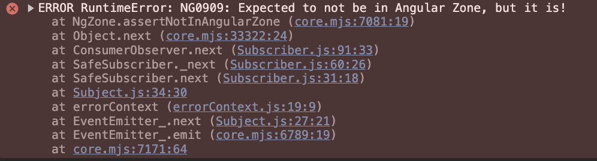

# FAQ

{ style="display: block; margin: 0 auto; width:75%" }

This page answers the questions developers ask about the Darwin Microfront ecosystem design and implementation.

## My Microfront application will only be used in one language, do I have to add i18n?

Yes, it is necessary for a few Nginx configurations used in the Darwin ecosystem. In order to have a friendly configuration the applications should always have i18n configured even if only one language is being used.

In addition to the configuration, the folder structure of the dist folder should be `dist/<language>/<sources>`. For example, `dist/en-US/…`.

To internationalize and localize your Microfront application you can follow this documentation: [Internationalization and Location](internationalization-and-location.md) about it.

## A Microfront application must manage the security token?

A Microfront should never manage the security token. The token is exclusively managed, renewed and deleted by the Shell application.

An exception is when the Microfront is used in a standalone mode through its ShellLite. Then, this ShellLite application will be in charge of managing the token for the Microfront.

You can read more in the following documentation: [Security and Token Handling](security-and-token-handling.md).

## How can I upgrade the version of my Darwin application or How can I migrate my Angular application to the Darwin Architecture?

For both answers, we strongly recommend the following steps:

1. Generate the desired Angular application with the chosen version with [Darwin Front CLI. Archetype Generator](../../cli/index.md).
2. Thanks to the Darwin generator, it should be already configured and working perfectly, but check first that everything is in order.
3. Slowly, start moving the logic and sources of your old application to the generated one.
4. Keep checking that nothing breaks until you finish the migration.

With this approach we have seen smoothier migrations. But with the idea of trying to apply all the changes needed int your own application directly, we have found that the developers struggles way more resulting in more problems.

## Why when my application leaves the Microfronts and loads it again, the state is being kept?

When entering a Microfront with an associated providers, they remains alive even if we exit the Microfront and it is unrendered from de DOM and we stop viewing it, so the data it stores will remain in memory.

Please note that the service constructors will only be executed once, even if we re-enter the Microfront.

For this reason it is very important to have an initial state of the data, to initialize it whenever the Microfront's lifecycles (e.g. `ngOnInit`) are executed.

## Can I modify the Nginx files?

Yes you can! And its very recommended to have a good understanding of what they do and how you can modify it to your needs. We have this documentation if you want to know more about this: [Nginx and proxy.conf Configuration](nginx-and-proxy.conf-configuration.md).

## Can I send information to other Microfronts?

Its possible to send information such as **queryParams** or **props** with the event of the **MicrofrontDirective** named [externalNavigate](../ng-darwin-wmf/v20/api-reference/microfrontdirective.md#externalnavigate).
With this event you can perform such navigations carrying information. You can learn how to do it and also receive information in your Microfront in the following documentation: [Navigation outside the Microfront](navigation-outside-the-microfront.md).

## I have a library that opens Pop Ups, Dialogs, etc, that works in standalone but once my Microfront is integrated in a Shell it does not work

That is because these libraries and functionalities generate the content outside the Microfront’s context (its DOM) and they render it in the Shell context DOM.
That content is outside the reach of your Microfront so it cannot apply the styles or functionalities your Microfront was supplying. You can read about why this happens in the following documentation [How to integrate a Microfront into a Shell application](how-to-integrate-a-microfront-into-a-shell-application/index.md#scope-of-styles).

Our recommendation is that the Shell should supply those styles or also implement and share that library.

## Can I use and share Angular Material in my Microfront?

Yes, your application can use it, but it is important to reach a common approach with the whole ecosystem your application is working with.
If you are using Material it is important to share the library with the other applications in order o reduce the bundle size.

## Can I use the Session and Local Storage in my Microfront?

Yes you can, but not the browser API directly. It should be configured and used it through the `SecurityService`. For more information check the following docs:

* [Session & Local Storage](session-storage-and-local-storage.md)
* [Darwin SessionStorageService](https://automatic-doodle-rew2y31.pages.github.io/classes/_ng-darwin_security.SessionStorageService.html){:target="_blank"}
* [Darwin LocalStorageService](https://automatic-doodle-rew2y31.pages.github.io/classes/_ng-darwin_security.LocalStorageService.html){:target="_blank"}

## Can I have two differences Microfronts loaded and visible at the same time?

Yes but with important constrains. This depends on how many Microfronts have routing functionalities.

**Only one Microfront with routing is allowed at the same time**. Knowing this, technically you could have two or more Microfronts at the same time.

You can find more information about it in the following documentation: [Simultaneous Microfronts](simultaneous-microfronts.md).

## Can I invoke two identical Microfronts at the same time?

Mainly yes, the Microfront will have the same restrictions as invoking another Angular component at the same time. Properties are not going to be shared but dependency classes will be, resulting in unexpected errors in some cases. Note that according to the answer to the previous question, those Microfronts should not have routing. <!-- markdownlint-disable MD013 -->

You can find more information about it in the following documentation: [Simultaneous Microfronts](simultaneous-microfronts.md).

## Can a Microfront application be integrated into a Shell by iframe?

Although it is technically possible, it is not recommended to integrate a Microfront application by an iframe. This way of integration is only intended for legacy applications. You can read more in the following documentation: [How to integrate a Microfront into a Shell application | Iframe integration](how-to-integrate-a-microfront-into-a-shell-application/index.md#iframe-integration).

## Can a Shell application and a Microfront application have different version of Angular?

Technically it is possible, and all the combinations are possible. You could have a Shell with Angular 18/20 and the Microfronts with 18/20.
This is achievable because we are using Angular Elements, which allow us to convert Angular Components into [Web Components](https://developer.mozilla.org/en-US/docs/Web/API/Web_components)
(a web standard for defining new HTML elements in a framework-agnostic way).

For example, you can have a Shell application in Angular 18, a Microfront "A" in Angular 18, and a Microfront "B" in Angular 20, with all Angular libraries shared through Webpack Module Federation.
When navigating to the Shell, the core of Angular 18 framework and the application bundle will be downloaded.
When the user opens the Microfront "A", the core of Angular framework won't be downloaded, and it will use the same files that have already been downloaded.
It will result in different Angular core instances but using the same Angular files. However, this will not be the case when the user goes to the Microfront "B", where the browser will need to completely download the core of Angular framework 20.
For further information, check how [Sharing Libraries](sharing-libraries.md) work.

!!! note
    Be aware that for each different Angular version needed, a complete Angular bundle will be downloaded. Therefore, having fewer different versions of Angular in the same application is recommended for better performance.

If you are going to start the development of a Microfront project, we strongly recommend you speak with the Shell application team, as that is where you will be integrated.
They will inform you about the version of Angular they are using and their roadmap for it.
Your Microfront project might be critical, requiring alignment with the Shell's Angular version, or it could have a smaller impact and you and your team may have greater decision making ability regarding the Angular version to be used.

## Integrating Angular 18 or higher Microfronts into a Shell with a lower version

Since version [6.2.0 of Gluon](../../../../../../../../changelog/posts/gluon-6-2-x.md/#front_1), the option to generate Darwin SPA/Shell and Microfront components in Angular 18 has been enabled.

When loading a Microfront in Angular 18, the following error may appear in the console:



This error should not be blocking, as the application can continue to function correctly. It occurs because the `NgZone` instance is not being shared between the Shell and the Microfront.

To eliminate this error in the different versions of Angular, some adjustments are necessary to ensure compatibility.

^^**Shell in version less than or equal to Angular 15**^^

In the component that loads the Microfront in Angular 18 or higher, the following code must be added:

=== "Constructor Injection"

    ```ts
    constructor(
        private readonly _zone: NgZone,
    ) {
        super();
        (<any>globalThis)._dwZone = (<any>globalThis)._dwZone || _zone;
    }
    ```

=== "Inject Function"

    ```ts
    private readonly _zone = inject(NgZone);

    constructor() {
        super();
        (<any>globalThis)._dwZone = (<any>globalThis)._dwZone || this._zone;
    }
    ```

^^**Shell in version 16**^^

It will only be necessary to use at least version [**16.0.2** of `@ng-darwin-wmf/microfront`](../../microfrontend-architecture/ng-darwin-wmf/v16/index.md/#fix).
