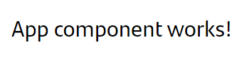

# Getting started with microfront development

{ style="display: block; margin: 0 auto;" }

Starting to develop a Microfront for the first time can be pretty tricky and hard to discover all the possibilities.
In order to facilitate the landing of Microfront development, this guide will gather all the resources across the documentation and explain them in a easier way.

## Microfront concept

The main goal of a Microfront is to structure applications as autonomously as possible. Each component is designed to have a clear and distinct purpose.
This self-contained approach ensures that a Microfrontend can be effectively leveraged across multiple channels.

The business context can often affect the functionality of a Microfront, but the goal is to create a system where each piece operates independently, with as few exceptions as possible.

Take a look at [ecosystem documentation](../../ecosystem/index.md) for more info about all the pieces related to this architecture.

## Starting with the Microfront archetype

!!! note "Important for AWS S3 Target"

    This development guide is intended for a **Darwin Microfront archetype in a Kubernetes environment**. If your goal is to deploy a Gluon Microfront archetype on AWS S3, we **strongly recommend** that you continue reading this guide to understand concepts that are common to both environments. Once completed, you can proceed with the [AWS S3 Considerations](./aws-s3-considerations.md) guide for environment-specific information.

Please, **we highly recommend** you to go to [Microfront archetype documentation](../../archetypes/microfront.md) and read carefully all the sections to start working with a Microfront application.

In order to develop a Microfront locally, the archetype generated from the Darwin generator comes with a feature named `ShellLite`.
This allows the developer to deploy a self-contained Microfront so it can be used without the need of a real `Shell` application serving it.

When `npm start` command is executed, it will deploy the application with the following configuration in the `index.html` file.

```html
<body>
    <projectKey-projectName-example-sl></projectKey-projectName-example-sl>
</body>
```

As you can see only the `ShellLite` would be rendered and it invokes the Microfront web component, you can check the `shell-lite.ts` file.

```html
<!-- shell-lite.ts invokes with customized Microfront tag -->
<projectKey-projectName-example [mountPath]="mountPath" />
```

Please note that a `ShellLite` does not have any visually component.

### Archetype example features

The Microfront archetype comes with some features already developed that can be reused for the application or just as an example code. This example module is completely optional and should be deleted when its not useful for the project.

Inside `index.html` file the `ShellLite` (Angular Component) is invoked with the tag `<prefix>-<appName>-sl`. The `ShellLite` will invoke the Microfront (Custom Element) which is defined in `bootstrap-mfe.ts`.

A detailed documentation about the example features can be [found here](../../archetypes/functionalities.md).

### The ShellLite

The `ShellLite` works as if it was a small shell application, and its function is allowing the Microfront to work in an isolated way or standalone mode. This small shell will be in charge of the token management and security initialization.
In short, it prepares the ground for the Microfront. It can be found in `src/shell-lite` folder of the archetype.

!!! warning
    `ShellLite` **must not be removed** because it is not only useful for developing locally, but it is mandatory to distribute the application in a standalone way or for `iframe` cases.

#### Available QueryParams

When deploying the Microfront with a ShellLite, a `QueryParam` is available:

##### `dw-channel`

When a Microfront is requested in a standalone way, (with no Shell), this query param specify the channel where the Microfront is going to be run. The `ShellLite` will set this value in the `securityService`. More info about this can be [read in](../channel-management.md).

### Steps to start development

Once you have figured out how the archetype is currently working, its time to switch the current configuration to start the development. In order to do that, follow these steps:

#### Bootstrap the main component `App`

We have to change the first component bootstrapped by application. Change the `Example` to the `App`. Go to the file `bootstrap-mfe.ts` and do the following:

#### Replace the `Example`

Replace the `Example` with the `App` in the `bootstrap-mfe.ts` file.

```ts
bootstrapMFE('projectKey-projectName', App, appConfig)
    .catch(err => console.error(err));
```

#### Check the `app.config.ts` file, by default some example routes and several good practices are given, such as [error handlers](../error-handling.md)

```ts
// app.config.ts
export const appConfig: ApplicationConfig = {
    providers: [
        provideRouter(routes, withViewTransitions()), // Check this routes

        ...

        { provide: HTTP_INTERCEPTORS, useClass: RetryInterceptor, multi: true }, // Check this interceptor
        { provide: ErrorHandler, useClass: GlobalErrorHandler } // Check this handler
    ]
};
```

#### Up and run the Microfront

You can use `npm start` to deploy the API and the application with the `shellLite` mode already on. If you navigate to [http://localhost:4201/](http://localhost:4201/) you should be able to see the following:

{ style="display: block; margin: 0 auto;" }

From now on you can start developing all the components your Microfront application needs.

## Main considerations

### The `MicrofrontDirective`

The root component of de Microfront called `App` must be always extended with `MicrofrontDirective`, supplied by the `ng-darwin-wmf-microfront` library, due to all the features and helpers lives within this directive.

Extending from `MicrofrontDirective` supplies some properties and methods to the main component of the Microfront. For example the handling of the `mountPath` (explained later) if needed.

```ts
// app.ts file
@Component({
  ...
})
export class App extends MicrofrontDirective {
}
```

We recommend reading the following documentation to understand what's the component now includes:

- [MicrofrontDirective](../../ng-darwin-wmf/v20/api-reference/microfrontdirective.md)
- [Lifecycle and Common Events | MicrofrontDirective](../lifecycle-and-common-events.md#microfrontdirective)

!!! warning
    The `MicrofrontDirective` **should be only used once in the Microfront's root component**. No more times or places.

### Routing within the Microfront

When integrating a Microfront the concept of `mountPath` becomes very relevant. This is because many of the checks that are performed in the `@ng-darwin-wmf/microfront` library, are based on this value to avoid problems with the routes paths.

The `mountPath` is a value used for enclosing the routes that a Microfront will be allowed to have. When you have a Microfront with routes, you must limit its paths in order to not impact outside its context.

It is very important to have the knowledge of how to navigate within the Microfront, otherwise the navigations with `router.navigate` and `router.navigateTo` could result in unexpected issues.
You can find out all about it in the following documentation: [Routing inside the Microfront](../routing-inside-the-microfront.md).

### Navigating to other Microfront or to the Shell

Thank to `MicrofrontDirective` inheritance an even named `externalNavigate` is exposed. This event allows to navigate to other Microfront within the Shell or even the Shell itself.

Because of this event is only exposed in the root component of the Microfront (the component that inherit the `MicrofrontDirective`),
we recommend to expose that event across the Microfront with a service provider and a Rxjs `Subject`, making it available to every desired part of the Microfront.

This event also allows sending information with _queryParams_ and _props_, and even creating some logic to determine flows of navigations with a specific _returns_. You can take a look at all this functionality in this documentation [Navigation outside the Microfront](../navigation-outside-the-microfront.md). <!-- markdownlint-disable MD013 -->

!!! note
    The linked documentation also shows how to receive the information from other `externalNavigate` navigations.

### Notifying breadcrumb changes

The `MicrofrontDirective` exposes an event named `breadcrumb` . This event allows to send a typed notification to the Shell application container with the changes the breadcrumb component, belonging to the Shell, should perform.
You can see how to send this notification in the following documentation: [Breadcrumbs | Microfront](../breadcrumbs.md#microfront).

### Error handling

A Microfront must be as robust as possible, so in case of having an error, it must be handled internally by implementing the required functionality.
Only as a last resort, when the Microfront cannot be overcome the error, it could be delegated to the Shell application.

For this, the `MicrofrontDirective` exposes an event named `error` for the technical unrecoverable errors and the possibility to create custom errors for functional errors.

All this information and how should be handled and implemented is gathered in the following documentation: [Error handling](../error-handling.md).

### Styles

In case of using a framework or CSS style library, the weight of the library must be taken into consideration and always try to reuse the one that is already integrated in the Shell to avoid duplications.

Ideally, the Microfront should be self-contained to avoid collateral problems. It should have its own styles and use an encapsulation strategy with [ShadowDom](https://angular.io/api/core/ViewEncapsulation#ShadowDom "https://angular.io/api/core/ViewEncapsulation#ShadowDom").
This will make all the styles declared in the Microfront not to affect out of its context.

We recommend reading the following documentations:

- [How to integrate a Microfront into a Shell application | Scope of Styles](../how-to-integrate-a-microfront-into-a-shell-application/index.md#scope-of-styles)
- [CSS Styles](../css-styles.md)

### Assets loading

When a Microfront is integrated into a Shell and this Microfront tries to load its assets using relative paths, the assets are searched in the Shell domain instead of the Microfront’s domain, resulting in problems.
In order to load the assets in a Microfront embedded inside a Shell, some extra configuration must be applied.

You can find out documentation about this in the following: [How to work with Microfront assets](../how-to-work-with-microfront-assets.md).

## Important configurations

### Webpack and sharing libraries

The Microfront has a file named `webpack.config.js`. This file is on charge of the transpilation and compilation process, minimization, optimization…
A standard Angular SPA archetype hides this file because its default configuration is enough, but for a Microfront architecture is necessary to enable it and change this configuration

In order to understand and prepare the Microfront configuration you can read the following documentations:

- [Webpack configuration](../webpack-configuration.md)
- [Sharing libraries](../sharing-libraries.md)

### Internationalization and Location

The Microfront archetype is configured out of the box to be distributed with the Internationalization and Location enabled. In order to configure the Microfront _i18n_ and _i10n_, we recommend the following documentation: [Internationalization and Location | Microfront configuration](../internationalization-and-location.md#microfront-configuration).

!!! note
    Although the Microfront is not planned to be distributed in more than one language, **it should be configured with the Internacionalization and Location enabled**.
It means the distribution must be created in `dist/<language>` folder and not in`dist` folder directly. This allows the use of easier Nginx configuration for deployment.

## Deployment

For the Microfront deployment, some default configuration can be found in the generated archetype. In order to understand the Nginx configuration, and understand how the Microfront is going to be integrated - in a Shell, we recommend the following documentations:

- [Nginx and proxy.conf configuration](../nginx-and-proxy.conf-configuration.md)
- [How to integrate a Microfront into a Shell application | The Microfront invocation](../how-to-integrate-a-microfront-into-a-shell-application/index.md#the-microfront-invocation)

## FAQ

These FAQ have more detailed explanation in the following documentation: [Developer FAQ](../faq.md).

### How can I upgrade/migrate my Microfront or Shell application?

In the case you want to migrate your application to adapt it to the Microfront architecture, upgrade the Angular version of your Microfront, or even if you just want to get the new updates from the [Darwin Front CLI. Archetype Generator](../../../cli/index.md), we recommend the same approach:

!!! important
    Generate a new Microfront archetype and move your application into the generated one.

This way can seem more tedious and slower but we have found this makes the transition easier and with fewer issues in the process.
