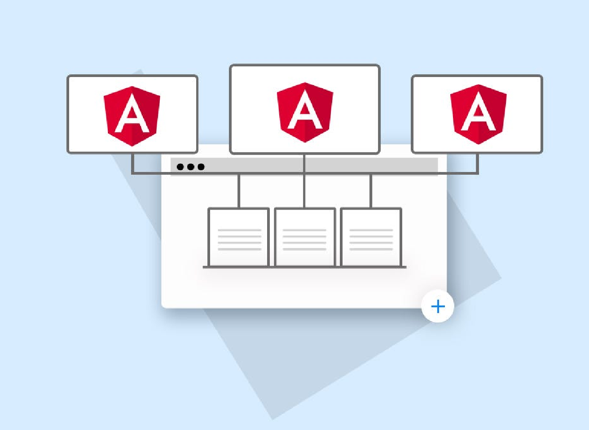

# How to integrate a Microfront into a Shell application

{ style="display: block; margin: 0 auto;" }

In order to integrate a Microfront into a Shell application, read and follow the steps below.

!!! note
    The steps to follow will vary depending on whether the Shell and the Microfront are deployed in Kubernetes or AWS.  
    This development guide covers both environments in separate tabs. Please note that there is also an [AWS S3 Considerations](./aws-s3-considerations.md) section.

## The Microfront invocation

### Prerequisites

Please take into account that this user guide will use a previously deployed Microfront as an example. Having one Microfront for the integration is a mandatory requirement.

#### Deployed Microfront Data Example

The following Microfront data will be required.

| Property | Value |
|---|---|
| Domain | <https://mex-rost-demomfecl20-sanes-pre-vostok-dev.apps.ccc01alm.ccc.pre.cn2.paas.cloudcenter.corp/> This is a URL example where a Microfront is deployed in Kubernetes. (note if you click the link it will return a 404 error. You must add the language as part of the path to preview the Microfront: `es` or `en-US`) |
| Technical grouping | `mf-ng-00000000-demomfecl20` |
| Relative path | empty (the Microfront is deployed in the root directory) |
| i18n | `es` and `en-US`. The Microfront implements the Angular standard internationalization. This will affect routes, since they will have the language previously concatenated |

### Develop the Angular Container component

For the integration, an Angular component must be generated to wrap the Microfront. The Angular CLI can be used to generate the base component.

- Generate the component

    `npm run ng generate component [name]`

- Inherit from the `MicrofrontContainerDirective`

    To facilitate the invocation of the Microfront, the Angular component with the wrapper role must inherit from the `MicrofrontContainerDirective` directive of the `@ng-darwin-wmf/microfront` library.

    ``` ts
    import { MicrofrontContainerDirective } from '@ng-darwin-wmf/microfront';

    @Component({
      templateUrl: './my-microfront-wrapper.html'
    })
    export class MyMicrofrontWrapper extends MicrofrontContainerDirective {
    }
    ```

- Implement some mandatory properties

    === "Kubernetes"

        When inheriting from the `MicrofrontContainerDirective`, some abstract properties and methods necessary for the invocation and construction of the Microfront must be implemented:

        - `microfrontTechnicalGrouping`: `string` Indicates the technical grouping of the Microfront.
        - `mountPath`: `string` This property must contain the path value where the Microfront will be mounted.
        - `loadRemoteError`: Method to be invoked when the microfront could not be obtained.

        ``` ts
        microfrontTechnicalGrouping = 'mf-ng-00000000-demomfecl20';

        mountPath = 'accounts/transfers';

        loadRemoteError(error: unknown) {
          console.log('Error when loading the Microfront');
        }
        ```

    === "AWS S3"

        When inheriting from the `MicrofrontContainerDirective`, some abstract properties and methods necessary for the invocation and construction of the Microfront must be implemented and possibly also some properties must be overridden:

        - `baseRemoteMfe`: `string` URL indicating where the Microfront is deployed. It is necessary to `override` this property because its default value in the base clase is `''` (empty string). Empty string indicates the Microfront will be requested from the same domain where the Shell is deployed, useful for Kubernetes mode.
        - `microfrontTechnicalGrouping`: `string` Indicates the technical grouping of the Microfront.
        - `mountPath`: `string` This property must contain the path value where the Microfront will be mounted.
        - `loadRemoteError`: Method to be invoked when the microfront could not be obtained.

        ``` ts
        override baseRemoteMfe = 'https://example.cloudfront.net/rost/mymfe/'; // example URL where the Microfront would be deployed in ASW S3

        microfrontTechnicalGrouping = 'mex-rost-mymfe';

        mountPath = 'accounts/transfers';

        loadRemoteError(error: unknown) {
          console.log('Error when loading the Microfront');
        }
        ```

    !!! warning
        If you have access to the Microfront repository, please, verify that the technical grouping is also being used in the `output.uniqueName` property of the Microfront's `webpack.config.js` file.

- Implement the HTML template

    To include the Microfront in an HTML template is mandatory in order to be rendered.

    Find out about the _tag_ with which the Microfront has been deployed, and use it within your HTML template with at least the following attributes, **these attributes are essential** for the correct functioning of the Microfront:

    - `#microfrontRef`: This is a mandatory template reference variable to avoid problems with deep links. It must have the exact name of the reference, since it will be used by the @ng-darwin-wmf/microfront library internally.

    - `isLoaded`: This shorthand of the Angular directive is mandatory to avoid that when rendering the Microfront, the properties may come empty.

    - `mountPath`: Inform the Microfront of its mounting route, mandatory if the Microfront contains routing.

    ```html
    <!-- Please take special care with the Microfront HTML tag, it must be identical to the one used by the Microfront to register the web component in the main Microfront bootstrap. -->

    @if (isLoaded()) {
      <rost-demomfecl20
        #microfrontRef
        [mountPath]="mountPath"
      ></rost-demomfecl20>
    }
    ```

    ``` ts
    // Note the Microfront app must define the web component in bootstrap-mfe.ts file through the bootstrapMFE function

    bootstrapMFE('rost-demomfecl20', App, appConfig)
      .catch(err => console.error(err));
    ```

### Routing the component

A specific path will usually be added to render the Angular Container component, and therefore, the Microfront as well. The new route will be added to the array of routes that have been defined by the Shell.

In this case, we are using the `accounts/transfers` path, so you will have to assign that same path in the Shell to render the Microfront container component.

It is important to **declare the route as a children with a wildcard path** (`**`) as shown in the example below. This way the Shell application will not have issues while the user is navigating the Microfront paths.

``` ts
// Shell routes
{
  path: 'accounts/transfers',
  children: [
    { path: '**', component: MyMicrofrontWrapper }
  ]
}
```

## Local environment. The proxy.conf file redirections

=== "Kubernetes"

    To integrate a Microfront and run it locally, the `proxy.conf.json` file must be configured.
    This configuration is necessary so that the requests made on the Shell domain can be resolved with a [reverse proxy](https://docs.nginx.com/nginx/admin-guide/web-server/reverse-proxy/){: target="_blank"} to the Microfront domain.

    For the reverse proxy configuration, special care must be taken with the existence of _relative routes_ and the internationalization (_i18n)_, both in the Shell and the Microfront application.

    Make sure to add these properties `changeOrigin=true` and `secure=false` so the redirection can be achieved successfully.

    If you are using the standard Angular _i18n_ in the Shell, **be aware when an application is deployed locally using** `ng run serve`, **it has no path to the language, since only one language can be deployed at the same time.**

    In the example below, the Microfront has implemented the standard i18n of Angular, so it will be redirected by default to the specific language `en-US`, if you want another language it would be necessary to modify it manually in the redirection.

    ```json
    {
      # A redirection for JavaScript, configuration file, static files, assets...
      "/mf-ng-00000000-demomfecl20": {
        "target": "https://mex-rost-demomfecl20-sanes-pre-vostok-dev.apps.ccc01alm.ccc.pre.cn2.paas.cloudcenter.corp",
        "changeOrigin": true,
        "secure": false,
        "pathRewrite": {
          "^/mf-ng-00000000-demomfecl20": "/en-US/mf-ng-00000000-demomfecl20"
        }
      }
    }
    ```

    ### Shell with a relative path

    If you have a relative path in the Shell, you can use it to make the rewrite easier.

    ``` json
    {
      "/relative/path/mf-ng-00000000-demomfecl20": {
        "target": "https://mex-rost-demomfecl20-sanes-pre-vostok-dev.apps.ccc01alm.ccc.pre.cn2.paas.cloudcenter.corp",
        "changeOrigin": true,
        "secure": false,
        "pathRewrite": {
          "^/relative/path": "/en-US"
        }
      }
    }
    ```

    ### Microfront with a relative path

    If the Microfront has been deployed with its own relative path, this relative path must be added to the rewrite directive.

    ``` json
    {
      "/mf-ng-00000000-demomfecl20": {
        "target": "https://mex-rost-demomfecl20-sanes-pre-vostok-dev.apps.ccc01alm.ccc.pre.cn2.paas.cloudcenter.corp",
        "changeOrigin": true,
        "secure": false,
        "pathRewrite": {
          "^/mf-ng-00000000-demomfecl20": "/relative/path/en-US/mf-ng-00000000-demomfecl20"
        }
      }
    }
    ```

=== "AWS S3"

    To integrate a Microfront deployed in AWS S3 into a Shell and run it locally, it will not be necessary to configure any redirection to the Microfront in the Shell's `proxy.conf.json` file, as the requests made by the Shell to retrieve the Microfront will be made directly to the domain where the Microfront is deployed, making a redirection unnecessary.

    A useful redirection that the `proxy.conf.json` file can have is the one necessary to retrieve the configuration needed by the Shell from the Fake API and it can run locally.

    ```json
    "/rost/cm-mymfe/config": {
      "target": "http://localhost:3000",
      "pathRewrite": {
        "^/rost/cm-mymfe": ""
      }
    }
    ```

## Distributed environment. The Nginx redirections

=== "Kubernetes"

    The configuration of the distributed environment is mainly based on reverse proxy redirects. To achieve this we will rely only on the Nginx solution.

    To integrate a Microfront a Nginx reverse proxy must be configured. This inverse proxy is necessary so that requests made on the Shell domain can be redirected and resolved against the Microfront domain.

    This is an example of the inclusion of a Microfront in the `default.conf` file of the Shell Nginx.

    ``` text
    location ~ ^<%= ENV["relativePath"] %>/(en-US|es)/mf-ng-00000000-demomfecl20 {
      proxy_pass https://mex-rost-demomfecl20-sanes-pre-vostok-dev.apps.ccc01alm.ccc.pre.cn2.paas.cloudcenter.corp;
    }
    ```

    The first line of code adds the entry point through which requests will be redirected to the Microfront domain, both for the configuration file and for the JavaScript and static files.

    ``` text
    location ~ ^<%= ENV["relativePath"] %>/(en-US|es)/mf-ng-00000000-demomfecl20 {
    ```

    Subsequently, in the case there is a relative path, the request is overwritten to eliminate the relative path of the shell.

    ``` text
    rewrite ^<%= ENV["relativePath"] %>/((?:en-US|es)/mf-ng-00000000-demomfecl20.*) /$1 break;
    ```

    If the Microfront has been deployed with its own relative path, this relative path must be added to the rewrite directive. For example with the relative path `/paas/example/`:

    ``` text
    rewrite ^<%= ENV["relativePath"] %>/((?:en-US|es)/mf-ng-00000000-demomfecl20.*) /paas/example/$1 break;
    ```

    The common configurations will have also to be added, in this case _proxy-cache_ and _common-headers_.

    Finally and most importantly, the domain where the Microfront is hosted and where all your requests will have to be available.

    ``` text
    proxy_pass https://mex-rost-demomfecl20-sanes-pre-vostok-dev.apps.ccc01alm.ccc.pre.cn2.paas.cloudcenter.corp;
    ```

    ### Local Nginx files

    We have also included the necessary files to test Ngixn locally. In these files it is necessary to manually add the relative paths, since they do not allow environment variables.

    These files can be found in the `nginx/local` directory.

=== "AWS S3"

    In the AWS S3 environment, Nginx is not used as a lightweight server; instead, static files are served directly from S3 (possibly with an intermediary piece like CloudFront). Therefore, to integrate a Microfront deployed on AWS S3 into a Shell and run it, it is not necessary to configure any redirection to the Microfront in the Shell's `nginx/default.conf` file. All requests made by the Shell to retrieve the Microfront will be sent directly to the domain where the Microfront is deployed, making redirections unnecessary.

## Points to consider

There are several points that may need to be considered when integrating a Microfront. Remember the more independent a Microfront is, the easier its integration will be.

### Internal Navigations

When integrating a Microfront, it is possible the links to internal navigations to not work as expected. You should check how they have been done and if they are receiving and using the mount path correctly.

The `@ng-darwin-wmf/microfront` library provides a `mountPath` pipe to simplify the use of the mount path in the links.

- HTML

    ``` html
    <a [routerLink]="'/first-child' | mountPath">Route First-child</a>
    ```

- TypeScript

    ``` ts
    export class Example {

      private readonly _router = inject(Router);

      private readonly _mountPathPipe = inject(MountPathPipe);

      navigateMethod() {
        const path = this._mountPathPipe.transform('/first-child');
        this._router.navigateByUrl(path);
      }
    }
    ```

More information in: [Routing inside the Microfront](../routing-inside-the-microfront.md).

### External Navigations

If you use the `externalNavigate` event and it does not work as expected, it is recommended to review the documentation that details this process: [Navigation outside the Microfront](../navigation-outside-the-microfront.md).

### i18n

It will be necessary to take into consideration if the Shell, where the Microfront will be integrated, uses the standard i18n of Angular or another solution such as `ng-translate`.

- Verify that the languages have been correctly added to the redirects in the Nginx configuration file.
- The use of the Angular i18n standard must also be checked.

!!! warning
    Only the Angular standard i18n can be used in Microfronts.

=== "Kubernetes"

    Please for more information read the user guide [Internationalization and Location](../internationalization-and-location.md).

=== "AWS S3"

    !!! note
        Please first familiarize yourself with the [Internationalization and Location](../internationalization-and-location.md) guide. **Keep in mind that the previous guide is designed for the Kubernetes environment**, but it will be useful for understanding the internationalization of applications. Once you are familiar with it, continue with this section.
    
    When a Shell requests a Microfront, with both deployed in Kubernetes, all requests to the Microfront are based on redirections handled by Nginx. These redirections take into account the language in which the Microfront is being requested.

    In the AWS S3 environment, there is no lightweight web server, such as Nginx, acting as a reverse proxy to redirect requests from the Shell to the Microfront. In AWS S3, requests from the Shell are made directly to the domain where the Microfront is deployed, and it is also necessary to consider the language to be retrieved,  the language is part of the URL in the request.


    #### Shell with standard internationalization

    It is mandatory for a Microfront to use Angular's standard internationalization. When the Shell uses this same internationalization, the process is very straightforward:

    When the Shell makes a request to a Microfront, the directive `MicrofrontContainerDirective` will use the Shell's language using the Angular token called [LOCALE_ID](https://angular.dev/api/core/LOCALE_ID). Imagine the Shell is set to American English, whose standard code is `en-US`. When the Shell makes the request, the `MicrofrontContainerDirective` will attempt to retrieve the Microfront using this same internationalization code. If the Microfront's distribution includes this same language code, it will load correctly.

    But what happens if the Microfront's distribution does not include American English and it has only generated a generic English version with the standard code `en`? The request from the Shell using the `en-US` code will fail. We need to inform the Shell that when it is set to the `en-US` language, it should actually make the request to the `en` language of the Microfront. For this, the `MicrofrontContainerDirective` provides the `normalizeLocale` method, which has to be overridden.

    The following code demonstrates how, when the Shell is set to American English (`en-US`), it normalizes the code to `en` so that the request is made to the generic English version of the Microfront (`en`). In any other case, the `locale` parameter is returned without modification.

    ``` ts
    export class ContainerExample extends MicrofrontContainerDirective {

      ...

      /**
       * @param locale current Shell LOCALE_ID token
       * @returns i18n code where the request will be done
       */
      protected override normalizeLocale(locale: string): string {
        switch (locale) {
          case 'en-US':
            return 'en';
          default:
            return locale;
        }
      } 

      ...
    }
    ```

    #### Shell with non-standard internationalization

    When a Shell uses third-party tools for internationalization, such as `ng-translate`, and only a single distribution is generated for all languages, the `LOCALE_ID` token is likely not taken into account and will always have the default value provided by Angular (`en-US`), corresponding to the source language configured in the `angular.json` file.

    In this case, it will be the responsibility of the Shell to override the `localeId` property provided by the `MicrofrontContainerDirective` directive with the language currently set in the Shell, which may or may not be a standard code, and use the `normalizeLocale` method to match it with the Microfront.

    For example, imagine the Shell's language is set to Mexican Spanish, but with a non-standard code such as `mex`, and when loading a Microfront, we want to load its generic Spanish version `es` because the Microfront does not include internationalization for Mexican Spanish:

    ``` ts
    export class ContainerExample extends MicrofrontContainerDirective {

      ...

      protected override localeId = 'mex';

      protected override normalizeLocale(locale: string): string {
        switch (locale) {
          case 'mex':
            return 'es';
        }
      }

      ...
    }
    ```

    !!! warning
        **Important!** It will be the responsibility of the Shell to override and update the value of the `localeId` property to match the Shell's language at that specific moment.

    #### What languages does a Microfront support?

    Language codes must follow the [IETF BCP 47](https://www.techonthenet.com/js/language_tags.php){: target="_blank"} standard. To determine the languages available in a Microfront, you can do so in two ways:

    - If you have access to the Microfront's repository, you can check the `angular.json` file and look for the `i18n` property. There, you will find the `sourceLocale` property, which indicates the default language code of the Microfront. The other supported language codes will be listed under the `locales` property.

        ``` json
        // Microfront's angular.json
        {
          "i18n": {
            "sourceLocale": "en-US",
            "locales": [
              "en-GB",
              "es"
            ]
          }
        }
        ```

    - If you do not have access to the Microfront's repository, when a Shell attempts to load it, the first thing it retrieves is its `manifest.json` file (a file automatically generated during the Microfront's build process). This file contains information about the language codes supported by the Microfront.

        ``` json
        // Microfront's manifest.json
        {
          "santander": {
            "version": "0.0.1-BETA",
            "locales": [
              "en-US",
              "en-GB",
              "es"
            ],
            "defaultLocale": "en-US"
          }
        }
        ```

### Share Dependencies

When using Webpack Module Federation (WMF), a key point will be the sharing of libraries to improve the performance of web applications.

In order to configure a strategy to share libraries, the `webpack.config.js` file must be modified in the `shared` property of the Webpack Module Federation plugin.

To be able to share a library, it must first be a dependency of the project in the `package.json` file, and the most important thing is that the WMF plugin refers to the same version of the library.
You will have to take into account how it affects the caret (`^`) or the tilde (`~`).

Considering that a SEMVER versioning _major.minor.path_ is used:

- `^` WMF will search for the highest _minor_ version always within the same _mayor_ if available.
- `~` WMF will search for the highest _path_ más version always within the same _mayor.minor_ if available.
- Setting a fix version WMF will search for the exact version of the library if available.

If there is no any matched version available, WMF will request the embedded version embedded version in the Microfront bundle.

#### Examples

Share Angular **major versions**. If the Microfront has the Angular dependencies with `^`,
we will be allowing that if any previously version equal or higher than `15.2.1` but lower than `16` has been previously loaded, it will be used by our Microfront, avoiding to download them again.

``` js
'@angular/animations': { requiredVersion: '^15.2.1' },
'@angular/common': { requiredVersion: '^15.2.1' },
'@angular/compiler': { requiredVersion: '^15.2.1' },
'@angular/core': { requiredVersion: '^15.2.1' },
'@angular/forms': { requiredVersion: '^15.2.1' },
'@angular/platform-browser': { requiredVersion: '^15.2.1' },
'@angular/platform-browser-dynamic': { requiredVersion: '^15.2.1' },
'@angular/router': { requiredVersion: '^15.2.1' },
```

Share Angular **minor versions**. If the Microfront has the Angular dependencies with `~`, we will be allowing that if any version equal or higher than `15.2.1` but lower than `15.2` has been previously loaded,
it will be used by our Microfront, avoiding to download them again.

``` js
'@angular/animations': { requiredVersion: '~15.2.1' },
'@angular/common': { requiredVersion: '~15.2.1' },
'@angular/compiler': { requiredVersion: '~15.2.1' },
'@angular/core': { requiredVersion: '~15.2.1' },
'@angular/forms': { requiredVersion: '~15.2.1' },
'@angular/platform-browser': { requiredVersion: '~15.2.1' },
'@angular/platform-browser-dynamic': { requiredVersion: '~15.2.1' },
'@angular/router': { requiredVersion: '~15.2.1' },
```

Share **exact versions** of Angular. If the Microfront has the exact Angular version set as a dependencies, we will be allowing that if version `15.2.1` has been previously loaded, it will be used by our Microfront, avoiding to download them again.

``` js
'@angular/animations': { requiredVersion: '15.2.1' },
'@angular/common': { requiredVersion: '15.2.1' },
'@angular/compiler': { requiredVersion: '15.2.1' },
'@angular/core': { requiredVersion: '15.2.1' },
'@angular/forms': { requiredVersion: '15.2.1' },
'@angular/platform-browser': { requiredVersion: '15.2.1' },
'@angular/platform-browser-dynamic': { requiredVersion: '15.2.1' },
'@angular/router': { requiredVersion: '15.2.1' },
```

!!! warning
    **Important!** In the **AWS S3 environment**, the modules `@ng-darwin/config` and `@ng-darwin-wmf/microfront` **cannot be shared**, or the architecture will not work.

More information in [Sharing Libraries](../sharing-libraries.md).

### Scope of Styles

It is possible when integrating a Microfront you may experience problems with the CSS styles.

#### ShadowDom, Libraries and Frameworks

In case of using a framework or CSS style library, the weight of the library must be taken into consideration and always try to reuse the one that is already integrated in the Shell to avoid duplications.

Ideally, the Microfront should be self-contained to avoid collateral problems. It should have its own styles and use an encapsulation strategy with [ShadowDom](https://angular.io/api/core/ViewEncapsulation#ShadowDom).
This will make all the styles declared in the Microfront not to affect out of context.

Also keep in mind that if you are using the [ShadowDom](https://angular.io/api/core/ViewEncapsulation#ShadowDom) and you have a library that creates _modals_ or _popovers_, you would be adding nodes in the DOM outside the scope of the Microfront,
so you will only be able to use styles applied in the Shell. To avoid problems, it is recommended to use the same solution proposed by the Shell application for opening _modals_ and _popovers_.

More information here in [CSS Styles](../css-styles.md).

#### Standalone

The main `styles.css|scss` file of the Microfront is only invoked in its own `index.html`.
This means it should only contain what is necessary for its right working in _standalone_ mode, such as the typographies and everything that is expected to facilitate the Shell in which it is integrated.

### Breadcrumbs

If any issue related to the Breadcrumb arises when integrating the Microfront, it is recommended to check the [breadcrumbs](../breadcrumbs.md) documentation.

### Events and Properties

If you need to pass some other properties or listening other events of the Microfront, either common or customized, please follow these available documentations for a deeper understanding:

- [User interface communication](../user-interface-communication.md)
- [Lifecycle and common events](../lifecycle-and-common-events.md)

### Iframe integration

The integration by `iFrame` is not recommended, since the inclusion of Webpack Module federation comes to solve the same problems but sharing libraries and integrating it in the same window context.

An example of iFrame integration can be found in the Shell archetypes.

The `iFrame` must always invoke the `index.html` of the Microfront. This file must include a small Shell called _Shell-Lite_ to manage the token, and other architectural properties.

The following data can be provided in URL invocation:

- **token:** The application token must be provided.
- **dw-channel:** It will be the channel that will inform the [@ng-darwin](https://automatic-doodle-rew2y31.pages.github.io/modules/_ng-darwin_security.html#channel-property){:target="_blank"} library.

As the Microfront must use the Angular standard i18n, the language must also be added in the URL of the `iFrame`.

`https://<microfront-domain>/en-US/?token=example-token&dw-channel=example-channel`.

For more information, check the following documentation [Iframe](../iframe.md).
