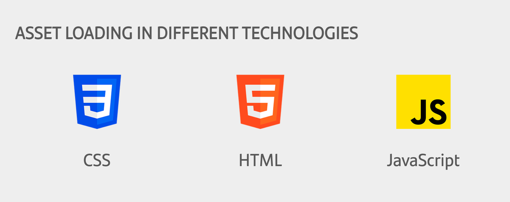

# How to work with Microfront assets

{ style="display: block; margin: 0 auto;" }

In this guide we are going to overview how to configure the Microfront project and the tools that can be used to achieve the assets integration.

When a Microfront is integrated into a Shell and this Microfront tries to load assets using relative paths, the assets are searched in the Shell domain instead of the Microfront's domain, resulting in problems.

In order to load assets in Microfront embedded in a Shell some extra configuration must be applied.

## Configuration

The `angular.json` file configuration.

```json
{
  "projects": {
    "mcf-ng13": {
      "architect": {
        "build": {
          "options": {
            "outputPath": "dist",
            "resourcesOutputPath": "<technical-grouping>/public",
            "assets": [{
              "glob": "**/*",
              "input": "public",
              "output": "<technical-grouping>/public"
            }]
          }
        }
      }
    }
  }
}
```

`resourcesOutputPath` indicates where the assets are going to be placed. This is a **required** property we are using to specify the folders where the assets are gonna be called for the CSS and HTML (examples later).

In this example for the required property `resourcesOutputPath` we declare a subpath that is the `<technical-grouping>` of the project.

!!! warning
    The use of the **technical grouping** for the `resourcesOutPath` property is **mandatory** in order to the Shell application to be able to redirect correctly.

## Usage

The three main ways to incorporate assets into our projects is through HTML, CSS and JavaScript, here we will show the following three resources:

* /public/css.png
* /public/html.png
* /public/js.png

### HTML

This is plain HTML, so the technical grouping is **required** in the path. This is the only way to achieve it.

```html
/public/html.png" />
```

### CSS

For CSS, we aim to find the assets folder directly. This is due because thanks to the `resourcesOutputPath` after the build the urls are resolved. This is the only way to achieve it.

``` html
<div class="css-image-relative"></div>
```

```css
.css-image-relative {
  background-image: url('../../public/css.png');
}
```

### Javascript

If we want to load an asset but we would like to avoid to set the technical grouping, we can use HTML and JS together:

``` html

```

The [prefixAsset](../ng-darwin-wmf/v20/api-reference/prefixassetpipe.md) pipe is supplied from the `@ng-darwin-wmf/microfront` library, which will add the technical grouping to the path, so adding it manually won't be needed.

## Nginx configuration for the Shell

If we want this assets configuration to work in a deployed environment, we have to set up some extra configurations in the Nginx configuration of the Shell application.

A rule has to be configured in order to redirect the requests to the Microfront. For example, to catch the request of the **assets** and the **config** of the Microfront it would be:

``` text
Shell configuration
# Microfront: request to its config properties and static files
location ~ ^<%= ENV["relativePath"] %>/(en-US|es)/mf-ng-00000000-appname {
    # Rewrite to delete relative path rewrite only if there is a relative path
    ^<%= ENV["relativePath"] %>/((?:en-US|es)/mf-ng-00000000-appname.*) /$1 break;
    proxy_pass https://microfront-domain;
}
```
