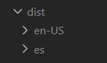

# Internationalization and Location

{ style="display: block; margin: 0 auto;" }

!!! warning
    The snippets and processes in this developer guide are aimed at the latest version of Angular supported by the architecture team. To find specific differences in older versions, please refer to the official Angular documentation online.

_Internationalization_, sometimes referred to as _i18n_, is the process of designing and preparing your project for use in different locations around the world without engineering changes.

_Localization,_ sometimes referred to as _i10n_, is the process of adapting and building versions of your internationalized software for different locales by translating text and adding local-specific components. The localization process includes the following actions: <!-- markdownlint-disable MD013 -->

A _locale_ identifies a region in which people speak a particular language or language variant. Possible regions include countries and geographical regions. A _locale_ determines the formatting and parsing of the following details.

* Measurement units including date and time, numbers, and currencies
* Translated names including time zones, languages, and countries

## Learn how to internationalize an application

This documentation is based on [Angular's internationalization](https://angular.dev/guide/i18n){:target="_blank"} process, so we recommend being familiar with it.

Using [Angular's standard internationalizacion](https://angular.dev/guide/i18n){:target="_blank"} **is mandatory for the Microfront**. The Shell application can choose a third-party solution, but from the architecture team we highly recommend the Angular approach.

If Shell application is using a third-party solution, please note this documentation is not prepared for it and it is the responsibility of Shell to offer a configuration that works.

### Add the localize package

`ng add @angular/localize`

First, be sure that you have the `@angular/localize` npm package installed. According to the Angular documentation, running the command will add `types: ["@angular/localize"]` in the TypeScript configuration files as well as the reference to the type definition of `@angular/localize` at the top of the `main.ts` file.

**main.ts:**

`/// <reference types="@angular/localize" />`

**tsconfig.app.json:**

`"types": [ "@angular/localize" ]`

### Refer to locales by ID

Angular uses the Unicode locale identifier (Unicode locale ID) format to refer to a locale. You can learn more about this [here](https://www.w3.org/TR/ltli/#i18n-terminology){:target="_blank"}.

The most important thing is that this identifier is usually referenced in the following way:

`{language_id}-{locale_extension}`

Where the first part of the expression refers to the spoken language and the second part refers to a location.

To translate your application, you need to decide which languages and locations are the target, since many countries share the same language, but differ in usage. Differences include grammar, punctuation, currency formats, decimal numbers, dates, etc.

| **LANGUAGE** | **LOCATION** | **UNICODE LOCAL ID** |
|---|---|---|
| English | Canada | en-CA |
| English | United States of America | en-US |
| French | Canada | fr-CA |
| Spanish | - | es |

### Set the source locale ID

Angular sets this value to `en-US` by default, but adding it is harmless.

``` json
"projects": {
  "my-project-name": {
    "i18n": {
      "sourceLocale": "en-US"
    }
  }
}
```

### Format data based on locale

!!! warning "`LOCALE_ID` token"

    Despite the fact that different locations are created Angular does not defaults the `LOCALE_ID` token.
    If you inject this token into a component it will be the wrong value. For this reason, **you have to set this token manually** if you want to use it correctly in the whole application.

An interesting use of this token would be to get the different locations of the Microfronts, based on it.

In the Shell archetype `LOCALE_ID` has been set based on a cookie that specifies the language in which _Nginx_ has served the application. But the Shell can use another approach according to its needs.

``` ts
// app.config.ts
function localeId() {
  function getCookie(name: string) {
    //...
  }
  
  return getCookie('_dwlan');
}

providers: [
  { provide: LOCALE_ID, useFactory: localeId }
]
```

### Prepare component for translation

To prepare your project for translation, complete the following actions:

* Use the `i18n` attribute to mark text in component templates.
* Use the `i18n-` attribute to mark attribute text strings in component templates.
* Use `$localize` to mark strings in the component's code.

We recommend you read [this Angular documentation](https://angular.dev/guide/i18n/prepare){:target="_blank"} where it is detailed how to perform the above actions in detail.

### Translation files and the extraction

After preparing a component for translation, use the Angular CLI command `extract-i18n` to extract the marked up text in the component to a language file. You can see the parameters it accepts [here](https://angular.dev/cli/extract-i18n){:target="_blank"}.

`ng extract-i18n --out-file src/locale/messages.xlf`

### Create a translation file for each language

Make a copy of the file `src/locale/messages.xlf` -> `src/locale/messages.{locale}.xlf`.

For example, for the generic Spanish translation, create the file `src/locale/messages.es.xlf`.

This is the file that must be sent to a translator and with an _xlf_ file editor tool to generate the translations.

For the moment we can generate the translations manually. Open the `messages.es.xlf` file and look for all the `<trans-unit>` entries. Each of these elements is a translation unit.

Duplicate the `<source>... </source>` element of each `<trans-unit>` and rename it to `<target>... </target>` replacing the content with the translation. Each translation unit should look like the following snippet.

``` xml
<trans-unit id="introductionHeader" datatype="html">
    <source>Hello i18n!</source>
    <target>Hola i18n!</target>
    <note priority="1" from="description">An introduction header for this sample</note>
    <note priority="1" from="meaning">User welcome</note>
</trans-unit>
<trans-unit id="ba0cc104d3d69bf669f97b8d96a4c5d8d9559aa3" datatype="html">
    <source>Welcome to the application</source>
    <target>Bienvenido a la aplicación</target>
</trans-unit>
<trans-unit id="701174153757adf13e7c24a248c8a873ac9f5193" datatype="html">
    <source>Angular logo</source>
    <target>Logo de Angular</target>
</trans-unit>
```

In a more complex translation, `description` and `meaning` elements can help to choose the right words for the translation.

To be able to translate plurals, alternative expressions for gender or nested expressions, please go to Angular documentation: "i18n metadata for translation.

### Define locales in the build configuration

Use the `i18n` property in your project's `angular.json` configuration file to define locales.

The following snippet shows a code base created in English and a translation for Spanish:

``` json
"projects": {
  "my-project": {
      // ...
      "i18n": {
        "sourceLocale": "en-US",
        "locales": {
          "es": {
            "translation": "src/locale/messages.es.xlf",
            // ...
          }
        }
      },
      // ...
    }
  }
}
```

### Generate application variants for each locale

Use the `localize` property in the `angular.json` configuration file to tell the CLI which locales to generate at build time.

* `localize` to `true` to generate all localizations defined in the configuration file.
* `localize` to an array with a subset of locale identifiers, to only generate these localizes. For example, `localize: ["es"]`.
* `localize` to `false` to disable the localization and not generate any specific locales.

For each variant of the app, the `lang` attribute of the `<html>` element is set to the locale.

The CLI also adjusts the `<base>` element for each version of the application by adding the locale to the configured `<base>`.

``` json
// angular.json

"build": {
  "builder": "@angular-devkit/build-angular:browser",
  "options": {
    "localize": true,
    // ...
  }
```

### Report missing translations

When a translation is missing, the build succeeds but generates a warning like _Missing translation for message "{translation\_text}"._ You can configure the level of warning that the Angular compiler generates by specifying one of the following levels.

| LEVEL | DETAIL | OUTPUT |
|---|---|---|
| error | It throws an error and the build fails | n/a |
| ignore | Does nothing. Ignore errors | n/a |
| warning | Show default warning in console | `Missing translation for message "{translation_text}"` |

``` json
// angular.json

"build": {
  "builder": "@angular-devkit/build-angular:browser",
  "options": {
    // ...
    "i18nMissingTranslation": "error"
  }
```

## Microfront configuration

### The base HREF

When you generate (build) a locale, Angular defaults the value of the `base href` to the value of the locale identifier. In order for a Microfront to work correctly inside a shell, it configures its `base href` as follows.

``` html
<!-- Microfront dist/es/index.html -->
<html lang="es">
  ...
  <base href="/es/">
  ...
</html>
```

But when a Microfront is integrated into a Shell, the Microfront `index.html` file is never used, and therefore the Microfront will use the `base href` element from the Shell application where it is integrated. The Nginx configuration of the Shell will do the magic to redirect the request to the Microfront.

Due to the above:

!!! warning
    **Important!** The use of the `APP_BASE_HREF` provider inside the Microfront **is not allowed**, since it does not make changes in the [HTML `base` tag](https://developer.mozilla.org/en-US/docs/Web/HTML/Element/base){:target="_blank"} and will cause problems when integrating the Microfront. The Microfront uses this HTML tag to know the context in which it is located.

If your Microfront needs to be served from a _relative path_ please check [this documentation](routing-inside-the-microfront.md#relative-path).

### Prepare and serve a Microfront location (standalone)

Angular can only serve one location at a time. If you try to configure your project to serve multiple, Angular will report an error.

You have to configure your project to be able to serve any of your locations and be able to make sure that they work correctly.

An example may be the following scripts in the `package.json` file of the Microfront project:

!!! note
    Please note that some script tasks may differ from Microfront archetype configuration.

``` json
"scripts": {
  ...
  "build": "ng build --configuration production",       // default build all locales
  "build:es": "ng build --configuration production,es", // build only spanish locale
  "serve:app": "ng serve",                              // default serve english
  "serve:app:es": "ng serve --configuration es",        // serve spanish locale
  "i18n": "ng extract-i18n --output-path=src/locale",
  ...
},
```

Set up your `angular.json` depending on the locales you have to serve. The following is an example for english (`sourceLocale` by default) and spanish locales, where `my-project` would be the name of your Microfront project:

!!! note
    Please note that some set up come with the Microfront archetype out of a box.

``` json
"projects": {
  "my-project": {
    "architect": {
      "build": {
        "options": {
          //...
          "localize": true,
          "i18nMissingTranslation": "error"
        }
        "configurations": {
          "development": {
            //...
            "localize": false
          },
          "es": {
            "localize": ["es"]
          }
        }
      }
      "serve": {
        //...
        "configurations": {
          //...
          "es": {
            "buildTarget": "my-project:build:development,es"
          }
        }
      }
    }
  }
}
```

### Build all the Microfront locations

To build all configured locations run `npm run build` in your Microfront project.

### Check the Microfront locations

You will note the previous step has generated as many folders as locations within the `dist` directory. If you want to up and run any of them, you must use a web server such as Nginx with the proper configuration.

The Microfront archetype comes with a Nginx local setup configuration out of the box (`nginx/local` folder), so you can test the Microfront as long as you have a Nginx locally installed in your computer.

You must modify some configuration properties:

* `root` to point to the specific location you want to serve
* `location.proxy_pass` to redirect to the site where the fake API is running and get the Microfront configuration.

## Shell configuration

### The base HREF

If the Shell application is using the Angular standard i18n, when you generate (build) a locale, Angular defaults the value of the _base href_ to the value of the locale identifier.

{ style="display: block; margin: 0 auto;" }

``` html
<!-- Shell dist/es/index.html -->
<html lang="es">
  ...
  <base href="/es/">
  ...
</html>
```

In order for all Shell locations to work correctly, we will leave the _base href_ element as is, without adding any extra configuration.
Only if the Shell needs to be served from a _relative path,_ in that case please check [this documentation](routing-inside-the-microfront.md#relative-path).

### Prepare and serve a Shell location

As previously stated, Angular can only serve one location at a time. If you try to configure your project to serve multiple, Angular will report an error.

You have to configure your project to be able to serve any of your locations and make sure that they work correctly.

An example may be the following scripts in the `package.json` file of the Microfront project:

!!! note
    Please note that some script tasks may differ from Shell archetype configuration.

``` json
"scripts": {
  ...
  "build": "ng build --configuration production",       // default build all locales
  "build:es": "ng build --configuration production,es", // build only spanish locale
  "serve:app": "ng serve",                              // default serve english
  "serve:app:es": "ng serve --configuration es",        // serve spanish spanish
  "i18n": "ng extract-i18n --output-path=src/locale",
  ...
}
```

Set up your `angular.json` depending on the locales you have to serve. The following is an example for english (`sourceLocale` by default) and spanish locales, where `my-project` would be the name of your Shell project:

!!! note
    Please note that some set ups come with the Shell archetype out of a box.

``` json
"projects": {
  "my-project": {
    "architect": {
      "build": {
        "options": {
          "localize": true,
          "i18nMissingTranslation": "error"
        }
        "configurations": {
          "development": {
            //...
            "localize": false
          },
          "es": {
            "localize": ["es"]
          }
        }
      },
      "serve": {
        //...
        "configurations": {
          //...
          "es": {
            "buildTarget": "my-project:build:development,es"
          }
        }
      }
    }
  }
}
```

### Build all the Shell locations

To build all configured locations run `npm run build` in your Shell project.

### Check the Shell locations

You will note the previous step has generated as many folders as locations within the `dist` directory. If you want to up and run any of them, you must use a web server such as Nginx with the proper configuration.

The Shell archetype comes with a Nginx local setup configuration out of the box (`nginx/local` folder), so you can test the Shell as long as you have a Nginx locally installed in your computer.

You must modify some configuration properties:

* `root` to point to the specific location you want to serve
* `location.proxy_pass`
    * to redirect the config request where the fake API is running and get the Shell configuration.
    * to redirect the Microfront requests where it is served.
  
Take a look at these sections for more information:

* [Configure Nginx for a Shell](#configuring-nginx-for-i18n)
* [The language process for the Shell](#the-language-process-for-the-shell)

### Check the Microfront locations from a Shell

To check the locations of a Microfront from a Shell application, there are two requiremens:

* [To have a Microfront created and deployed](getting-started-with-microfront-development/index.md)
* [To have the previous Microfront integrated into a Shell](how-to-integrate-a-microfront-into-a-shell-application/index.md)

If the Shell and Microfront have the _i18n_ with Angular's standard solution, testing the Microfront localizations from a Shell is pretty straightforward. All the magic is done through the Shell redirects to the Microfront.

If the Shell is requested in English, it will request the Microfront in English as well, and if the Shell is requested in another language, such as Spanish, this will be the language in which the Microfront will be retrieved.

The Shell must redirect to where the Microfront is deployed, taking into account that this redirection must eliminate the relative path of the shell if it had any.

In the following example the Shell is deployed in a `/relative/path` and the `rewrite` directive redirects to where the Microfront it is deployed. Look at the part of the _regex_ with the language `(en-US|es)`.

``` text
# Shell Nginx configuration

...

# Requests to Microfront
location ~ ^/relative/path/(en-US|es)/mf-ng-00000000-name {
  # Rewrite to delete relative path
  rewrite ^/relative/path/((?:en-US|es)/mf-ng-00000000-name.*) /$1 break;
  proxy_pass https://microfront-deployed-url;
}
```

The Microfront must also be configured and deployed so that the request from the Shell to the Microfront work.

``` text
# Microfront nginx configuration

...

# Request to serve the app
location ~ ^/(es|en-US) {
  index index.html;
  try_files $uri /$1/index.html?$args;
}

location / {
  try_files $uri =404;
}
```

### Configuring Nginx for i18n

A Shell application must be prepared to serve its own requested locale and also to request the Microfronts in that same locale.

#### Shell configuration

* Set the `$accept_language` to the value of the http header `accept_language`.

``` text
map $http_accept_language $accept_language {
  ~*^en-US en-US;
  ~*^es es;
}
```

* If the `_dwlan` cookie exists and it has one of the desired languages, the `$language` variable is set to that value.

``` text
# check cookie _dwlan
if ($cookie__dwlan ~ "^(es|en-US)$" ) {
  set $language $1;
}
```

* If the cookie `_dwlan` does not exist, the `$language` variable is set to the value of the `$accept_language` variable.

``` text
# if no cookie set language to accept-language http header
if ($cookie__dwlan ~ "^$") {
  set $language $accept_language;
}
```

* The path `/` or the path `/relative/path` is redirected to `/$language` or `/relative/path/$laguage` respectively (ex: `/relative/path/es`, `/relative/path/es-US`).

``` text
rewrite ^<%= ENV["relativePath"] %>/?$ <%= ENV["relativePath"] %>/$language permanent;
```

* A `location` is prepared to be able to serve the Shell configuration through a reverse proxy. The snippet gets the Shell configuration through _ConfigService_.

``` text
# Shell: request to its own config
location ~ ^<%= ENV["relativePath"] %>/(en-US|es)/f-ng-00000000-shell/config.json {
  rewrite ^<%= ENV["relativePath"] %>/(en-US|es)/f-ng-00000000-shell/config.json /f-ng-00000000-shell/dev/master/f-ng-00000000-shell.json break;
  proxy_pass <%= ENV["CONFIG_END_POINT"] %>; }
```

* A `location` is configured to redirect, through a reverse proxy, to where the Microfront static files and its configuration are served.

``` text
# Shell: request to the Microfront
location ~ ^<%= ENV["relativePath"] %>/(en-US|es)/mf-ng-00000000-microfront {
  # Rewrite to delete relative path only if there is a relative path
  rewrite ^<%= ENV["relativePath"] %>/((?:en-US|es)/mf-ng-00000000-microfront.*) /$1 break;
  proxy_pass https://microfront-deployed-url;
}
```

* A `location` is configured to serve the Shell application. A cookie called `_dwlan` is also created whenever requests referring to the Shell application are made.

``` text
# Shell: to serve the app
location ~ ^<%= ENV["relativePath"] %>/(en-US|es) {
  add_header Set-Cookie "_dwlan=$1; SameSite=Lax;Secure;Path=<%= ENV["relativePath"] %>/";
  try_files $uri <%= ENV["relativePath"] %>/$1/index.html?$args;
  index index.html;
}
```

* Any other request that is not made to the root or the specific location will return `404`.

``` text
location / {
  try_files $uri =404;
}
```

#### Microfront configuration

A Microfront has to be set up to be able to serve their static files and configuration. The snippet gets the Microfront configuration through _ConfigService_.

``` text
# Microfront: request to config properties
location ~ ^<%= ENV["relativePath"] %>/(en-US|es)/mf-ng-00000000-microfront/config.json {
  rewrite ^<%= ENV["relativePath"] %>/(en-US|es)/mf-ng-00000000-microfront/config.json /mf-ng-00000000-microfront/dev/master/mf-ng-00000000-microfront.json break;
  proxy_pass <%= ENV["CONFIG_END_POINT"] %>;
}

# To serve the Microfront
location ~ ^<%= ENV["relativePath"] %>/(es|en-US) {
  try_files $uri <%= ENV["relativePath"] %>/$1/index.html?$args;
  index index.html;
}

location / {
  try_files $uri =404;
}
```

## The language process for the Shell

Let’s simulate step by step the process of retrieving the application in a certain locale, according to the preferences of a user who has English saved as a preference but accesses through a browser configured to prioritize Spanish. This user is accessing the application for the first time.

1. The user accesses the Shell application through its address. The language is not specified in the URL to demonstrate the entire retrieval process.

2. The request is handled by the Shell Nginx server, which aims to set the locale in which the user wants to receive the application and store it in the `$language` variable. To do this the value of the `$http_accept_language` header received from the browser is stored in the `$accept_language` variable, depending on the browser's configuration. In this case, it is Spanish. Nginx then checks if the `_dwlan` cookie exists. If it does, the `$language` variable is set to its value. If the cookie does not exist, the `$accept_language` variable is used. Since the cookie does not exist at this moment, the `$language` variable will take the value received from the browser.

3. The next step is to rewrite the address by adding the desired locale and trying to match it with a `location` directive.

4. In this case, the matching `location` directive is `location ~ ^<%= ENV["relativePath"] %>/(en-US|es)`, and the server will return the `index.html` located at `<%= ENV["relativePath"] %>/es/index.html`, setting the `_dwlan` cookie to `es`.

5. The browser receives the `index.html` file and begins parsing it, downloading the JavaScript files in Spanish. The application starts running.

6. As soon as the application starts, it makes a request to the user data service to verify that the `LOCALE_ID` token, which represents the current language of the served application (`es` in this case), matches the language value in the user data. Note that the `LOCALE_ID` token is set to the value of the `_dwlan` cookie.

7. If both values match, the application continues running. If they do not match, a redirection is made to the locale saved by the user, in this case, `<%= ENV["relativePath"] %>/en-US/index.html`.

8. This new request is handled by Nginx, which again tries to match it with a `location` directive. The same `location` directive as before captures the request, but this time it serves `<%= ENV["relativePath"] %>/en-US/index.html` and sets the `_dwlan` cookie to `en-US`.

9. The browser starts parsing the new `index.html` file, downloading the corresponding JavaScript files in English. The application starts running and requests the user data, comparing the language saved by the user with the `LOCALE_ID` token. This time, both values match, and the application continues its execution.

### Considerations

* If the user accesses the application without specifying any specific locale in the URL, the value of the `_dwlan` cookie will indicate the language to access the static JavaScript files of the application.

* If the `_dwlan` cookie has no value, the Microfront files will be served according to the language set by the browser as a priority in its `accept_language` header, which may or may not match the language saved in the user data.

* If the served locale does not match the user's preferences, the application will start running and redirect to the desired locale. This redirection will set the correct value for the `_dwlan` cookie, so if the user accesses the application again without specifying any locale, the correct locale will be served, and no redirection will occur.

* This feature requires a user service that specifies the locale the user wants the application to be served in. We recommend reading the Internationalization & Location sections found in the files of Shell and Microfront archetypes.
