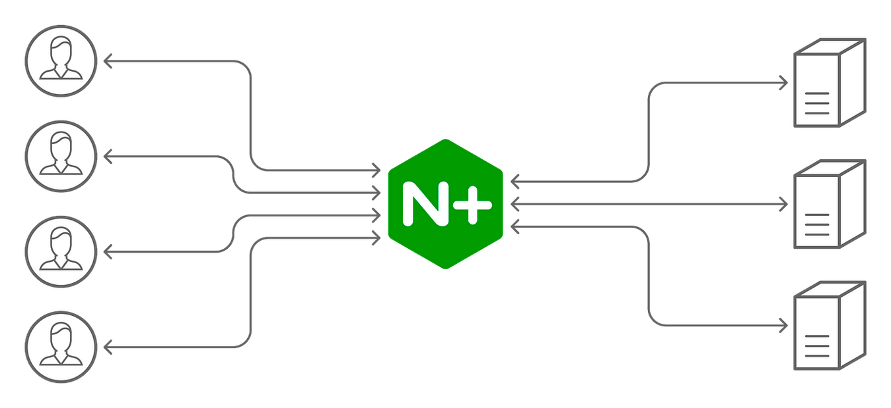

# Nginx and Proxy.conf configuration

{ style="display: block; margin: 0 auto;" }

The web server/reverse proxy configuration is crucial to the Microfronts architecture and its integrations. Microfronts will need to be exposed in the Shell domain and also those APIs that are called in a relative way.

For the configuration in a distributed environment, [Nginx](https://www.nginx.com){:target="_blank"} will be used and for the local configuration, the `proxy.conf` file that Angular provides for editing or creating new entry points to the local server.

## Nginx

The archetypes provide a base configuration distributed in the `default.conf`, `common-headers.conf`, `gzip.conf` y `proxy-cache.conf` files but it is likely that the `default.conf` file will need to be modified to include new APIs,
Microfronts integration or language aggregation. This documentation details those points related to the Microfronts architecture.

Files such as `gzip.conf` and `proxy-cache.conf` will no be reviewed since they are not modified from the SPA architecture, more details about these files can be found [here](../../ng-darwin/nginx-config/index.md).

### Use of variables

Within the Nginx configuration files, environment variables will be used with the following syntax.

`<%= ENV["ENVIRONMENT_VARIABLE"] %>`

These will be replaced by the variables value declared, in some cases they will be optional and will be checked if they exist.

For more information about this syntax you can visit [this link](https://apidock.com/ruby/ERB "https://apidock.com/ruby/ERB"){:target="_blank"}.

### Fetching config.json file

The Shell and Microfront archetypes integrate the [darwin configuration module](https://automatic-doodle-rew2y31.pages.github.io/modules/_ng-darwin_config.html){:target="_blank"},
so they will try to get via AJAX the `config.json` file at initialization.

To resolve this request, a redirect is performed in Nginx, this redirect is contemplated in the archetypes.

Currently the file can be generated through [ConfigMaps](../../ng-darwin/modules/config/config-maps.md) or [Spring Cloud Config](../../ng-darwin/modules/config/spring-cloud-config.md)
but depending on what is going to be implemented one or the other redirection will have to be used.

- **ConfigMaps**

    The pod volume is redirected and the common headers are added.

    ``` text
    location ~ ^<%= ENV["relativePath"] %>/(en-US|es)/<technical-grouping>/config.json {
      alias /etc/san-configmap-darwin/config.json;
      ...
    }
    ```

- **Spring Cloud Config**

    Here the service declared in the `CONFIG_END_POINT` variable will be redirected. The `ACTIVE_ENVIRONMENT` variable will be used to determine the environment and `ACTIVE_BRANCH` to active branch.

    ``` text
    location ~ ^<%= ENV["relativePath"] %>/(en-US|es)/<technical-grouping>/config.json {
      rewrite ^<%= ENV["relativePath"] %>/(en-US|es)/<technical-grouping>/config.json /<technical-grouping>/<%= ENV["ACTIVE_ENVIRONMENT"] %>/<%= ENV["ACTIVE_BRANCH"] %>/<technical-grouping>.json break;
      proxy_pass <%= ENV["CONFIG_END_POINT"] %>;
      ...
    }
    ```

    !!! note
        In the case of the Microfront an extra redirection is added to obtain the configuration corresponding to the **Shell-Lite**. It is exactly the same but adding `-sl` both in the location and in the rewrite or alias

    ``` text
    # ConfigMaps
    location ~ ^<%= ENV["relativePath"] %>/(en-US|es)/<technical-grouping>-shell-lite/config.json {
      alias /etc/san-configmap-darwin/config-sl.json;
      ...
    }
    ```

    ``` text
    # Spring Cloud Config
    location ~ ^<%= ENV["relativePath"] %>/(en-US|es)/<technical-grouping>-sl/config.json {
      rewrite ^<%= ENV["relativePath"] %>/(en-US|es)/<technical-grouping>-sl/config.json /<technical-grouping>-shell-lite/<%= ENV["ACTIVE_ENVIRONMENT"] %>/<%= ENV["ACTIVE_BRANCH"] %>/<technical-grouping>-sl.json break;
      proxy_pass <%= ENV["CONFIG_END_POINT"] %>;
      ...
    }
    ```

### Microfront redirections from Shell

To integrate a Microfront in a Shell, it will be necessary to declare its entry point in Nginx in order to redirect all the requests that correspond to it, mainly its configuration file, JavaScript and assets.

In the following redirection all this is contemplated with a Regex, the headers are added and finally the domain where the Microfront is accessible. In case the Microfront has a **relative path**, it is in the `rewrite` where it must be reflected, being `/<relative-path>/$1`. <!-- markdownlint-disable MD013 -->

``` text
location ~ ^<%= ENV["relativePath"] %>/(en-US|es)/<technical-grouping> {
  rewrite ^<%= ENV["relativePath"] %>/((?:en-US|es)/<technical-grouping>.*) /$1 break;
  proxy_pass <microfront-domain>;
  ...
}
```

In case there is not a relative path configured, the rewrite would be unnecessary in the location, resulting the location in:

``` text
location ~ ^<%= ENV["relativePath"] %>/(en-US|es)/<technical-grouping> {
  proxy_pass <microfront-domain>;
  ...
}
```

For any questions, [check the documentation](how-to-integrate-a-microfront-into-a-shell-application/index.md#the-microfront-invocation).

### i18n

The configuration of Nginx is of great importance for the implementation of i18n in our archetypes, since it must consider the different distributions made by language and localization.

As this is a very extensive point, it is recommended to review the [documentation dedicated to i18n](internationalization-and-location.md),
where the specific [configuration related to Nginx](internationalization-and-location.md#configuring-nginx-for-i18n) is also detailed.

### Relative path

By default the applications contemplate the relative path within the Nginx configurations, having to modify the `relativePath` environment variable to add relative path if required.

In case of having a Microfront with relative path, it will have to be taken into account when applying the redirections in the Nginx configuration of the Container Shell, as discussed in point [Microfront redirections from shell](#microfront-redirections-from-shell).

For more questions review the documentation: [Routing inside the Microfront | Relative path](routing-inside-the-microfront.md#relative-path).

### Headers

By default, several headers are included in the Nginx configuration of the archetypes, the most important of which are the following:

- **Content-Security-Policy** by default its value is `default-src 'self'; img-src 'self' data:; script-src 'self' 'unsafe-inline'; style-src 'self' 'unsafe-inline'; frame-ancestors 'none'` but it can be modified with the environment variable **CSP\_RULE**.

- **Permissions-Policy** by default its value is `"geolocation=(), microphone=(), camera=()"` but it can be modified with the environment variable **PP\_RULE**.

For more information, visit: [Nginx Configuration](../../ng-darwin/nginx-config/index.md).

### Variables

#### CONFIG\_END\_POINT

!!! note
    This variable is mandatory for the use of [Spring Cloud Config](../../ng-darwin/modules/config/spring-cloud-config.md).

In case of using [Spring Cloud Config](../../ng-darwin/modules/config/spring-cloud-config.md) it is necessary to report this variable with the domain where the service is available.

``` text
# default.conf
location ~ ^/(en-US|es)/<technical-grouping>/config.json {
    rewrite ...
    proxy_pass <%= ENV["CONFIG_END_POINT"] %>;
    ...
}
```

#### ACTIVE\_ENVIRONMENT

!!! note
    This variable is mandatory for the use of [Spring Cloud Config](../../ng-darwin/modules/config/spring-cloud-config.md).

Will specify in what environment is deployed the application.

``` text
# default.conf
location  ~ ^/(en-US|es)/<technical-grouping>/config.json {
    rewrite ^/(en-US|es)/<technical-grouping>/config.json /<technical-grouping>/<%= ENV["ACTIVE_ENVIRONMENT"] %>/<%= ENV["ACTIVE_BRANCH"] %>/<technical-grouping>.json break;
    ...
}
```

Examples final values could be: **dev, pre, pro**.

#### ACTIVE\_BRANCH

!!! note
    This variable is mandatory for the use of [Spring Cloud Config](../../ng-darwin/modules/config/spring-cloud-config.md).

Will specify in which branch the configuration file is used.

``` text
# default.conf
location  ~ ^/(en-US|es)/config/<technical-grouping>/config.json {
    rewrite ^/(en-US|es)/config/<technical-grouping>/config.json /<technical-grouping>/<%= ENV["ACTIVE_ENVIRONMENT"] %>/<%= ENV["ACTIVE_BRANCH"] %>/<technical-grouping>.json break;
    ...
}
```

Examples final values could be: **master, develop**.

#### CSP\_RULE

This variable is used for the modification of the `Content-Security-Policy` header.

#### PP\_RULE

By default the `Permissions-Policy` header has the value `geolocation=(), microphone=(), camera=()`, in case of requiring its modification, this environment variable can be informed.

#### relativePath

This variable will be necessary to inform only in case the application has a relative path.

!!! note
    This variable is in **camelCase** syntax but it will be changed in the future to **SCREAMING\_SNAKE\_CASE** to have the same syntax as the rest.

### Local Nginx

The archetypes include a `local` directory within Nginx for testing purposes in a local machine. Mainly it will be necessary to modify the `root` directive to indicate the directory where the application distribution is located.

The configuration is very similar from the production environment one but without adding extra headers, except for the cookie that is added to be able to test with the i18n.

With this configuration it is possible to perform redirection tests for Microfronts integrations in a Shell.

## Proxy.conf

This file is located in the root of the Shell and Microfront archetypes. It is referenced in the `angular.json` file and it is used to perform proxy jobs on the local web server by defining multiple entries.

### Shell

By default the `proxy.conf` file of the archetype comes with several entries defined:

- `/api` to redirect all requests made to port 3000 where the json server will be deployed.

    ``` json
    "/api": {
      "target": "http://localhost:3000"
    },
    ```

- `/<technical-grouping>/config` necessary to obtain the Shell application configuration file.

    ``` json
    "// Shell Rules": {},
    "/<technical-grouping>/config": {
      "target": "http://localhost:3000",
      "pathRewrite": {
        "^/<technical-grouping>": ""
      }
    }
    ```

- `/mf-ng-00000000-demomfecl18`
    This entry is used to ensure the integration of the example Microfront `00000000-demomfecl18`. It is needed for all assets and JavaScript files requests.

    The `changeOrigin` and `secure` properties are used to be able to point to a deployed Microfront. It is also important to remember that being a local environment configuration, Angular's i18n standard is not reflected in the URL, so you have to redirect directly in the `pathRewrite` property. If you want to change the language, you would have to modify the value of the property, the default is `en-US`.

    Microfront configuration, by default targeting a deployed one.

    ``` json
    "/mf-ng-00000000-demomfecl18": {
      "target": "https://mex-rost-demomfecl18-sanes-pre-vostok-dev.apps.ccc01alm.ccc.pre.cn2.paas.cloudcenter.corp",
      "changeOrigin": true,
      "secure": false,
      "pathRewrite": {
        "^/mf-ng-00000000-demomfecl18": "/en-US/mf-ng-00000000-demomfecl18"
      }
    }
    ```

### Microfront

By default two entries are defined in the `proxy.conf` file of the archetype:

- `/<technical-grouping>-sl/config` necessary to obtain the configuration of the Shell-Lite application in standalone mode.

    ``` json
    "/<technical-grouping>-sl/config": {
      "target": "http://localhost:3001",
      "pathRewrite": {
        "^/<technical-grouping>-sl": "shell-lite"
      }
    }
    ```

- `/<technical-grouping>/config` required to obtain the Microfront configuration.

    ``` json
    "/<technical-grouping>/config": {
      "target": "http://localhost:3001",
      "pathRewrite": {
        "^/<technical-grouping>": ""
      }
    }
    ```

### Local API’s

To redirect requests to an API, it will be necessary to create a new entry. In the case of a domain other than localhost, the `changeOrigin` and `secure` properties must be added as in the following example:

``` json
"/api/example": {
  "target": "<domain>",
  "changeOrigin": true,
  "secure": false
}
```

!!! note
    If these redirections are specific to the Microfront, they must also be reflected when it is integrated into a shell so that requests are accessible from its domain.

## Links of interest

- [Internationalization & Location](internationalization-and-location.md)
- [How to integrate a Microfront into a shell](how-to-integrate-a-microfront-into-a-shell-application/index.md)
- [Routing inside a Microfront](routing-inside-the-microfront.md)
