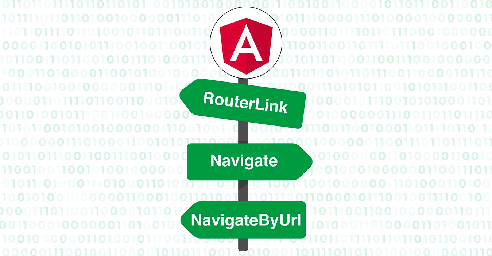
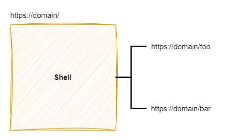
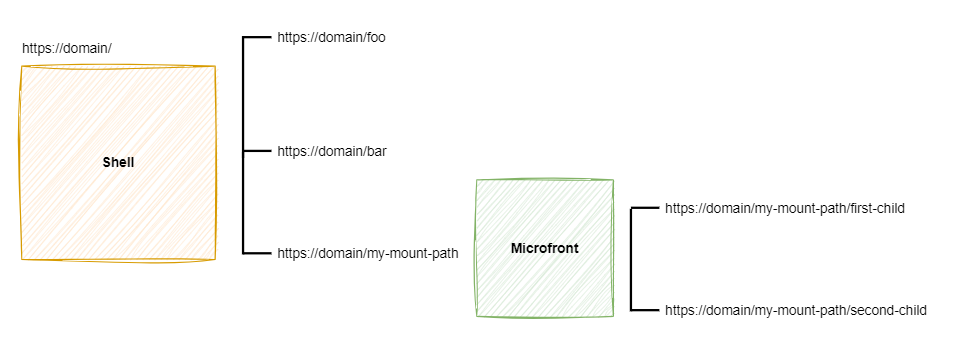
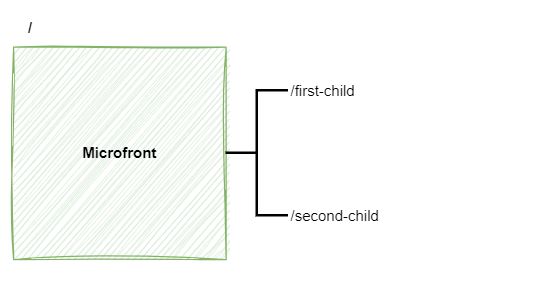

# Routing inside the Microfront

{ style="display: block; margin: 0 auto;" }

In this documentation page we will talk about the importance and responsibility of using routing in a Microfronts architecture. What should be taken into consideration, what should be avoided and some vital concepts will be clarified.

## The Mount Path. What is it?

When integrating a Microfront the concept of mount path becomes very relevant. This is because many of the checks that are performed in the `@ng-darwin-wmf/microfront` library, are based on this value to avoid problems with the paths.

The `mountPath` is a variable used for the enclosure of paths that a Microfront will be allowed to have. When you have a Microfront with routes, you must limit its paths in order to not impact outside its context.

It is appropriate to reserve a Shell path as a mount path so that the Microfront can develop smoothly.

### Example

Let’s see an example to clarify. Imagine we have a Shell with the domain `https://domain/` and two internal paths.

{ style="display: block; margin: 0 auto;" }

If you would like to integrate a Microfront that contains and makes use of their own routing and paths, you would have to indicate its mounting path. In this way, its field of action will be limited, avoiding impacting outside of it.

In the following example, the `my-mount-path` path is used as the mount path to integrate the Microfront.

{ style="display: block; margin: 0 auto;" }

What is being indicated with this mounting path is that all the paths associated to `https://domain/my-mount-path` will be part of the Microfront.
If the path suffers any modification within this context, the Shell will not make any change, because the only thing it will do is to delegate all the paths that may exist in the Microfront to the Microfront.

Actually the Microfront will be developed without knowing the exact value of the its mount path, it will only know that it will exist but not its value.

{ style="display: block; margin: 0 auto;" }

!!! note
    Keep in mind that the same Microfront may be used in more than one Shell at the same time and with a different mount path for each one.

## Relative path

The use of relative paths is very common in web projects when they can no be deployed in a root path.

!!! warning
    Please, special care with reverse proxy redirects if you are using relatives paths in your Microfronts architecture.

### Shell relative path

Let's imagine you want your Microfront to be deployed in the next relative path: `/relative/path`. Follow these steps to get it working:

#### Add relative path in `angular.json` file

The relative path must be specified in the following properties:

* `baseHref` - The application compile will generate the [HTML **base** tag](https://developer.mozilla.org/en-US/docs/Web/HTML/Element/base){: target="_blank"} with its value.
* `outputPath` - It will modify the distributed code by adding the relative path directories.

```json
"architects": {
  "build": {
    "options": {
      "baseHref": "/relative/path/",
      "outputPath": "dist/relative/path",
```

!!! warning
    **Important!** The use of the `APP_BASE_HREF` provider **is not allowed**, since it does not make changes in the [HTML **base** tag](https://developer.mozilla.org/en-US/docs/Web/HTML/Element/base){: target="_blank"} and will cause problems in Microfronts,
    which will use this tag to know the context in which they are.

#### Add redirects for the local environment

It will be necessary to modify all the **http requests made against the application domain**.

These redirects should have already been registered in the `proxy.conf.json` file, and only the relative path should be added.

Example:

Before.

```json
"/<technical-grouping>/config": {
  "target": "http://localhost:3000",
  "pathRewrite": {
    "^/<technical-grouping>": ""
  }
},
```

After.

```json
"/relative/path/<technical-grouping>/config": {
  "target": "http://localhost:3000",
  "pathRewrite": {
    "^/relative/path/<technical-grouping>": ""
  }
},
```

If there are also any requests to Microfronts in the `proxy.conf.json` file, they must also be modified to ensure their right working.

!!! note
    If you have any doubts you can always check the documentation on [How to integrate a Microfront into a Shell application](how-to-integrate-a-microfront-into-a-shell-application/index.md).

#### Add redirects for the deployed environments

If the application is deployed on PaaS it will only be necessary to add the environment variable **relativePath** with the value of the relative path, in our example `/relative/path`.

This environment variable is considered in the Nginx configuration file `nginx/default.conf` , and it will modify all requests made to your domain as long as they are registered in the file.

There is also an additional Nginx file in case you want to test the distribution locally, `nginx/local/conf.d/default-shell.conf`.
In this case it will be necessary to make the changes manually. Please use `nginx/default.conf` file as a reference and observe where the environment variable is replaced.

Example:

The following snipped would be an applicable example to all `locations`.

Before.

``` text
location ~ ^/(en-US|es)/<technical-grouping>/config.json {
  rewrite ^/(en-US|es)/<technical-grouping>/config.json /config.json break;
  proxy_pass http://localhost:3000;
}
```

After.

``` text
location ~ ^/relative/path/(en-US|es)/<technical-grouping>/config.json {
  rewrite ^/relative/path/(en-US|es)/<technical-grouping>/config.json /config.json break;
  proxy_pass http://localhost:3000;
}
```

!!! note
    If there are also any requests to Microfronts in the `default.conf` file, they must also be modified to ensure their right working.

!!! note
    You can omit the ISO codes if your Shell application is not using the Angular standard i18n.

!!! note
    If you have any doubts you can always check the documentation on [How to integrate a Microfront into a Shell application](how-to-integrate-a-microfront-into-a-shell-application/index.md).

### Microfront relative path

Let's imagine you want your Microfront to be deployed in the next relative path: `/mcf-relative`. Follow these steps to get it working:

#### Add relative path in `angular.json`

The relative path must be specified in the following properties:

* `baseHref` - The application compile will generate the [HTML **base** tag](https://developer.mozilla.org/en-US/docs/Web/HTML/Element/base){: target="_blank"} with its value.
* `outputPath` - It will modify the distributed code by adding the relative path directories.

```json
"architects": {
  "build": {
    "options": {
      "baseHref": "/mcf-relative-path/",
      "outputPath": "dist/mcf-relative-path",
```

!!! warning
    **Important!** The use of the `APP_BASE_HREF` provider **is not allowed**, since it does not make changes in the
    [HTML **base** tag](https://developer.mozilla.org/en-US/docs/Web/HTML/Element/base){: target="_blank"} and will cause problems when integrating the Microfront.
    The Microfront uses this HTML tag to know the context in which it is located.

#### Add redirects for the local environment

It will be necessary to modify all the **http requests made against the application domain**.

These redirect should have already been registered in the `proxy.conf.json` file, and only the relative path should be added. By default the Microfront archetypes have exposed configuration files on port 3001.

Example:

Before.

```json
"/<technical-grouping>-shell-lite/config": {
  "target": "http://localhost:3001",
  "pathRewrite": {
    "^/<technical-grouping>-shell-lite": "shell-lite"
  }
},
"/<technical-grouping>/config": {
  "target": "http://localhost:3001",
  "pathRewrite": {
    "^/<technical-grouping>": ""
  }
}
```

After.

```json
"/mcf-relative-path/<technical-grouping>-shell-lite/config": {
  "target": "http://localhost:3001",
  "pathRewrite": {
    "^/mcf-relative-path/<technical-grouping>-shell-lite": "shell-lite"
  }
},
"/mcf-relative-path/<technical-grouping>/config": {
  "target": "http://localhost:3001",
  "pathRewrite": {
    "^/mcf-relative-path/<technical-grouping>": ""
  }
}
```

#### Add relative path to local devServer in webpack configuration file

!!! warning
    Only for versions before Angular 18

When a Microfront is up and run locally, you will have noticed the browser is automatically open. Change this property so that the relative path is taken into account.

``` js
module.exports = {
  devServer: {
    open: ['/mcf-relative-path?dw-init-mode=shell']
  },
  ...
}
```

#### Add redirects for the deployed environments

If the application is deployed on PaaS it will only be necessary to add the environment variable **relativePath** with the value of the relative path, in our example `/mcf-relative-path`.

This environment variable is considered in the Nginx configuration file `nginx/default.conf` , and it will modify all requests made to your domain as long as they are registered in the file.

There is also an additional Nginx file in case you want to test the distribution locally, `nginx/local/conf.d/default-shell.conf`.
In this case it will be necessary to make the changes manually. Please use the previous file `nginx/default.conf` as a reference and observe where the environment variable is replaced.

Before.

``` text
# Shell-lite: request to config properties
location ~ ^/(en-US|es)/<technical-grouping>-shell-lite/config.json {
    rewrite ^/(en-US|es)/<technical-grouping>-shell-lite/config.json /shell-lite/config.json break;
    proxy_pass http://localhost:3001;
}
# Microfront: request to config properties
location ~ ^/(en-US|es)/<technical-grouping>/config.json {
    rewrite ^/(en-US|es)/<technical-grouping>/config.json /config.json break;
    proxy_pass http://localhost:3001;
}
```

After.

``` text
# Shell-lite: request to config properties
location ~ ^/mcf-relative-path/(en-US|es)/<technical-grouping>-shell-lite/config.json {
    rewrite ^/mcf-relative-path/(en-US|es)/<technical-grouping>-shell-lite/config.json /shell-lite/config.json break;
    proxy_pass http://localhost:3001;
}
# Microfront: request to config properties location ~ ^/mcf-relative-path/(en-US|es)/<technical-grouping>/config.json {
    rewrite ^/mcf-relative-path/(en-US|es)/<technical-grouping>/config.json /config.json break;
    proxy_pass http://localhost:3001;
}
```

!!! note
    If you have any doubts you can always check the documentation on [How to integrate a Microfront into a Shell application](how-to-integrate-a-microfront-into-a-shell-application/index.md).

#### Reference to the Microfront

After adding the relative path in the Microfront, it will be necessary to update those places where it has been integrated, and modify the reverse proxy redirections so that they can include the Microfront relative path.

Example:

```json
# Shell proxy.conf example
"/<mcf-technical-grouping>": {
  "target": "<microfront-domain>",
  "pathRewrite": {
    "^/<mcf-technical-grouping>": "/mcf-relative-path/<mcf-technical-grouping>"
  }
},
```

``` text
# Shell nginx example # In this example a possible relative shell path and headers are not added
# Request to Microfront static files and Microfront config properties
location ~ ^/(en-US|es)/<mcf-technical-grouping> {
  rewrite ^/((?:en-US|es)/<mcf-technical-grouping>.*) /mcf-relative-path/$1 break;
  proxy_pass <microfront-domain>;
}
```

## Navigations and links

Special care must be taken with the use of links in a Microfront, **since the mounting path or context must always be taken into consideration**.

When a Microfront is initialized, a reconfiguration of its router is performed by `@ng-darwin-wmf/microfront` library, in order to adapt it to the assembly route in which it is going to be painted.
This means that whenever you want to navigate through the registered routes of your router, you will have to prefix these routes with the `mountPath`.

Remember the mount path is variable depending on the Shell, so there are a tools to facilitate this, such as the [MountPathPipe](../ng-darwin-wmf/v20/api-reference/mountpathpipe.md) available in the
[MicrofrontDirective](../ng-darwin-wmf/v20/api-reference/microfrontdirective.md) directive, but it is not always necessary to use them, it will depend on the type of navigation being performed.

### Absolute navigations

An absolute navigation is a navigation in which the complete route is informed. If you want to use this type of navigation in a component where, you will have to add the `mountPath` assembly point as a prefix to the rest of the route.
This can be done with the `MountPathPipe`[pipe](../ng-darwin-wmf/v20/api-reference/mountpathpipe.md) or with a singleton shared `MountPathService`[service](../ng-darwin-wmf/v20/api-reference/mountpathservice.md),
both provided by the architecture library.

* `MountpathService` example:

```ts
// Angular component
import { MountPathService } from '@ng-darwin-wmf/microfront';
@Component({
  template: `
    <a routerLink="{{mountPath}}/foo">Route Foo</a>
    <a routerLink="{{mountPath}}/bar">Route Bar</a>
  `
})

export class Home implements OnInit {

  mountPath!: string;

  private readonly _mountPathService = inject(MountPathService);

  ngOnInit(): void {
    this._mountPathService.mountPath$.subscribe(mountPath => { this.mountPath = mountPath; });
  }
}
```

* `MountPathPipe`pipe example (**recommended method**):

For ease of use by developers, the `@ng-darwin-wmf/microfront` library provide a pipe that performs this work automatically, with example routes in the following cases:

* Navigation for HTML

```html
<a [routerLink]="'/foo' | mountPath">Route Foo</a>
<!-- Result: <a href="/<mount-path>/foo">Route Foo</a> -->
```

* Navigation for TypeScript

```ts
export class Example {

  private _router = inject(Router);

  private _mountPathPipe = inject(MountPathPipe);

  navigateMethod() {
    const path = this._mountPathPipe.transform('/foo');
    this.router.navigateByUrl(path); // or this.router.navigate([path]);
  }
}
```

!!! note
    From architecture team we recommend using the `MountpathPipe` method instead of the service.

#### Navigate to Microfront root path

In case you have to navigate to the root of the Microfront, you will also have to report the mounting path, as this will actually be your root path.

* Navigation for HTML

```html
<a [routerLink]="'/' | mountPath">Root</a>
<!-- Result: <a href="/<mount-path>/">Root</a> -->
```

* Navigation for TypeScript

``` ts
navigateMethod() {
  const path = this._mountPathPipe.transform('/');
  this.router.navigateByUrl(path); // or this.router.navigate([path]); }
```

### Relative navigations

A relative navigation is a navigation that is performed taking into consideration the context in which we find ourselves, only available in components already rendered within a `<router-outlet>` tag.

As it is relative, it will not be necessary to inform the mounting path and it will be required to use the `navigate`, that allows to inform the `relativeTo` property, will have to be used.

* Navigation for HTML

```html
<a routerLink="first-child">Route First-child</a>
```

* Navigation for TypeScript

``` ts
export class Example {

  private _router = inject(Router);

  private _activatedRoute = inject(ActivatedRoute);

  navigateMethod() {
    this.router.navigate(['first-child'], { relativeTo: this._activatedRoute });
    // this.router.navigateByUrl('first-child'); DON'T DO THIS. IT WILL NOT WORK } }
```

## Location Strategy

### Shell strategy

By default the Shell archetype has a path strategy defined, since is the most common way and the one that is recommended. If for some requirement it is necessary to implement hashing in a Shell application follow these steps:

#### Add hashing strategy

Inside main `app.config.ts` the `HashLocationStrategy` must be added.

``` ts
providers: [{
  provide: LocationStrategy,
  useClass: HashLocationStrategy
}],
```

#### Config the router

Add the `withHashLocation` method in Application Config.

```ts
export const appConfig: ApplicationConfig = {
  providers: [
    provideRouter(
      ...
      withHashLocation()
      ...
    ),
  ]
};
```

### Microfront strategy

In order to develop a MicroFront compatible with the using of hashing strategy, the `LocalizationStrategy` is mandatory.

!!! note
    Please note `LocalizationStrategy` is already included in the Microfront archetype.

You must use the `locationStrategyFactory` utility provided by `@ng-darwin-wmf/microfront` library in the main `app.config.ts` of Microfront.

```ts
export const appConfig: ApplicationConfig = {
  providers: [{
    provide: LocationStrategy,
    useFactory: locationStrategyFactory,
    deps: [PlatformLocation]
  }],
};
```

The factory `locationStrategyFactory` will facilitate the creation of a strategy according to the context in which it is found, `HashLocationStrategy` or `PathLocationStrategy` depending on the strategy implemented by the Shell from which it is invoked.
