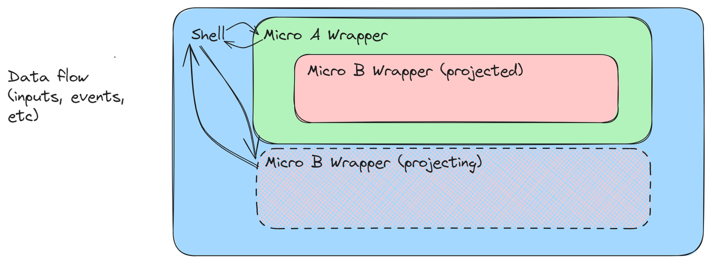
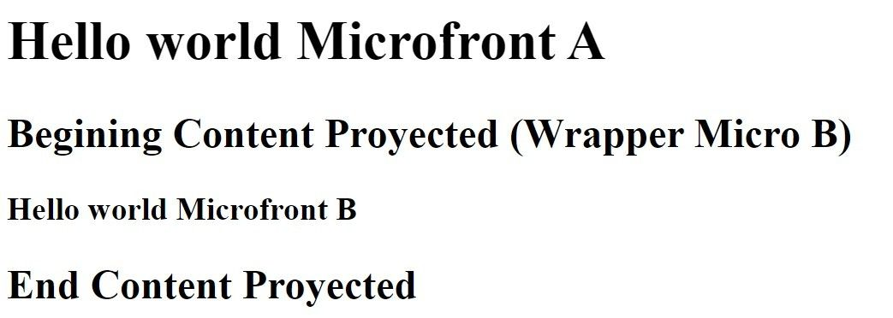

# Semantic nesting of Microfronts

{ style="display: block; margin: 0 auto;" }

The objective of this guide is to explain how a semantic nesting of Microfronts can be achieved and what are the considerations to keep in mind in such sceneario.

## What is a semantic nesting?

The most important concept to understand is: What is semantic nesting?

!!! note
    Semantic nesting means a visual nesting but not a technical one.

For example, in a website, you can see how a `Shell` invokes a `Microfront A`, and visually be able to see a `Microfront B` perfectly inside `Microfront A`, pretending that the `Microfront A` has loaded the `Microfront B`. In reality, what is happening is that `Shell` invokes both Microfronts, projecting the `Microfront B` inside the `Microfront A`. This results in the `Shell` application with two Microfronts that are just mere siblings, but seems like one is inside the other one. <!-- markdownlint-disable MD013 -->

## Main rules of semantic nesting

As said before, those Microfronts will act as siblings more than children and father, therefore, they are **Simultaneous Microfronts**. In those scenarios, we have already done a developer guide of how simultaneous Microfronts behaves. Please read carefully the following documentation in order to understand this: [Simultaneous Microfronts considerations](./simultaneous-microfronts.md).

## Note and recommended lecture before the guide

!!! note
    For this guide, we are going to explain two main tools, ng-content and slots from WebComponents. Due that both of them works in a ver similar way, ng-content is going to be used to explain the main behaviour of these tools, but, the tool that **we recommend is** `slot` as explained later.

The recommended lecture is [Angular Content Projection](https://angular.dev/guide/components/content-projection){: target="_blank"}. Explanation of the concept and usage of content projection with `ng-content`.

In the lecture the following cases can be seen:

- Projecting content from one component to another.
- Content projection through identifiers.
- Content projection enriched by ng-template.

!!! warning
    Unfortunately, the scenario in which `ng-template` and content rendering in `ng-container` are used cannot be applied with web components because the Angular context is lost, and the identification of the templates for their subsequent use cannot be performed.

## `ng-content`

### Basic usage of content projection

Let's make it so that semantically, `Microfront A` invokes `Microfront B`.

Positioning ourselves in the HTML of the `Microfront A` wrapper, within the `Shell`, we will project the `Microfront B` wrapper inside the `appComponent` from `Microfront A`.

``` html
<!-- Microfront A Wrapper HTML: Invocation the Microfront B Wrapper -->

<custom-tag-micro-a>
  <wrapper-micro-b></wrapper-micro-b>
</custom-tag-micro-a>
```

In this way, from the `Microfront A` wrapper (a `Shell` component), we are invoking `Microfront A`, but projecting the instance of `Microfront B` inside it, so that, from inside `Microfront A`, we can now display that content.

``` html
<!-- app.html of Microfront A -->

<h1>Hello world Microfront A </h1>
<h2>Begining Content Proyected (wrapper Micro B) <h2>

<ng-content></ng-content>

<h2>End Pontent Proyected</h2>
```

{ style="display: block; margin: 0 auto;" }

As we can see, visually, `Microfront B` appears inside `Microfront A`, although only semantically. These Microfronts are both children of the `Shell`, and therefore the same rules that apply to **simultaneous Microfronts** are applied to them.

### Important Consideration. The instantiation

When working with `ng-content`, there are a series of considerations to take into account.

!!! warning
    The `Microfront B` wrapper is instantiated even if `ng-content` is not available.

This is because through content projection, that content is automatically instantiated, and subsequently, it can optionally be picked up by `ng-content`. That is, we could have the `Microfront B` wrapper instantiated even if it could not be visualized.

To solve this and give control to `Microfront A` over when `Microfront B` should really be instantiated, the following solutions are proposed

- **Rendering through event**

    `Microfront A` emits an event that its wrapper listens to in order to modify the value of a flag. This flag would be used in a `ngIf` on the projected content to build and destroy the instance of the `Microfront B` wrapper on demand.

    ```html
    <!-- HTML wrapper Microfront A -->

    @if (showMicro()) {
      <custom-tag-micro-a (activeMicro)="handleShowMicro($event)" >
        <wrapper-micro-b></wrapper-micro-b>
      </custom-tag-micro-a>
    }
    ```

    ```ts
    /** Typescript wrapper Microfront A **/

    showMicro = signal(false);

    handleShowMicro(event: Event): void {
      const { detail } = <CustomEvent>event;
      this.showMicro.set(detail);
    }
    ```

- **Rendering through hook**

    The `Microfront A` wrapper passes a bound method to `Microfront A`, so it can modify the value of the flag of the projected content. `Microfront A` could then use that method to invoke `Microfront B` when it deems necessary.

    ```html
    <!-- HTML Microfront A Wrapper (Shell) -->

    @if (showMicro()) {
      <custom-tag-micro-a [toggleShowMicro]="toggleShowMicro.bind(this)" >
        <wrapper-micro-b></wrapper-micro-b>
      </custom-tag-micro-a>
    }
    ```

    ```ts
    /** Typescript Microfront A Wrapper (Shell) **/

    showMicro = signal(false);

    toggleShowMicro(): void {
      this.showMicro.set(!this.showMicro());
    }
    ```

    ```html
    <!-- HTML Microfront A -->

    <button (click)="toggleShowMicro()">Invoke Microfront B</button>
    <ng-content></ng-content>
    ```

    ```ts
    /** Typescript Microfront A **/

    @Input() toggleShowMicro!: Function;
    ```

## `slot`

### Basic usage of `slot`

`slot` are the standard way to project content. They are almost identical to ng-content, with the same passing of events, inputs, and the important consideration to have that **what is sent to the slots is instantiated directly in the same way as discussed with** `ng-content`.

```html
<!-- HTML wrapper Microfront A -->

<custom-tag-micro-a>
  <wrapper-micro-b slot="slotMicro"></wrapper-micro-b>
</custom-tag-micro-a>
```

Later, `Microfront A` can pick and show the `slot` through:

``` html
<!-- app.html of Microfront A -->

<h1>Hello world Microfront A </h1>
<h2>Begining Content Proyected (wrapper Micro B) <h2>

<slot name="slotMicro"></slot> <!-- Container of the proyected Microfront B Wrapper -->

<h2>End Pontent Proyected</h2>
```

**The last and mandatory piece**, is that the Microfront that host slots, must have its encapsulation as `ShadowDom`.

``` ts

@Component({
  selector: 'custom-tag-micro-a',
  ...
  encapsulation: ViewEncapsulation.ShadowDom
})

```

## `slot` vs `ng-content`

As mentioned previously, they really have no difference in terms of hierarchy, event emitting, and dynamic rendering. But they do have some peculiarities that make them different.

### Differences

#### Freedom to collect the projection

The biggest and most important difference is the freedom to collect the projection, which is understood as where the projected content can be displayed.

With `ng-content`, the projected content can only be received where it has been sent, that is, if we project the `Microfront B` wrapper into the `Microfront A` wrapper, then `Microfront A` `ng-content` can only be used in the App of `Microfront A`, this being the root of the Microfront.

However, with slots, they can be used anywhere in `Microfront A`, meaning that it could be projected in any component of `Microfront A`, even in a different route, regardless of the level of nesting that this component has internally.

#### Load Event

`ng-content` does not have any event to emit when content has been loaded in it, while `slot` have the [`slotchange`](https://developer.mozilla.org/en-US/docs/Web/API/HTMLSlotElement/slotchange_event){: target="_blank"} event. This event will be triggered when the content has been loaded, although this should not be used reliably to see when a Microfront has loaded, since Angular components go through different life cycles and these are not exactly coordinated with this native JavaScript event.

#### Compatibility

`ng-content` is an Angular solution, while slot are a native JavaScript solution. `slot` offer wider compatibility which aligns with the objectives of Darwin architecture about offering multitechnology.

#### Styles

There are no problems with styles in the sense that, `Microfront A`, which semantically nests `Microfront B`, does not interfere with the styles, and the same is true in the reverse direction.

There is a selector called `::slotted` that can be used to apply styles to `slot`. The problem is that it only applies directly to the invoked tag, in our case, the `Microfront B` wrapper (`wrapper-micro-b`). If you want to access child tags, you can only do so by using a wildcard `::slotted(*)`, which would apply to everything, and this is not feasible.

!!! note
    By default the styles of a Microfront are isolated, so it is not recommended trying to change them with these tools. For sharing styles the optimal solution would be sharing a library.

### The recommended solution

From the Darwin architecture, **we strongly recommend the use of** `slot` **from Web Components** for the reasons explained before.

## Conclusions

From Darwin Architecture, **we consider the semantic nesting of Microfronts to be viable**, being this the solution that should be chosen when a Microfront needs to be displayed inside another, thus avoiding the technical nesting of Microfronts and being able to maintain the Shell role as a Shell intact.

!!! warning
    When working with this feature, please keep in mind all the previous restrictions and considerations said in this documentation, being the most important one, the **instantiation** and the rules of **simultaneous Microfronts**.
