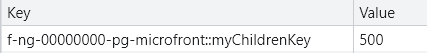

# Session storage and local storage

## Introduction

In the Microfront architecture, the use of **storage** is very sensible and risky. If a scope or namespace is not used to differentiate ownership, stability cannot be guaranteed.
Therefore, it is advised to use storage services inside [@ng-darwin/security](https://automatic-doodle-rew2y31.pages.github.io/modules/_ng-darwin_security.html){:target="_blank"} to avoid potential problems, such as key conflicts. <!-- markdownlint-disable MD013 -->

## Best Practices

Remember that the **storage usage** should be reserved for the following cases:

* **Maintaining application state**, allowing the page refresh without losing the current state.
* **Optimization**, avoiding repeated requests for no mutable data.
* **Improving user experience**, such as saving temporary forms and preventing loss of data, which can lead to user frustration.

!!! note
    In general, it is recommended to save read-only data in storage and to avoid using it as a communication channel.

## Services in Security Module

The security module of [@ng-darwin/security](https://automatic-doodle-rew2y31.pages.github.io/modules/_ng-darwin_security.html){:target="_blank"} has two services for managing storage:
one for [localStorage](https://automatic-doodle-rew2y31.pages.github.io/modules/_ng-darwin_security.html#localstorageservice-service){:target="_blank"} usage and the other for [sessionStorage](https://automatic-doodle-rew2y31.pages.github.io/modules/_ng-darwin_security.html#sessionstorageservice-service){:target="_blank"}
usage. In addition to provide some utilities, both services avoid potential conflicts with other applications by injecting a namespace into their variables and allowing only the alteration.

Those services have the following methods:

### Available methods

### length()

`get length(): number`

#### returns

The number of key/value pairs currently present for the virtual browser storage (keys starting with the prefix).

### getItem()

`getItem(key:string): any`

#### returns

The current value associated with the given key, or null if the given key does not exist in the list associated with the object. The key to be searched will be the concat of `prefix::key`.

### setItem()

`setItem(key:string, value:string): any`

Sets the value of the pair identified by key to value, creating a new key/value pair if none existed for key previously. The real key will be the concat of `prefix::key` .

!!! note
    Throws a "QuotaExceededError" DOMException exception if the new value couldn't be set. (Setting could fail if, e.g., the user has disabled storage for the site, or if the quota has been exceeded.)

#### returns

The value just set.

### removeItem()

`setItem(key:string): any`

Removes the item with the key specified. The real key will be the concat of `prefix::key` .

#### returns

The value just removed.

### clear()

`clear(): void`

Empty the virtual storage (all items of the storage with keys starting with the prefix).

### key()

`key(index:number): void`

#### returns

Returns the name of the nth key in the list without the prefix of the virtual browser storage, or null if n is greater than or equal to the number of key/value pairs in the object.

#### Example

``` ts
export class Example implements NgOnInit {
  private readonly _sessionStorage = inject(SessionStorageService);
  
  ngOnInit() {
    this._sessionStorage.setItem('mykey', 'myValue');
    this._sessionStorage.key(0); // returns 'myValue'
  }
}
```

### Set up example

In the following examples, `SessionStorageService` or `LocalStorageService` can be used interchangeably depending on the need.

!!! note
    The **storageEncode** option allows you to store values with UNICODE and/or BASE64 encoding if you want to obfuscate the information being stored. We recommend using the **NONE** option should only in development.

### NO ENCODE (by default)

```ts
// app.config.ts
// import and configure the security module via provideSecurity
export const appConfig: ApplicationConfig = {
  providers: [
    provideSecurity(
      withStaticConfig({
        ...
        storageEncode: StorageEncode.NONE, // encoding level
        ...
      }),
    ),
  ],
};

// app.ts
export class App implements OnInit {
  
  // inject service
  private readonly _sessionStorage = inject(SessionStorageService);

  exampleMethod() {
    this._sessionStorage.setItem('mykey', '10');
  }
}
```

More examples can be checked [here](https://automatic-doodle-rew2y31.pages.github.io/classes/_ng-darwin_security.SessionStorageService.html){:target="_blank"}.

## Storage Management

By default, the prefix set when using the storage services is the technical grouping id.

Assuming that the technical grouping id of my microfront is `f-ng-00000000-pg-microfront`, and given the microfront implementation below:

``` ts
private readonly _sessionStorage = inject(SessionStorageService);

override async ngOnInit(): Promise<void> {
  this._sessionStorageService.setItem('myChildrenKey', '500');
}
```

It will result in this key-value saved in the session storage:

{ style="display: block; margin: 0 auto;" }

## External Libraries

If you are using external libraries, you need to make sure that they work properly in a Microfront architecture by checking if they introduce data into local or session storage. If so, there may be problems if the library is used in another microfront.
Therefore, a previous analysis is required to verify how it works and determine if sharing is necessary and in what way.

## Global variables

Global variables that can be saved in storage should only be used by transversal pieces of architecture.

In case this type of variable is required, you should check if they can be sent through a communication channel instead of storage, as this is not their intended purpose. You can find more information about this [here](user-interface-communication.md).
