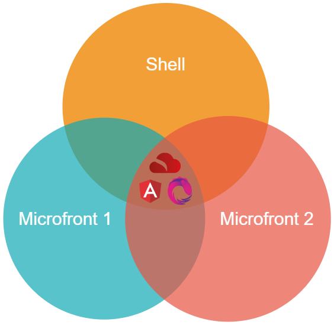
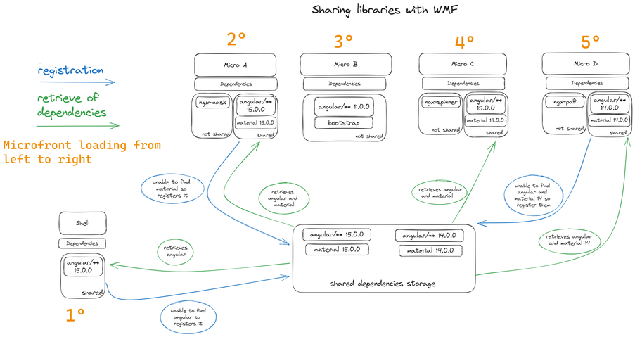

# Sharing Libraries

{ style="display: block; margin: 0 auto;" }

One of the principles when we talk about Microfronts is that they must be able to be developed and deployed independently.
Despite this independence, it is very likely that both need to use identical resources.
Therefore, if two different Microfronts need a library called _lib1_, when the distributions of each of the Microfronts are generated, each one will have this _lib1_ library in its vendor code.
When any of the Microfronts make use of this library, each one will request the one that contains its own bundle, downloading code that **could have been avoided**.

The solution to the problem is the sharing of libraries. Different Microfronts use the same library (either vendor library or custom library).
Webpack Modules Federation (WMF) allows you to easily share libraries through a series of properties and rules to configure, making use of the `shared` property of the `ModuleFederationPlugin`.

## What does it mean sharing libraries with WMF?

Sharing libraries with WMF means not downloading the same code several times when it is not necessary. WMF wraps each javascript module in a context that it can understand, giving it an identifier or name, and inside it is the code of the library itself.

When two Microfronts share a library, they will both be given the same context and therefore execute the same code.
**It must be kept in mind here that the fact how the library is developed matters**, since as both Microfronts share the context, what one does on the library can affect the other.
This can happen for example with the use of global variables within that context, or with the use of static properties in a class, or if the library itself has side effects...

Let's imagine that two microfronts share a library, and that it contains the following code:

``` ts
class MyLib {
  public prop1 = 0;
  static s_prop2 = 0;
}
```

If both Microfronts create an instance of the **MyLib** class, **the instance properties will not be shared, but the static properties will**.
If a Microfront changes the `MyLib.s_prop2` property, this value will be reflected in the other Microfront, and may have unwanted effects.
For this reason, it is very important that before sharing a library, you study how it is developed, and whether sharing it will affect or not when composing Microfronts in a Shell.

!!! warning
    **How the library is developed matters!** The fact that a Microfront in _standalone_ mode works correctly using the library does not guarantee that it will work when incorporated into a Shell where it must coexist with others.

On the other hand, when a Microfront has not configured through WMF that it wants to share a library, when generating its distribution bundle, Webpack will create an exclusive context for this library and only this Microfront will receive it.
In this case there is no problem of altering a global context, since it will only be used by this Microfront.

## How to share a library

The libraries are shared in such a way that each WMF configuration is independent, so technically:

* Each Shell can decide which of its dependency libraries wants to expose so that the Microfronts can use them.
* Each Microfront can decide which of its dependency libraries wants to expose so that other Microfronts can use them.
* It is up to each Microfront if they want to use a shared library or not.

!!! note
    It is very important the Shell and each Microfront have a clear versioning strategy when it comes to sharing. Shell should be always taken in consideration so it will determine which are the first libraries to be shared.

{ style="display: block; margin: 0 auto;" }

### Important properties of the WMF plugin

You can change the `shared` property inside the `webpack.config.js` file to config the WMF plugin.

``` js
plugins: [
  new webpack.container.ModuleFederationPlugin({
    ...
    shared: {
      '@angular/core': { requiredVersion: '~15.2.1' },
      ...
    }
  })
]
```

Shell and Microfront archetypes make use of the `requiredVersion` plugin property. This plugin has more configuration properties, but the archetypes does not make use of them. `requiredVersion` is the only property that the archytecrute team recommends.

If you want to know more about this, you can click on the links you will find at the end of this documentation.

#### `requiredVersion`

Allows to specify the required version of the of the shared module. It accepts semantic versioning. For example, `"^1.2.3"`.

### Versioning and sharing

To be able to share a library, it must first be as a dependency of the project in the _package.json_ file, and the most important thing is that **the WMF plugin references the same version of the library**.
You will have to keep in mind how it affects the **caret (`^`)** or the **tilde (`~`)** using the property `requiredVersion`.

Taking into account that a SEMVER versioning is used with `major.minor.path`_:_

* `^` WMF will look for the higher `minor` version inside the same `mayor`.
* `~` WMF will look the _higher_ `path` version inside the same `mayor.minor`.
* Fixing the WMF version will look for the exact version of the library.

### Examples

* Example where Angular `major` versions will be shared:

``` js
'@angular/animations': { requiredVersion: '^15.2.1' },
'@angular/common': { requiredVersion: '^15.2.1' },
'@angular/compiler': { requiredVersion: '^15.2.1' },
'@angular/core': { requiredVersion: '^15.2.1' },
'@angular/forms': { requiredVersion: '^15.2.1' },
'@angular/platform-browser': { requiredVersion: '^15.2.1' },
'@angular/platform-browser-dynamic': { requiredVersion: '^15.2.1' },
'@angular/router': { requiredVersion: '^15.2.1' },
```

If the Microfront has Angular dependencies with `^`, we will be allowing that if any version equal to or greater than `15.2.1` but less than 16 has previously been loaded, this will be used by our Microfront, avoiding downloading them again.

* Example where angular `minor` versions will share::

``` js
'@angular/animations': { requiredVersion: '~15.2.1' },
'@angular/common': { requiredVersion: '~15.2.1' },
'@angular/compiler': { requiredVersion: '~15.2.1' },
'@angular/core': { requiredVersion: '~15.2.1' },
'@angular/forms': { requiredVersion: '~15.2.1' },
'@angular/platform-browser': { requiredVersion: '~15.2.1' },
'@angular/platform-browser-dynamic': { requiredVersion: '~15.2.1' },
'@angular/router': { requiredVersion: '~15.2.1' },
```

If the Microfront has Angular dependencies with `~`, we will be allowing that if any version equal to or greater than `15.2.1` but less than `15.2` has been previously loaded, this will be used by our Microfront, avoiding downloading them again.

* Example where they will share the **exact** versions of angular:

``` js
'@angular/animations': { requiredVersion: '15.2.1' },
'@angular/common': { requiredVersion: '15.2.1' },
'@angular/compiler': { requiredVersion: '15.2.1' },
'@angular/core': { requiredVersion: '15.2.1' },
'@angular/forms': { requiredVersion: '15.2.1' },
'@angular/platform-browser': { requiredVersion: '15.2.1' },
'@angular/platform-browser-dynamic': { requiredVersion: '15.2.1' },
'@angular/router': { requiredVersion: '15.2.1' },
```

If the Microfront has the Angular dependencies fixed, we will be allowing that if version `15.2.1` has been previously loaded, it will be used by our Microfront, avoiding downloading them again.

### Singleton property

``` js
react: {
  requiredVersion: '17.2.0',
  singleton: true
}
```

This property allows that the version loaded, in this case `17.2.0`, to be the one that will be guaranteed for the rest of the applications that require it,
despite the fact that the version that the rest of the applications actually request does not match `17.2.0`.

Ultimately this property allows only a single version of the shared module in the shared scope.

We must keep in mind that we are used to hearing the word _singleton_ in the scope of classes, where _singleton_ means that there will only be one instance of a class.

In WMF this word _singleton_ refers to a single version of the library with a single context that covers it and that will be shared with all the applications that require it.
If the code of the library contains classes, their instantiation and that the instances are unique has nothing to do with WMF's _singleton_ property, but with how the libraries themselves are implemented.

!!! note
    The Shell and Microfront archetypes does not make use of this `singlenton` property, but a Shell applicacion could make use of it with certain types of libraries where there should only be one instance of it.

## Best practices

### Version control

Version control is a crucial aspect of managing shared libraries with Webpack Module Federation. Ensuring that all shared modules are appropriately versioned allows for better tracking, debugging, and rollbacks when necessary. The shared libraries might be consumed by multiple Microfrontends, which can be independently developed and deployed. Therefore, it is vital to establish a robust versioning strategy for the shared libraries to prevent conflicts and ensure smooth operation across different microfrontends. **A robust versioning strategy, combined with clear communication between the teams**, will mitigate potential conflicts and ensure seamless integration across different parts of the system. <!-- markdownlint-disable MD013 -->

### Compatibility testing

Compatibility testing is another essential part of managing shared libraries in a Microfrontends architecture.
While it is crucial to test each Microfrontend in standalone mode, it is equally important to test it within the context of the Shell where it will be integrated.
This dual-mode testing approach can help anticipate potential problems that might arise from version compatibility issues with the shared libraries.
Carrying out compatibility tests whenever a new version of a shared library is released or consumed would be a good practice. This includes checking for any breaking changes that could impact the microfrontend's functioning within the Shell. By this you can ensure that each Microfrontend not only works well in isolation but also seamlessly integrates into the overall application environment.

### Avoiding code duplication

Avoiding code duplication is a key best practice in the context of shared libraries with Webpack Module Federation. Leveraging the **singleton** option whenever possible can help ensure that only a single version of a shared library is loaded, thereby reducing unnecessary code duplication. However, while sharing more code can help reduce duplication, it can also lead to unused code being included.

To combat this, employing Tree Shaking techniques is highly recommended. Tree Shaking helps eliminate unused code from the final bundle, keeping it as lean and efficient as possible. This process can optimize the application's performance by reducing the size of the Javascript bundles that need to be downloaded.

## Advantages and disadvantages

### Advantages

* Less code to download, reducing the loading time of the Microfronts. By including a component in the shared _ModuleFederationPlugin_ matrix, we ensure that Microfronts share as much library code as possible.

### Disadvantages

* Unexpected sharing errors. For example, if `@angular/core` is shared and not `@angular/common`, it could happen that when a later Microfront is loaded and makes use of the previously loaded `@angular/core`,
not detecting any previously shared `@angular/common` then it uses its own, in such a way that Angular does not know how to act in the face of such cross behavior and returns an error when we initialize.
Therefore, it is recommended to share all the framework modules with the same versions.
* Depending on how a library is developed, it could be sharing more than what is intended between Microfronts, as described in the section What does it mean to share libraries in WMF?

## Additional information

[Module Federation — Sharing Vendor Code](https://medium.com/tenable-techblog/module-federation-sharing-vendor-code-1794270b21c1 "https://medium.com/tenable-techblog/module-federation-sharing-vendor-code-1794270b21c1"){: target="_blank"}

[Module Federation — Sharing Library Code](https://medium.com/tenable-techblog/7-module-federation-sharing-library-code-759ae98f7fc8 "https://medium.com/tenable-techblog/7-module-federation-sharing-library-code-759ae98f7fc8"){: target="_blank"}

[How to Build a Micro Frontend with Webpack's Module Federation Plugin](https://dev.to/bitovi/how-to-build-a-micro-frontend-with-webpacks-module-federation-plugin-n41 "https://dev.to/bitovi/how-to-build-a-micro-frontend-with-webpacks-module-federation-plugin-n41"){: target="_blank"}
