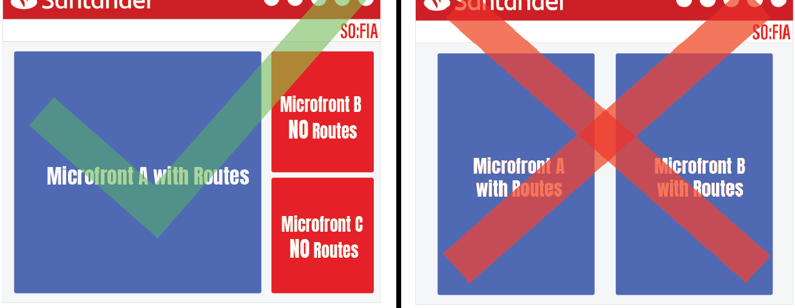
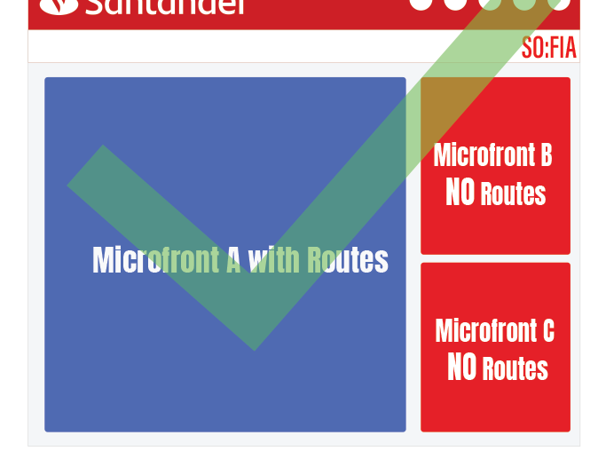
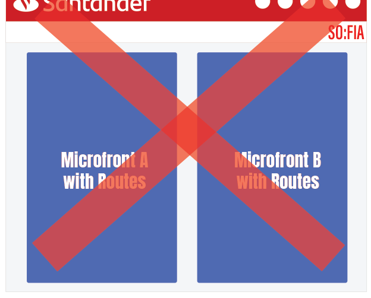

# Simultaneous Microfronts

{ style="display: block; margin: 0 auto;" }

The objective of this guide is to explain what are the **do's** and **dont's** of invoking multiple Microfronts at the same time.

## Microfronts combinations

It is important to understand what types of Microfronts a Shell application can render simultaneously, because in some cases, there will be restrictions to avoid possible coexistence problems.

From architecture team we have reached some conclusions working with more than a Microfront simultaneously, what is **viable** and what is **not viable**. We will explain these restrictions in this user guide.

!!! note
    In order to work with simultaneously Microfronts, each Microfront wrapper has to be invoked, meaning, in a Component that extends from [MicrofrontContainerDirective](../ng-darwin-wmf/v20/api-reference/microfrontcontainerdirective.md). It is **NOT POSSIBLE** to invoke two or more Microfronts from only one wrapper. After that a normal Shell Component must invoke the wrappers desired. <!-- markdownlint-disable MD013 -->

| Microfront types | Description |
|---|---|
| { style="width: 50%" } | Microfronts that don't use the Angular router and they don't use any route in the location bar of the browser. |
| { style="width: 50%" } | Microfronts that use the Angular router and have their own routes, and therefore they use the location bar of the browser. |

### Microfronts with no routes

!!! note
    This combination is viable.

Two or more Microfronts can live at the same time if none of them have any route configured.

### One Microfront with routes and the others with no routes

!!! note
    This combination is viable.

If only one Microfront have a configured router, all of them can live at the same time and they would not disturb each other.

{ style="display: block; margin: 0 auto; width:50%" }

### Two or more Microfronts with routes

!!! warning
    This combination is not viable.

If more than one Microfront has the router configured, they will fight for the URL of the browser navigation bar. Conflicts can arise and be caothic, causing the URL to not represent what it is being showed in the user screen.

{ style="display: block; margin: 0 auto; width: 50%" }

## Special combination

### Same Microfront more than once at the same time

This combination behaves like a normal Angular component when it is instantiated more than once at the same time, meaning:

- The class properties are not shared, neither the @Input or @Output and they will work as expected.
- The dependencies of that component like the providers are shared, meaning if the Microfront is invoked two times, **those two Microfront have the same instance for the inyected class**.
- Due to the previous point, unexpected behaviours may arise. The most obvious is **if the Microfront has routing, it will not work at all**.
- The Darwin libraries will work as expected, but with only the exception of the **local and session storage** use. The Darwin Security library of a Microfront, use a prefix to saved the data in the browser storage to not override the information between different Microfronts. In this special combination this prefix would be the same and conflicts will arise between both instances.

!!! note
    Therefore **the same restrictions of invoking an standard Angular component more than once in the same time should be considered**, meaning that if sharing classes dependencies is not a problem, two identical Microfront could be invoked at the same time.

!!! warning
    A Microfront invoked multiple times at the same times **should never have routing**.

## Extra consideration

### Named router outlet

Angular router have a feature called *named router outlet*. With this feature, a Microfront could have their routes without the risk of other Microfront with the same routes names getting triggered.

After investigating this possible solution in all the scenarios, the conclusion is that it could technically works and the Microfront routes would be protected from being triggered by other Microfronts but, the URL would be a mess and it would not canonically represent the current state of the application.

!!! warning
    The outlet names must not be used to have multiple Microfronts with routing at the same time.
