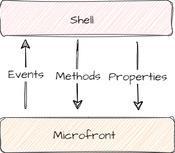
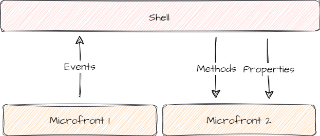

# User Interface Communication

## Introduction

In this user guide the different recommended ways for the communication in a Microfronts Architecture will be exposed, and also, the common events with small code snippets.

To avoid coupling between applications, to implement any communication between microfronts in a **direct way is not recommended**.

Communication should be seen as an API that is exposed in the Microfront and that will be consumed only by the containing application.

{ style="display: block; margin: 0 auto;" }

## Shell → Microfront

Downstream communication, from a Shell application to a Microfront.

### Properties approach

Identically to a native web components or framework componest. If you have some properties to modify functionality, these properties can be modified in real time to see your changes reflected inside the Microfront.

It is necessary to declare these properties in the Microfront.
They must be declared in the **main angular component of the Microfront**, which will be encapsulated in an [angular element](https://angular.dev/guide/elements){: target="_blank"} (native Web Component).

``` ts
// Microfront
export class App extends MicrofrontDirective {
  @Input() title!: string;
}
```

After declaring them, the properties can be used from their container (Shell).

```html
<!-- Shell -->
<microfront-component-tag
  title="Hello world!"
></microfront-component-tag>
```

!!! note
    The properties have no type limitation, they can be literals, numbers, objects, etc.

### Methods approach

If you need a more complex logic, then you can use the public methods. With this way you will be able to launch certain functionality from the containing application, as you would do with a native Web Component.

The public method must be created in the **main angular component of the Microfront**, which will be encapsulated in an [angular element](https://angular.dev/guide/elements){: target="_blank"}.

The method has to be an [arrow function](https://developer.mozilla.org/en-US/docs/Web/JavaScript/Reference/Functions/Arrow_functions){: target="_blank"} property with the `@Input` Angular decorator (essential to make use of the context).

```ts
// Microfront
export class App extends MicrofrontDirective {
  @Input()
  refresh = () => {
    // method functionality
  }
}
```

It may be necessary to call detectChanges manually to see the changes reflected in the microfront, since the method will be executed outside the Angular context of the Microfront.

```ts
// Microfront
export class App extends MicrofrontDirective {

  private readonly _ref = inject(ChangeDetectorRef);

  @Input()
  refresh = () => {
    // method functionality
    this.ref.detectChanges();
  }
}
```

As with the properties, the method will be used from its container (Shell).

```ts
// Shell Component
@Component({
  template: `
    <mcf-component-tag #microfrontRef></mcf-component-tag>
  `,
})
export class MicrofrontWrapper extends MicrofrontContainerDirective {  
  refreshMicrofrontComponent() {
    this.microfrontRef().nativeElement.refresh();
  }
}
```

## Microfront → Shell

Upstream communication, from a Microfront to a Shell application.

### Custom events approach

Natively [DOM elements can emit and listen to events](https://developer.mozilla.org/en-US/docs/Web/API/EventTarget){: target="_blank"}.
It is as simple as emitting an event from the Microfront and listen to it from a higher DOM element, in this case the Shell application.

**It is recommended to emit only from the main angular component of the Microfront**. This way will be easier to know what API the Microfront has and it will result in a cleaner and clearer code.

If you need to emit events from other points of the Microfront, you can always make use of an Angular service provider to communicate the components of your own Microfront application, to finally emit the event from the main component.

The following example is performed from the main angular component, so that the @Output decorator can be used to emit custom events:

```ts
// Microfront
@Component({
  template: `
    <button (click)="onClick()">Microfront button</button>
  `,
})
export class App extends MicrofrontDirective {
  @Output() mcfEvent = new EventEmitter();

  onClick() {
    this.mcfEvent.emmit('Hello world from Microfront!');
  }
}
```

Just like any other native event, you must listen to the event and use a callback to do the logic you want. The type of the received event will be CustomEvent, so the parameters can be obtained from its detail.

```ts
// Shell
@Component({
  template: `
    <mcf-component-tag
      (mcfEvent)="myFunction($event)"
    ></mcf-component-tag>
  `,
})
export class MicrofrontWrapper extends MicrofrontContainerDirective {
  myFunction(event) {
    console.log(event.detail);
  }
}
```

## Microfront → Microfront

In order to be able to communicate between Microfronts, it is recommended to use the two previous flows, thus guaranteeing the independence of the Microfronts.

{ style="display: block; margin: 0 auto;" }

For more complex communication cases, there is also the possibility of using the [externalNavigate](navigation-outside-the-microfront.md) event, which allows navigating from one microfront to another by incorporating return logic and properties.

This allows us not to have to make modifications in the Shell as long as its implementation is contemplated.
