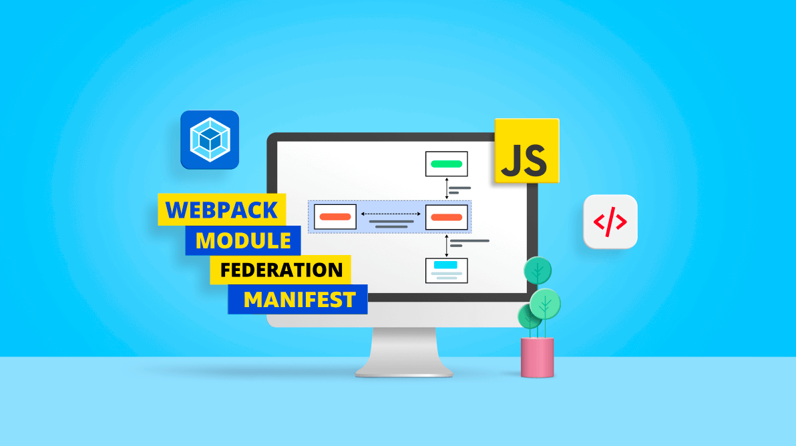
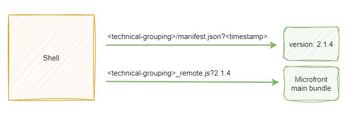

# Webpack Configuration for Module Federation

{ style="display: block; margin: 0 auto;" }

Webpack is a code bundler with a multitude of plugins, which allows to execute various tasks in the compilation process, either with transpilation processes, minimized, optimization, assets, JavaScript, HTML etc.

* The **Shell** archetype use two plugins, **Manifest** and **Module Federation**.
* The **Microfront** archetype use **Module Federation** plugin.

## Plugins

### Module Federation Plugin

In a Microfronts architecture there is no longer a monolithic web, with its dependencies shared by its functionalities to a lot of small applications,
which will also have their dependencies, in many cases they will be the same, this derives in a high cost of performance.

This plugin allows to have separate builds that should form a single application. These separate builds act like containers and can expose and consume code between builds, creating a single unified application.

We will use this plugin to expose the Microfront bundles, their libraries and also determine a sharing strategy.

### Manifest Plugin

It is incorporated only in the Microfront archetype.
This plugin will always be launched at the beginning of the compilation, it will look for the Microfront version in the `package.json` file and **will create or update** a `manifest.json` file in the root of the project.

Generating a base like the following:

``` json
{
  "santander": {
    "version": "x.x.x"
  }
}
```

By default this file is exposed in the `angular.json` configuration along with the assets.

``` json
{
  "architect": {
    "build": {
      "options": {
        "assets": [
          {
            "glob": "manifest.json",
            "input": "",
            "output": "<technical-grouping>"
          }
        ],
```

!!! note
    Including the technical grouping in `output` property is mandatory to be able to identify the Microfront when it is integrated.

The purpose of generating the `manifest.json` file is to allow the Shell to check the Microfront version. This file will be used by the Shell when it requests the Microfront to load.
First of all the manifest file will be obtained, where the Microfront version will be informed and then the main `<technical-grouping>_remote_entry.js` file will be requested, using the version as a parameter to override the cache if necessary.

{ style="display: block; margin: 0 auto;" }

## Archetypes

### Shell configuration

The Shell application only makes use of the Module Federation plugin, since it is not required to expose it as a Microfront. The Shell should only configured the sharing of libraries so that the Microfronts that loads later can make use of them.

!!! note
    Keep in mind that the Shell will always be the first application to register its libraries to be shared, so it will normally set the guidelines on which versions will be used.
    [Learn more about sharing libraries](sharing-libraries.md) and the important key roles it plays in the configuration of the architecture.

### Microfront configuration

Let's check all the **properties** that are part of the configuration:

#### `experiments`

Enables new webpack features, it is used to enable the `outputModule` option, which allows the exposition of bundles in JavaScript modules.

`experiments: { outputModule: true, }`

#### `optimization`

This option adds more optimization features to help reduce the compilation size. It is used to disable the `runtimeChunk` option, preventing extra chunks from being generated, essential for Module Federation compatibility.

``` js
optimization: {
  runtimeChunk: false
}
```

#### `output`

Allows to set a public path and a unique name for the compilation. It must always have the following two properties:

* `chunkFilename` with the value `<technical-grouping>-[name].[contenthash].js`, indicating the name that the libraries will have when exposed.
* `uniqueName` with the value `<technical-grouping>`, it's used to prevent source file path collisions in sourcemaps when loading multiple libraries built with webpack.

``` js
output: {
  chunkFilename: '<technical-grouping>-[name].[contenthash].js',
  uniqueName: '<technical-grouping>'
}
```

!!! warning
    Please note that using the `<technical-grouping>` is mandatory in both properties above.

#### plugins

The configuration of all plugins to be used with Webpack is determined by this property. The two plugins mentioned above are configured by default.

!!! note
    The Microfront archetype will come with all the necessary dependencies out the box, but you must always check the current strategy of sharing libraries.

##### Manifest plugin

It will only be necessary to indicate the path where the file is to be generated. It must always be the root of the project.

``` js
plugins: [
  new McfManifestPlugin({
    root: __dirname
  })
]
```

##### Module Federation plugin

It must always have the configuration generated by the archetype except for the `shared` property, which can be adapted to the requered strategy.

!!! info
    Please read the following documentation to [learn more about sharing libraries](sharing-libraries.md) and the important key roles it plays in the configuration of the architecture.

```js
plugins: [
  new webpack.container.ModuleFederationPlugin({
    name: '<technical-grouping>',
    filename: '<technical-grouping>_remote_entry.js',
    library: {
      type: 'module'
    },
    exposes: {
      './web-components': './src/bootstrap-mfe'
    },
    shared: {
      ...
    }
  })
]
```

`name` is the unique name for the exposed container.
Module Federation uses the [ContainerPlugin](https://webpack.js.org/concepts/module-federation/#containerplugin-low-level){: target="_blank"} and when it is initialized, the name entered will be used as the file name for the container's relative path.

`filename` is used to specify the file name for the output bundle that also serves as an entry point to the bundle.

`library` helps determine how the exposed code will be stored and retrieved.

`exposes` is the path to the module or files exposed by the container.

`shared` allows sharing the node libraries on which the exposed module depends to run. Most documentation about this property [here](sharing-libraries.md).
