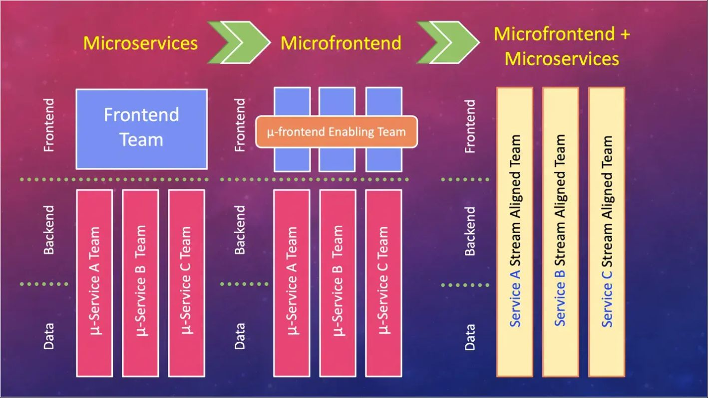
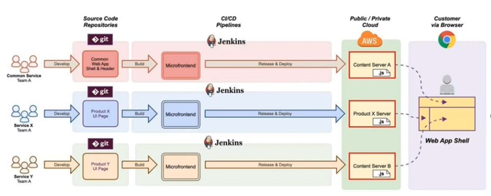
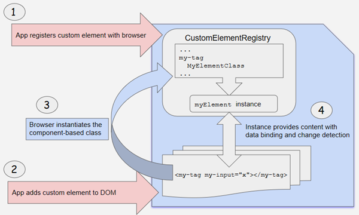
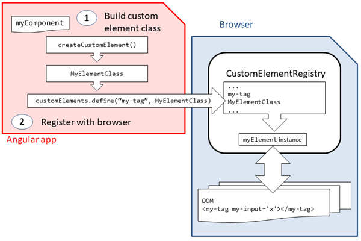
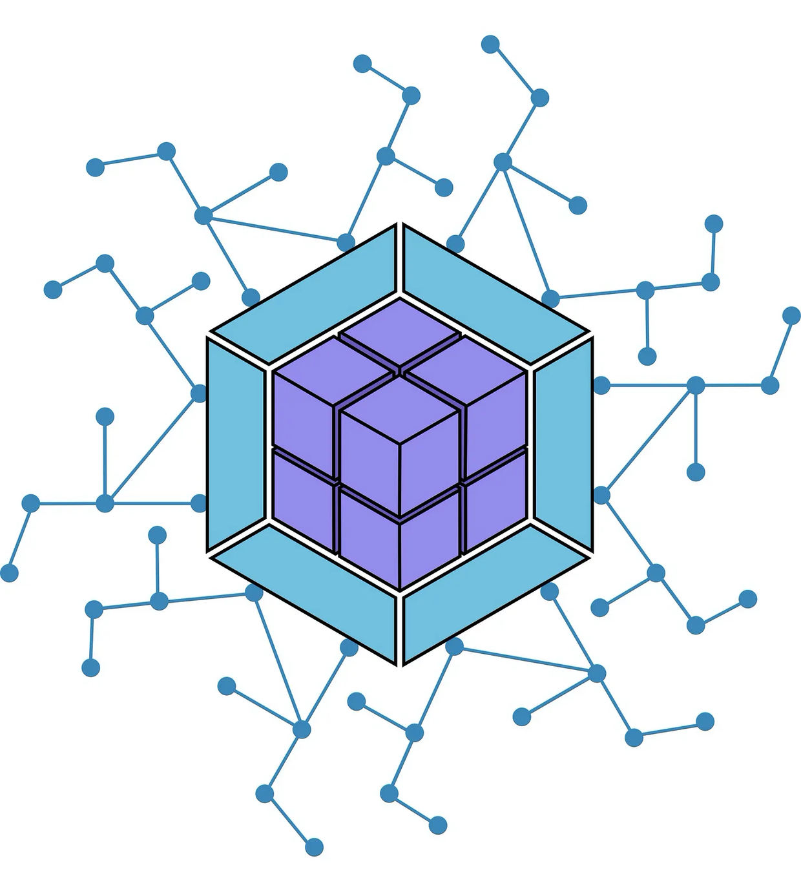
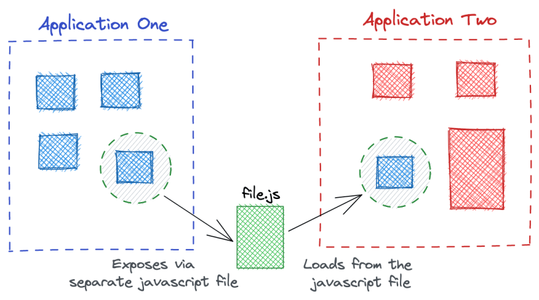
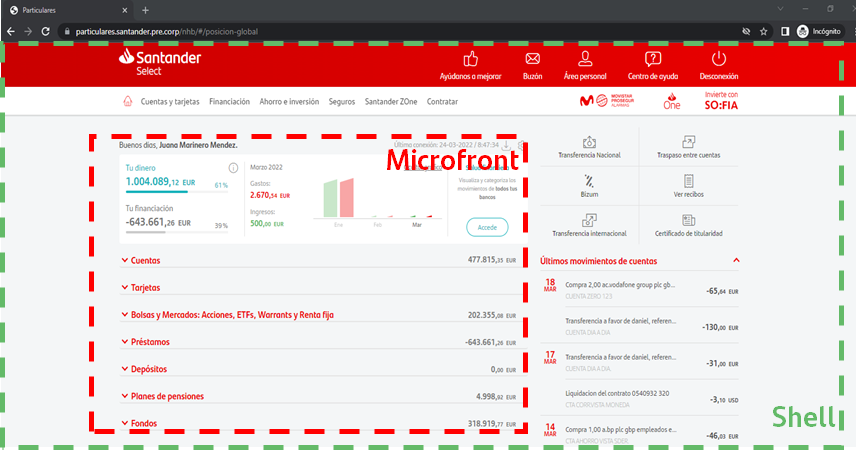
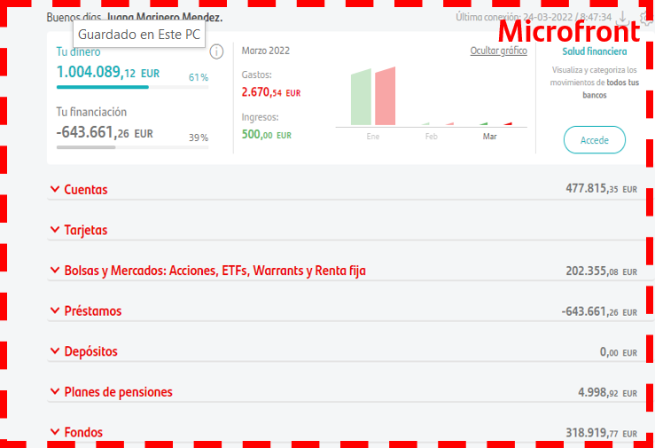

# Microfrontend ecosystem

The Microfront term extends the concept of microservices to the world of the frontend. Over time, a Single Page Application grows larger and it is more difficult to maintain. That is what we call a Monolithic Interface.

The idea behind Microfronteds is to think of a application as a composition of features that are owned by independent teams.
Each team has a defined business area or mission that it cares about and specializes in. A team develops its features end-to-end, from database to the user interface.

{ style="display: block; margin: 0 auto" }

The main benefits of a Microfrontend architecture are:

* **Smaller, cohesive and maintainable code bases with no sharing and conflicts.**

The source code for each individual microfrontend will, by definition, be much smaller than the source code for a single monolithic frontend.
These smaller codebases tends to be simpler and easier for developers to work with. In particular, we avoid complexity between components that should not know each other.

* **Independent deployments on the team’s own schedule**

Regardless of how or where your UI code is hosted, each UI should have its own CI CD pipeline, which builds, tests, and deploys it to production.

* **Increase autonomy of independent teams with a end-to-end autonomy within a business domain.**

By having the code and our pipeline decoupled, we are able to have totally independent teams, which can have a section of a product from its inception to production.
Teams can own everything they need to deliver value to customers, allowing them to move quickly and effectively. For this to work, our teams need to be built around verticals of business functionalities, rather than around technical capabilities.
An easy way to do this is to divide the product based on what end users will see.

Other advantages a Microfrontend architecture can help address in an organization:

* Architecture that enables and encourage fast flow within each team.
* Produce architectures software systems that are sustainable over time.
* Increase the lifetime of legacy web applications without the need to rewrite everything upon integration.
* Allow new frontend framework to coexist with on the old/legacy web application.
* Increase autonomy of independent teams with a end-to-end autonomy within a business domain.
* Decouples development dependency.
* Operational responsible.
* Can easily scale the development of web apps horizontally with multiple teams engaging frontend work concurrently.

{ style="display: block; margin: 0 auto" }

There are two main technologies that allow us to development a Microfrontend architecture:

* **Web Components**
* **Webpack Module Federation**

## Web Components with Angular Elements

With [Custom Elements](https://html.spec.whatwg.org/multipage/scripting.html#custom-elements "https://html.spec.whatwg.org/multipage/scripting.html#custom-elements"),
web developers can **create new HTML tags**, beef-up existing HTML tags, or extend the components other developers have authored. The API is the foundation of [Web Components](http://webcomponents.org/ "http://webcomponents.org/").
It brings a web standards-based way to create reusable components using nothing more than vanilla JS/HTML/CSS.

**Example**. Defining a drawer panel, `<app-drawer>`:

``` TS
class AppDrawer extends HTMLElement {...}
window.customElements.define('app-drawer', AppDrawer);

// Or use an anonymous class if you don't want a named constructor in current scope.
window.customElements.define('app-drawer', class extends HTMLElement {...});
```

**Example usage:**

```html
<app-drawer></app-drawer>
```

In our architecture a Microfront will be a Custom Element. It will not be necessary to learn the standard way to develop a Custom Element, since currently,
the main framework we work with is Angular, and it provides a way to convert the Angular components into Custom Elements. This technology we will leverage is called [Angular Elements](https://angular.io/guide/elements "https://angular.io/guide/elements").

Therefore, an Angular Element is nothing more than a Custom Element developed in Angular, and where we can take advantage of using all the benefits of this framework, such as dependency injection for example.

{ style="display: block; margin: 0 auto" }
{ style="display: block; margin: 0 auto" }

**Angular Element example:**

``` TS
@Component({
  selector: 'my-popup',
  template: `...`,
  styles: [`...`]
})
export class Popup {
}

@Component({
  selector: 'app-root',
  template: `...`,
})
export class App {
  constructor(injector: Injector) {
    // Convert `Popup` to a custom element.
    const PopupElement = createCustomElement(Popup, {injector});
    // Register the custom element with the browser.
    customElements.define('popup-element', PopupElement);
  }
}
```

## Webpack Module Federation

**Webpack Module Federation (WMF) is a feature that enables loading separately compiled applications at runtime and allows sharing of common dependencies.**
With the wide array of benefits and runtime integration ability, Module Federation is a great feature for Microfrontends architectures.
{ style="display: block; margin: 0 auto; width: 25%" }

WMF is not a framework. It’s a JavaScript architecture and **plugin** added to Webpack. So there is no dependency on a particular framework and provides complete flexibility in development.
It also happens at runtime so there is no overhead involved in the build process.

It has many advantages such as:

* Independent development by teams and dynamically import code from other applications at runtime. End results feels like an SPA.
* Independent testing and deployment/release strategies.
* Smaller and optimised bundle size of each micro app as shared components and dependencies that are loaded only when its required.
* Each of the micro app can choose their own tech stack and not bound by a particular framework. Although for now the only available framework is Angular.

{ style="display: block; margin: 0 auto; width: 60%" }

Following are some important terms you may need to familiarize yourself with when using this architecture:

* **Shell:** The host application contains typical features from a SPA application that boots and renders the components the user would see first. It can consume remote applications.
* **Microfront:** The remote application is another Webpack build. It is a SPA and its major functionality is to create a Custom Element to be consumed by the Shell.

The code is downloaded during run time. If a Shell dependency has been shared between the Microfrontends then the same is used.
If any dependency is missing then the Microfrontend application downloads it. This leads to less duplication and smaller bundle size.

## Shell Application

A Shell application is a typical Single Page Application that may or may not contain functionality requirements like any monolithic application, but with the peculiarity that it will also contain the Microfront apps.

It will be in charge of providing to the Microfronts certain characteristics necessary for them, such a:

* A security token management.
* The channel where the Microfront lives at runtime.
* The language (i18n and i11n).
* To share, thanks to WMF, a set of libraries with a specific version, such as the Angular framework among others, and the possibility that Microfront will use it if it is compatible.

{ style="display: block; margin: 0 auto" }

## Microfront Application

A Microfront application is a Single Page application that will contain any specific functionality requirements and it will live inside a Shell application.

A Microfront **is not in charge** of the management of the security token, the language or the channel where is running. It only use those main properties if necessary.

A Microfront must be self-contained and have everything it needs to run, but if possible, it must use the federated libraries. Just like it should federate its libraries so another Microfront can consume them.

{ style="display: block; margin: 0 auto" }
