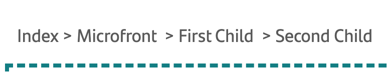

# `MicrofrontDirective`

This directive should be used in the main component of a Microfront. It will help with the standardization of events, input properties and possible routing problems.

## Input Properties

These properties are reported from the context in which the Microfront is used, such as a shell. They should be used as properties of a web component.

``` html
<microfront-tag [property]="property"></microfront-tag>
```

| Property | Description |
|---|---|
| `mountPath`: `string` | Microfront mounting path. |
| `returnTo`: [`MicrofrontNavigationTarget`](./types/microfrontnavigationtarget.md) | Optional The microfront could receive a route or projectId for returning later. Only used as a way to store this information. |

## Input Methods

### `navigateTo()`

This method performs navigation by concatenating the mount path and the path.

For example, if the Microfront is being mounted on the route `http://localhost:4200/relative/path/microfront-a` and wants to go on the route `first-child` from Microfront. It will only be necessary to execute the following line:

``` ts
this.navigateTo('first-child');
```

## Methods

### `ngOnInit()`

> This method should only be called directly in case it is necessary to overwrite it.

``` ts
override async ngOnInit(): Promise<void>
```

[ngOnInit](https://angular.io/api/core/OnInit) Angular lifecycle hook.

It is responsible for initializing the Microfront navigation and emitting the mounting path through the [MounPathService](mountpathservice.md).

### `ngOnDestroy()`

This method should only be called directly in case it is necessary to overwrite it.

[ngOnDestroy](https://angular.io/api/core/OnDestroy) Angular lifecycle hook.

This method should only be called directly in case it is necessary to overwrite it.

Currently the directive has only two methods, `ngOnInit` and `ngOnDestroy`. Both are used to take advantage of the Angular lifecycle but should only be called directly in case they need to be overwritten.

## Output Events

These events work internally in the Microfront exactly like the Angular [Output](https://angular.io/api/core/Output) events.

``` ts
this.eventName.emit();
```

These events are exposed as native events of the web component that represents the Microfront, therefore they can be captured as any other native event.

``` html
<microfront-tag (eventName)="handler($event)"></microfront-tag>
```

### `initialize`

Will indicate the initialization of the Microfront.

``` ts
this.initialize.emit();
```

### `destroy`

Will indicate the end of the Microfront.

``` ts
this.destroy.emit();
```

### `error`

Indicates that an uncontrolled error has occurred.

``` ts
this.error.emit();
```

### `externalNavigate`

Request for Shell application navigation.

| Parameter                               | Description                                                                                                                                                                                                                                                                                                                                               |
| --------------------------------------- | --------------------------------------------------------------------------------------------------------------------------------------------------------------------------------------------------------------------------------------------------------------------------------------------------------------------------------------------------------- |
| `path`: `string | MicrofrontNavigation` | If `string`, it indicates the path the shell should navigate to. Can be a Microfront route assigned in the shell routing or the microfront project identifier where is going to be navigated. If `MicrofrontNavigation`, can achieve the same about the navigation but can carry extra information as queryParams, props, where shouldReturn to and more. |

!!! note
    By default externalNavigate should be handled by the public method `navigate` of the `MicrofrontContainerDirective`.

For example, if a Microfront wants to navigate to the`/home` path of the shell. Then, the Microfront wrapper takes care of the event.

``` ts
this.externalNavigate.emit('home');
```

!!! note
    This event requires to be implemented in the shell.

``` ts
// Shell example implementation
<microfront-tag (externalNavigate)="handler($event)"></microfront-tag>

handler(event) {
  const { detail } = event as CustomEvent;
  this.router.navigate([detail]);
}
```

Another example, the Microfront **ng13** navigate to Microfront **ng13b** passing some queryParams and the Microfront wrapper uses the the method `navigate`:

``` ts
// Microfront implementation
const payload: Map<string, string> = new Map();
payload.set('mifitMode', 'client');
const microfrontNavigation: MicrofrontNavigation = {
  to: { target: 'f-ng-00000000-pg-microfront-b' },
  queryParams: payload
};
this.externalNavigate.emit(microfrontNavigation);
```

``` ts
// Shell implementation
<f-ng-00000000-pg-microfront
  #microfrontRef
  *ngIf="isLoaded"
  (breadcrumb)="changeBreadcrumb($event)"
  (externalNavigate)="navigate($event)"
  [mountPath]="mountPath" >
</f-ng-00000000-pg-microfront>
```

### `breadcrumb`

This event will indicate the Microfront crumb path for the Shell.

| Parameter | Description |
|---|---|
| `breadcrumbLinks`: `BreadcrumbLink[]` | It will be an array with the necessary data so that they can render the breadcrumb from any context and call our [`navigateTo`](./microfrontdirective.md#navigateto) if necessary. |

Let's imagine that we have a Shell that has a `/home` path and another `/microfront` where it mounts a Microfront with the following child paths: /first-child/second-child/third-child. All three would be accessible.

In the Shell you will need to render something similar to this.

{ style="display: block; margin: 0 auto; width: 50%" }

This would be an example of what would need to be issued to render it.

``` ts
this.breadcrumb.emit([
  {
    title: 'Microfront',
    path: ''
  }
  {
    title: 'First Child',
    path: 'first-child'
  },
  {
    title: 'Second Child',
    path: 'first-child/second-child'
  },
  {
    title: 'Third Child'
    // If the `path` is not defined, this breadcrumb should not be clickable
  }
]);
```

!!! note
    This event requires to have been implemented in the shell.

For a full example, [check this section](./types/breadcrumblink.md).

## Usage Notes

``` ts
export class ExampleComponent extends MicrofrontDirective {
  private _securityLiteService = inject(SecurityLiteService);

  override async ngOnInit(): Promise<void> {
    await super.ngOnInit();
    await this._securityLiteService.initialize();
    ...
    this.initialize.emit();
  }

  override ngOnDestroy(): void {
    super.ngOnDestroy();
    ...
    this.destroy.emit();
  }
}
```
