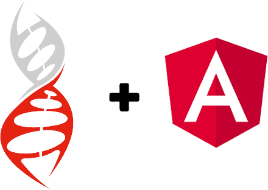

{ style="display: block; margin: 0 auto"; width: 50%; }

# @ng-darwin

**NgDarwin** is a library developed in Angular ready to be used in projects that exclusively use this framework.
It's composed of a series of independent modules that offer a series of specific functionalities that will facilitate front-end development within the Darwin world.

## Advantages

- **NgDarwin** manages the user's session lifetime, based on the user's activity, taking the developers out of this task and allowing them to focus on business development.
The library is able to detect when the user stops making mouse movements or keyboard presses to trigger events that can be captured and acted consequently.
- It automates security token management. The use of _backend_ services requires this type of security.
**NgDarwin** is able to manage this token; retrieve it, attach it to service requests, refresh it when necessary, and delete it when the session has expired, either due to a _timeout_ or because the developer has so decided.
- It automates the application traceability, through the management of a series of headers that it adds in the requests to all _backend_ services.
- It offers a module for error tracing and its exploitation in the [Kibana](https://www.elastic.co/es/kibana) tool.
Any application requiring this type of service will be able to send traces with a series of information automatically attached, such as operating system, browser and version used, screen resolution, etc.
- It offers a module that allows you to configure the application in a different way per environment without having to recompile and deploy again.
Nobody wants to call production backend services, while you are testing your application in a development environment. That's what this module is very useful for.
- **NgDarwin** also offers a number of extra injectable services that developers can use, which will facilitate the development of their applications. These services are described in the technical documentation.
- A CLI (Command Line Interface) is provided to help you create and configure your application from the ground up.

# Angular Framework

[Angular](https://angular.io/) is a powerful _opensource framework_ developed and maintained by Google.
It has been created to facilitate the development of SPA (Single Page Application) applications, with a clear goal of increasing browser based applications, and making their development and testing easier.
Given its wide use in the frontend development world, Darwin is offered with this flavor.

## Cross Platform

| Progressive Web Apps | Native | Desktop |
|---|---|---|
| Use modern web platform capabilities to deliver app-like experiences. High performance, offline, and zero-step installation. | Build native mobile apps with strategies from Cordova, Ionic, or NativeScript. | Create desktop-installed apps across Mac, Windows, and Linux using the same Angular methods you've learned for the web plus the ability to access native OS APIs. |

## Speed And Performance

| Code Generation | Universal | Code Splitting |
|---|---|---|
| Angular turns your templates into code that's highly optimized for today's JavaScript virtual machines, giving you all the benefits of hand-written code with the productivity of a framework. | Serve the first view of your application on Node.js®, .NET, PHP, and other servers for near-instant rendering in just HTML and CSS. Also paves the way for sites that optimize for SEO. | Angular apps load quickly with the new Component Router, which delivers automatic code-splitting so users only load code required to render the view they request. |

## Productivity

| Templates | Angular CLI | IDEs |
|---|---|---|
| Quickly create UI views with simple and powerful template syntax. | Command line tools: start building fast, add components and tests, then instantly deploy. | Get intelligent code completion, instant errors, and other feedback in popular editors and IDEs. |

## Full Development Story

| Testing | Animation | Accessibility |
|---|---|---|
| With Karma for unit tests, you can know if you've broken things every time you save. And Protractor makes your scenario tests run faster and in a stable manner. | Create high-performance, complex choreographies and animation timelines with very little code through Angular's intuitive API. | Create accessible applications with ARIA-enabled components, developer guides, and built-in a11y test infrastructure. |
