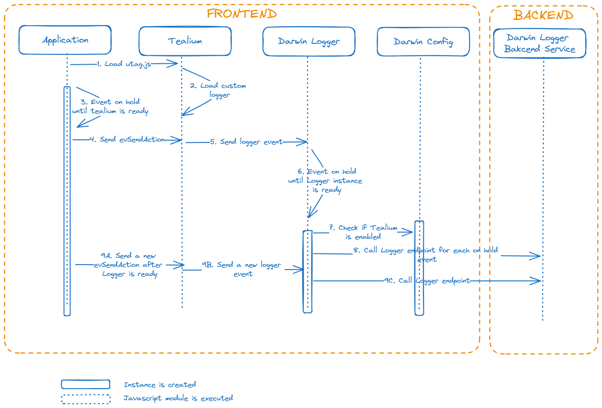

# Tealium Integration

!!! warning
    This section is a draft of the beta version. Please note that the content here is subject to change, and it may not represent the final version. Use with caution.

## Why is this feature needed?

An application that uses Tealium sends trace logs using the Tealium API, but stores the data in third-party applications, such as [Google Analytics](https://marketingplatform.google.com/intl/es/about/analytics/){:target="_blank"}.
The problem with this approach is that the data is not available to be read in real-time.

To address this issue, projects commonly sends trace activity logs using the programmatic [logCustomActivity](https://automatic-doodle-rew2y31.pages.github.io/modules/_ng-darwin_logger.html#logcustomeractivity-method){:target="_blank"} method from the `ng-darwin` library. <!-- markdownlint-disable MD013 -->

However, this approach requires explicit calls in the application code. This underscores the importance of integrating Tealium with the Darwin Logger.
In this setup, applications make calls to Tealium, and subsequently, Tealium takes on the resposability of communicating with the Darwin Logger and take advantage of the real time.

## Overview

The application takes responsibility for loading the Tealium footprint. Once loaded, this footprint will proceed to load the custom logger integration.
When Tealium events are dispatched this custom logger piece will be in charge of passing these events to Darwin Logger. Whenever Tealium is activated in Darwin Logger configuration, these events will be listened and logged.

Let's now look at the function of each of the actors involved:

- Application: Responsible for loading the Tealium script and dispatching events to Tealium on demand (programmatically).
- Tealium: Responsible for triggering events and loading the custom logger integration which has to be configured in the associated Tealium instance and is in charge of managing the communication with Darwin Logger.
- Darwin Logger: In charge of receiving events from Tealium and calling the corresponding endpoint of the API exposed in the backend.
- Darwin Config: It will be necessary to communicate via configuration if Tealium is enabled or not.
- Darwin Logger Backend: This is the service that will receive the requests from the frontend and store them.

## How it works

We will now take a step-by-step look at how it works, supported by a sequence diagram to clarify the process.



1. App loads the Tealium footprint `utag.js`, which ends up being a javascript code that is loaded asynchronously in the `<head>`.
2. Tealium loads the custom logger integration into its environment.
3. In the meantime, if the application is initialising and sending events, it has to keep them waiting until Tealium is ready.
4. The application sends an `evSendAction` event to Tealium.
5. Tealium sends an event to Darwin Logger.
6. Until the Darwin `Logger` instance is initialised, it will hold the incoming events.
7. Once the instance is initialised, it checks if Tealium is enabled.
8. If it is enabled, it makes a request to the Darwin Logger backend service for each event that was waiting.
9. From this point on, each new `evSendAction` event sent by the application, Darwin `Logger` will directly call the backend service.

## Characteristics

### Decoupling of applications with Darwin `Logger`

As mentioned above, this is the immediate need covered by this integration. The application only has to inform Tealium and Tealium is responsible for knowing what to do with the information.
In this case, it sends an event with the information, but it may have other providers and perform other additional tasks.

### Waiting mechanisms

Due to the asynchronous nature of library loading, as shown in the diagram, we need two specific mechanisms to ensure that we don't miss any events:

- The application must wait for Tealium to be ready before sending events.
- Whenever Tealium is active, the events dispatched before the instance of Darwin `Logger` has been created must wait to be logged.

## How to integrate

### Enabling Tealium in the configuration

You need to enable the `tealium` flag in the configuration by setting it to `true`:

```json
{
  "appKey": "appKey",
  "appName": "appName",
  ...
  "logger": {
    ...
    "tealium": true // false by default
  }
}
```

More information can be found in the [Configuration File Format](https://automatic-doodle-rew2y31.pages.github.io/modules/_ng-darwin_config.html#configuration-file-format){:target="_blank"} documentation.

### Communicating with Tealium

Tealium listens to events in the `body` and sends events to Darwin `Logger` as follows:

```js
$("body").on("evSendAction", function (e, data) {
    const eventName = 'tmDwLogger';

    function dispatch(name, detail) {
        console.log('send ' + name + ' event to Darwin Logger');
        const event = new CustomEvent(name, { detail: detail });
        window.dispatchEvent(event);
    }

    dispatch(eventName, tealiumDataObject);
});
```

`tealiumDataObject` will contain data such as `page_name`, `event_type`, `event_target`, `event_label`, etc.

The application must send a `CustomEvent` with the log information to be listened by Tealium in this way.

It is necessary that Tealium has created and configured the custom logger integration so that when an event is received from the application, it can send it to the Darwin `Logger`.

### Data format

Tealium sends all data in a flat format. When Darwin `Logger` receives the event from Tealium, it will stored all the data in the `attributes` field to call `logCustomerActivity` method. Please take a look at the next documentation:

- [What API does Darwin Logger offer?](https://automatic-doodle-rew2y31.pages.github.io/modules/_ng-darwin_logger.html#logcustomeractivity-method){:target="_blank"}
- [`logCustomerActivity` method](https://automatic-doodle-rew2y31.pages.github.io/classes/_ng-darwin_logger.LoggerService.html#logcustomeractivity){:target="_blank"}

It is important to note that the format of `attributes` is `Record<string, string>`. Therefore `string` is the only allowed data type, so Darwin `Logger` will try to convert any data type that arrives to `string` before making the call to the endpoint.

!!! warning
    If you have a complex data type, please, **implement a strategy** to convert it to `string` before sending the event to Tealium.
