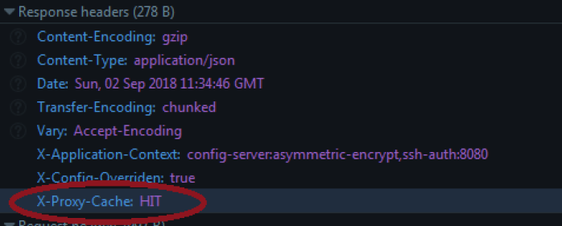

# default.conf

In this file you will find the default configuration to build a project with the architecture.

## Directives

### **proxy_cache_path**

Indicates the directory of the machine where the resources to be cached are stored, it is the directive used to configure the reverse proxy. This directory must contain permissions 700 so that the proxy can write correctly.
If you want to check if the resource has been returned from cache or from the webserver, at run time you have to add the following header to the default.conf file: **add_header X-Proxy-Cache $upstream_cache_status**.
With this header we can have two types of response values:

- **HIT** : if the resource has been returned from the cache the header shows this value.
- **MISS** : value shown in the header if the resource is returned from the webserver.

The following image shows an example of the use of the header, the requested resource has been returned from the cache:

The **proxy_cache_path** directive must be outside the **server{}** context. |

### **server**

It is used to declare a specific web site, there can be more than one server block, each of these blocks represents a virtual host.

### **location**

Allows you to define a group of settings that are applied to different sections of the web site. It can be placed inside a server block or nested inside another location block.

### **listen**

Directive that allows to specify the listening port.

### **server_name**

This directive indicates the address where the requests will be sent.

### **include**

It is used to import the configuration from the specified file. We use it to include the configuration found in the `gzip.conf` and `proxy_cache.conf` files.

### **expires**

Enables or disables the addition or modification of the "Expires" and "Cache-Control" response header fields whenever the response code is equal to 200, 201, 204, 206, 301, 302, 303, 304, 307 or 308. The parameter can be a positive or negative time.
By default in our configuration the time is 24h.

### **stub_status**

Basic status information will be accessible from the surrounding location.

### **access_log**

It is used to save the traces, it defines the access file from which the connections to the http proxy are collected. In our configuration it is deactivated.

### **Allow**

Directive used to restrict the ips that are allowed.

### **Deny**

Denies access to the specified network or address.

### **alias**

Defines a replacement for the specified location in this case instead of the `config.json_default` file, the `config.json` file will be returned.

### **rewrite**

If the specified regular expression matches a request URI, this URI is replaced by the specified string.

### **proxy_pass**

Directive that indicates the URL of the application server to which the cached content will be requested with the proxy_cache_path directive, in our case the request is always made to the configuration service that is deployed in the Openshift paas.

### **root**

Set the root directory for the requests, by default it will be the following: `/usr/share/nginx/html;`

### **Index**

Defines the files that will be used as an index. In this case they are the following:

- index.html
- index.htm
- Default.htm

### **auth_basic**

Allows validation of the user name and password using the "HTTP Basic Authentication" protocol.

### **auth_basic_user_file**

Specifies a file containing user names and passwords.
