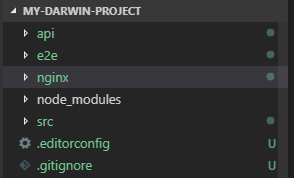
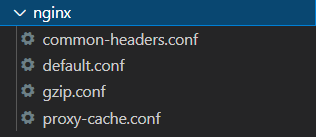

# Nginx Configuration

## Introduction

The Darwin architecture offers a CLI with which you can generate your own archetype, which includes the modules and Nginx configuration needed to deploy your application.

## Nginx configuration structure

Every project should have a folder named **nginx** as shown in the example image below:

Inside you will find three configuration files, which will be discussed in depth throughout the document.  Below is a small definition of each of the files:

- **Default.conf**: Default configuration to be able to build a project with the architecture.
- **Gzip.conf**: Directives responsible for the compression of the requests and responses made during the use of the application.
- **Proxy-cache.conf**: Directives in responsibility of the proxy and cache configuration.
- **Common-headers.conf**: Directives responsible for all common headers.

The gzip.conf, proxy-cache.conf and common-headers.conf files are included in the general configuration of the default.conf project. For more information about the directives see the following link to the official Nginx documentation.

[https://nginx.org/en/docs/](https://nginx.org/en/docs/)
