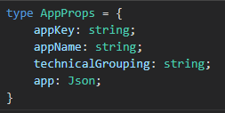

# Breaking Changes

For a migration of the **ng-darwin** libraries from version **8.x.x** to version **11.x.x**, the following **breaking changes** must be taken into account:

- The different ng-darwin modules in version 11.x.x only work with Angular version 11, so it will be necessary for applications to migrate to this version of Angular.

- The `ConfigModule` configuration module now needs a mandatory property called technicalGrouping in order to work and retrieve the configuration.

    ``` ts
    ConfigModule.forRoot({
      technicalGrouping: 'f-ng-00000000-name',
      ...
    })
    ```

- Referring to the previous point, the Nginx configuration must be modified so that it can perform the necessary redirections.

    ``` TEXT
    # to get config properties
    location <%= ENV["relativePath"] %>/config/f-ng-00000000-name/config.json {
      proxy_pass <%= ENV["CONFIG_END_POINT"] %>;
      include conf.d/proxy-cache.conf;
    }
    <% end %>
    ```

- The type returned by `ConfigService.config` renames the token from `ConfigProps` to `AppProps`.

- The modeconfiguration property belonging to the SecurityModule module, which specified the type of authentication of the application, will no longer be taken into account and will be obsolete. Version 11.x.x of the architecture libraries have a new logic, capable of retrieving the initial token in different ways. For more information, see the `initialize` method offered by `SercurityService` [here](https://automatic-doodle-rew2y31.pages.github.io/modules/_ng-darwin_security.html#m%C3%A9todo-initialize){:target="_blank"}. <!-- markdownlint-disable MD013 -->

- The query of the `SecurityService.tokenproperty` of the injectable service providing `SecurityModule` will always return an `string` or `undefined`.

    

- The following error codes emitted by error events of the security module are removed, so they will never be emitted:
    - Code `3002`, `DW_INVALID_MODE`,
    - Code `3005`, `DW_COOKIE_NOT_FOUND`.

!!! warning
    If you are migrating an application that has not used the current front archetype, which incorporates Angular 11 out of the box and the ng-darwin libraries in version 11.x.x, you will need to use a new component that generates this archetype to facilitate token management.
    The best way to see this is to generate a base front archetype and check the app.component.ts and dw.component.ts files.

``` ts
@Component({
  selector: 'app-root',
  template: `
    <!-- ------------------------------------------------------------ -->
    <!-- The html content below is mandatory. DO NOT DELETE IT. -->
    <!-- Build your app inside app-dw-root (DwComponent) -->
    <!-- ------------------------------------------------------------ -->
    <app-dw-root *ngIf="(securityService.onSessionInitialized$ | async) === undefined"></app-dw-root>
  `
})
export class AppComponent implements OnInit {
  ...
}
```
