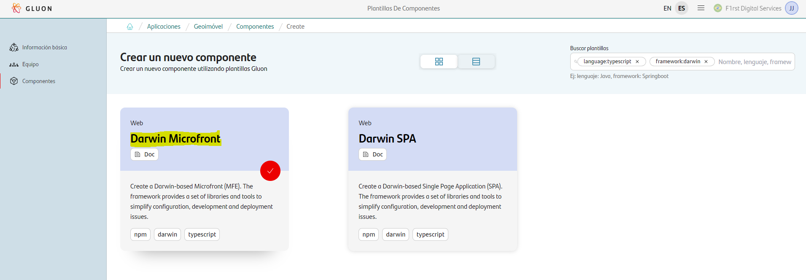
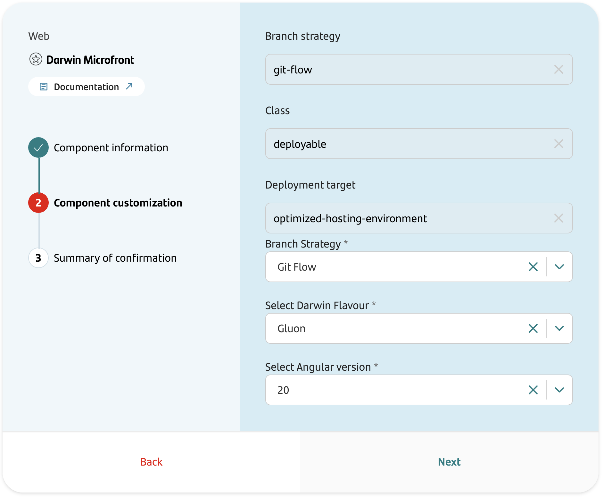
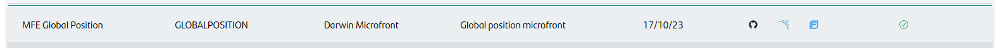

## Introduction

The purpose of this documentation is to provide a **step-by-step guide** on how to create, build, analyze and deploy an Microfront based on **Darwin** framework within the GLUON platform.

This guide will allow you to understand how to build and deploy our web application through a CI/CD process but not how to develop it.
For more information about the development of a Darwin Microfront, please refer to the [Darwin Microfront Archetype documentation](framework/microfrontend-architecture/archetypes/microfront.md) provided by the framework.

{!
   include-markdown "../../../../snippets/overview/front-overview.md"
   start="<!--Start Deploy target-->"
   end="<!--End Deploy target-->"
!}

## Setup your local environment

{!
   include-markdown "../../../../snippets/setup/npm-setup.md"
!}

## Create Component

### Gluon Portal

First you have to [**onboard your application.**](../../../../../application/application-management/index.md)
Once you have your application created, you can start creating your component.

To create a component, follow the steps described in [**Component Management**](../../../../../application/component-management/create-component.md), searching for the component to be created.

You have to select the type of component you want to create, in this case you are going to create a **Darwin Microfront**.



???+ remember

    To follow the naming convention visit [Repository Naming Convention](../../../../../application/component-management/create-component.md#repository-naming-convention).

The users can customize the Flavour and Angular version. For this example we have created a Microfront with the following characterictics:

{!
   include-markdown "../../../../snippets/setup/front-setup.md"
   start="<!--Start Branch Strategy-->"
   end="<!--End Branch Strategy-->"
!}

- **Flavour**: If `Gluon` is selected, the archetype will use the [HTTP library](../core/http/index.md), otherwise if `Classic` is selected, the archetype will use the [@darwin/security library](https://automatic-doodle-rew2y31.pages.github.io/modules/_ng-darwin_security.html){:target="_blank"}.
- **Angular version**: By default, the Microfront is configured for Angular 20.
[Here](framework/ng-darwin/versions/index.md) are the current versions.



Once the component is created we can see under the application that there is a new repository created with the name of the component, Sonar project and Fortify project.



We have the following links in:

| Item | Link | Role Permission |
| --- | --- | --- |
| GitHub Repository | Link to the repository created in GitHub | Developer (RW) /Technical Lead (Maintain) [All roles explained](https://docs.github.com/es/organizations/managing-user-access-to-your-organizations-repositories/managing-repository-roles/repository-roles-for-an-organization){:target="_blank"} |
| Sonar Project | Link to the Sonar project created | All Users (Read) |
| Fortify Project | Link to the Fortify project created | All Users (Read) |

### Darwin Microfront Template

#### Branches

{!
   include-markdown "../../../../snippets/setup/branch-setup-for-front.md"
!}

#### Structure

The generated Darwin Microfront has a structure similar to the following (Depending the parameters you have previously configured):

``` bash
📂.github
 ┣ 📂workflows
 | ┣ 📜bluegreen-switch-workflow.yml
 | ┣ 📜cd.yml
 | ┣ 📜ci-fix-gfw.yml
 | ┣ 📜ci-gfw.yml
 | ┣ 📜create-release-branch.yml
 | ┣ 📜quality.yml
 | ┣ 📜release-fix-gfw.yml
 | ┣ 📜release-gfw.yml
 | ┣ 📜security.yml
 | ┣ 📜update-component-workflow.yml
 | ┗ 📜version-validation.yml
 ┗ 📜CODEOWNERS
📂.gluon
 ┣ 📂cd
 | ┣ 📂cert
 | | ┣ 📜cd.yml
 | | ┗ 📜values.yaml
 | ┣ 📂pre
 | | ┣ 📜cd.yml
 | | ┗ 📜values.yaml
 | ┗ 📂pro
 | | ┣ 📜cd.yml
 | | ┗ 📜values.yaml
 | ┗ 📜values.yaml
 ┗ 📂ci
   ┗ 📜properties.env
📂api
 ┣ 📂public
 | ┣ 📂shell-lite
 | | ┗ 📜config.json
 | ┗ 📜config.json
 ┣ 📜api-server.js
 ┗ 📜db.json
📂nginx
 ┣ 📂local
 | ┣ 📂conf.d
 | | ┗ 📜default-mcf.conf
 | ┗ 📜nginx.conf
 ┣ 📜common-headers.conf
 ┣ 📜default.conf
 ┗ 📜gzip.conf
📂public
 ┣ 📜css.png
 ┣ 📜favicon.ico
 ┗ 📜js.png
📂src
 ┣ 📂app
 | ┣ 📜app.config.ts
 | ┣ 📜app.html
 | ┣ 📜app.routes.ts
 | ┣ 📜app.scss
 | ┣ 📜app.spec.ts
 | ┗ 📜app.ts
 ┣ 📂environments
 | ┣ 📜environment.development.ts
 | ┗ 📜environment.ts
 ┣ 📂locale
 | ┣ 📜messages.es.xlf
 | ┗ 📜messages.xlf
 ┣ 📂shell-lite
 | ┣ 📜shell-lite.config.ts
 | ┣ 📜shell-lite.spec.ts
 | ┗ 📜shell-lite.ts
 ┣ 📜bootstrap-mfe.ts
 ┣ 📜bootstrap-shell-lite.ts
 ┣ 📜index.html
 ┣ 📜main.ts
 ┗ 📜styles.scss
📜.editorconfig
📜.gitignore
📜.tool-versions
📜angular.json
📜Dockerfile
📜eslint.config.js
📜karma.conf.js
📜manifest.json
📜package.json
📜proxy.conf.json
📜README.md
📜tsconfig.app.json
📜tsconfig.json
📜tsconfig.spec.json
📜webpack.config.js
```

For more information on the structure and functionality of Darwin Microfronts, please refer to the [Darwin Microfront Archetype documentation](framework/microfrontend-architecture/archetypes/microfront.md) provided by the framework. <!-- markdownlint-disable MD013 -->

## Local Running

??? abstract "Cloning your repository"

    ### Cloning your repository

    Once we have the device properly configured, the first step is to clone the project locally.

    To do so, visit [**How to clone de project**](../../../../../application/component-management/create-component.md#cloning-a-repository).

??? abstract "Run your Microfront"
    ### Running the Microfront

    Once you have clone your repo, the next thing to do is to install your dependencies. As any other node project, you'l need to execute the following command:

    ``` text
    npm install
    ```

    When that process end and you have all your dependencies installed, you'll need to serve the application. In order to do this, just run the following command:

    ``` text
    npm start
    ```

## Kubernetes Infrastructure

{!
   include-markdown "../snippets/kubernetes-for-front.md"
!}

## AWS/S3 Infrastructure

{!
   include-markdown "../snippets/s3-for-front.md"
!}

## Component Configuration

{!
   include-markdown "../../../../snippets/configuration/front-config.md"
   start="<!--Start front config init-->"
   end="<!--End front config init-->"
!}

=== "Darwin Microfront example"

    ```properties
    # Npm parameters
    NODE_VERSION='22.17.1'
    NPM_CONFIGURATION_DIST_DIRECTORY='nginx/'
    NPM_RUN_TEST_COMMAND='npm test --coverage'

    DOCKER_BUILD_ARGUMENTS='--build-arg ARTIFACT_PATH=${ARTIFACT_PATH} --build-arg CONFIG_PATH=${CONFIG_PATH}'

    # NPM GROUP
    NPM_APPLICATION_GROUP=santander-group-gluon-test
    ```

{!
   include-markdown "../../../../snippets/configuration/front-config.md"
   start="<!--Start front config end-->"
   end="<!--End front config end-->"
!}

## Build and Deploy your application

{!
   include-markdown "../../../../snippets/lifecycle/gitflow-for-front.md"
!}

## Fix/Release Flow

{!
   include-markdown "../../../../snippets/lifecycle/fix-release-flow.md"
!}
