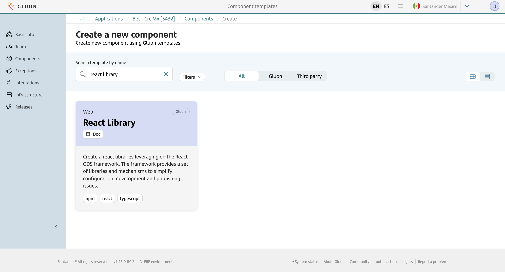
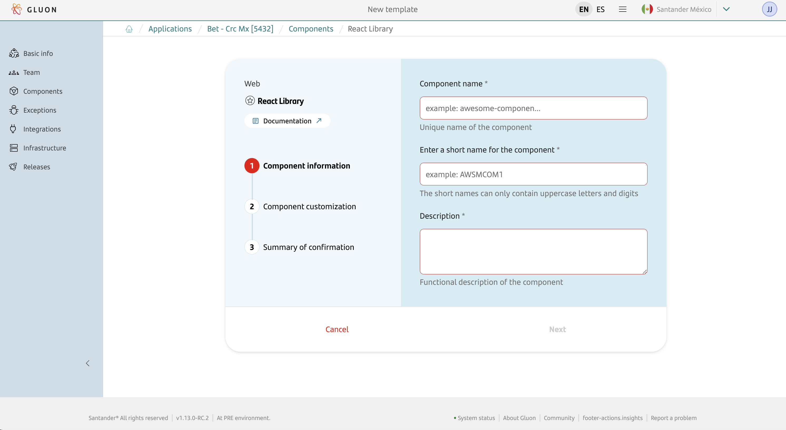
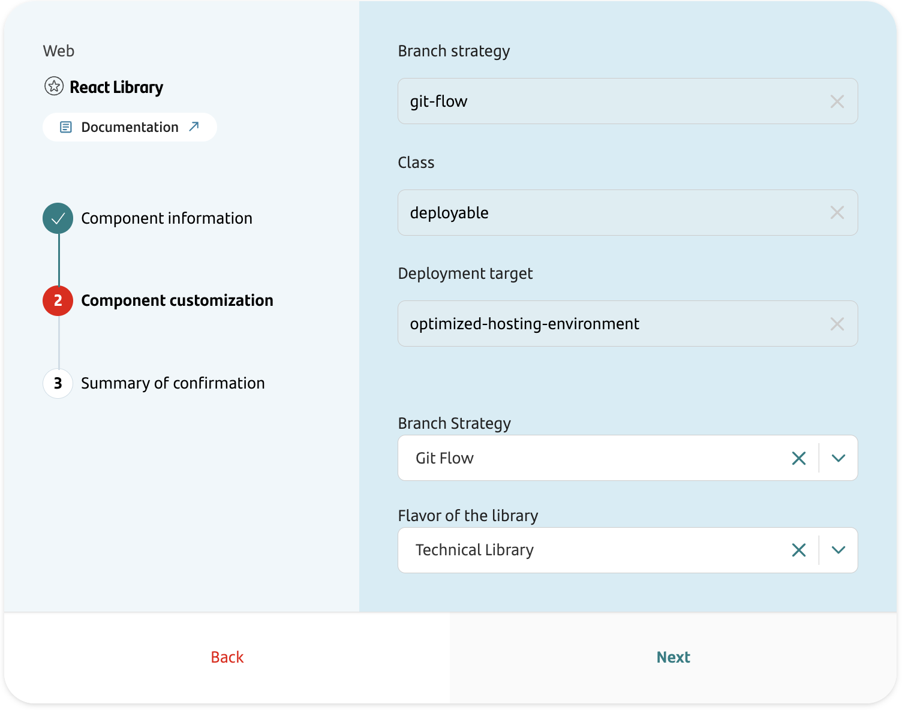
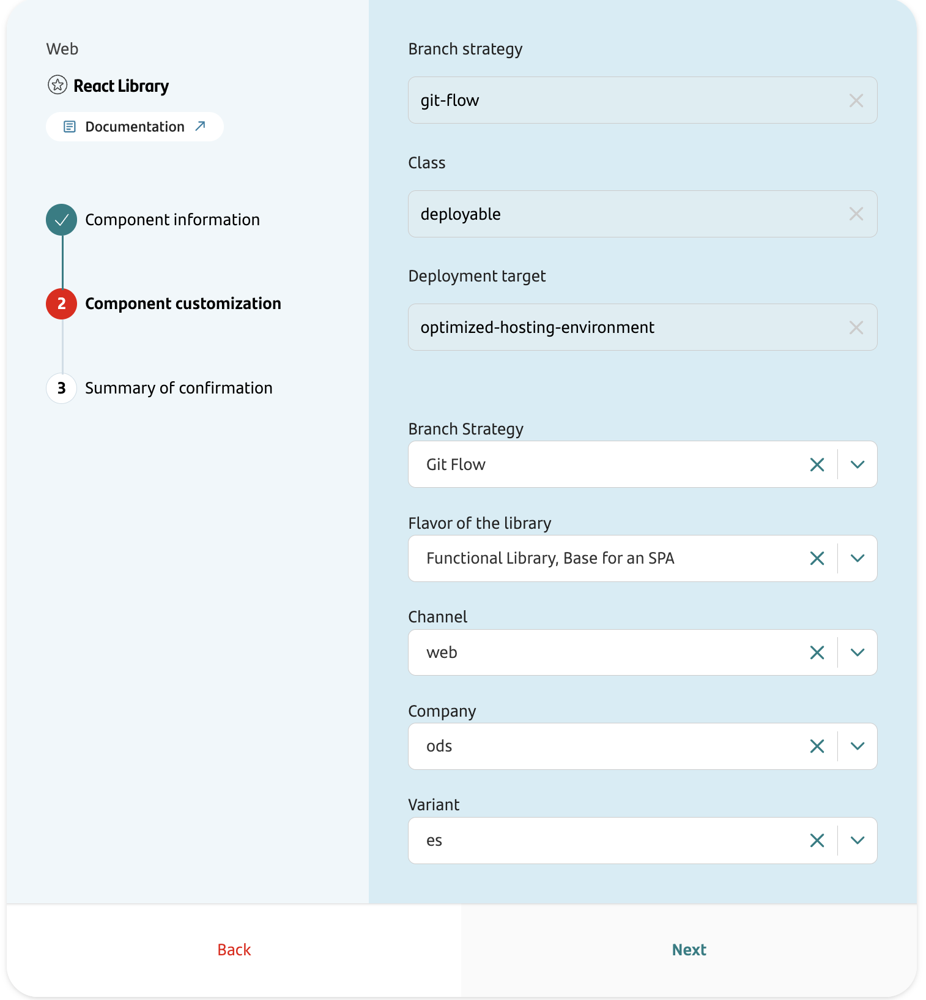
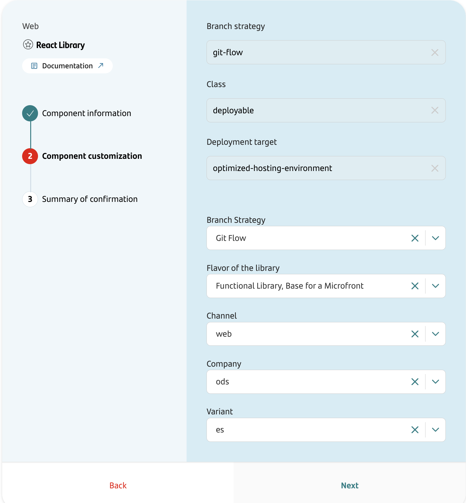
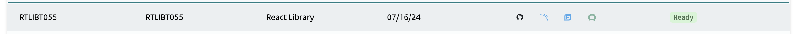

## Introduction

The purpose of this documentation is to provide a **step-by-step guide** on how to create, build, analyze and publish different flavors of libraries based on **React ODS** framework within the GLUON platform.

This guide will allow you to understand how to build and publish our react library through a CI/CD process but not how to develop it.
For more information about React ODS on Gluon, please refer to the [React documentation](./framework/index.md).

The resulting library will be published to the configured artifact repository (Nexus/JFROG).

## Setup your local environment

{!
   include-markdown "../../../../snippets/setup/npm-setup.md"
!}

## Create Component

### Gluon Portal

First you have to [**onboard your application.**](../../../../../application/application-management/index.md)
Once you have your application created, you can start creating your component.

#### Creation of the component

To create a component, follow the steps described in [**Component Management**](../../../../../application/component-management/create-component.md), searching for the component to be created.

You have to select the type of component you want to create, in this case you are going to create a **React Library**.



Then, you'll be asked for the component name, the short name (relevant for the future repository name) and a short description.



???+ remember

    To follow the naming convention visit [Repository Naming Convention](../../../../../application/component-management/create-component.md#repository-naming-convention).

{!
   include-markdown "../../../../snippets/setup/front-setup.md"
   start="<!--Start Branch Strategy-->"
   end="<!--End Branch Strategy-->"
!}

After this common data, the wizard will ask you for for the branch strategy (right now, we only support Git. Flow) and the flavor of the library. You should choose between:

- Technical Library
- Functional Library, Base for an SPA
- Functional Library, Base for a Microfront

We must choose between them and you'll be asked for more specific data depending on it.

##### Technical Library

The technical library is supposed to be used for creating technical pieces like validators, utils,..



It will no require no extra parameter.

##### Functional Library, Base for an SPA

The functional library (base for an SPA) should be used to create a base library for a SPA (Single Page Application)



This flavour will require the following parameters:

- Channel: The target channel for the future application
- Company: The target company of the future application
- Variant: The variant of the future application

##### Functional Library, Base for a Microfront

The functional library (base for a Microfront) should be used to create a base library for Microfronts.



This flavour will require the following parameters:

- Channel: The target channel for the future application
- Company: The target company of the future application
- Variant: The variant of the future application

#### View the components

Once the component is created we can see under the application that there is a new repository created with the name of the component, Sonar project and Fortify project.



We have the following links in:

| Item | Link | Role Permission |
| --- | --- | --- |
| GitHub Repository | Link to the repository created in GitHub | Developer (RW) /Technical Lead (Maintain) [All roles explained](https://docs.github.com/es/organizations/managing-user-access-to-your-organizations-repositories/managing-repository-roles/repository-roles-for-an-organization) |
| Sonar Project | Link to the Sonar project created | All Users (Read) |
| Fortify Project | Link to the Fortify project created | All Users (Read) |
| Catalog | Link to APM | All Users (Read) |

### React Library Template

#### Branches

{!
   include-markdown "../../../../snippets/setup/branch-setup-for-front.md"
!}

#### Structure

The generated React Library could have different structure, depending the selected flavor:

=== "Technical Library"

    ``` bash
    📂.github
    ┣ 📂workflows
    | ┣ 📜ci-gfw.yml
    | ┣ 📜quality.yml
    | ┣ 📜release-gfw.yml
    | ┣ 📜security.yml
    | ┣ 📜update-component-workflow.yml
    | ┗ 📜version-validation.yml
    ┗ 📜CODEOWNERS
    📂.gluon
    ┗ 📂ci
      ┗ 📜properties.env
    📂app
    ┣ 📂.storybook
    | ┣ 📜main.ts
    | ┗ 📜preview.ts
    ┣ 📂src
    | ┣ 📂__tests__
    | | ┗ 📜index.spec.ts
    | ┣ 📂code-example
    | | ┣ 📂__docs__
    | | | ┗ 📜introduction.mdx
    | | ┣ 📂__tests__
    | | | ┗ 📜helloWorld.spec.ts
    | | ┣ 📜helloWorld.ts
    | | ┗ 📜index.ts
    | ┗ 📜 index.ts
    ┣ 📜.editorconfig
    ┣ 📜.eslintignore
    ┣ 📜.eslintrc
    ┣ 📜.prettierrc
    ┣ 📜.yarnrc
    ┣ 📜jest.config.js
    ┣ 📜package.json
    ┣ 📜tsconfig-build.json
    ┣ 📜tsconfig-cjs.json
    ┣ 📜tsconfig-esm.json
    ┗ 📜tsconfig.json
    📂envs
    ┗ 📜properties.env
    📜README.adoc
    📜pom.xml
    ```

=== "Functional Library, base for a SPA"

    ``` bash
    📂.github
    ┣ 📂workflows
    | ┣ 📜ci-gfw.yml
    | ┣ 📜quality.yml
    | ┣ 📜release-gfw.yml
    | ┣ 📜security.yml
    | ┣ 📜update-component-workflow.yml
    | ┗ 📜version-validation.yml
    ┗ 📜CODEOWNERS
    📂.gluon
    ┗ 📂ci
      ┗ 📜properties.env
    📂app
    ┣ 📂eslint-local-rules
    | ┗ 📜sort-types.js
    ┣ 📂src
    | ┣ 📂__mocks__
    | | ┣ 📂@gruposantander
    | | | ┗ 📜mb-ui-framework.ts
    | | ┗ 📂lottie-web
    | |   ┗ 📜index.js
    | ┣ 📂__tests__
    | | ┣ 📜UtilsProvider.tsx
    | | ┣ 📜assetMock.js
    | | ┣ 📜renderUtils.tsx
    | | ┣ 📜test-utils.test.ts
    | | ┗ 📜useActiveBreakpointsHandlers.ts
    | ┣ 📂config
    | | ┣ 📂__tests__
    | | | ┗ 📜dependencies.test.ts
    | | ┣ 📜dependencies.ts
    | | ┗ 📜index.ts
    | ┣ 📂core
    | | ┣ 📂example-context
    | | | ┣ 📂application
    | | | | ┗ 📜index.ts
    | | | ┣ 📂domain
    | | | | ┗ 📜index.ts
    | | | ┣ 📂infra
    | | | | ┗ 📜index.ts
    | | | ┗ 📜index.ts
    | | ┣ 📜index.ts
    | | ┗ 📜test-utils.ts
    | ┣ 📂ui
    | | ┣ 📂components
    | | | ┗ 📜index.ts
    | | ┣ 📂views
    | | | ┗ 📜index.ts
    | | ┣ 📂widgets
    | | | ┗ 📜index.ts
    | | ┗ 📜index.ts
    | ┣ 📜index.ts 
    | ┗ 📜test-utils.ts
    ┣ 📜.editorconfig
    ┣ 📜.eslintignore
    ┣ 📜.eslintrc
    ┣ 📜.gitignore
    ┣ 📜.prettierignore   
    ┣ 📜.prettierrc
    ┣ 📜.yarnrc
    ┣ 📜README.md
    ┣ 📜jest.config.js
    ┣ 📜jest.setup.js
    ┣ 📜nodemon.json
    ┣ 📜package.json
    ┣ 📜tsconfig-build.json
    ┣ 📜tsconfig-cjs.json
    ┣ 📜tsconfig-esm.json
    ┗ 📜tsconfig.json
    📜README.adoc
    📜pom.xml
    ```

=== "Functional Library, base for a Microfront"

    ``` bash
    📂.github
    ┣ 📂workflows
    | ┣ 📜ci-gfw.yml
    | ┣ 📜quality.yml
    | ┣ 📜release-gfw.yml
    | ┣ 📜security.yml
    | ┣ 📜update-component-workflow.yml
    | ┗ 📜version-validation.yml
    ┗ 📜CODEOWNERS
    📂.gluon
    ┗ 📂ci
      ┗ 📜properties.env
    📂app
    ┣ 📂eslint-local-rules
    | ┗ 📜sort-types.js
    ┣ 📂src
    | ┣ 📂__mocks__
    | | ┣ 📂@gruposantander
    | | | ┗ 📜mb-ui-framework.ts
    | | ┗ 📂lottie-web
    | |   ┗ 📜index.js
    | ┣ 📂__tests__
    | | ┣ 📜UtilsProvider.tsx
    | | ┣ 📜assetMock.js
    | | ┣ 📜renderUtils.tsx
    | | ┣ 📜test-utils.test.ts
    | | ┗ 📜useActiveBreakpointsHandlers.ts
    | ┣ 📂config
    | | ┣ 📂__tests__
    | | | ┗ 📜dependencies.test.ts
    | | ┣ 📜dependencies.ts
    | | ┗ 📜index.ts
    | ┣ 📂core
    | | ┣ 📂example-context
    | | | ┣ 📂application
    | | | | ┗ 📜index.ts
    | | | ┣ 📂domain
    | | | | ┗ 📜index.ts
    | | | ┣ 📂infra
    | | | | ┗ 📜index.ts
    | | | ┗ 📜index.ts
    | | ┣ 📜index.ts
    | | ┗ 📜test-utils.ts
    | ┣ 📂ui
    | | ┣ 📂components
    | | | ┗ 📜index.ts
    | | ┣ 📂views
    | | | ┗ 📜index.ts
    | | ┣ 📂widgets
    | | | ┗ 📜index.ts
    | | ┗ 📜index.ts
    | ┣ 📜index.ts 
    | ┗ 📜test-utils.ts
    ┣ 📜.editorconfig
    ┣ 📜.eslintignore
    ┣ 📜.eslintrc
    ┣ 📜.gitignore
    ┣ 📜.prettierignore   
    ┣ 📜.prettierrc
    ┣ 📜.yarnrc
    ┣ 📜README.md
    ┣ 📜jest.config.js
    ┣ 📜jest.setup.js
    ┣ 📜nodemon.json
    ┣ 📜package.json
    ┣ 📜tsconfig-build.json
    ┣ 📜tsconfig-cjs.json
    ┣ 📜tsconfig-esm.json
    ┗ 📜tsconfig.json
    📜README.adoc
    📜pom.xml
    ```

## Local Running

??? abstract "Cloning your repository"

    ### Cloning your repository

    Once we have the device properly configured, the first step is to clone the project locally.

    To do so, visit [**How to clone de project**](../../../../../application/component-management/create-component.md#cloning-a-repository).

??? abstract "Building your library"

    ### Building your library

    Once you have clone your repo, the next thing to do is to install your dependencies. As any other node project, you'l need to execute the following command:

    ``` text
    yarn install
    ```

    When that process end and you have all your dependencies installed, you'll be able to build your library. In order to do this, just run the following command:

    ``` text
    yarn build
    ```

## Infrastructure

All deployments will be done in corporate [Nexus](https://nexus.alm.europe.cloudcenter.corp/).

## Component Configuration

### Branches

{!
   include-markdown "../../../../snippets/configuration/front-configuration.md"
   start="<!--Start Gitflow Branches-->"
   end="<!--End Gitflow Branches-->"
!}

### Configuration Files

{!
   include-markdown "../../../../snippets/configuration/front-configuration.md"
   start="<!--Start Configuration Files-->"
   end="<!--End Configuration Files-->"
!}

#### Properties

=== "React Library"

    ```properties
    # Npm parameters
    NODE_VERSION='18.18.2'
    NPM_APPLICATION_DIST_DIRECTORY='app/'
    NPM_LIBRARY_DIRECTORY='app/'
    NPM_RUN_INSTALL_COMMAND='npm i yarn -g && cd app && yarn && cd ..'
    NPM_RUN_BUILD_COMMAND='cd app && yarn dist && cd ..'
    NPM_RUN_TEST_COMMAND='cd app && yarn test && cd ..'

    # Sonar parameters
    SONAR_PROJECT_KEY="mex-rost-rtlibs047"
    NPM_SONAR_PROPERTIES='-Dsonar.sources=./app/src,./app/package.json -Dsonar.tests=. -Dsonar.test.inclusions=**/*.spec.ts,**/*.test.ts,**/*.test.tsx -Dsonar.javascript.coveragePlugin=lcov -Dsonar.javascript.lcov.reportPath=app/__reports__/test-coverage/lcov.info -Dsonar.typescript.lcov.reportPaths=app/__reports__/test-coverage/lcov.info -Dsonar.typescript.coveragePlugin=lcov -DtestExecutionReportPaths=app/__reports__/test-coverage/lcov-report/index.html -Dsonar.coverage.exclusions=app/src/*.js,app/src/*.jsx,app/src/**/__mocks__/**/*,app/src/**/__fixtures__/**/*,app/src/**/__tests__/*,app/src/**/index.ts'

    # Fortify parameters
    FORTIFY_PROJECT="mex-rost-rtlibs047"
    ```

{!
   include-markdown "../../../../snippets/configuration/front-configuration.md"
   start="<!--Start Common Properties-->"
   end="<!--End Common Properties-->"
!}

## Build and Publish your library

{!
   include-markdown "../../../../snippets/lifecycle/gitflow-library-node.md"
!}
