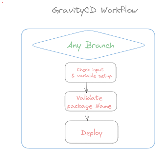
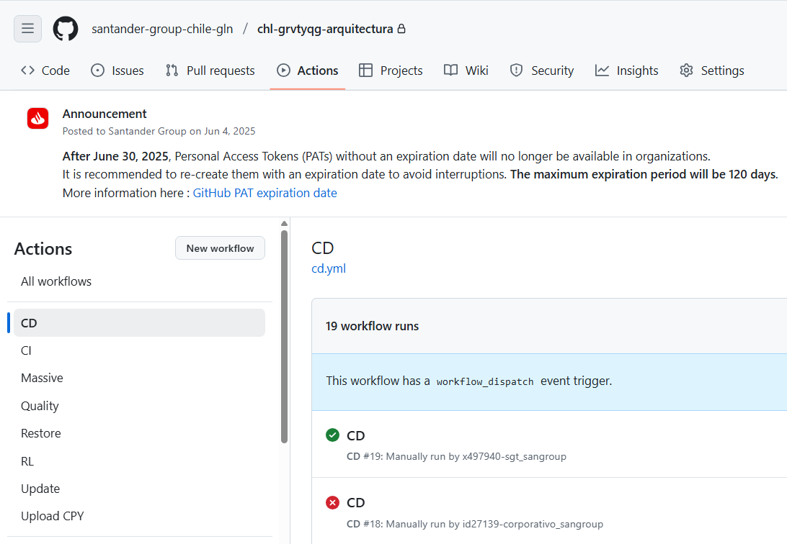
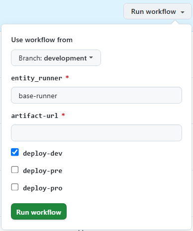
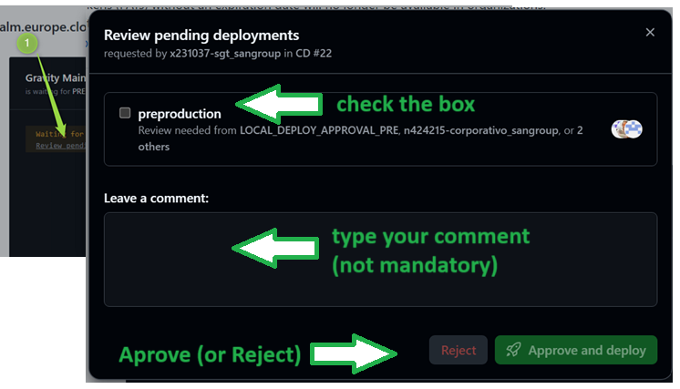
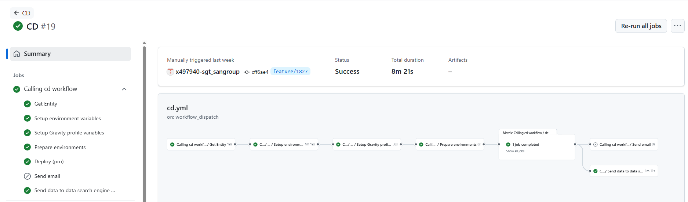

# Gravity CD Workflow

## Summary

The Gravity CD Workflow is designed to deploy a specified package from Artifactory or Nexus into any environment (DEV, PRE, or PRO).
To deploy in the DEV environment, a snapshot package URL can be used.
If you wish to deploy to the PRE or PRO environments, a release package URL should be provided.

## Workflow setup configuration

Once you have entered in the appropriate github.com repository where your software is, you may click on actions menu and then select GravityCD Workflow.

Once this is done you may click on 'Run workflow' button and then select the branch where you want to launch the workflow from:

Please select options accurately, this is:

* if deploy_dev is checked, you may introduce a SNAPSHOT package URL.
* if deploy_pre is checked, you may introduce a Release package URL.
* if deploy_pro is checked, you may introduce a Release package URL.

Once you hit on 'Run workflow', runner will start working covering the accurate stages.

## Workflow stages

* **Check Input & Variables setup**: first of all, given parameters entered are checked. In case of any issue on checking, workflow will stop showing an error message.

* **Validate Package name**: Workflow will check on whether package introduced at workflow configuration time is suitable for the environment selected.

* **Deploy ENV**:  Workflow will execute ansible deployment on the specified environment skipping the non selected ones.

!!! Warning
    Workflow will stop in order you to approve/confirm the deployment
    

    and so it will remain till you get your accurate environment check selected
    as follows:
    

* **Upload CPY (new)**:  After a successful deployment to PRO, the workflow runs automatically. It does not need to be executed manually.
This workflow allows you to update the CPYs of a release artifact in the entity's shared CPYs repository.

You may also see at the workflow execution diagram who launch it, over which branch and how long it took to execute the complete workflow and the partial and total results of each stage explained above:

