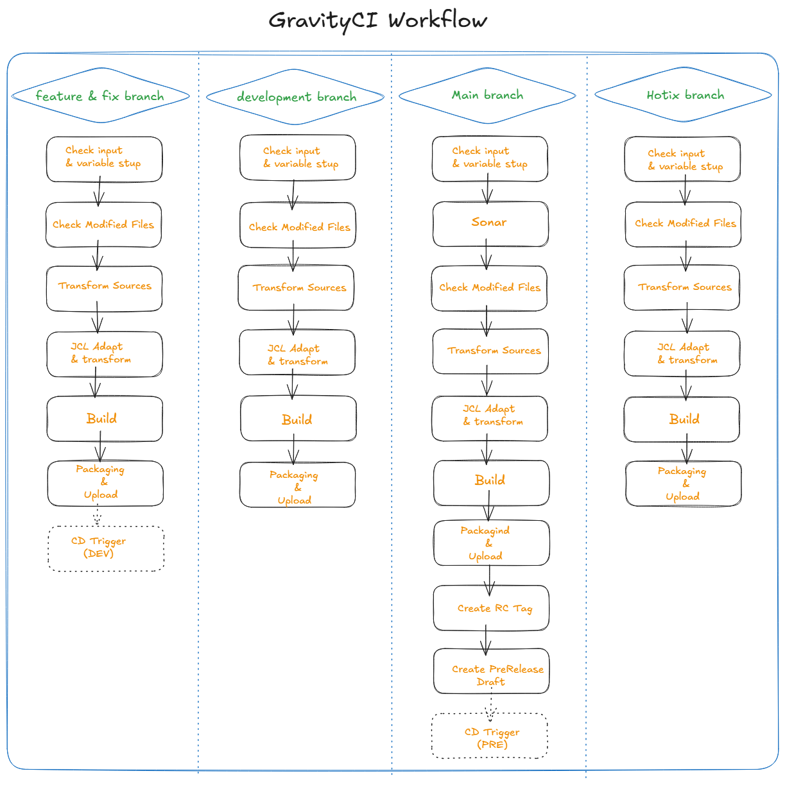
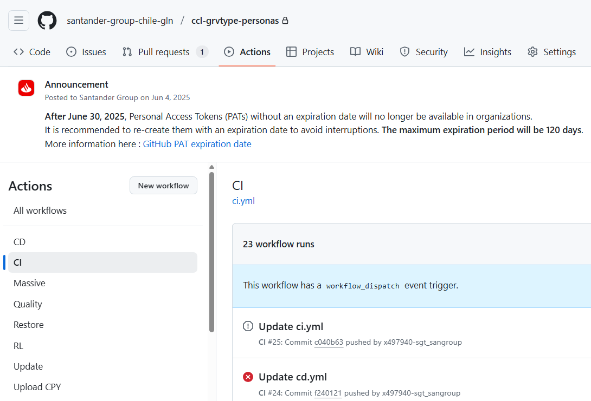
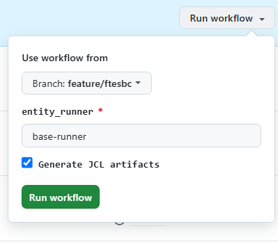
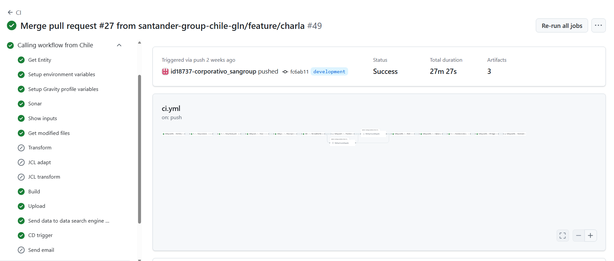

# Gravity CI Workflow

This workflow allows depending on the selected branch:

* **feature and fix branch**: to build a application, upload the package to artifactory or nexus (Snapshot repository) and get ready to deploy in dev environment.

* **development branch**: to build a application, upload the package to artifactory or nexus (Snapshot repository).

* **main branch**: to build a application, run a Sonar analysis, upload the package to artifactory or nexus (Snapshot repository) and get ready to deploy in PRE environment.

* **horfix branch**: to build a application, upload the package to artifactory or nexus (Snapshot repository).

## Workflow setup configuration

Once you have entered in the appropriate github.com repository where your software is, you may click on actions menu and then select GravityCI Workflow.

Once this is done you may click on 'Run workflow' button and then select the branch where you want to launch the workflow from:

Once you hit on 'Run workflow', runner will start working covering the accurate stages.

## Workflow stages

* **Check Input & Variables setup**: first of all, given parameters entered are checked. In case of any issue on checking, workflow will stop showing an error message.

* **Sonar**: (only main branch) right before compiling any source is checked according to sonar profile if not excepted.

* **Get modified files**: Workflow will check commits done in the branch compared to the latest version available (if there is no previous tag then everything will be taken into account for next stages).

* **Transform (Optional)**: in this stage expanded sources are sent to GravityOne (transformed software tool) to get them back properly transformed according to SW client destination specifications.

* **adaptaJCL**: Transforms the JCL/SYS/PRO artifacts to adapt then to environment.

* **JCL Transform (Optional)**: Performs the transformation of JCL/SYS/PRO artifacts for each object and environment. This functionality depends on whether the client has it enabled.

* **Build**: source transformed files are compiled using Microfocus Compiler together with accurate directives previously set by default depending on the SW client destination specifications.

* **Upload**: once compilation is done, transformed sources and binaries, Transformed JCLs adapted for the environment are package together in a zip file.
This zip file is uploaded to Artifactory or nexus (snapshot repository: `cobol_linux_snapshots/<component>`).
The package standardization naming is as follows:

??? info "Naming convention"
    | branch | convention |
    | -- | -- |
    | fix | `<component>-<version>+<hash>-fix+<branch>.zip` |
    | feature | `<component>/<component>-<version>+<hash>-feature+<branch>.zip` |
    | development | `<component>-<version>+<hash>-SNAPSHOT.zip` |
    | main | `<component>-<version>+<hash>-RC.zip` |
    | hotfix | `<component>-<version>+<hash>-hotfix+<branch>.zip` |

* **Create RC Tag**: (only main branch) This is the Release Candidate Tag creation at your repository.

* **Create Release Draft**: (only main branch) finally as a previous stage for the Release workflow a Release Draft is created at your SW repository.

* **CD trigger**: (only feature, fix and main branch). At this stage, the CD workflow is triggered to deploy to DEV if it is executed from the feature or fix branches, or to deploy to PRE if it is executed from the main branch.

You may also see at the workflow execution diagram who launch it, over which branch and how long it took to execute the complete workflow and the partial and total results of each stage explained above:

