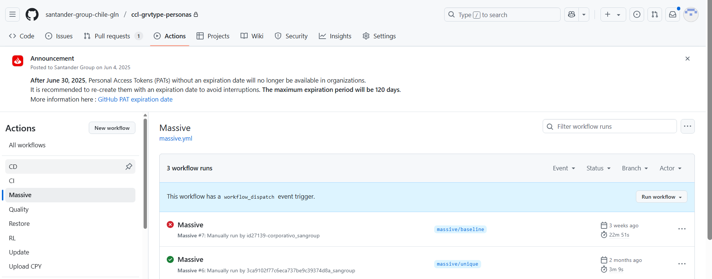
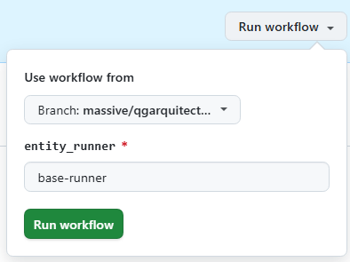
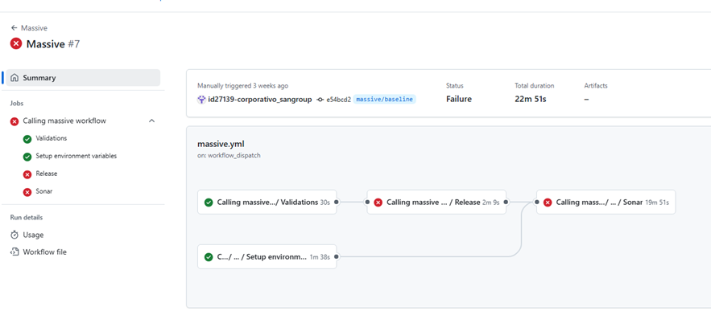

# Gravity Massive Workflow

## Summary

This workflow allows you to create the initial release v1.0.0 by skipping the compilation process, so no package is generated in Nexus.  
This first release establishes the baseline from which the user will start development.  
From that point on, builds in the feature/development/main branches are compared against this first release, until a second release is generated, which will establish a new baseline.

If there is no initial massive load and the first release is generated following the usual flow (feature → development → main), there is a risk of creating packages that are too large and may not pass the continuous integration (CI) cycle.  
Additionally, this approach prevents deploying all objects unnecessarily.

## Workflow setup configuration

Once you have entered in the appropriate github.com repository where your software is, you may click on actions menu and then select GravityRestore Workflow.

Once this is done you may click on 'Run workflow' button and then select the branch where you want to launch the workflow from:

This workflow can only be executed on branches that follow the format massive/[branch name]; otherwise, execution will fail.  
It can also only be executed if no release exists yet; if a release already exists, the process will fail.

## Workflow stages

The workflow creates and merges a pull request (PR) to the main branch, creates the 1.0.0 tag, and generates the release (v1.0.0) on that tag.  
Afterwards, it propagates the changes from main to development via a PR and updates the version in development to 1.1.0.  
Finally, it runs the Sonar analysis to establish the baseline in Sonar.

