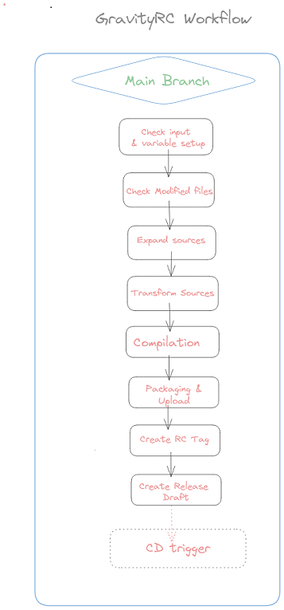
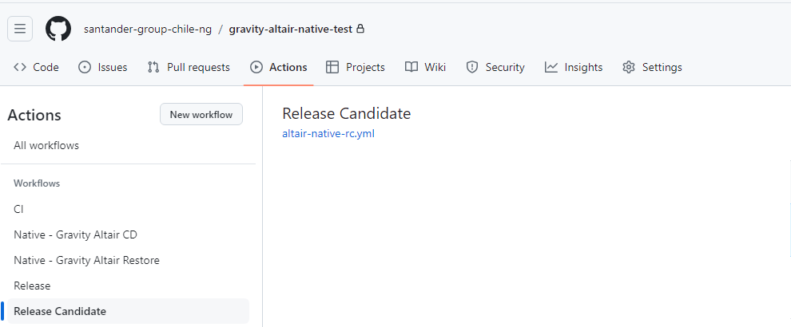
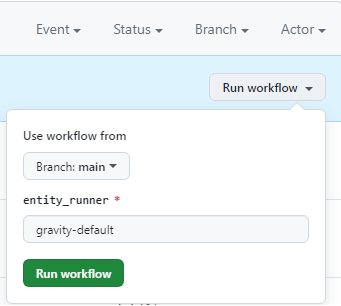
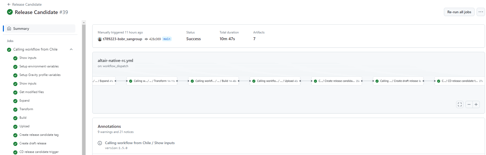

# Gravity Release Candidate Workflow

## Summary

This particular workflow is aimed to build up from the main branch an artifactory or nexus release-candidate package coming from a given previously uploaded snapshot package in a feature branch and get ready to deploy in pre environment.

## Workflow setup configuration

Once you have entered in the appropriate github.com repository where your software is, you may click on actions menu and then select GravityRC Workflow.

Once this is done you may click on 'Run workflow' button and then select the branch where you want to launch the workflow from:

Once you hit on 'Run workflow', runner will start working covering the accurate stages.

## Workflow stages

* **Check Input & Variables setup**: first of all, given parameters entered are checked. In case of any issue on checking, workflow will stop showing an error message.

* **Get modified files**: Workflow will check commits done in the branch compared to the latest version available (if there is no previous tag then everything will be taken into account for next stages).

* **Expand**: prior developed and committed modified sources are expanded one by one using appropriate Cobol Linux Microfocus methods.

* **Transform**: in this stage expanded sources are sent to GravityOne (transformed software tool) to get them back properly transformed according to SW client destination specifications.

* **Build**: source transformed files are compiled using Microfocus Compiler together with accurate directives previously set by default depending on the SW client destination specifications.

* **Upload**: once compilation is done, expanded sources, transformed sources and binaries are package together in a zip file. This zip file is uploaded to Artifactory or nexus (snapshot repository). The package standardization naming is as follows:
??? info "RC Naming convention"
    | convention | example |
    | -- | -- |
    |`<Sw-component>-<version>+<hash>-RC.zip` | native-test-1.1.0+3ed2d06-RC.zip |

* **Create RC Tag**: since we have selected the Release-Candidate workflow, an extra stage is made apart from the GravityCI Workflow. This is the Release Candidate Tag creation at your repository. The tag will have the same name as the previously
 uploaded package.

* **Create Release Draft**: finally as a previous stage for the [Release workflow](./GravityRelease.md) a Release Draft is created at your SW repository.

You may also see at the workflow execution diagram who launch it, over which branch and how long it took to execute the complete workflow and the partial and total results of each stage explained above:

