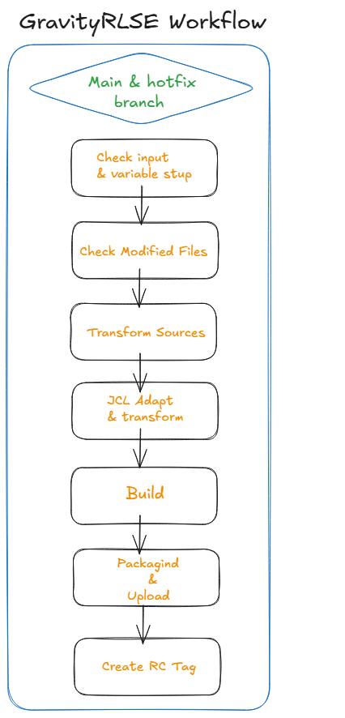
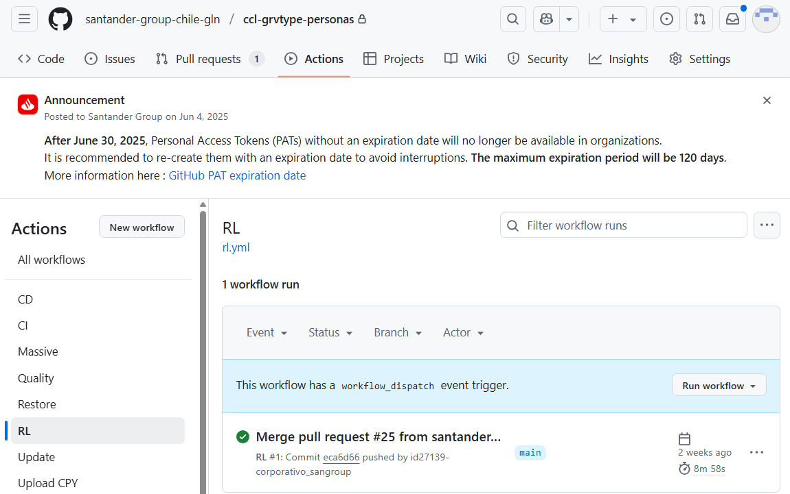
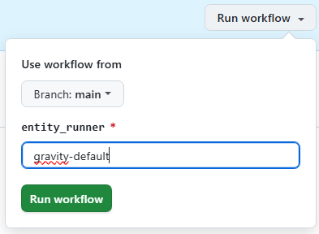
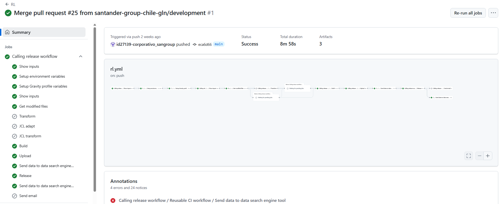

# Gravity Release Workflow

## Summary

This particular workflow is intended to create, from the main or hotfix branch, a release package for Artifactory or Nexus based on a previously generated snapshot package, and prepare it for deployment in a pre-production environment.

## Workflow setup configuration

Once you have entered in the appropriate github.com repository where your software is, you may click on actions menu and then select RL Workflow.

Once this is done you may click on 'Run workflow' button and then select the branch where you want to launch the workflow from: main or horfix branch.

Once you hit on 'Run workflow', runner will start working covering the accurate stages.

## Workflow stages

* **Check Input & Variables setup**: first of all, given parameters entered are checked. In case of any issue on checking, workflow will stop showing an error message.

* **Get modified files**: Workflow will check commits done in the branch compared to the latest version available (if there is no previous tag then everything will be taken into account for next stages).

* **Transform (Optional)**: in this stage expanded sources are sent to GravityOne (transformed software tool) to get them back properly transformed according to SW client destination specifications.

* **adaptaJCL**: Transforms the JCL/SYS/PRO artifacts to adapt then to environment.

* **JCL Transform (Optional)**: Performs the transformation of JCL/SYS/PRO artifacts for each object and environment. This functionality depends on whether the client has it enabled.

* **Build**: source transformed files are compiled using Microfocus Compiler together with accurate directives previously set by default depending on the SW client destination specifications.

* **Upload**: once compilation is done, expanded sources, transformed sources and binaries are package together in a zip file. This zip file is uploaded to Artifactory or nexus (release repository).
The package standardization naming is as follows:

??? info "RC Naming convention"
    | convention | example |
    | -- | -- |
    |`<Sw-component>-<version>.zip` | native-test-1.1.0.zip |

* **Create RLSE Tag**: The Release Tag is created at your repository according to the naming mentioned above.  
  If executed from the main branch, the PreRelease is updated to a Release and is also marked as latest.  
  If executed from the hotfix branch, the package for that hotfix is located and converted to a Release, but it is not marked as latest.

You may also see at the workflow execution diagram who launch it, over which branch and how long it took to execute the complete workflow and the partial and total results of each stage explained above:

