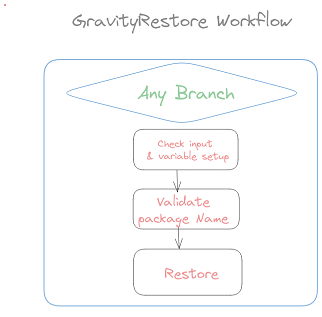
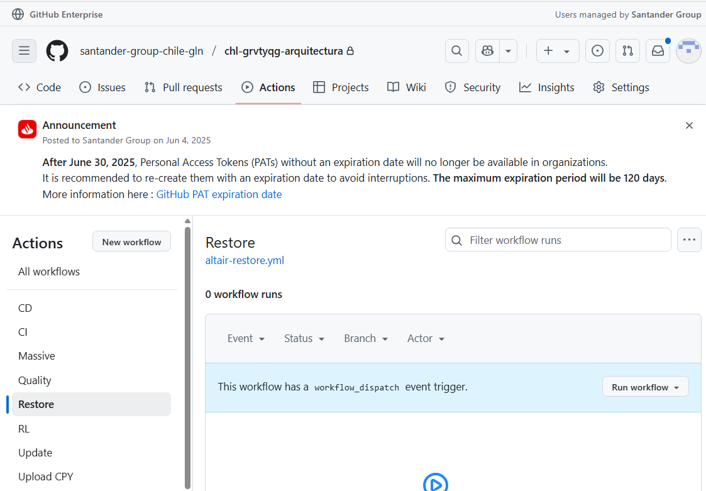
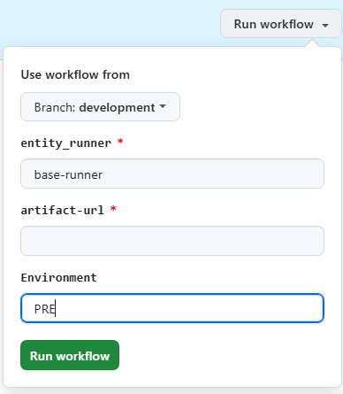
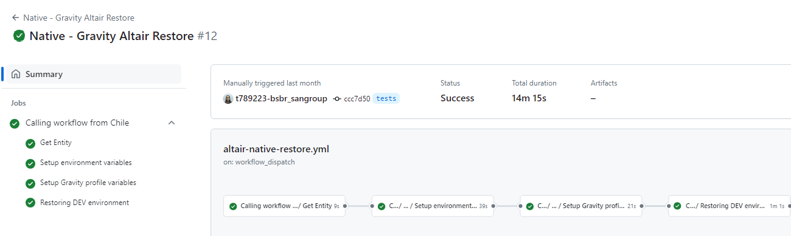

# Gravity Restore Workflow

## Summary

The Gravity Restore Workflow is aimed to deploy an already backup SW in either preproduction or production environment. For that purpose, an artifactory or nexus package has to be given at workflow input.

## Workflow setup configuration

Once you have entered in the appropriate github.com repository where your software is, you may click on actions menu and then select GravityRestore Workflow.

Once this is done you may click on 'Run workflow' button and then select the branch where you want to launch the workflow from:

Please select options accurately, this is:

* if PRE is typed, you may introduce a Release package URL.
* if PRO is typed, you may introduce a Release package URL.

Once you hit on 'Run workflow', runner will start working covering the accurate stages.

## Workflow stages

* **Check Input & Variables setup**: first of all, given parameters entered are checked. In case of any issue on checking, workflow will stop showing an error message.

* **Restore ENV**:  Workflow will execute ansible deployment from backup on the specified environment skipping the non selected ones.

!!! Warning
    Workflow will stop in order you to approve/confirm the deployment
     
    and so it will remain till you get your accurate environment check selected
    as follows:
    

You may also see at the workflow execution diagram who launch it, over which branch and how long it took to execute the complete workflow and the partial and total results of each stage explained above:

