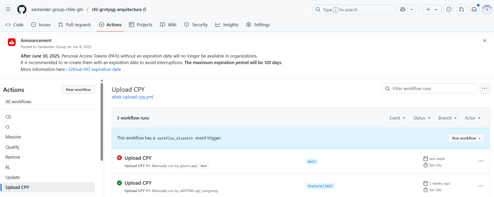
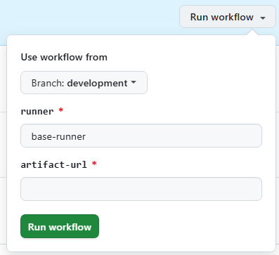
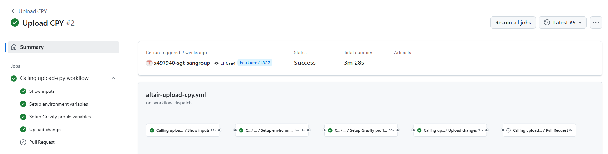

# Gravity Uploda CPY Workflow

## Summary

The workflow allows you to update the CPYs of a release artifact in the entities shared CPYs repository. It is not necessary to run this workflow manually, after a successful deployment to PRO, it runs automatically.

## Workflow setup configuration

It is not necessary to run this workflow manually, after a successful deployment to PRO, it runs automatically.

If it is necessary to run the workflow manually. Once you have entered in the appropriate github.com repository where your software is, you may click on actions menu and then select Upload CPY Workflow.

Once this is done you may click on 'Run workflow' button and then select the branch where you want to launch the workflow from:

## Workflow stages

* **Upload Changes**: Validate that the artifact belongs to the corresponding component. Download the artifact. Search for the CPYs within the artifact. Update any modified CPYs by creating a Pull Request (PR) to the main branch in the shared CPYs repository

