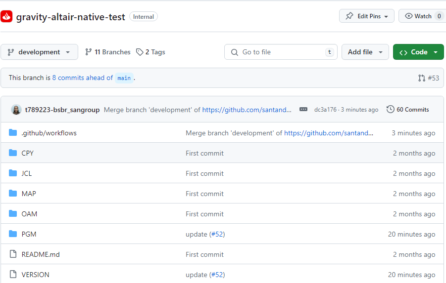

# Native Model

## Abstract

The purpose of this article is to indicate the necessary steps for developers to be able to version their Cobol Microfocus Programs projects in a Github.com repository, store their artifacts generated in Artifactory or Nexus, automatically deploy in the
    development environment and release the software for their delivery. Not forgetting, the deployment to preproduction and production environments.

## Onboarding

You may follow instructions given in GLUON onboarding:

 * [**Users Onboarding**](../../../../../application/users-teams/user-permissions.md)

 * [**Teams Onboarding**](../../../../../application/application-management/application-members-management.md)

 * [**Application onboarding**](../../../../../application/application-management/application-owners-management.md)

## Repository Creation and Contents

It is needed you to create a Github Repository in order your Software to be stored in the GLUON platform. For this purpose Gravity Team has prepared a github repository template where workflows will be exported as well.

## Branch Model

Once repository is set, you will need to create branches on it in order workflows to work properly. So far the approach to branching name convention is as follows:

* **main**: initial branch in the repository. This branch is also called MasterBranch, this is, the one from release package is build and upload

* **development**: Branch opened from main that consolidates SW development efforts based on:

* **feature branches**: from 1 to n and coming from development are the eligible branches for continuous integration purposes. Example: *feature/GLUON-99999*, *feature/INC999999999*

## Workflows and Actors

To carry out continuous integration and deployment, users have the following workflows available:

|**Workflow**|**Actor**|**Description**|
|---     |---        |---   |
| [GravityCI](./GravityCI.md)   | Development Labs | This template allows depending on the selected branch to build an application and upload the package to either Artifactory or nexus (Snapshot repository) |
| [GravityCD](./GravityCD.md)    | Development Labs / Release Management Teams | This workflow allows to deploy a given Nexus or Artifactory snapshot package in Certification environment  |
| [GravityRelease](./GravityRelease.md)   | Release Management Teams | This workflow generates a RELEASE in Artifactory or Nexus (Release repository) from a nexus snapshot package and deploys it into PRE environment. |
| [GravityRestore](./GravityRestore.md)   | Any Team | This workflow allows you to return to a deployment previous from an artifact that we have previously uploaded to Artifactory or Nexus |
| [GravityMassiva](./GravityMassiva.md)   | Any Team | This workflow allows you to create the initial release v1.0.0 by skipping the compilation process, so no package is generated in Nexus. This first release establishes the baseline from which the user will start development. |
| [GravityUploadCPY](./GravityUploadCPY.md)   | workflow runs automatically | The workflow allows you to update the CPYs of a release artifact in the entities shared CPYs repository. It is not necessary to run this workflow manually, after a successful deployment to PRO, it runs automatically. |
