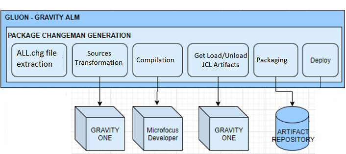

# Gravity Altair Synchronization

## Scope

This section is aimed to explain how Gravity Gluon handles ALL.chg files (based on Changeman expedients)previously located at reception folder including Splitting, Transformation and Compilation, packaging and finally deployment in DEV or
 CERT environments. This is, in other words how CI/CD is done in Gluon Gravity.

## Cycle & Workflow stages summary



## ALL.cfg files contents and Split

Once Listener has retrieved the ALL.chg file, a functionality called Splitter reads the data in it and separates in pieces according to predefined headers written into it. A header entry example could be as follows:

```  { .bash .copy }
#GRVT@CHG@# 20231003193417 AAE 001155 AEJDENSD JCL 0001 20230921 184656 ______ O
```

where you can easily distinguish that is gravity intended changeman dated expedient including a given dated versioned JCL.

``` { .bash .copy }
#GRVT@CHG@# 20230905141944 AGM 000311 GM4CPE96 FTE 0001 20230905 140310 BCD___ O
```

where you may find a gravity intended changeman expedient including a giben dated versioned cobol program

This is, a given .chg file may contain 1 to n sections including any kind of Altair objects such as JCLs, Bath or online Cobol programs, Maps, CPYs or Rex.

Depending on the kind of object included in the ALL.chg file, its contents may vary. For Cobol PGMs sources are included as well as expanded ones.

## Objects treatment

Depending on the split contents, a different further treatment is done. Please see following table

|**Object Type**|**Expanded source**|**Needs transformation**|**Needs Compilation**|
|---     |---        |---   |---    |
| PGM (Online/batch)   | yes | yes | yes |
| JCL    | yes | yes | no |
| REX    | no | yes | no |
| MAP (BMS)   | no | no  | yes |
| CPY / DCL   | no | no | no |

### Transformation

All objects within the ALL.chg file that need to be transformed, this is, adapted from Mainframe to be usable for Microfocus, are brougth together in a single call to the transformation SW called GravityOne. As a result of this transformation .ftetrf
    files are taken. For PGMs expanded sources are passed and transformation sources are gotten back.

### Compilation

Once the transformed files have been retrieved from GravityOne or even just using none transformed sources, objects are compiled separately according to the client specifications, this is, microfocus installed version or ddbb provider (udb,oracle,
    ...). A set of binary files for each object will be obtained as a result of compilation. As an example from a single PGM source (.cbl) we get up to four files (.gnt, .idy, .int, .lst)

## Packaging

This stage is aimed to bring together sources, expanded sources, transformed sources and binaries into a single zip file that will be uploaded, depending on the affected clients, in an Artifactory (by Jfrog) or NEXUS (by Sonatype) repository called cobol_linux_release.

Artifactory repository available at [**ARTIFACTORY_URL**](http://artifactory.santanderbr.corp/artifactory/cobol_linux_release/).

Nexus repository available at [**NEXUS_URL**](https://nexusmaster.alm.europe.cloudcenter.corp/) (sign-in needed)

In this repository, you may find an entry for each initial expedient (ALL.chg file) treated. For trazability purposes zip files are named using a standardized convention, this is,```ExpedientID```+```TimeStamp``` where ```TimeStamp``` is formed as
    YYYYMMDDHHMMSS. Example: AAE_001161+20231124133347087.zip

## Deployment

Once package is ready, deployment actions are done using Ansible. Ansible is based in playbooks and inventories controlled by the Gravity Team where files treatment and destination folders are properly set for each client and each environment. You may
    see an approximation below (take into account destination is a relative path based on each client/environment)

|**Object Type**|**File Type**|**Destination**|
|---     |---        |---   |
| PGM online   | .idy, .gnt | orpgm/exe |
| PGM batch    | .idy, .gnt | orcics/exe |
| MAP (BMS) | .mod | orfases/exe |

Besides binary files deployment, sources are also deployed in their appropriate folders for future debugging purposes. Typically sources will reside at the same labes as binaries paths but in a separate folder called ```fte```

It is quite important to note that Gluon does a backup of destination folders to get already existing objects prior the package to be deployed in the DEV environment. This backup could be used for restoration purpose using the appropriate workflows.
    Backup folder is commonly named as ```almbackup``` and resides in the deployment first level  destination path.

For technical info about configuration you may check following readme files within github.com Gluon organization:
[Configuration&Profiles](https://github.com/santander-group-shared-assets/gln-gravity-configuration/blob/main/README.md)
