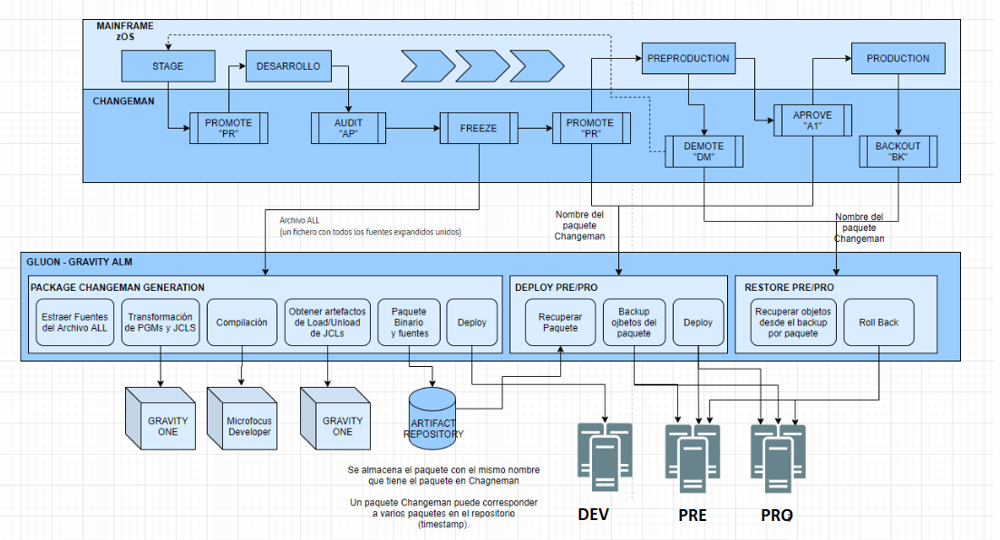

# Gravity Altair Synchronized Model Overview

This section is aimed to explain the Synchronized, also called Transitional, Gravity Model based on clients using Altair Architecture.

## Abstract

This picture shows the main steps that takes part on the synchronized model:

## Listener

For these particular transitional model, synchronization is done automatically by means of a piece of GLUON SW called listener. This software is in charge of retrieve periodically information from the reception folder on a given linux server (this
    data is indicated in a GLUON inventory per client controlled by Gravity Team). It is based on a microservice running at the same server where the reception folder is set in order to avoid miscarrieges or communication issues.

Anytime a Changeman package is moved in Mainframe, a new .chg file is placed at the reception folder indicanting that Changeman expedients data. This is the information listener is searching for. Depending on what standardized name is retrieved,
    further actions will be done by the appropriate github.com workflows.

- _ALL.chg: Readiness for CI and CD into DEV environment
- _APR.chg (APPROVE): Readiness for PRO environment deployment
- _PRM.chg (PROMOTE): Readiness for PRE environment deployment
- _DM.chg (DEMOTE): Readiness for restoring in PRE environment
- _BK.chg (BACKUP): Readiness for restoring in PRO environment

In the following sections you may read about treatment of the mentioned files. Depending on which kind of file is retrieved, some of our Gluon workflows will be triggered in order to completely fulfill SW lifecycle management including DEV, PRE or
    PRO deployments:

- [Altair Sync (CI/CD)](./altair-sync.md){:target="_blank"}
- [Altair PRE/PRO](./altair-prepro.md){:target="_blank"}
- [Altair Restore](./altair-restore.md){:target="_blank"}
