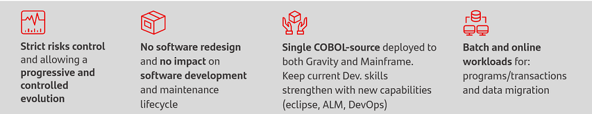
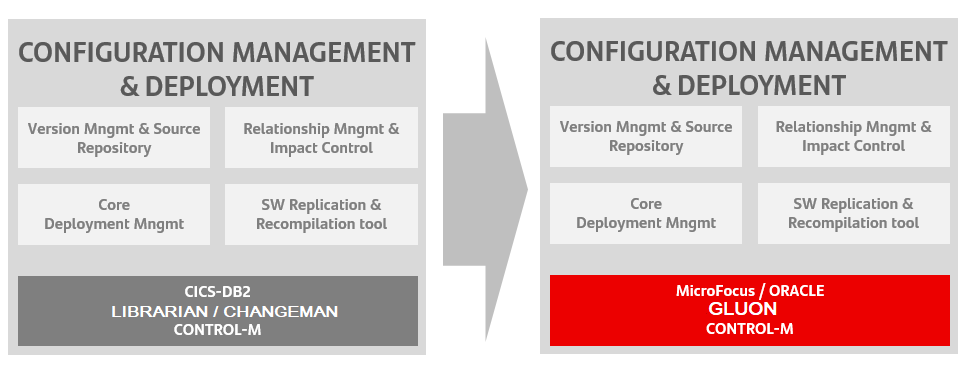
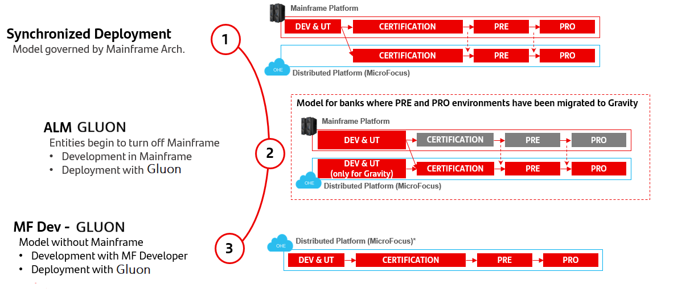

# Gravity Project overview

Gravity aims to take the Santander core banking out of the mainframe to the Group's open and scalable cloud infrastructure (Gravity). The migration approach is based on:

According to these principles, software development model and its coexistence with the current platform are cornerstone elements for the migration process and Gravity success.

The presented solution takes into account the current ‘Synchronized Model’ as well as the ‘Model governed by Mainframe’ and its evolution to the target model TO-BE: ‘Model governed by ALM in Gravity’.

## GLUON Blueprint

The goal of this blueprint is to compile detailed information regarding migration of Configuration Management & Deployment tools and processes aligned with GLUON platform:

Implement a new ALM model for new MicroFocus/Oracle platform
Implement all functionalities & validations and Lifecycle of either Partenon or Altair mainframe objects in the new Lifecycle for distributed platform
Migration of Relationship Analysis, Version Management, Change Management processes, …

## Phases (Models)

The phases in which the migration will take place are:

