# Gravity JCL Certification Workflows

## 1. Introduction

As mentioned this document is intended to deep into details about how JCL's objects are deployed in Certification environment. In order to understand how JCL's are carried out to the PRE-CERT environment please check Mainframe documentation.
[**MaaS Documentation**](https://santandernet.sharepoint.com/sites/SEPPARTRT/SitePages/Annexes/Annexed%20Partenon%20Gravity%20MaaS.%20Developer,%20Deployment%20_%20Configuration%20Management/Gravity.%20Edici%C3%B3n,%20Mantenimiento%20y%20Despliegue%20de%20JCLs/Gravity.%20Edici%C3%B3n,%20Mantenimiento%20y%20Despliegue%20de%20JCLs.aspx)

This is done in two steps: From Previous/TMP CERT to CERT and then from CERT to Previous/TMP PRE.

## 2\. Component Creation & Team onboarding

Component should be created at your gluon application (within the appropriate gluon organization). You may follow [GLUON CREATE COMPONENT](../../../../../application/component-management/create-component.md) taking into account you must use the
 following template:

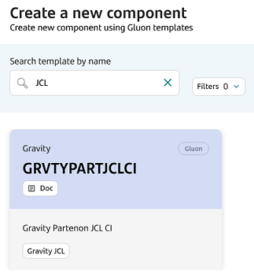

## 3\. Github.com ecosystem

Be familiar with github.com actions and look-like:

???- Note "**Enter in Github.com**"

    *   Open your browser
    *   Access or copy the URL (add to favorites recommended).
        Sample for Evolutives: <br>
        [Gobierno de Entornos](https://github.com/santander-group-sds-gln/sgt-apm1658-certjclgobierno) ** Restricted access **

???- Note "**Run a workflow**"

    *   Select the 'action' bar, click on the workflow you may want to execute and click on **Run Workflow** button

    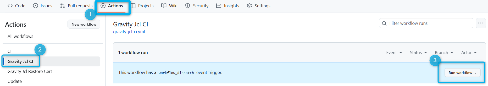

    
    *   **Use workflow from**: you may select it according at your branch strategy (development by default)

???- Note "**Check the workflow's log:**"

    *   Click on **Workflow execution** and then on the desired stage
    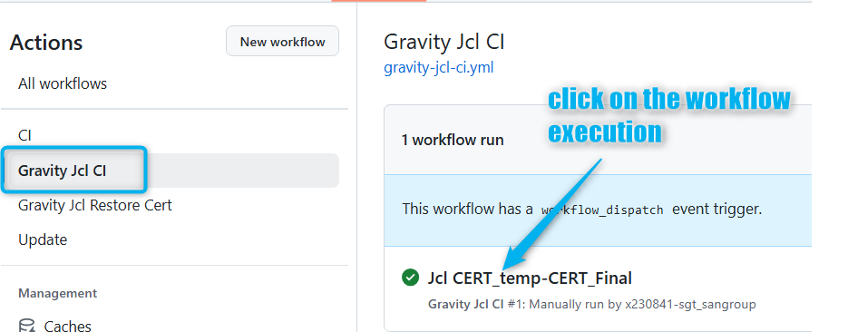
    *   and then on the desired **stage** and **job**<br>
    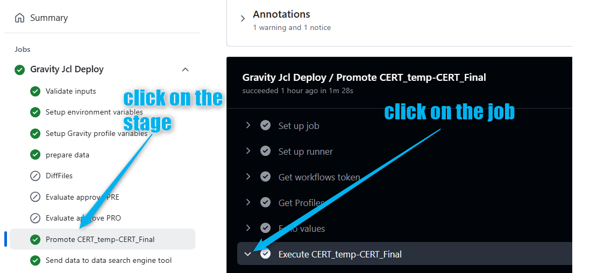
    <br>

    !!! Info "JCLS JOB SUMMARY"
        Pay special attention at the button of the console where you can find a summary of the most important actions done during the workflow execution. Example:
        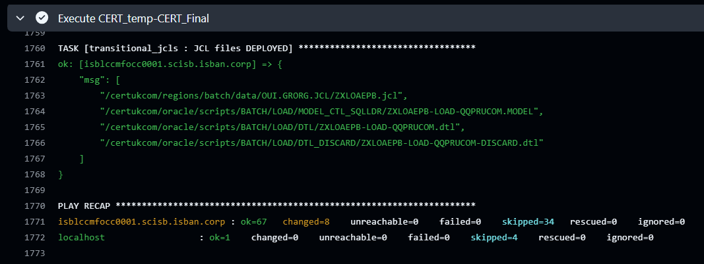

???- Note "**Check Annotations for Workflow entries:**"

    You may also check on Annotations the main entries given at workflow configuration time
    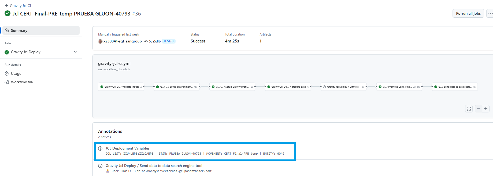
  
## 4\. Workflows Description

### 4.1 From CERT Previous to CERT final libraries

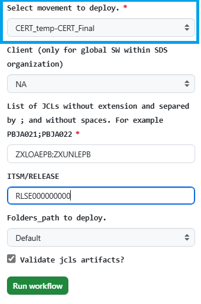
???+ Parameters

    *  **Use Workflow from** (select properly depending on your branch strategy)
    *  **Select movement to deploy.:** Select ***CERT-Temp-CERT-Final***
    *  **Client**: It may be consider only for Global JCL's, this is those promoted JCLs within SDS-GLN organization. For Local JCL's client is retrieved from the own gluon organization (Examples: UKEU from santander-group-scb-gln, SVGS from santander-group-usa-gln, etc... )
    *  **JCL_LIST:** List of JCLs without extension and **separated by semicolon** and without spaces. JCLs have to exist in origin directory.
    *  **ITSM/RELEASE:** ITSM code or Release code. It is been used in the workflow execution name as well in audit log.
    *  **FOLDERS PATH:** Keep in default
    *  **VALIDATE_ARTIFACTS:** if checked an script is invoked in order to guarantee that the JCL has all related artifacts on the origin. If some artifact is missing job will be stopped.

### 4.2 Restore CERT Final libraries

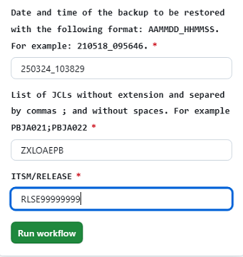
???+ Parameters

    *  **Use Workflow from** (select properly depending on your branch strategy)
    *   **BACKUP\_DATE:**  Backup Date in format AAMMDD\_HHMSS. This information can be found in deployments JOBS log looking for the pattern: "\_bk/BK".
    *   **JCL\_LIST:** List of JCLs without extension and separated by semicolons and without spaces. JCLs have to exist in origin directory.
    *   **ITSM/RELEASE:** ITSM code or Release code. It is been used for audit log.

### 4.3 From CERT Final libraries to PRE Previous libraries

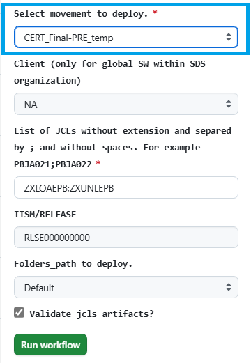
???+ Parameters

    *  **Use Workflow from** (select properly depending on your branch strategy)
    *  **Select movement to deploy.:** Select ***CERT-Final-PRE-Temp***
    *  **Client**: It may be consider only for Global JCL's, this is those promoted JCLs within SDS-GLN organization. For Local JCL's client is retrieved from the own gluon organization (Examples: UKEU from santander-group-scb-gln, SVGS from santander-group-usa-gln, etc... )
    *   **JCL\_LIST:** List of JCLs without extension and separated by semicolons and without spaces. JCLs have to exist in origin directory
    *   **ITSM/RELEASE:** ITSM code or Release code. It is been used in the workflow execution name as well in audit log.
    *   **FOLDERS\_PATH:** For UKEU only. Available values on the combo: Default or deposit protection.

## 5\. Jobs Behaviour

### 5.1 **FROM TEMP TO FINAL**

This is for either 'CERT-TEMP to CERT-Final', 'PRE-TEMP to PRE-Final' or 'PRO-TEMP to PRO-Final'

* Check that JCLs exist. Job will fail if any of the JCL listed is not found
* Finds all jcl related files
* If checked, a new step is done to guarantee that the JCL has all related artifacts on the origin by means of an script called 'validate\_jcl\_artifacts.sh' . In case of some missing required associated artifacts in origin folder, it will show up
 an error message as following
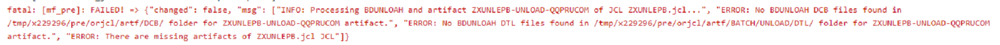{: style="height:75px"}

* Moves all found files in the FINALLY directory to the backup directory and rename the file with the deploy date and time (i.e.```/preukcom/orjcl/ORG.GRISB.JCL_bk/BK_210607/PBJA021.jcl_210607_134002```)

* Moves all found files in the temporal directory to the FINAL directory
* Audit file will be generated with the information of the JCL deploy with the name of the transitional-jcl-audit.log in the same path that the jcl are deployed OUI.GRORG.JCL\_audit but in the folder.

    In case of failure, the action column will have the value AUTO\_RESTORED with the restored files.

### 5.2 **FROM FINAL TO TEMP**

This is for either 'CERT-Final to PRE-TEMP' or 'PRE-Final to PRO-TEMP'

* Check that JCLs exist. Job will fail if any of the JCL listed is not found
* Finds all jcl related files
* Transforms the jcl (*.jcl), model (*.MODEL) and SQL (\*.sql) to adapt then to next environment with [the adaptaJCL.sh script](https://github.alm.europe.cloudcenter.corp/sgt-ISL00279/50074298/blob/master/adaptaJCL.sh)
    .

* Deletes all JCL related files (using the pattern described in the step 2) from the temporal directory of target servers (all hosts in *Microfocus* server group).
* Copies all JCL files to the temporal directory of target servers

* It is done a **comparison** between the JCLs just promoted to the environment-temp folders to the existing ones in the environment-final

### 5.3 **RESTORE**

Any case of restore in CERT, PRE or PRO

* Check that backup file with indicated nomenclature exists.
* Copies JCLs and related files to the final directory of target servers, with correct name

* Audit file will be generated with the information of the JCL restore with the name of the transitional-jcl-audit.log in the same path that the jcl are deployed OUI.GRORG.JCL\_audit but in the folder.

    In case of failure, the action column will have the value AUTO\_RESTORED with the restored files.

## 6\. **ANEXES:**

### **AUDIT FILE**

Audit sample extracted from the same path where JCLs are stored:

```text
DATE    USER    ITSM/RELEASE    FILE    ACTION        JOB
22/03/02-10:43:30 x230841 test                     ZXUNLEPB-UNLOAD-QQPRUCOM-FB.sql_220302_104330               RESTORED      https://sgt-grv.jenkins.alm.europe.cloudcenter.corp/sgt-grv/job/sgt-shift-operations/job/UKEU/job/PRO/job/RESTORE\_PRO\_Final/8/
22/03/02-10:43:30 x230841 test                     ZXUNLEPB-UNLOAD-QQPRUCOM-CSV.sql\_220302\_104330              RESTORED      https://sgt-grv.jenkins.alm.europe.cloudcenter.corp/sgt-grv/job/sgt-shift-operations/job/UKEU/job/PRO/job/RESTORE\_PRO\_Final/8/
22/03/11-09:54:44 x230841 RLSE00000000             ZXUNLEPB.jcl                                                DEPLOYED      https://sgt-grv.jenkins.alm.europe.cloudcenter.corp/sgt-grv/job/sgt-shift-operations/job/UKEU/job/PRO/job/5.-JCL-PRO\_temp----PRO\_Final/11/
22/03/11-09:54:44 x230841 RLSE00000000             ZXJCLALE.jcl                                                DEPLOYED      https://sgt-grv.jenkins.alm.europe.cloudcenter.corp/sgt-grv/job/sgt-shift-operations/job/UKEU/job/PRO/job/5.-JCL-PRO\_temp----PRO\_Final/11/
22/03/11-09:54:44 x230841 RLSE00000000             ZXUNLEPB-UNLOAD-QQPRUCOM.dcb                                DEPLOYED      https://sgt-grv.jenkins.alm.europe.cloudcenter.corp/sgt-grv/job/sgt-shift-operations/job/UKEU/job/PRO/job/5.-JCL-PRO\_temp----PRO\_Final/11/
22/03/11-09:54:44 x230841 RLSE00000000             ZXUNLEPB-UNLOAD-QQPRUCOM-FB.dtl                             DEPLOYED      https://sgt-grv.jenkins.alm.europe.cloudcenter.corp/sgt-grv/job/sgt-shift-operations/job/UKEU/job/PRO/job/5.-JCL-PRO\_temp----PRO\_Final/11/
22/03/11-09:54:44 x230841 RLSE00000000             ZXUNLEPB-UNLOAD-QQPRUCOM-CSV.sql                            DEPLOYED      https://sgt-grv.jenkins.alm.europe.cloudcenter.corp/sgt-grv/job/sgt-shift-operations/job/UKEU/job/PRO/job/5.-JCL-PRO\_temp----PRO\_Final/11/
22/03/11-09:54:44 x230841 RLSE00000000             ZXUNLEPB-UNLOAD-QQPRUCOM-FB.sql                             DEPLOYED      https://sgt-grv.jenkins.alm.europe.cloudcenter.corp/sgt-grv/job/sgt-shift-operations/job/UKEU/job/PRO/job/5.-JCL-PRO\_temp----PRO\_Final/11/
```

### **COMPARISON RESULTS**

For those jobs that stablishes a comparison between JCLs, the result can be viewed or/and downloaded from the workflow in any of the following ways:

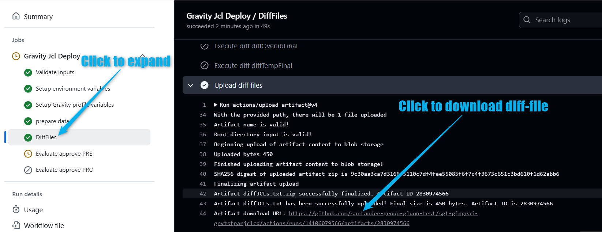

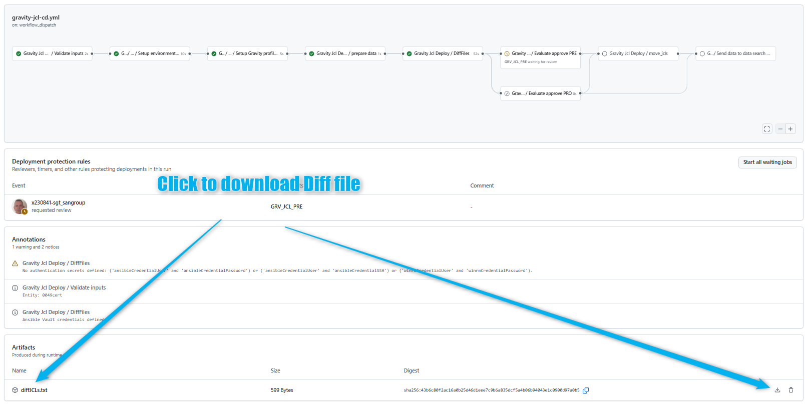

This diffJCL.txt file may looks like as follows:

* If there is a new JCL related file in the promoted file vs the destination folders content (Example: a new dtl):

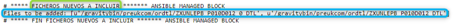

* If some JCL related file are in the destination folder but not in the promoted files (Example: a dtl not included):

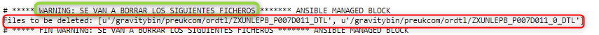

* If there is no change in the JCLs and/or in the related files between promoted and destination folder:

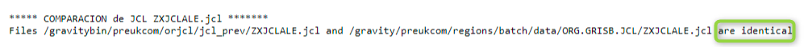

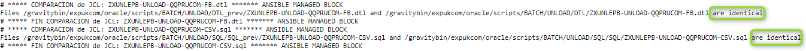

* If there is a change in an artifact, as an example on the .jcl comparison is shown in two column format (on the left side promoted file, on the right side existing file);

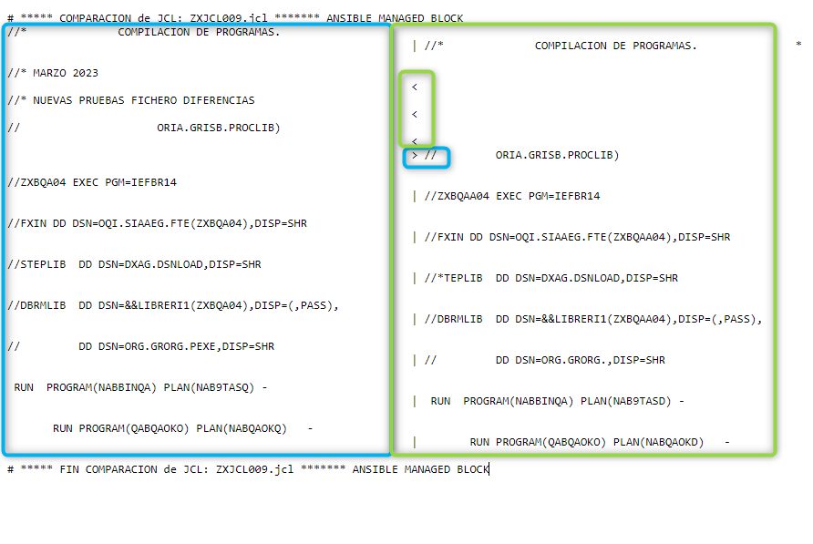

## 7\. CERT/PRE/PRO JCLs folders structure guidance

* Check on [**UK Corporate** folders structure](https://santandernet.sharepoint.com/:w:/s/Architecture_SWLifecycle_Public/EbKsXUpPfDFKmFtECM0XDEoBRspuUvx03UXgVPzUs89f8w?e=ra1BrH)

* Check on [**USA** folders structure](https://santandernet.sharepoint.com/:w:/s/Architecture_SWLifecycle_Public/EWR_AzVXznhDqkhn-Bk_uqwBu9hv-6SAlNp37uJXYADAcA?e=tNHtPS)

* Check on [**SCIB** folders structure](https://santandernet.sharepoint.com/:w:/s/Architecture_SWLifecycle_Public/EY1PoEizf5lPn2gkqNcdtQMBNZCy28gDGMY3sNEYRezYWA?e=JOlgtT)

* Check on [**Santander Spain** folders structure](https://santandernet.sharepoint.com/:w:/s/Architecture_SWLifecycle_Public/EU8j2BTPwJ1OuW7LO9N4p5sBSt2UytAO4sF4VE0uKmgWbw?e=nd2S4g)

* Check on [**Santander Mexico** folders structure](https://santandernet.sharepoint.com/:w:/r/sites/Architecture_SWLifecycle_Public/Shared%20Documents/ALMMC%20-%20Gravity/Documentation/WORD/estructura_carpetas_jcls_MEX_PREPRO.docx?d=w5fd69953041346f69264b3a65d13e930&csf=1&web=1&e=YtOKS1)

* Check on [**Santander Chile** folders structure](https://santandernet.sharepoint.com/:w:/r/sites/Architecture_SWLifecycle_Public/Shared%20Documents/ALMMC%20-%20Gravity/Documentation/WORD/estructura_carpetas_jcls_CHILE_PREPRO.docx?d=w4cf10423e62c496cbc46faa5d7c82470&csf=1&web=1&e=vLewhN)

* Check on [**Santander Germany** folders structure](https://santandernet.sharepoint.com/:w:/r/sites/Architecture_SWLifecycle_Public/Shared%20Documents/ALMMC%20-%20Gravity/Documentation/WORD/estructura_carpetas_jcls_DEU_CERT_only.docx?d=web99a89eea934ff5b44a6c86325487d3&csf=1&web=1&e=RH7ZAU)

## 8\. Trouble Shooting and job execution information

Some errors could appear while executing any of the workflows. These are most common ones:

* "*JCL's *****\* are duplicated in the JCL list*" meaning a set of JCLs has been specified at least twice.

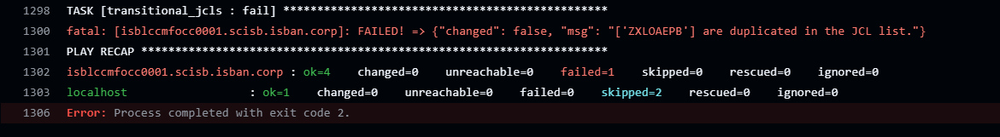

* "*JCL *****\* not found in temp directory*", meaning specified JCL is not in origin

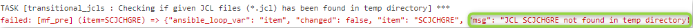

As mentioned above, while executing jobs that moves JCLs from CERT-TEMP to CERT-Final folders an entry for each file moved is written at the auditlog. You may take a look into it at:

* UK CERT: /certukcom/regions/batch/data/OUI.GRORG.JCL\_audit
* USA CERT: /certanusa/regions/batch/data/OSI.GRORG.JCL\_audit
* SCIB CERT: /certscib/regions/batch/data/ORI8.GRORG.JCL\_audit
* ESP CERT: /certsanesp/regions/batch/data/PRP.GRORG.JCL\_audit

## 9\. FAQ's

You may also take a look to the [FAQ's section](../gravity-support-faqs.md)

## 10\. Doubts, incidents or support

### **10.1 Functional doubts**

For functional doubts you can access to the Team Channel: [ALMMC - Gravity](https://teams.microsoft.com/l/channel/19%3A700a602f72c1462abc5dbcb25e01004d%40thread.skype/ALMMC%20-%20Gravity?groupId=e08adfa0-b3fd-4054-9ec0-eeb99835f6d0&tenantId=35595a02-4d6d-44ac-99e1-f9ab4cd872db)

During the pilots phase you may also consider to contact ALM Gravity Focal Points

### **10.2 Support or incidents in Gluon ALM cycle (Workflows)**

For any incident or support that you may need while using Gluon Workflows, it is necessary to open a Service now to [Gluon Gravity ALM Support team](../gravity-support-faqs.md/#how-to-open-a-support-ticket)

### **10.3 Support or incidents in Mainframe (scripts)**

For any incident or support that are related to scripts it will be needed to open a ITSM ticket to the following categorization

[Technical Catalog / Systems / Mainframe / Gravity - Development Support](https://santander.service-now.com/com.glideapp.servicecatalog_cat_item_view.do?v=1&sysparm_id=ce3e0a471b33189862ce85506e4bcb3c&sysparm_processing_hint=setfield:request.parent%3d&sysparm_link_parent=d592a6601b40378020044002cd4bcba4&sysparm_catalog=719aafd0db031f448c6c7cde3b9619f8&sysparm_catalog_view=catalog_technical_catalog)

Resolutor Group: SGT\_IN\_SY\_ES\_DEV\_SUP\_MAINFRAME

### **10.4. Support or incidents in Mainframe (JCLs transformation)**

For any incident or support related to JCLs transformation, please rise a ticket to SGT\_AP\_SE\_AA\_SGS Host& GIPIH N1 at the following categorization:

* Category: Architecture
* Subcategory: SGS Host & Gipih
* Environment: Production
* Element: Gipih & Tools SDLC  HOST

## 11\. Videos

| Título | **1. Topic** | **2\. Link** | **3\. Language** | **4\. Duration** |
| --- | --- | --- | --- | --- |
| CI Workflows Training Session | JCL  | [JCLs Training Session](https://santandernet-my.sharepoint.com/personal/x230841_santanderglobaltech_com/_layouts/15/stream.aspx?id=%2Fpersonal%2Fx230841%5Fsantanderglobaltech%5Fcom%2FDocuments%2FRecordings%2FFormaci%C3%B3n%20en%20promoci%C3%B3n%20de%20JCLs%20a%20trav%C3%A9s%20de%20workflows%20de%20GLUON%2D20250429%5F110515%2DGrabaci%C3%B3n%20de%20la%20reuni%C3%B3n%2Emp4&referrer=StreamWebApp%2EWeb&referrerScenario=AddressBarCopied%2Eview%2E662c7e03%2D914d%2D4cfa%2D9b6b%2D01397bcda9e8&ga=1) | Spanish | 57:53 |
