# Gravity JCLs Overlib workflows

## 1\. Scope, Overview and workflows diagram

The goal of these workflows is to fulfill certains behaviours on PRE and PRO environment using CSA and overlib folders in order to be able to cover already existing procedures in Mainframe performed by CCB, Implantation and CSA teams.

|     |     |
| --- | --- |
| 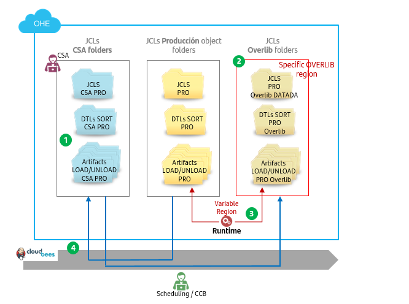 | 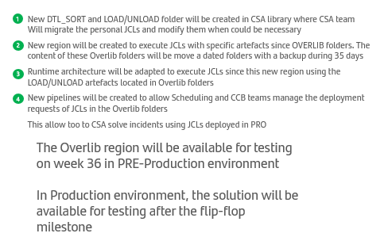 |

ALM Multicloud offers a list of workflows suitable for users to promote jcls through the different folders. You may see a resume below:

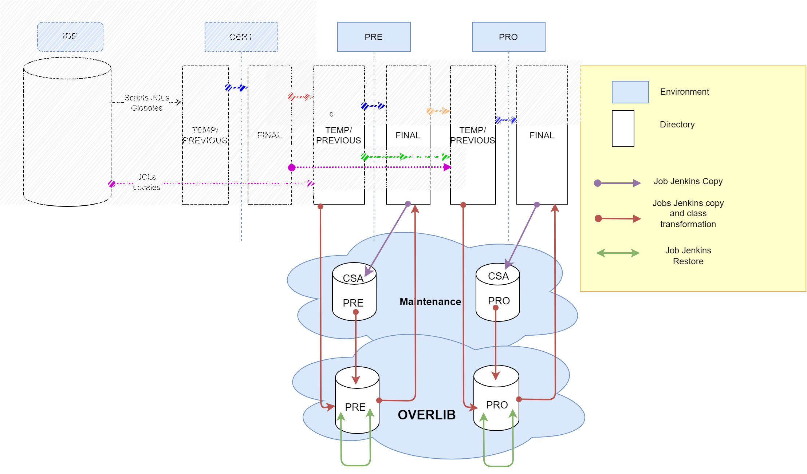

## 2\. Component Creation & Team onboarding

Component should be already created at your gluon organization together with the Team that can access and execute the appropriate workflows. In case of any doubt please contact your [Gluon Gravity ALM Support team](../gravity-support-faqs.md/#how-to-open-a-support-ticket)

## 3\. Github.com ecosystem

Be familiar with github.com actions and look-like:

???- Note "**Enter in Github.com**"

    *   Open your browser
    *   Access or copy the URL (add to favorites recommended).<br>
        Sample [USA JCLs Repo](https://github.com/santander-group-usa-gln/sov-jclplan-grvusajcl):  ** Restricted access **

???- Note "**Run a workflow**"

    *   Select the 'action' bar, click on the workflow you may want to execute and click on **Run Workflow** button

    

    *   **Use workflow from**: you may select it according at your branch strategy (development by default)

???- Note "**Check the workflow's log:**"

    *   Click on **Workflow execution** and then on the desired stage
    
    *   and then on the desired **stage** and **job**<br>
    
    <br>

    !!! Info "JCLS JOB SUMMARY"
        Pay special attention at the button of the console where you can find a summary of the most important actions done during the workflow execution. Example:
        

???- Note "**Check Annotations for Workflow entries:**"

    You may also check on Annotations the main entries given at workflow configuration time
    

## 4\. Jobs Description

### 4.1. Jobs OVERLIB PRE

See details on each overlib workflows in PREProduction

#### 4.1.1. From Final PRE libraries to PRE CSA Folders

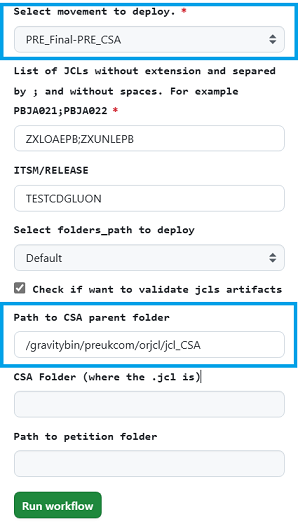
???+ Parameters

     *  **Select movement to deploy.:** Select ***PRE_Final-PRE_CSA***
     *  **JCL\_LIST**: List of JCLs without extension and separated by semicolons and without spaces. JCLs have to exist in origin directory.
     *  **ITSM/RELEASE:** ITSM code or Release code. It is been used for audit log. (not mandatory)
     *  **FOLDERS\_PATH**: For UK only. Available values on the combo: Default and deposit protection
     *  **CSA\_PATH**: Location of the CSA folder where the JCLs are going to be to copy to. By default value is "*/CSA\_PATH/*" but it must be filled in with the appropriate value.

#### 4.1.2. From CSA folders to OVERLIB PRE libraries (Only JCL without transformation)

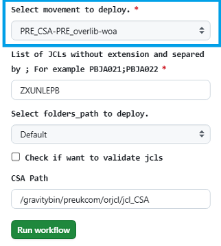
???+ Parameter

    *  **Select movement to deploy.:** Select ***PRE_CSA-PRE_overlib-woa***
    *  **JCL\_LIST**: List of JCLs without extension and separated by semicolons and without spaces. JCLs have to exist in origin directory
    *  **CSA\_PATH**: Location of the CSA folder where the JCLs are going to be to copy from. By default value is "*/CSA\_PATH/*" but it must be filled in with the appropriate value.

#### 4.1.3. From CSA folders to OVERLIB PRE libraries

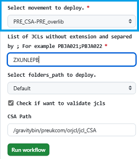
???+ Parameter

    *  **Select movement to deploy.:** Select ***PRE_CSA-PRE_overlib***
    *  **JCL\_LIST**: List of JCLs without extension and separated by semicolons and without spaces. JCLs have to exist in origin directory
    *  **CSA\_PATH**: Location of the CSA folder where the JCLs are going to be to copy from. By default value is "*/CSA\_PATH/*" but it must be filled in with the appropriate value.
    *  **VALIDATE\_ARTIFACTS**: if checked an script is invoked in order to guarantee that the JCL has all related artifacts on the origin. If some artifact is missing job will be stopped.

#### 4.1.4. From OVERLIB PRE libraries to Final PRE libraries (Only JCL without transformation)

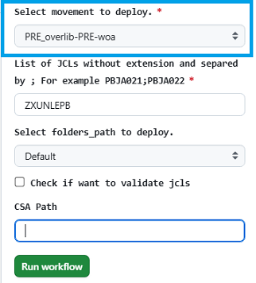
???+ Parameters

    *  **Select movement to deploy.:** Select ***PRE_overlib-PRE-woa***
    *  **JCL\_LIST**: List of JCLs without extension and separated by semicolons and without spaces. JCLs have to exist in origin directory.
    *  **FOLDERS\_PATH**: For UK only. Available values on the combo: Default,  deposit protection and CDB.

#### 4.1.5. From OVERLIB PRE libraries to Final PRE libraries

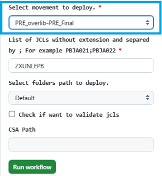
???+ Parameters

    *  **Select movement to deploy.:** Select ***PRE_overlib-PRE-woa***
    *  **JCL\_LIST**: List of JCLs without extension and separated by semicolons and without spaces. JCLs have to exist in origin directory.
    *  **FOLDERS\_PATH**: For UK only. Available values on the combo: Default,  deposit protection and CDB.

#### 4.1.6. From PRE previous libraries to PRE overlib libraries

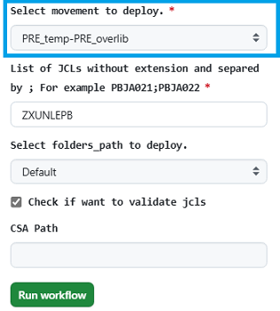
???+ Parameters

    *  **Select movement to deploy.:** Select ***PRE_temp-PRE_overlib***
    *  **JCL\_LIST:** List of JCLs without extension and separated by semicolons and without spaces. JCLs have to exist in origin directory.
    *  **FOLDERS\_PATH:** For UK only. Available values on the combo: Default and deposit protection.
    *  **VALIDATE\_ARTIFACTS:** if checked an script is invoked in order to guarantee that the JCL has all related artifacts on the origin. If some artifact is missing job will be stopped.

### 4.2. Jobs OVERLIB PRO

See details on each overlib workflows in Production

#### 4.2.1. From Final PRO libraries to PRO CSA Folders

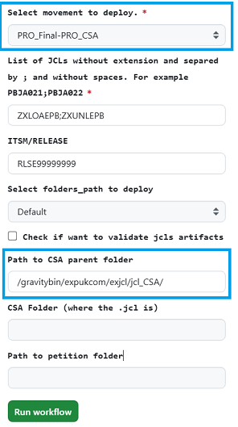
???+ Parameters

     *  **Select movement to deploy.:** Select ***PRO_Final-PRO_CSA***
     *  **JCL\_LIST**: List of JCLs without extension and separated by semicolons and without spaces. JCLs have to exist in origin directory.
     *  **ITSM/RELEASE:** ITSM code or Release code. It is been used for audit log. (not mandatory)
     *  **FOLDERS\_PATH**: For UK only. Available values on the combo: Default and deposit protection
     *  **CSA\_PATH**: Location of the CSA folder where the JCLs are going to be to copy to. By default value is "*/CSA\_PATH/*" but it must be filled in with the appropriate value.

#### 4.2.2. From CSA folders to OVERLIB PRO libraries (Only JCL without transformation)

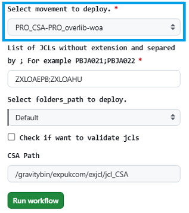
???+ Parameter

    *  **Select movement to deploy.:** Select ***PRO_CSA-PRO_overlib-woa***
    *  **JCL\_LIST**: List of JCLs without extension and separated by semicolons and without spaces. JCLs have to exist in origin directory
    *  **CSA\_PATH**: Location of the CSA folder where the JCLs are going to be to copy from. By default value is "*/CSA\_PATH/*" but it must be filled in with the appropriate value.

#### 4.2.3. From CSA folders to OVERLIB PRO libraries

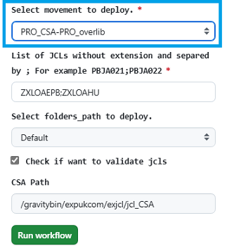
???+ Parameter

    *  **Select movement to deploy.:** Select ***PRO_CSA-PRO_overlib***
    *  **JCL\_LIST**: List of JCLs without extension and separated by semicolons and without spaces. JCLs have to exist in origin directory
    *  **CSA\_PATH**: Location of the CSA folder where the JCLs are going to be to copy from. By default value is "*/CSA\_PATH/*" but it must be filled in with the appropriate value.
    *  **VALIDATE\_ARTIFACTS**: if checked an script is invoked in order to guarantee that the JCL has all related artifacts on the origin. If some artifact is missing job will be stopped.

#### 4.2.4. From OVERLIB PRO libraries to Final PRO libraries (Only JCL without transformation)

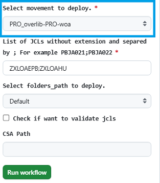
???+ Parameters

    *  **Select movement to deploy.:** Select ***PRO_overlib-PRO-woa***
    *  **JCL\_LIST**: List of JCLs without extension and separated by semicolons and without spaces. JCLs have to exist in origin directory.
    *  **FOLDERS\_PATH**: For UK only. Available values on the combo: Default, deposit protection and CDB.

#### 4.2.5. From OVERLIB PRO libraries to Final PRO libraries

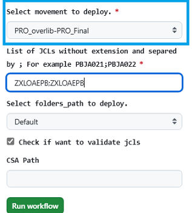
???+ Parameters

    *  **Select movement to deploy.:** Select ***PRO_overlib-PRO-woa***
    *   **JCL\_LIST**: List of JCLs without extension and separated by semicolons and without spaces. JCLs have to exist in origin directory.
    *   **FOLDERS\_PATH**: For UK only. Available values on the combo: Default, deposit protection and CDB.

#### 4.2.6. From previous PRO libraries to PRO overlib libraries

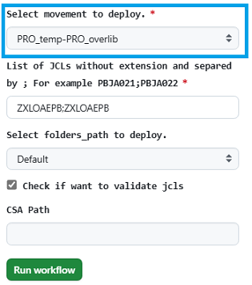
???+ Parameters

    *  **Select movement to deploy.:** Select ***PRO_temp-PRO_overlib***
     *  **JCL\_LIST:** List of JCLs without extension and separated by semicolons and without spaces. JCLs have to exist in origin directory.
     *  **FOLDERS\_PATH:** For UK only. Available values on the combo: Default and deposit protection.
     *   **VALIDATE\_ARTIFACTS:** if checked an script is invoked in order to guarantee that the JCL has all related artifacts on the origin. If some artifact is missing job will be stopped.

## **5\. JOBS BEHAVIOUR**

### **5.1. FROM FINAL TO CSA**

This is either for 'PRE-Final to CSA-PRE' or 'PRO-Final to CSA-PRO'

* Check that JCLs exist. Job will fail if any of the JCL listed is not found or if the list is empty.
* Finds all JCL and JCL related files (load/unload and dtl's) in the original folder.
* Checks whether JCLs and related files exist in the destination folder. If so job action will delete all, JCL and related files, (using the pattern described in the step 2) from the CSA directory of target server (all hosts in *Microfocus* server group).
* Copies all JCL files and related files (no transformation is needed) into the CSA directory of target servers and give 664 rights in order to allow modifications. It may also change the unix group owner to csa group.

### **5.2. FROM CSA TO OVERLIB**

This is for 'CSA-PRE to PRE-OVERLIB' or 'CSA-PRO to 'PRO-OVERLIB'

* Check that JCLs exist. Job will fail if any of the JCL listed is not found
* Find all jcl files and related files in the CSA folders (origin)
* Once checks are done, workflow will display the difference between JCL about to move and the existing one at final destination stopping the execution


You may see those differences either in console or attached txt file and so decide to continue deploying (Proceed) or stopping workflow (Abort). So, **if Approve is checked**...

* Copy Jcls and related files from CSA folder to the overlib day folder using a pattern: **D<***YYMMDD> (sample: D220901)*

    i) If a JCL is found at destination (on either today or yesterday dated folders) job will ended KO showing a message on the console log as follows:

    ```text
    failed: \[mf\_pre\] (item=ZXUNLEPB) => {"ansible\_loop\_var": "item", "changed": false, "item": "ZXUNLEPB", "msg": "JCL ZXUNLEPB found in overlib directory!.
    If you want to deploy, check the 'FORCE\_DEPLOY' parameter!."}
    ```

    ii) In this scenario you may use 'force' deployment in order to override contents at destination folder.

    iii)  If so, before copying contents to overlib folders, a backup of the OVERLIB folder (destination) is done.

    iv) JCLs are transformed in order to be adapted to the overlib region by means of the [adaptaJCL.sh script](https://github.alm.europe.cloudcenter.corp/sgt-ISL00279/50074298/blob/master/adaptaJCL.sh) and copied to the overlib folder accurate folders.

    v) Permissions are re-adapted to the original ones (without csa unix group rights to modify them)

* Audit file will be generated with the information of the JCL restore with the name of the transitional-jcl-audit.log in the same path that the jcl are deployed  (OUI.GRORG.JCL\_audit or EXP.GRISB.JCL\_audit).

### **5.3. FROM CSA TO OVERLIB (W/O Adaptation)**

This is for 'CSA-PRE to PRE-OVERLIB' (WOA) or 'CSA-PRO to 'PRO-OVERLIB' (WOA)

* Check that JCLs exist. Job will fail if any of the JCL listed is not found
* Find only .jcl files in the CSA folder (origin)
* Copy only  .jcls  from CSA folder to the overlib day folder using a pattern: **D<***YYMMDD> (sample: D220901)*

    i) If a JCL is found at destination (on either today or yesterday dated folders) job will ended KO showing a message on the console log as follows:

    ```text
    failed: \[mf\_pre\] (item=ZXUNLEPB) => {"ansible\_loop\_var": "item", "changed": false, "item": "ZXUNLEPB", "msg": "JCL ZXUNLEPB found in overlib directory!.
    If you want to deploy, check the 'FORCE\_DEPLOY' parameter!."}
    ```

    ii) In this scenario you may use 'force' deployment in order to override contents at destination folder.

    iii)  If so, before copying contents to overlib folders, a backup of the OVERLIB folder (destination) is done.

    iv) JCLs are copied directly to overlib folder without any adaptation.

    v) Permissions are re-adapted to the original ones (without csa unix group rights to modify them)

* Audit file will be generated with the information of the JCL restore with the name of the transitional-jcl-audit.log in the same path that the jcl are deployed  (OUI.GRORG.JCL\_audit or EXP.GRISB.JCL\_audit).

### **5.4. FROM OVERLIB TO FINAL**

This is for either 'OVERLIB-PRE to PRE-Final' or 'OVERLIB-PRO to PRO-Final'

* Check that JCLs exist. Job will fail if any of the JCL listed is not found
* Find all jcl files and related files in the current date overlib folder **D<***YYMMDD> (sample: D220901)*
* Once checks are done, workflow will display the difference between JCL about to move and the existing one at final destination stopping the execution.


You may see those differences either in console or attached txt file and so decide to continue deploying (Proceed) or stopping workflow (Abort). So, **if Approve is checked**...

* Copy Jcls and related files from current date overlib folder to the Final folders (destination):

    i) If a JCL is found at destination (either PRE-Final or PRO-Final) job will ended KO showing a message on the console log as follows:

    ```text
    failed: \[mf\_pre\] (item=ZXUNLEPB) => {"ansible\_loop\_var": "item", "changed": false, "item": "ZXUNLEPB", "msg": "JCL ZXUNLEPB found in PRE-Final directory!.
    If you want to deploy, check the 'FORCE\_DEPLOY' parameter!."}
    ```

    ii) In this scenario you may use 'force' deployment in order to override contents at destination folder.

    iii)  If so, before copying contents to Final folders, a backup of the Final folder (destination) is done.

    iv) JCLs are transformed in order to be adapted to the accuratte class region by means of the [adaptaJCL.sh script](https://github.alm.europe.cloudcenter.corp/sgt-ISL00279/50074298/blob/master/adaptaJCL.sh) and copied to the Final accurate folders.

* An entry 'DEPLOYED' with the information of the JCL and related files restored will be generated in the AUDIT\_FILE (transitional-jcl-audit.log in OUI.GRORG.JCL\_audit or EXP.GRISB.JCL\_audit).

### **5.5. FROM TEMP TO OVERLIB**

This is either for 'PRE-Temp to OVERLIB-PRE' or 'PRO-Temp to OVERLIB-PRO'

* Check that JCLs exist. Job will fail if any of the JCL listed is not found
* Find all jcl files and related files in the temp folders (origin)
* If checked, a new step is done to guarantee that the JCL has all related artifacts on the origin by means of an script called 'validate\_jcl\_artifacts.sh'. In case of some missing required associated artifacts in origin folder, it will show up an
 error message as following:


* Copy Jcls and related files from Temp folders to the overlib day folder using a pattern: **D<***YYMMDD> (sample: D220901)*

    i) If a JCL is found at destination (on either today or yesterday dated folders) job will ended KO showing a message on the console log as follows:

    ```text
    failed: \[mf\_pre\] (item=ZXUNLEPB) => {"ansible\_loop\_var": "item", "changed": false, "item": "ZXUNLEPB", "msg": "JCL ZXUNLEPB found in overlib directory!.
    If you want to deploy, check the 'FORCE\_DEPLOY' parameter!."}
    ```

    ii) In this scenario you may use 'force' deployment in order to override contents at destination folder.

    iii)  If so, before copying contents to overlib folders, a backup of the OVERLIB folder (destination) is done.

    iv) JCLs are transformed in order to be adapted to the accuratte class region by means of the [adaptaJCL.sh script](https://github.alm.europe.cloudcenter.corp/sgt-ISL00279/50074298/blob/master/adaptaJCL.sh) and copied to the overlib folder
     accurate folders.

* It is done also a **comparison** between what it's been promoted to Overlib vs contents on Final environment folders.
* An entry 'DEPLOYED' with the information of the JCL and related files restored will be generated in the AUDIT\_FILE (transitional-jcl-audit.log in OUI.GRORG.JCL\_audit or EXP.GRISB.JCL\_audit)

### **5.6. OVERLIB RESTORE**

This is either for 'RESTORE PRE Overlib' or 'RESTORE PRO Overlib'

* Check that JCLs and/or related files exists in the backup folders specified in the 'backup\_date' entry parameter. Job will fail if any of the JCL listed are not found.
* Copy JCLs and related files from the backup folders to the current date overlib folder. Job will fail if current date overlib folder is not found.
* An entry 'RESTORED' with the information of the JCL and related files restored will be generated in the AUDIT\_FILE (transitional-jcl-audit.log in OUI.GRORG.JCL\_audit or EXP.GRISB.JCL\_audit)

## **6\. ANEXES:**

### **AUDIT FILE**

  Audit sample extracted from the same path where JCLs are stored:

Audit Sample

```text
DATE        USER        ITSM/RELEASE        FILE        ACTION      JOB
22/09/21-10:24:10   n381412 JIWA039   JIWA039.jcl DEPLOYED    https://sgt-grv.jenkins.alm.europe.cloudcenter.corp/sgt-grv/job/sgt-shift-operations/job/UKEU/job/OVERLIB/job/3.4.PRE_CSA----PRE_OVERLIB/20/
22/09/21-10:24:10   n381412 JIWA039   JIWA039_STEP05A_DTL   DEPLOYED    https://sgt-grv.jenkins.alm.europe.cloudcenter.corp/sgt-grv/job/sgt-shift-operations/job/UKEU/job/OVERLIB/job/3.4.PRE_CSA----PRE_OVERLIB/20/
22/09/21-10:24:10   n381412 JIWA039   JIWA039_STEP05A_0_DTL    DEPLOYED      https://sgt-grv.jenkins.alm.europe.cloudcenter.corp/sgt-grv/job/sgt-shift-operations/job/UKEU/job/OVERLIB/job/3.4.PRE_CSA----PRE_OVERLIB/20/
22/09/21-10:24:10   n381412 JIWA039   JIWA039_STEP5B1_DTL   DEPLOYED      https://sgt-grv.jenkins.alm.europe.cloudcenter.corp/sgt-grv/job/sgt-shift-operations/job/UKEU/job/OVERLIB/job/3.4.PRE_CSA----PRE_OVERLIB/20/
22/09/21-10:24:10   n381412 JIWA039   JIWA039_STEP05B_0_DTL    DEPLOYED      https://sgt-grv.jenkins.alm.europe.cloudcenter.corp/sgt-grv/job/sgt-shift-operations/job/UKEU/job/OVERLIB/job/3.4.PRE_CSA----PRE_OVERLIB/20/
22/09/21-10:24:10   n381412 JIWA039   JIWA039_STEP05B_DTL   DEPLOYED      https://sgt-grv.jenkins.alm.europe.cloudcenter.corp/sgt-grv/job/sgt-shift-operations/job/UKEU/job/OVERLIB/job/3.4.PRE_CSA----PRE_OVERLIB/20/
22/09/21-10:24:10   n381412 JIWA039   JIWA039_STEP5B1_0_DTL    DEPLOYED      https://sgt-grv.jenkins.alm.europe.cloudcenter.corp/sgt-grv/job/sgt-shift-operations/job/UKEU/job/OVERLIB/job/3.4.PRE_CSA----PRE_OVERLIB/20/
22/09/23-12:54:48   x497940 TEST    ZXUNLEPB.jcl_220923_121951    RESTORED    https://sgt-grv.jenkins.alm.europe.cloudcenter.corp/sgt-grv/job/dev/job/gravity-tests/job/x229296/job/jcls/job/PF09/job/RESTORE.PRE_Overlib/66/
22/09/23-12:54:48   x497940 TEST    ZXUNLEPB-UNLOAD-QQPRUCOM-FB.dtl_220923_121951 RESTORED    https://sgt-grv.jenkins.alm.europe.cloudcenter.corp/sgt-grv/job/dev/job/gravity-tests/job/x229296/job/jcls/job/PF09/job/RESTORE.PRE_Overlib/66/
22/09/23-12:54:48   x497940 TEST    ZXUNLEPB-UNLOAD-QQPRUCOM.dcb_220923_121951    RESTORED    https://sgt-grv.jenkins.alm.europe.cloudcenter.corp/sgt-grv/job/dev/job/gravity-tests/job/x229296/job/jcls/job/PF09/job/RESTORE.PRE_Overlib/66/
22/09/23-12:54:48   x497940 TEST    ZXUNLEPB-UNLOAD-QQPRUCOM-FB.sql_220923_121951 RESTORED    https://sgt-grv.jenkins.alm.europe.cloudcenter.corp/sgt-grv/job/dev/job/gravity-tests/job/x229296/job/jcls/job/PF09/job/RESTORE.PRE_Overlib/66/
22/09/23-12:54:48   x497940 TEST    ZXUNLEPB-UNLOAD-QQPRUCOM-CSV.sql_220923_121951    RESTORED    https://sgt-grv.jenkins.alm.europe.cloudcenter.corp/sgt-grv/job/dev/job/gravity-tests/job/x229296/job/jcls/job/PF09/job/RESTORE.PRE_Overlib/66/
```

### **COMPARISON RESULTS**

For those jobs that stablishes a comparison between JCLs, the result can be viewed or/and downloaded from the workflow in any of the following ways:


This diffJCL.txt file may looks like as follows:

* If there is a new JCL related file in the promoted file vs the destination folders content (Example: a new dtl):


* If some JCL related file are in the destination folder but not in the promoted files (Example: a dtl not included):


* If there is no change in the JCLs and/or in the related files between promoted and destination folder:


* If there is a change in an artifact, as an example on the .jcl comparison is shown in two column format (on the left side promoted file, on the right side existing file);


## 7\. CERT/PRE/PRO JCLs folders structure guidance

* Check on [**UK Corporate** folders structure](https://santandernet.sharepoint.com/:w:/s/Architecture_SWLifecycle_Public/EbKsXUpPfDFKmFtECM0XDEoBRspuUvx03UXgVPzUs89f8w?e=ra1BrH)

* Check on [**USA** folders structure](https://santandernet.sharepoint.com/:w:/s/Architecture_SWLifecycle_Public/EWR_AzVXznhDqkhn-Bk_uqwBu9hv-6SAlNp37uJXYADAcA?e=tNHtPS)

* Check on [**SCIB** folders structure](https://santandernet.sharepoint.com/:w:/s/Architecture_SWLifecycle_Public/EY1PoEizf5lPn2gkqNcdtQMBNZCy28gDGMY3sNEYRezYWA?e=JOlgtT)

* Check on [**Santander Spain** folders structure](https://santandernet.sharepoint.com/:w:/s/Architecture_SWLifecycle_Public/EU8j2BTPwJ1OuW7LO9N4p5sBSt2UytAO4sF4VE0uKmgWbw?e=nd2S4g)

* Check on [**Santander Mexico** folders structure](https://santandernet.sharepoint.com/:w:/r/sites/Architecture_SWLifecycle_Public/Shared%20Documents/ALMMC%20-%20Gravity/Documentation/WORD/estructura_carpetas_jcls_MEX_PREPRO.docx?d=w5fd69953041346f69264b3a65d13e930&csf=1&web=1&e=YtOKS1)

* Check on [**Santander Chile** folders structure](https://santandernet.sharepoint.com/:w:/r/sites/Architecture_SWLifecycle_Public/Shared%20Documents/ALMMC%20-%20Gravity/Documentation/WORD/estructura_carpetas_jcls_CHILE_PREPRO.docx?d=w4cf10423e62c496cbc46faa5d7c82470&csf=1&web=1&e=vLewhN)

* Check on [**Santander Germany** folders structure](https://santandernet.sharepoint.com/:w:/r/sites/Architecture_SWLifecycle_Public/Shared%20Documents/ALMMC%20-%20Gravity/Documentation/WORD/estructura_carpetas_jcls_DEU_CERT_only.docx?d=web99a89eea934ff5b44a6c86325487d3&csf=1&web=1&e=RH7ZAU)

For any incident or support that we need from our cycle in ALM Multiclloud it is necessary to open a Service now to [support team](https://confluence.alm.europe.cloudcenter.corp/display/ALMMC/Support)

## 8\. Doubts, incidents or support

### **8.1 Functional doubts**

For functional doubts you can access to the Team Channel: [ALMMC - Gravity](https://teams.microsoft.com/l/channel/19%3a700a602f72c1462abc5dbcb25e01004d%40thread.skype/4.%2520ALM%2520-%2520Gravity?groupId=e08adfa0-b3fd-4054-9ec0-eeb99835f6d0&tenantId=35595a02-4d6d-44ac-99e1-f9ab4cd872db)

During the pilots phase you may also consider to contact ALM Gravity Focal Points

### **8.2 Support or incidents in ALM cycle (Jenkins jobs)**

For any incident or support that you may need while using ALM Multicloud jobs, it is necessary to open a Service now to [Gluon Gravity ALM Support team](../gravity-support-faqs.md)

### **8.3 Support or incidents in Mainframe (scripts)**

For any incident or support that are related to scripts it will be needed to open a ITSM ticket to the following categorization

[Technical Catalog / Systems / Mainframe / Gravity - Development Support](https://santander.service-now.com/com.glideapp.servicecatalog_cat_item_view.do?v=1&sysparm_id=ce3e0a471b33189862ce85506e4bcb3c&sysparm_processing_hint=setfield:request.parent%3d&sysparm_link_parent=d592a6601b40378020044002cd4bcba4&sysparm_catalog=719aafd0db031f448c6c7cde3b9619f8&sysparm_catalog_view=catalog_technical_catalog)

Resolutor Group: SGT\_IN\_SY\_ES\_DEV\_SUP\_MAINFRAME

### **8.4. Support or incidents in Mainframe (JCLs transformation)**

For any incident or support related to JCLs transformation, please rise a ticket to SGT\_AP\_SE\_AA\_SGS Host& GIPIH N1 at the following categorization:

* Category: Architecture
* Subcategory: SGS Host & Gipih
* Environment: Production
* Element: Gipih & Tools SDLC  HOST

## 9\. Videos

| Título | **1. Topic** | **2\. Link** | **3\. Language** | **4\. Duration** |
| --- | --- | --- | --- | --- |
| Scheduling Team Training Session | JCL  | [training](https://santandernet-my.sharepoint.com/:v:/r/personal/x230841_santanderglobaltech_com/Documents/Recordings/Formaci%C3%B3n%20despliegues%20JCLs%20por%20GLUON-20250403_120715-Grabaci%C3%B3n%20de%20la%20reuni%C3%B3n.mp4?csf=1&web=1&e=Kqi9up&nav=eyJyZWZlcnJhbEluZm8iOnsicmVmZXJyYWxBcHAiOiJTdHJlYW1XZWJBcHAiLCJyZWZlcnJhbFZpZXciOiJTaGFyZURpYWxvZy1MaW5rIiwicmVmZXJyYWxBcHBQbGF0Zm9ybSI6IldlYiIsInJlZmVycmFsTW9kZSI6InZpZXcifX0%3D) | Spanish | 58:49 |
